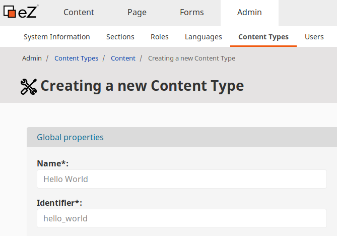
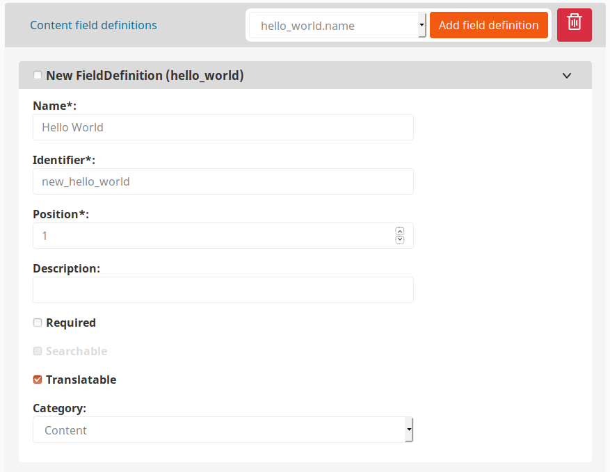
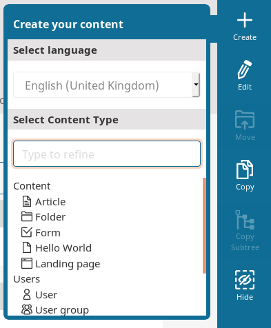

# Creating custom Field Type

The Generic Field Type is an abstract implementation of Field Types holding structured data e.g. Address.
It can be used as a base for custom Field Types.
The Generic Field Type comes with the implementation of basic methods, reduces the number of classes which must be created and simplifies the tagging process. 

!!! tip

    You should not use the Generic Field Type when you need a very specific implementation or complete control over the way data is stored.

The simplified process of creating a custom Field Type based on a Generic Field Type requires the following steps:

- Define Value Object
- Define fields and configuration
- Define form for Value Object
- Render field
- Final results

## Define Value Object

Create `Value.php` in `src/FieldType/HelloWorld` directory.
The Value class of a Field Type contains only the basic logic of a Field Type, the rest of it is handled by the `Type` class.
For more information about Field Type Value see [Value handling](../../api/field_type_type_and_value/#value-handling).

The `HelloWorld` Value class should contain:

- public properties that retrieve `name`
- an implementation of the `__toString()` method

```php
<?php
/* /src/FieldType/HelloWorld/Value.php */
namespace App\FieldType\HelloWorld;

use eZ\Publish\SPI\FieldType\Value as ValueInterface;
use Symfony\Component\Validator\Constraints as Assert;

final class Value implements ValueInterface
{
    /**
     * @Assert\NotBlank()
     */
    private $name;
  
    public function getName(): ?string
    {
        return $this->name;
    }
    public function setName(?string $name): void
    {
        $this->name = $name;
    }
    
    public function __toString()
    {
        return "Hello {$this->name}!";
    }
}
```

## Define fields and configuration

In this step you will implement a definition of a Field Type extending the Generic Field Type in the `src/FieldType/HelloWorld/Type.php` class.
It provides settings for the Field Type and an implementation of the `eZ\Publish\SPI\FieldType\FieldType` interface.

```php
<?php
namespace App\FieldType\HelloWorld;

use eZ\Publish\SPI\FieldType\Generic\Type as GenericType;

final class Type extends GenericType implements FieldValueFormMapperInterface
{
    public function getFieldTypeIdentifier(): string
    {
        return 'hello_world';
    }
}
```

For more information about the Type class of a Field Type see [Type class](../../api/field_type_type_and_value.md#type-class).

Next, add the `ezplatform.field_type` class to `config/services.yaml`:

```yaml
App\FieldType\HelloWorld\Type:
    tags:
        - { name: ezplatform.field_type, alias: hello_world }
```

## Define form for Value Object

Create a `src/Form/Type/HelloWorldType.php` form.
It enables you to edit your new Field Type.

```php
<?php
declare(strict_types=1);

namespace App\Form\Type;

use App\FieldType\HelloWorld\Value;
use Symfony\Component\Form\AbstractType;
use Symfony\Component\Form\Extension\Core\Type\TextType;
use Symfony\Component\Form\FormBuilderInterface;
use Symfony\Component\OptionsResolver\OptionsResolver;

final class HelloWorldType extends AbstractType
{
    public function buildForm(FormBuilderInterface $builder, array $options): void
    {
        $builder->add('name', TextType::class);
    }
    public function configureOptions(OptionsResolver $resolver): void
    {
        $resolver->setDefaults([
            'data_class' => Value::class
        ]);
    }
}
```

Now you will map Field definitions into Symfony forms with FormMapper.
Add `FieldValueFormMapperInterface` interface (`EzSystems\EzPlatformContentForms\FieldType\FieldValueFormMapperInterface`)
to the Field Type definition in `src/FieldType/HellowWorld/Type.php`.

```php
<?php
namespace App\FieldType\HelloWorld;

use App\Form\Type\HelloWorldType;
use eZ\Publish\SPI\FieldType\Generic\Type as GenericType;
use EzSystems\EzPlatformContentForms\Data\Content\FieldDataa;
use EzSystems\EzPlatformContentForms\FieldType\FieldValueFormMapperInterface;
use Symfony\Component\Form\FormInterface;

final class Type extends GenericType implements FieldValueFormMapperInterface
{
    # ...
    public function mapFieldValueForm(FormInterface $fieldForm, FieldData $data): void
    {
        $definition = $data->fieldDefinition;

        $fieldForm->add('value', HelloWorldType::class, [
            'required' => $definition->isRequired,
            'label' => $definition->getName()
        ]);
    }
}
```

For more information about the FormMappers see [Field Type form and template](../../api/field_type_form_and_template.md).

Next, add the `ezplatform.field_type.form_mapper.value` class to `config/services.yml`:

```yaml
App\FieldType\HelloWorld\Type:
    public: true
    tags:
        - { name: ezplatform.field_type, alias: hello_world }
        - { name: ezplatform.field_type.form_mapper.value, fieldType: hello_world }
```

## Render fields

### Create a template

Create a template for the new Field Type. It will define the default display of the `HelloWorld` field.
In the `templates` directory create a `field_type.html.twig` file:

```html+twig

    Hello <b>{{ field.value.getName() }}!</b>

```

### Template mapping

Provide the template mapping in `config/packages/ezplatform.yaml`:

```yaml
ezplatform:
    system:
        default: 
            # ...
            field_templates:
                - { template: 'field_type.html.twig', priority: 0 }
```

## Final results

Finally, you should be able to add a new Content Type in the Back Office interface.
Navigate to **Content Types** tab and under **Content** category create a new Content Type:



Next, define a **Hello World** field:



After saving, your **Hello World** Content Type should be available under **Content** in the sidebar menu.



For more detailed tutorial on Generic Field Type follow [Creating a Point 2D Field Type ](../../tutorials/generic_field_type/creating_a_point2d_field_type.md).
