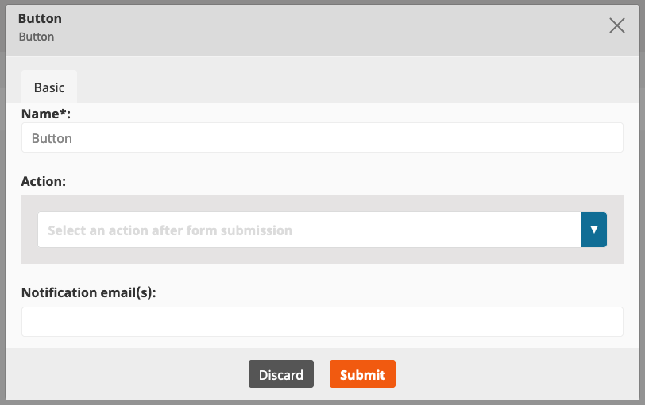

# Extending Form Builder

!!! enterprise

    ## Existing Form fields

    ### Captcha field

    The Captcha Form field is based on [Gregwar/CaptchaBundle](https://github.com/Gregwar/CaptchaBundle).

    You can customize the field by adding configuration to `app/config/config.yml` under `gregwar_captcha`:

    ``` yaml
    gregwar_captcha:
        as_url: true
        width: 150
        invalid_message: Retry.
        reload: true
    ```

    For information about available options, see [the bundle's documentation](https://github.com/Gregwar/CaptchaBundle#options).

    !!! note

        If your installation uses Varnish to manage content cache, you must modify the configuration to avoid issues with the Captcha field. For more information, see [Ensure proper captcha behavior](../http_cache.md#ensure-proper-captcha-behavior).

    ## Extending Form fields

    You can extend the Form Builder by adding new form fields or modifying existing ones.
    Form fields are defined in YAML configuration.

    For example, to create a Country Form field:

    ``` yaml
    ez_platform_form_builder:
        fields:
            country:
                name: Country
                category: Default
                thumbnail: `/bundles/ezplatformadminui/img/ez-icons.svg#input-line`
                attributes:
                    label:
                        name: Display label
                        type: string
                        validators:
                            not_blank:
                                message: You must provide label of the field
                    help:
                        name: Help text
                        type: string
                validators:
                    required: ~
    ```

    Available attribute types are:

    |Type|Description|
    |----|----|
    |`string`|String|
    |`text`|Text block|
    |`integer`|Integer number|
    |`url`|URL|
    |`multiple`|Multiple choice|
    |`select`|Dropdown|
    |`checkbox`|Checkbox|
    |`location`|Content Location|
    |`radio`|Radio button|
    |`action`|Button|
    |`choices`|List of available options|

    Each type of Form field can have validators of the following types:

    - `required`
    - `min_length`
    - `max_length`
    - `min_choices`
    - `max_choices`
    - `min_value`
    - `max_value`
    - `regex`
    - `upload_size`
    - `extensions`

    New types of fields require a mapper which implements `\EzSystems\EzPlatformFormBuilder\FieldType\Field\FieldMapperInterface`:

    ``` php
    namespace AppBundle\FormBuilder\Field\Mapper;

    use EzSystems\EzPlatformFormBuilder\FieldType\Field\Mapper\GenericFieldMapper;
    use EzSystems\EzPlatformFormBuilder\FieldType\Model\Field;

    class CountryFieldMapper extends GenericFieldMapper

    {
        /**
         * {@inheritdoc}
         */
        protected function mapFormOptions(Field $field, array $constraints): array
        {
            $options = parent::mapFormOptions($field, $constraints);
            $options['label'] = $field->getAttributeValue('label');
            $options['help'] = $field->getAttributeValue('help');
            return $options;
        }
    }
    ```

    The mapper must be registered as a service:

    ``` yaml
    services:
        # ...
        AppBundle\FormBuilder\Field\Mapper\CountryFieldMapper:
            arguments:
                $fieldIdentifier: country
                $formType: Symfony\Component\Form\Extension\Core\Type\CountryType
            tags:
                - { name: ezplatform.form_builder.field_mapper }
    ```

    ## Changing field and field attribute definitions dynamically

    Field or field attribute definition can be modified by subscribing to one of the following events:

    ```
    ezplatform.form_builder.field.<FIELD_ID>
    ezplatform.form_builder.field.<FIELD_ID>.<ATTRIBUTE_ID>
    ```

    The following example adds the `readonly` attribute to `single_line` field definition.

    ``` php
    namespace AppBundle\EventSubscriber;

    use EzSystems\EzPlatformFormBuilder\Event\FieldDefinitionEvent;
    use EzSystems\EzPlatformFormBuilder\Event\FieldDefinitionEvents;
    use EzSystems\EzPlatformFormBuilder\Definition\FieldAttributeDefinitionBuilder;
    use Symfony\Component\EventDispatcher\EventSubscriberInterface;

    class FieldDefinitionSubscriber implements EventSubscriberInterface
    {
        public function onSingleLineFieldDefinition(FieldDefinitionEvent $event): void
        {
            $isReadOnlyAttribute = new FieldAttributeDefinitionBuilder();
            $isReadOnlyAttribute->setIdentifier('readonly');
            $isReadOnlyAttribute->setName('Field is read only');
            $isReadOnlyAttribute->setType('string');

            $definitionBuilder = $event->getDefinitionBuilder();
            $definitionBuilder->addAttribute($isReadOnlyAttribute->buildDefinition());
        }

        /**
         * {@inheritdoc}
         */
        public static function getSubscribedEvents(): array
        {
            return [
                FormEvents::getFieldDefinitionEventName('single_line') => 'onSingleLineFieldDefinition'
            ];
        }
    }
    ```

    ``` yaml
    services:
        AppBundle\EventSubscriber\FieldDefinitionSubscriber:
            public: true
            tags:
                - kernel.event_subscriber
    ```

    ## Accessing Form field definitions

    Field definitions are accessible through:

    - `\EzSystems\EzPlatformFormBuilder\Definition\FieldDefinitionFactory` in the back end
    - global variable `eZ.formBuilder.config.fieldsConfig` in the front end

    ## Customizing email notifications

    Email is one of the Submit button options you can choose from in the Form Builder.
    It allows you to list email addresses where notifications about newly filled forms should be sent to.

    

    ### Override email template

    To customize Form Builder submission notification, you need to override the `form_builder/form_submit_notification_email.html.twig` template.
    It contains two blocks: subject and body.
    Each of them is rendered independently and consists of three sets of parameters.

    |Parameter|Type|Description|
    |---------|----|-----------|
    |`content`|`eZ\Publish\API\Repository\Values\Content\Content`|Name of the form, its Content Type|
    |`form`|`EzSystems\EzPlatformFormBuilder\FieldType\Model\Form`|Definition of the form|
    |`data`|`EzSystems\EzPlatformFormBuilder\FieldType\Model\FormSubmission`|Sent data|  

    By adjusting them to your needs, you will change your email template.

    ### Configure sender details

    To send emails you also need to configure `sender_address` in `app/config/config.yml`.
    It acts as a sender address and a return address where all bounced messages will be returned to.
    You can learn more by visiting [Symfony Mailer Configuration Reference.](https://symfony.com/doc/3.4/reference/configuration/swiftmailer.html#sender-address)

    ### Configure email notifications

    To send emails, you need to configure `sender_address` in `app/config/config.yml` under the `swiftmailer` key.
    It acts as a sender and return address for all bounced messages.
    For details, see [Symfony Mailer Configuration Reference.](https://symfony.com/doc/3.4/reference/configuration/swiftmailer.html#sender-address)
