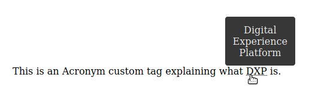

# Extending the Online Editor

The Online Editor is based on [Alloy Editor](https://alloyeditor.com/).
Refer to [Alloy Editor documentation](https://alloyeditor.com/docs/develop/) to learn how to extend the Online Editor with new elements.
To learn how to extend the eZ Platform Back Office follow [Extending Admin UI tutorial](../../tutorials/extending_admin_ui/extending_admin_ui).

!!! note

    Online Editor configuration works out of the box only if you have the Rich Text bundle enabled.
    If you do not, for example due to an upgrade from an earlier version,
    enable it according to the [installation guide](https://github.com/ezsystems/ezplatform-richtext#installation).

## Custom tags

Custom tags enable you to add more features to the Rich Text editor beyond the built-in ones.
They are configured under the `ezrichtext` key.

If you want to learn how to apply them to your installation follow [Creating a custom tag tutorial](../../tutorials/extending_admin_ui/6_adding_a_custom_tag).

#### Example: YouTube tag

Preparation of the tag always starts with the configuration file that should be added to `app/Resources/config`. This is sample configuration for the YouTube tag, `custom_tags.yml`:

```yaml
ezpublish:
    system:
        default:
            fieldtypes:
                ezrichtext:
                    custom_tags: [ezyoutube]

ezrichtext:
    custom_tags:
        ezyoutube:
            # The template used for front-end rendering of the custom tag
            template: AppBundle:field_type/ezrichtext/custom_tag:ezyoutube.html.twig
            # An icon for the custom tag as displayed in the Online Editor's toolbar.
            icon: '/assets/field_type/ezrichtext/custom_tag/icon/youtube-color.svg#youtube-color'
            attributes:
                title:
                    type: string
                    required: true
                    default_value: ''
                video_url:
                    type: string
                    required: true
                width:
                    type: number
                    required: true
                    default_value: 640
                height:
                    type: number
                    required: true
                    default_value: 360
                autoplay:
                    type: boolean
                    default_value: false
                align:
                    type: choice
                    required: false
                    default_value: left
                    choices: [left, center, right]
```

Remember to provide your own files for the template and the icon.
Each custom tag can have any number of attributes.
Supported attribute types are:
`string`, `number`, `boolean`, `link`, and `choice` (which requires a list of choices provided by the `choices` key).

Next, add `custom_tags.yml` to `app/config/config.yml` under the `imports` key:

``` yaml
imports:
# ...
    - { resource: custom_tags.yml }
```

The configuration requires an `ezyoutube.html.twig` template for the custom tag that will be placed in `/Resources/views/field_type/ezrichtext/custom_tag`:

```html+twig
<div style="text-align: {{ params.align }};">
    <iframe type="text/html" width="{{ params.width }}" height="{{ params.height }}"
        src="{{ params.video_url|replace({'https://youtu.be/' : 'https://www.youtube.com/embed/'}) }}?autoplay={{ params.autoplay == 'true' ? 1 : 0 }}"
        frameborder="0"></iframe>
</div>
```

!!! tip

    Remember that if an attribute is not required, you need to check if it is defined in the template, for example:

    ```html+twig
    
        ...
    
    ```

To ensure the new tag has labels, provide translations in `app/Resources/translations/custom_tags.en.yaml` file:

```yaml
ezrichtext.custom_tags.ezyoutube.label: Youtube
ezrichtext.custom_tags.ezyoutube.description: ''
ezrichtext.custom_tags.ezyoutube.attributes.autoplay.label: Autoplay
ezrichtext.custom_tags.ezyoutube.attributes.height.label: Height
ezrichtext.custom_tags.ezyoutube.attributes.title.label: Title
ezrichtext.custom_tags.ezyoutube.attributes.video_url.label: Video url
ezrichtext.custom_tags.ezyoutube.attributes.width.label: Width
ezrichtext.custom_tags.ezyoutube.attributes.align.label: Align
```

Now you can use the tag.
In the Back Office, create or edit a Content item that has a RichText Field Type.
In the Online Editor, click **Add**, and from the list of available tags select the YouTube tag icon.


#### Example: FactBox tag

FactBox tag is a good example for showcasing possibilities of `ezcontent` property.
Each custom tag has an `ezcontent` property that contains the tag's main content.
This property is editable by a tab in a custom tag.

Create the `custom_tags.yml` configuration file that will be added to `app/Resources/config`. This is sample configuration for FactBox tag:

```yaml hl_lines="10"
ezpublish:
    system:
        admin_group:
            fieldtypes:
                ezrichtext:
                    custom_tags: [ezfactbox]

ezrichtext:
    custom_tags:
        ezfactbox:
            template: AppBundle:field_type/ezrichtext/custom_tag:ezfactbox.html.twig
            icon: '/assets/field_type/ezrichtext/custom_tag/icon/factbox.svg#factbox'
            attributes:
                name:
                    type: string
                    required: true
                style:
                    type: choice
                    required: true
                    default_value: light
                    choices: [light, dark]
```

Remember to provide your own files for the template and the icon.
Line 10 points to `ezfactbox.html.twig` template described below.
Attributes listed below the custom tag can be set when adding the tag to a RichText Field.

Ensure that the `custom_tags.yml` file is added to `app/config/config.yml` under the `imports` key.

Now, the configuration requires an `ezfactbox.html.twig` template for the custom tag that will be placed in `/Resources/views/field_type/ezrichtext/custom_tag`:

```html+twig
<div class="ez-factbox ez-factbox--{{ params.style }}">
    <p>{{ params.name }}</p>
    <div>
        {{ content|raw }}
    </div>
</div>
```

!!! tip

    Remember that if an attribute is not required, you need to check if it is defined in the template, for example:

    ```twig
    
        ...
    
    ```

To ensure the new tag has labels, provide translations in `app/Resources/translations/custom_tags.en.yaml` file:

```yaml
# ezfactbox
ezrichtext.custom_tags.ezfactbox.label: FactBox
ezrichtext.custom_tags.ezfactbox.description: ''
ezrichtext.custom_tags.ezfactbox.attributes.name.label: Name
ezrichtext.custom_tags.ezfactbox.attributes.style.label: Style
ezrichtext.custom_tags.ezfactbox.attributes.style.choices.light.label: Light style
ezrichtext.custom_tags.ezfactbox.attributes.style.choices.dark.label: Dark style
```

Now you can use the tag.
In the Back Office, create or edit a Content item that has a RichText Field Type.
In the Online Editor, click **Add**, and from the list of available tags select the FactBox tag icon.


### Inline custom tags

Custom tags can also be placed inline with the following configuration:

``` yaml hl_lines="6"
ezrichtext:
    custom_tags:
        badge:
            template: field_type/ezrichtext/custom_tag/badge.html.twig
            icon: '/bundles/ezplatformadminui/img/ez-icons.svg#bookmark'
            is_inline: true
            attributes:
                # ...
```

`is_inline` is an optional key.
The default value is `false`, so if it is not set, the custom tag will be treated as a block tag.

!!! caution "Incorrect configuration"

    Newer configuration options, such as `is_inline`, only work with the configuration provided above.
    If your project uses [configuration from version prior to 2.4](../../update_and_migration/from_1.x_2.x/update_db_to_2.5.md#changes-to-custom-tags),
    these options will not work.
    You need to update your configuration to be placed under the `ezrichtext` key.

### Use cases

#### Link tag

You can also configure a custom tag with a `link` attribute that offers a basic UI with text input.
It is useful when migrating from eZ Publish to eZ Platform.

The configuration in `app/config/custom_tags.yml` is:

```yaml hl_lines="24 25"
ezpublish:
    system:
        admin_group:
            fieldtypes:
                ezrichtext:
                    custom_tags: [linktag]

ezrichtext:
    custom_tags:
        linktag:
            template: '@ezdesign/custom_tags/vcustom.html.twig'
            icon: '/bundles/ezplatformadminui/img/ez-icons.svg#link'
            attributes:
                attrTitle:
                    type: string
                    required: false
                attrDesc:
                    type: string
                    required: false
                attrColor:
                    type: choice
                    required: false
                    choices: [Red, Blue, Green]
                attrUrl:
                    type: link
                    required: false
```

Remember to provide your own files for the template and the icon.
In this example, the tag has the `attrUrl` attribute with the `type` parameter set as `link`. (lines 24-25).

Before proceeding, ensure that the `custom_tags.yml` file is added to `app/config/config.yml` under the `imports` key:

``` yaml
imports:
# ...
    - { resource: custom_tags.yml }
```

Next, create a `app/Resources/views/field_type/ezrichtext/linktag.html.twig` template:

``` html+twig
<h2>vcustom</h2>

    <div><strong>{{ attr_name }}</strong>: {{ attr_value }}</div>

```

Lastly, provide the translations in a `app/Resources/translations/linktag.en.yaml` file:

``` yaml
ezrichtext.custom_tags.linktag.label: 'Link Tag'
ezrichtext.custom_tags.linktag.attributes.attrTitle.label: 'Title'
ezrichtext.custom_tags.linktag.attributes.attrDesc.label: 'Description'
ezrichtext.custom_tags.linktag.attributes.attrColor.label: 'Color'
ezrichtext.custom_tags.linktag.attributes.attrUrl.label: 'URL'
```

Now you can use the tag.
In the Back Office, create or edit a Content item that has a RichText Field Type.
In the Online Editor, click **Add**, and from the list of available tags select the Link tag icon.

 

#### Acronym

You can create an inline custom tag that will display a hovering tooltip with an explanation of an acronym.

``` yaml
ezpublish:
    system:
        admin_group:
            fieldtypes:
                ezrichtext:
                    custom_tags: [acronym]

ezrichtext:
    custom_tags:
        acronym:
            template: AppBundle::field_type/ezrichtext/custom_tag/acronym.html.twig
            icon: '/bundles/ezplatformadminui/img/ez-icons.svg#information'
            is_inline: true
            attributes:
                explanation:
                    type: 'string'
```

The `explanation` attribute will contain the meaning of the acronym that will be provided
while editing in the Online Editor.

Label translations can be provided in `app/Resources/translations/custom_tags.en.yaml`:

``` yaml
ezrichtext.custom_tags.acronym.label: 'Acronym'
ezrichtext.custom_tags.acronym.attributes.meaning.label: 'Explanation'
```


In the template file `acronym.html.twig` provide the explanation as `attr_value`
to the title of the `abbr` tag:

``` html+twig
<abbr title="{{ params.explanation }}">{{ content }}</abbr>
```



## Custom toolbars

You can extend the Online Editor with the custom toolbars.
The feature depends on [Alloy Editor](https://alloyeditor.com/).

Preparation of the custom toolbar starts with creating a new toolbar config.
If you want to learn how to do it, see [Creating a Toolbar.](https://alloyeditor.com/docs/develop/create_toolbars.html)

Next, add the toolbar config to the `ezplatform-admin-ui-alloyeditor-js` entry using encore.
Finally, add the toolbar JavaScript class to `ezAlloyEditor.customSelections.<TOOLBAR_NAME>` eZ config.

You can do it at the bottom of the toolbar config file:

```js
eZ.addConfig('ezAlloyEditor.customSelections.ContentVariableEdit', ContentVariableEditConfig);
```

With this step, the `ContentVariableEditConfig` toolbar is injected and ready to be used.

## Custom styles

You can extend the Online Editor with custom text styles.
The feature depends on [Alloy Editor styles](https://alloyeditor.com/docs/features/styles.html).
The styles are available in the text toolbar when a section of text is selected.

There are two kinds of custom styles: block and inline.
Inline styles apply to the selected portion of text only, while block styles apply to the whole paragraph.

### Back Office configuration

The sample configuration is as follows:

``` yaml
ezpublish:
    system:
        admin_group:
            fieldtypes:
                ezrichtext:
                    custom_styles: [highlighted_block, highlighted_word]

ezrichtext:
    custom_styles:
        highlighted_word:
            template: '@ezdesign/field_type/ezrichtext/custom_style/highlighted_word.html.twig'
            inline: true
        highlighted_block:
            template: '@ezdesign/field_type/ezrichtext/custom_style/highlighted_block.html.twig'
            inline: false
```

The system expects two kinds of configuration:

- a global list of custom styles, defined under the node `ezrichtext.custom_styles`,
- a list of enabled custom styles for a given Admin SiteAccess or Admin SiteAccess group, located under the node `ezpublish.system.<scope>.fieldtypes.ezrichtext.custom_styles`

!!! note

    Defining this list for a front site SiteAccess currently has no effect.

### Translations

Labels that appear for each custom style in the Online Editor need to be translated using Symfony translation system.
The translation domain is called `custom_styles`. For the code example above, you can do it in a `app/Resources/translations/custom_styles.en.yml` file:

```yaml
ezrichtext.custom_styles.highlighted_block.label: Highlighted block
ezrichtext.custom_styles.highlighted_word.label: Highlighted word
```

### Rendering

The `template` key points to the template used to render the custom style. It is recommended to use the [design engine](../design_engine.md).

In the example above, the template files for the front end could be:

- `app/Resources/views/themes/standard/field_type/ezrichtext/custom_style/highlighted_word.html.twig`:

``` html+twig
<span id="{{ id }}" class="ezstyle-{{ name }}">{{ content|raw }}</span>
```

- `app/Resources/views/themes/standard/field_type/ezrichtext/custom_style/highlighted_block.html.twig`:

``` html+twig
<div id="{{ id }}" class="align-{{ align }} ezstyle-{{ name }}">{{ content|raw }}</div>
```

Templates for Content View in the Back Office would be `app/Resources/views/themes/admin/field_type/ezrichtext/custom_style/highlighted_word.html.twig` and `app/Resources/views/themes/admin/field_type/ezrichtext/custom_style/highlighted_block.html.twig` respectively (assuming Admin SiteAccess uses the `admin` theme).

### Use cases

#### Note box

You can create a custom style that will place a paragraph in a note box:


``` yaml
ezpublish:
    system:
        admin_group:
            fieldtypes:
                ezrichtext:
                    custom_styles: [note_box]

ezrichtext:
    custom_styles:
        note_box:
            template: field_type/ezrichtext/custom_style/note_box.html.twig
```

The indicated `note_box.html.twig` template wraps the content of the selected text (`{{ content }}`)
in a custom CSS class:

``` html+twig
<div class="note">{{ content }}</div>
```

``` css
.note {
    display: block;
    background-color: #faa015;
    border-left: solid 5px #353535;
    line-height: 18px;
    padding: 15px;
    color: #fff;
    font-weight: bold;
}
```

Label translation can be provided in `app/Resources/translations/custom_styles.en.yaml`:

``` yaml
ezrichtext.custom_styles.note_box.label: 'Note box'
```


!!! tip

    You can also create a similar note box using [custom classes](#note-box_1).

#### Text highlight

You can create an inline custom style that highlights a part of a text:


``` yaml
ezpublish:
    system:
        admin_group:
            fieldtypes:
                ezrichtext:
                    custom_styles: [highlight]
                    
ezrichtext:
    custom_styles:
        highlight:
            template: field_type/ezrichtext/custom_style/highlight.html.twig
            inline: true
```

The indicated `highlight.html.twig` template wraps the content of the selected text (`{{ content }}`)
in a custom CSS class:

``` html+twig
<span class="highlight">{{ content }}</span>
```

``` css
.highlight {
    background-color: #fcc672;
    border-radius: 25% 40% 25% 40%;
}
```

Label translation can be provided in `app/Resources/translations/custom_styles.en.yaml`:

``` yaml
ezrichtext.custom_styles.highlight.label: 'Highlight'
```


## Custom data attributes and classes

You can add custom data attributes and CSS classes to elements in the Online Editor.

The available elements are:

- `embedinline`
- `embed`
- `formatted`
- `heading`
- `embedimage`
- `ul`
- `ol`
- `li`
- `paragraph`
- `table`
- `tr`
- `td`

!!! caution "Overriding embed templates"

    If you override the default templates for `embedinline`, `embed` or `embedimage` elements,
    (e.g. `EzPublishCoreBundle:default:content/embed.html.twig`),
    the data attributes and classes will not be rendered automatically.

    Instead, you can make use of the `data_attributes` and `class` properties in your templates.
    The `ez_data_attributes_serialize` helper enables you to serialize the data attribute array.

### Custom data attributes

Custom data attributes are configured under the `fieldtypes.ezrichtext.attributes` key.
The configuration is SiteAccess-aware.

A custom data attribute can belong to one of four types: `choice`, `boolean`, `string`, or `number`.
You can also set each attribute to be `required` and set its `default_value`.

For the `choice` type, you must provide an array of available `choices`.
Adding `multiple` enables you to choose whether more than one option can be selected.
It is set to `false` by default.

The example below adds two data attributes, `custom_attribute` and `another_attribute`
to the Heading element:

``` yaml
ezpublish:
    system:
        # The configuration only works with an admin (Back Office) SiteAccess
        <siteaccess>:
            fieldtypes:
                ezrichtext:
                    attributes:
                        heading:
                            custom-attribute:
                                type: boolean
                                default_value: false
                            another-attribute:
                                type: choice
                                choices: [attr1, attr2]
                                default_value: attr2
                                required: false
                                multiple: true
```

This configuration will output `data-ezattribute-<attribute_name>="<value>"` in the corresponding HTML element,
in this example as `data-ezattribute-custom-attribute="false"` and `data-ezattribute-another-attribute="attr1,attr2"`.

### Custom CSS classes

Custom CSS classes are configured under the `fieldtypes.ezrichtext.classes` key.
The configuration is SiteAccess-aware.

You must provide the available `choices`.
You can also set the values for `required`, `default_value` and `multiple`.
`multiple` is set to true by default.

The example below adds a class choice to the Paragraph element:

``` yaml
ezpublish:
    system:
        # The configuration only works with an admin (Back Office) SiteAccess
        <siteaccess>:
            fieldtypes:
                ezrichtext:                            
                    classes:
                        paragraph:
                            choices: [regular, special]
                            default_value: regular
                            required: false
                            multiple: false
```

### Label translations

You can provide label translations for custom attributes with the translation extractor `ez_online_editor_attributes`.
It gets a full list of custom attributes for all elements in all scopes.

For example:

``` bash
php ./bin/console translation:extract --enable-extractor=ez_online_editor_attributes
    --dir=./app/Resources/views --output-dir=./app/Resources/translations/ --output-format=yaml
```

### Use cases

#### Note box

You can create a custom class that will enable you to place a paragraph element in a note box:


``` yaml
ezpublish:
    system:
        admin_group:
            fieldtypes:
                ezrichtext:
                    classes:
                        paragraph:
                            choices: [regular, tip_box, warning_box]
                            default_value: regular
                            required: false
                            multiple: false
```

This enables you to choose one of the following classes for each paragraph element: `regular`, `tip_box`, or `warning_box`
that you can then style individually using CSS.


!!! tip

    You can also create a similar note box using [custom styles](#note-box).

## Custom plugins

You can add your own plugins to the Online Editor.

For more information, follow [Creating Online Editor plugin](online_editor_plugin.md).

You can also download an existing plugin from the CKEditor.
In this case, include it in a page after AlloyEditor is loaded:

``` yaml
ezrichtext:
    alloy_editor:
        extra_plugins: [plugin1, plugin2]
```

The name of a plugin needs to be the same as the one passed to `CKEDITOR.plugins.add` in the plugin source code.

Please keep in mind that if a plugin changes RichText input (in xhtml5/edit format for DocBook), the changes need to be supported by RichText Field Type.
For example, if a plugin adds some class to some element, you need to confirm that this class is stored when saving or publishing content (it could result in either XML validation error or could be omitted by RichText processor).

## Buttons configuration

Custom buttons can be added to your installation with the following configuration:

```yml hl_lines="4"
ezrichtext:
    alloy_editor:
        extra_buttons:
            paragraph: [buttonName1, buttonName2]
            embed: [buttonName1]
```

Under `extra_buttons` (line 4) specify to what toolbar you want to add a new button e.g. `paragraph`.
Next to that toolbar, add an array with names of custom buttons that you want to install e.g. `[buttonName1, buttonName2]`.

All new buttons should also be added to AlloyEditor under the same name that's in the configuration file.
For more information follow [AlloyEditor tutorial on creating a button](https://alloyeditor.com/docs/develop/create_buttons.html).
