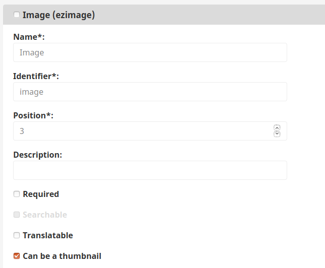

# Extending thumbnails

Thumbnails enable you to easily choose an image for a specific Content Type.
If you do not want to use custom thumbnails [`ContentType` icons](../../resources/icons.md#content-types) will be used instead.

## Thumbnail mechanism 

The thumbnail mechanism has two layers, and each layer can have many implementations.
The mechanism checks if any of the implementations returns an image that can be a thumbnail.
If found, the image is used as a Content Type thumbnail.

First layer of the mechanism contains strategy pattern that focuses on finding a thumbnail.
The thumbnail can be found inside or outside the Content Type.
For example for users thumbnails can be downloaded from an avatar-generating service.

For this layer there are two default implementations.
The first looks for images in Fields, and after that the second one will look for them in the Content Type.
If there are no Fields that contain an image that can be a thumbnail, the Content Type icon will be used as a thumbnail.
This mechanism can be modified to fit your site needs, so you can decide from where and how the thumbnails will be downloaded.

Second layer of thumbnail mechanism enables selection of thumbnail from a Field that first layer has found. 
It searches the Field for images with function "Can be a thumbnail" turned on.



If there is more than one image in the Field, this layer will return the first nonempty image that can be a thumbnail.

### Add a thumbnail mechanism 

First, create `StaticStrategy.php` in `src/Strategy`.
It is a base strategy for returning thumbnails from a static file.

```php
<?php
​
declare(strict_types=1);
​
namespace App\Strategy;
​
use eZ\Publish\API\Repository\Values\Content\Thumbnail;
use eZ\Publish\API\Repository\Values\ContentType\ContentType;
use eZ\Publish\SPI\Repository\Strategy\ContentThumbnail\ThumbnailStrategy;
​
final class StaticStrategy implements ThumbnailStrategy
{
    /** @var string */
    private $staticThumbnail;
​
    public function __construct(string $staticThumbnail)
    {
        $this->staticThumbnail = $staticThumbnail;
    }
​
    public function getThumbnail(ContentType $contentType, array $fields): Thumbnail
    {
        return new Thumbnail([
            'resource' => $this->staticThumbnail,
        ]);
    }
}
```

Next, add the strategy with the `ezplatform.spi.content.thumbnail_strategy` tag and `priority: 100` to `config/services.yaml`:
 
```yaml
services:
    App\Strategy\StaticStrategy:
        arguments:
            $staticThumbnail: http://example.com/some_image.jpg
        tags:
            - { name: ezplatform.spi.content.thumbnail_strategy, priority: 100 }
```

Priority `100` will allow this strategy to be used first on a clean installation or before any other strategy with lower priority.

At this point you can go to the Back Office and check the results.

## Other Fields as thumbnails

Any Field Type can generate a thumbnail, e.g.:

- DateAndTime (`ezdatetime`) - you can add a mini calendar thumbnail for Appointment Content Type and on the day of the appointment a clock thumbnail with a specific time when it takes place
- TextBlock (`eztext`) -  you can add a first letter of the text block that is inside

### Add eztext Field as thumbnail

First, create a strategy that will add support for `eztext` as the thumbnail.
It will enable you to add a thumbnail URL in the text field.

Add `ImageUrlThumbnailStrategy.php` in `src/FieldType/ImageUrl`.

```php
<?php
​
declare(strict_types=1);
​
namespace App\FieldType\ImageUrl;
​
use eZ\Publish\API\Repository\Values\Content\Field;
use eZ\Publish\API\Repository\Values\Content\Thumbnail;
use eZ\Publish\SPI\Repository\Strategy\ContentThumbnail\Field\ThumbnailStrategy;
​
class ImageUrlThumbnailStrategy implements ThumbnailStrategy
{
	public function getFieldTypeIdentifier(): string
	{
		return 'eztext';
	}
	
    public function getThumbnail(Field $field): ?Thumbnail
    {
        return new Thumbnail([
            'resource' => $field->value,
        ]);
    }
}
```

Next, add the strategy with the `ezplatform.spi.field.thumbnail_strategy` tag to `config/services.yaml`:

 ```yaml
 services:
     App\FieldType\ImageUrl\ImageUrlThumbnailStrategy:
         tags:
             - { name: ezplatform.spi.field.thumbnail_strategy }
 ```
 
At this point you can go to the Back Office and check the results.
