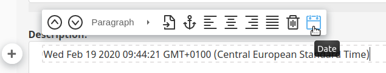

# Creating Online Editor plugin

You can add your own plugins to the Online Editor.

Online Editor is based on AlloyEditor, which in turn uses CKEditor,
so creating a custom plugin is similar to [the way you do it in CKEditor](https://ckeditor.com/docs/ckeditor4/latest/guide/plugin_sdk_sample.html).

In this example you will create a plugin which inserts the current date into a RichText Field.

## Creating the plugin

First, create the plugin file in `AppBundle/Resources/public/js/alloyeditor/plugins/date.js`:

``` js
(function (global) {
    if (CKEDITOR.plugins.get('date')) {
        return;
    }

    const InsertDate = {
        exec: function (editor) {
            var now = new Date();
            editor.insertHtml( now.toString() );
        },
    };
    
    global.CKEDITOR.plugins.add('date', {
        init: (editor) => editor.addCommand('InsertDate', InsertDate),
    });
})(window);
```

This file implements an `InsertDate` command and attaches it to the editor.

## Creating a button

Next, you need to add a button for inserting the date to the Online Editor toolbar.

Create a file for the button in `AppBundle/Resources/public/js/alloyeditor/buttons/date.js`:

``` js
import PropTypes from 'prop-types';
import AlloyEditor from 'alloyeditor';
import EzButton
    from '../../../../../../../vendor/ezsystems/ezplatform-admin-ui/src/bundle/Resources/public/js/alloyeditor/src/base/ez-button.js';

export default class BtnDate extends EzButton {
    static get key() {
        return 'date';
    }

    insertDate(data) {
        this.execCommand(data);
    }

    render() {
        const title = 'Date';

        return (
            <button
        className="ae-button ez-btn-ae ez-btn-ae--date"
        onClick={this.insertDate.bind(this)}
        tabIndex={this.props.tabIndex}
        title={title}>
            <svg className="ez-icon ez-btn-ae__icon">
            <use xlinkHref="/bundles/ezplatformadminui/img/ez-icons.svg#date" />
            </svg>
            </button>
    );
    }
}

AlloyEditor.Buttons[BtnDate.key] = AlloyEditor.BtnDate = BtnDate;
eZ.addConfig('ezAlloyEditor.BtnDate', BtnDate);

BtnDate.propTypes = {
    command: PropTypes.string,
};

BtnDate.defaultProps = {
    command: 'InsertDate',
};
```

## Enabling the plugin

Now you need to enable the plugin and the button.

Create an `AppBundle/Resources/encore/ez.config.manager.js` file:

``` js
const path = require('path');

module.exports = (eZConfig, eZConfigManager) => {
    eZConfigManager.add({
        eZConfig,
        entryName: 'ezplatform-admin-ui-alloyeditor-js',
        newItems: [
            path.resolve(__dirname, '../public/js/alloyeditor/buttons/date.js'),
            path.resolve(__dirname, '../public/js/alloyeditor/plugins/date.js'),
        ]
    });

    eZConfigManager.replace({
        eZConfig,
        entryName: 'ezplatform-admin-ui-alloyeditor-js',
        itemToReplace: path.resolve(__dirname, '../../../../vendor/ezsystems/ezplatform-admin-ui/src/bundle/Resources/public/js/scripts/fieldType/base/base-rich-text.js'),
        newItem: path.resolve(__dirname, '../public/js/base-rich-text.js'),
    });
};
```

This file loads the plugin and button files when loading Online Editor.

It also overrides the toolbar to enable you to add the button to it.
For this purpose you need an `AppBundle/Resources/public/js/base-rich-text.js` file.
It overrides `vendor/ezsystems/ezplatform-admin-ui/src/bundle/Resources/public/js/scripts/fieldType/base/base-rich-text.js`,
so you can copy this source file and modify it in the following way:

``` js
// ...
init(container) {
    const toolbarProps = { extraButtons: this.alloyEditorExtraButtons, attributes: this.attributes, classes: this.classes };

    const ezParagraphConfig = new window.eZ.ezAlloyEditor.ezParagraphConfig({ customStyles: this.customStylesConfigurations, ...toolbarProps, });

    const pluginButtons = ['date'];
    ezParagraphConfig.buttons = ezParagraphConfig.buttons.concat(pluginButtons);
// ...
```

Additionally, replace the existing `eZParagraphConfig` in `toolbars.styles.selections` in `base-rich-text.js`
with a reference to this new config:

``` js
ezParagraphConfig,
```

## Adding the plugin to configuration

Finally, add the plugin to your eZ Platform configuration:

``` yaml
ezrichtext:
    alloy_editor:
        extra_plugins: [date]
```

At this point you can run `yarn encore dev` and create a Content item with a RichText Field.
The new button appears in the toolbar when editing a Paragraph element and inserts the current date when clicked:


