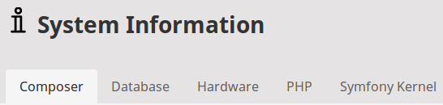

# Extending eZ Platform UI

## Back Office interface

The Back Office interface is produced by [the ezplatform-admin-ui Bundle](https://github.com/ezsystems/ezplatform-admin-ui)
together with [ezplatform-admin-ui-modules](https://github.com/ezsystems/ezplatform-admin-ui-modules),
which contains React modules that handle specific parts of the application.
This interface is accessible in your browser at `http://[uri_of_platform]/admin`.

The Back Office uses React-based modules that make each part of the UI easily extensible.
The interface uses Bootstrap, which facilitates adapting and styling the interface to your needs.

!!! tip

    You can also see:

    - [a presentation about eZ Platform extensibility](https://www.slideshare.net/sunpietro/extending-ez-platform-2x-with-symfony-and-react)
    - [a case study of creating a new Field Type and extending eZ Platform UI](https://mikadamczyk.github.io/presentations/extending-ez-platform-ui/).

## General extensibility

You can extend the Back Office in the following areas:

- [Menus](#menus)
- [Dashboard](#dashboard)
- [Tabs](#tabs)
- [Workflow event timeline](#workflow-event-timeline)
- [Injecting custom components](#injecting-custom-components)
- [Format date and time](#format-date-and-time)
- [Universal Discovery module](extending_modules.md#universal-discovery-module)
- [Sub-items list](extending_modules.md#sub-items-list)
- [Multi-file upload](extending_modules.md#multi-file-upload)
- [Online Editor](extending_online_editor.md)
- [Page blocks](extending_page.md#creating-page-blocks)
- [Form fields](extending_form_builder.md#extending-form-fields)

!!! note "String translations"

    Refer to [Custom string translations](back_office_translations.md#custom-string-translations)
    to learn how to provide string translations when extending the Back Office.

## Menus

Back Office menus are based on the [KnpMenuBundle](https://github.com/KnpLabs/KnpMenuBundle) and are easily extensible.

!!! tip

    For general information on how to use `MenuBuilder`,
    see [the official KnpMenuBundle documentation](https://symfony.com/doc/master/bundles/KnpMenuBundle/index.html).

Menus are extensible using event subscribers/listeners. You can hook into the following events:

- `ConfigureMenuEvent::MAIN_MENU`
- `ConfigureMenuEvent::USER_MENU`
- `ConfigureMenuEvent::CONTENT_SIDEBAR_RIGHT`
- `ConfigureMenuEvent::CONTENT_EDIT_SIDEBAR_RIGHT`
- `ConfigureMenuEvent::CONTENT_CREATE_SIDEBAR_RIGHT`
- `ConfigureMenuEvent::CONTENT_SIDEBAR_LEFT`
- `ConfigureMenuEvent::TRASH_SIDEBAR_RIGHT`
- `ConfigureMenuEvent::SECTION_EDIT_SIDEBAR_RIGHT`
- `ConfigureMenuEvent::SECTION_CREATE_SIDEBAR_RIGHT`
- `ConfigureMenuEvent::POLICY_EDIT_SIDEBAR_RIGHT`
- `ConfigureMenuEvent::POLICY_CREATE_SIDEBAR_RIGHT`
- `ConfigureMenuEvent::ROLE_EDIT_SIDEBAR_RIGHT`
- `ConfigureMenuEvent::ROLE_CREATE_SIDEBAR_RIGHT`
- `ConfigureMenuEvent::USER_EDIT_SIDEBAR_RIGHT`
- `ConfigureMenuEvent::USER_CREATE_SIDEBAR_RIGHT`
- `ConfigureMenuEvent::ROLE_ASSIGNMENT_CREATE_SIDEBAR_RIGHT`
- `ConfigureMenuEvent::LANGUAGE_CREATE_SIDEBAR_RIGHT`
- `ConfigureMenuEvent::LANGUAGE_EDIT_SIDEBAR_RIGHT`
- `ConfigureMenuEvent::CONTENT_TYPE_GROUP_CREATE_SIDEBAR_RIGHT`
- `ConfigureMenuEvent::CONTENT_TYPE_GROUP_EDIT_SIDEBAR_RIGHT`
- `ConfigureMenuEvent::CONTENT_TYPE_CREATE_SIDEBAR_RIGHT`
- `ConfigureMenuEvent::CONTENT_TYPE_EDIT_SIDEBAR_RIGHT`
- `ConfigureMenuEvent::URL_EDIT_SIDEBAR_RIGHT`
- `ConfigureMenuEvent::USER_PASSWORD_CHANGE_SIDEBAR_RIGHT`
- `ConfigureMenuEvent::OBJECT_STATE_GROUP_CREATE_SIDEBAR_RIGHT`
- `ConfigureMenuEvent::OBJECT_STATE_GROUP_EDIT_SIDEBAR_RIGHT`
- `ConfigureMenuEvent::OBJECT_STATE_CREATE_SIDEBAR_RIGHT`
- `ConfigureMenuEvent::OBJECT_STATE_EDIT_SIDEBAR_RIGHT`

An event subscriber can be implemented as follows:

``` php
<?php
namespace EzSystems\EzPlatformAdminUi\EventListener;

use EzSystems\EzPlatformAdminUi\Menu\Event\ConfigureMenuEvent;
use EzSystems\EzPlatformAdminUi\Menu\MainMenuBuilder;
use Symfony\Component\EventDispatcher\EventSubscriberInterface;

class MenuListener implements EventSubscriberInterface
{
    public static function getSubscribedEvents()
    {
        return [
            ConfigureMenuEvent::MAIN_MENU => ['onMenuConfigure', 0],
        ];
    }

    public function onMenuConfigure(ConfigureMenuEvent $event)
    {
        $menu = $event->getMenu();
        $factory = $event->getFactory();
        // options passed from the context (i.e. Content item in Content View)
        $options = $event->getOptions();

        // your customizations
    }
}
```

After creating a subscriber, add it to `config/services.yaml`:

``` yaml
services:
    EzSystems\EzPlatformAdminUi\EventListener\MenuListener:
        tags:
           - { name: kernel.event.subscriber }

```

Providing the `kernel.event.subscriber` tag is necessary only if [the autoconfigure option](https://symfony.com/doc/3.4/service_container.html#the-autoconfigure-option) is disabled.

### Adding menu items

#### Add a new menu item under "Content" with custom attributes

``` php
$menu[MainMenuBuilder::ITEM_CONTENT]->addChild(
    'form_manager',
    [
        'route' => '_ezpublishLocation',
        'routeParameters' => ['locationId' => 2],
        // attributes directly on <a> element
        'linkAttributes' => [
            'class' => 'test_class another_class',
            'data-property' => 'value',
        ],
        // attributes on container <li> element
        'attributes' => [
            'data-property' => 'value',
        ],
    ]
);
```

#### Add a top-level menu item with a child

``` php
$menu->addChild(
    'menu_item_1',
    ['label' => 'Menu Item 1', 'extras' => ['icon' => 'file']]
);
$menu['menu_item_1']->addChild(
    '2nd_level_menu_item',
    ['label' => '2nd level menu item', 'uri' => 'http://example.com']
);
```

#### Add an item depending on a condition

``` php
$condition = true;
if ($condition) {
    $menu->addChild(
        'menu_item_2',
        ['label' => 'Menu Item 2', 'extras' => ['icon' => 'article']]
    );
}
```

#### Add a top-level menu item with URL redirection

``` php
$menu->addChild(
    'menu_item_3',
    [
        'label' => 'Menu Item 3',
        'uri' => 'http://example.com',
        'extras' => ['icon' => 'article'],
    ]
);
```

### Modifying menu items

#### Remove the *Media* menu item from the Content tab

``` php
$menu[MainMenuBuilder::ITEM_CONTENT]->removeChild(
    MainMenuBuilder::ITEM_CONTENT__MEDIA
);
```

#### Reorder menu items, i.e. reverse the order

``` php
$menu->reorderChildren(
    array_reverse(array_keys($menu->getChildren()))
);
```

### Other menu operations

#### Pass a parameter to a menu item

You can pass parameters to menu items with `template_parameters`:

``` php
$menu->addChild(
    'menu_item_with_params',
    [
        'extras' => [
            'template' => 'AppBundle::menu_item_template.html.twig',
            'template_parameters' => [
                'custom_parameter' => 'value',
            ],
        ],
    ]
);
```

You can then use the variable `custom_parameter` in `AppBundle::menu_item_template.html.twig`.

#### Translatable labels

To have translatable labels, use `translation.key` from the `messages` domain:

``` php
$menu->addChild(
    'menu_item_3',
    [
        'label' => 'translation.key',
        'uri' => 'http://example.com',
        'extras' => [
            'icon' => 'article',
            'translation_domain' => 'messages',
        ],
    ]
);
```

#### Custom icons

You can use the `extras.icon` parameter to select an icon from the built-in set.

To use your custom icon, use the `extras.icon_path` parameter:

``` php
$menu->addChild(
    'menu_item_with_icon',
    [
        'extras' => [
            'icon_path' => '/assets/images/icons/custom.svg',
            'icon_class' => 'my-custom-class',
        ],
    ]
);
```

The `extras.icon_class` parameter adds a custom CSS class to the `<svg>` element.

## Dashboard

To extend the Dashboard, make use of an event subscriber.

In the following example, the `DashboardEventSubscriber.php` reverses the order of sections of the Dashboard
(in a default installation this makes the "Everyone" block appear above the "Me" block):

``` php
namespace App\EventListener;

use EzSystems\EzPlatformAdminUi\Component\Event\RenderGroupEvent;
use Symfony\Component\EventDispatcher\EventSubscriberInterface;

class DashboardEventSubscriber implements EventSubscriberInterface
{
    public static function getSubscribedEvents()
    {
        return [
            RenderGroupEvent::NAME => ['onRenderGroupEvent', 20],
        ];
    }

    public function onRenderGroupEvent(RenderGroupEvent $event)
    {
        if ($event->getGroupName() !== 'dashboard-blocks') {
            return;
        }

        $components = $event->getComponents();

        $reverseOrder = array_reverse($components);

        $event->setComponents($reverseOrder);

    }
}
```

## Tabs

Many elements of the back-office interface, such as System Info or Location View, are built using tabs.



You can extend existing tab groups with new tabs, or create your own tab groups.

### Adding a new tab group

To create a custom tab group with additional logic you need to create it at the level of compiling the Symfony container, using a [CompilerPass](https://symfony.com/doc/3.4/service_container/compiler_passes.html).

For example, in `src/DependencyInjection/Compiler/CustomTabGroupPass.php`:

``` php
namespace App\DependencyInjection\Compiler;

use EzSystems\EzPlatformAdminUi\Tab\TabGroup;
use EzSystems\EzPlatformAdminUi\Tab\TabRegistry;
use Symfony\Component\DependencyInjection\Compiler\CompilerPassInterface;
use Symfony\Component\DependencyInjection\ContainerBuilder;
use Symfony\Component\DependencyInjection\Definition;

class CustomTabGroupPass implements CompilerPassInterface
{
    public function process(ContainerBuilder $container)
    {
        if (!$container->hasDefinition(TabRegistry::class)) {
            return;
        }

        $tabRegistry = $container->getDefinition(TabRegistry::class);
        $tabGroupDefinition = new Definition(
            TabGroup::class,  // or any class that extends TabGroup
            ['custom-tab-group']
        );
        $tabRegistry->addMethodCall('addTabGroup', [$tabGroupDefinition]);
    }
}
```

A shorter way that you can use when no custom logic is required, is to add your own tab with the new group.
If a tab's group is not defined, it will be created automatically.

A new tab group can be rendered using the [`ez_render_tab_group`](https://github.com/ezsystems/ezplatform-admin-ui/blob/master/src/bundle/Templating/Twig/TabExtension.php#L58) Twig helper:

``` html+twig
<div class="my-tabs">
    {{ ez_render_tab_group('custom-tab-group') }}
</div>
```

This will render the group and all tabs assigned to it.

### Adding a new tab

Before you add a tab to a group you must create the tab's PHP class and define it as a Symfony service with the `ezplatform.tab` tag:

``` yaml
App\Custom\Tab:
    parent: EzSystems\EzPlatformAdminUi\Tab\AbstractTab
    tags:
        - { name: ezplatform.tab, group: custom-tab-group }
```

This configuration also assigns the new tab to `custom-tab-group`.

!!! tip

    If the `custom-tab-group` does not yet exist, it will be created automatically at this point.

The tab class can look like this (in `src/Custom/Tab.php`):

``` php
namespace App\Custom;

use EzSystems\EzPlatformAdminUi\Tab\AbstractTab;

class Tab extends AbstractTab
{
    public function getIdentifier(): string
    {
        return 'custom-tab';
    }

    public function getName(): string
    {
        return /** @Desc("Custom Tab") */
            $this->translator->trans('custom.tab.name', [], 'some_translation_domain');
    }

    public function renderView(array $parameters): string
    {
        // Do rendering here

        return $this->twig->render('AppBundle:my_tabs/custom.html.twig', [
            'foo' => 'Bar!',
        ]);
    }
}
```

Beyond the `AbstractTab` used in the example above you can use two specialized tab types:

- `AbstractControllerBasedTab` enables you to embed the results of a controller action in the tab.
- `AbstractRouteBasedTab` embeds the results of the selected routing, passing applicable parameters.

### Modifying tab display

You can order the tabs by making the tab implement `OrderedTabInterface`.
The order will then depend on the numerical value returned by the `getOrder` method.

``` php
class Tab extends AbstractTab implements OrderedTabInterface
{
    public function getOrder(): int
    {
        return 100;
    }
}
```

The tabs will be displayed according to this value in ascending order.

!!! tip

    It is good practice to reserve some distance between these values, for example to stagger them by step of 10.
    It may come useful if you later need to place something between the existing tabs.

You can also influence tab display (e.g. order tabs, remove or modify them, etc.) by using Event Listeners:

``` php
class TabEvents
{
    /**
     * Happens just before rendering a tab group.
     */
    const TAB_GROUP_PRE_RENDER = 'ezplatform.tab.group.pre_render';

    /**
     * Happens just before rendering a tab.
     */
    const TAB_PRE_RENDER = 'ezplatform.tab.pre_render';
}
```

As an example, see how `OrderedTabInterface` is implemented:

```php
namespace EzSystems\EzPlatformAdminUi\Tab\Event\Subscriber;

use EzSystems\EzPlatformAdminUi\Tab\Event\TabEvents;
use EzSystems\EzPlatformAdminUi\Tab\Event\TabGroupEvent;
use EzSystems\EzPlatformAdminUi\Tab\OrderedTabInterface;
use EzSystems\EzPlatformAdminUi\Tab\TabInterface;
use Symfony\Component\EventDispatcher\EventSubscriberInterface;

/**
 * Reorders tabs according to their Order value (Tabs implementing OrderedTabInterface).
 * Tabs without order specified are pushed to the end of the group.
 *
 * @see OrderedTabInterface
 */
class OrderedTabSubscriber implements EventSubscriberInterface
{
    /**
     * @return array
     */
    public static function getSubscribedEvents(): array
    {
        return [
            TabEvents::TAB_GROUP_PRE_RENDER => ['onTabGroupPreRender'],
        ];
    }

    /**
     * @param TabGroupEvent $tabGroupEvent
     */
    public function onTabGroupPreRender(TabGroupEvent $tabGroupEvent)
    {
        $tabGroup = $tabGroupEvent->getData();
        $tabs = $tabGroup->getTabs();

        $tabs = $this->reorderTabs($tabs);

        $tabGroup->setTabs($tabs);
        $tabGroupEvent->setData($tabGroup);
    }

    /**
     * @param TabInterface[] $tabs
     *
     * @return array
     */
    private function reorderTabs($tabs): array
    {
        $orderedTabs = [];
        foreach ($tabs as $tab) {
            if ($tab instanceof OrderedTabInterface) {
                $orderedTabs[$tab->getIdentifier()] = $tab;
                unset($tabs[$tab->getIdentifier()]);
            }
        }

        uasort($orderedTabs, [$this, 'sortTabs']);

        return array_merge($orderedTabs, $tabs);
    }

    /**
     * @param OrderedTabInterface $tab1
     * @param OrderedTabInterface $tab2
     *
     * @return int
     */
    private function sortTabs(OrderedTabInterface $tab1, OrderedTabInterface $tab2): int
    {
        return $tab1->getOrder() <=> $tab2->getOrder();
    }
}
```

## Custom Content Type icons

To add custom icons for existing Content Types or custom Content Types in eZ Platform follow the instructions below.

### Configuration

A configuration of the default icon for Content Type is possible via `default-config` key.
For example:

```yaml
ezpublish:
    system:
       default:
           content_type:
              default-config:
                 thumbnail: /assets/images/mydefaulticon.svg
```

To configure a custom icon you just need to replace the `default-config` key with a Content Type identifier.
For example:

```yaml
ezpublish:
    system:
       default:
           content_type:
              article:
                 thumbnail: /assets/images/customicon.svg
```

!!! note "Icons format"

    All icons should be in SVG format so they can display properly in Back Office.

### Custom icons in Twig templates

Content Type icons are accessible in Twig templates via `ez_content_type_icon` function.
It requires Content Type identifier as an argument. The function returns the path to a Content Type icon.

```twig
<svg class="ez-icon ez-icon-{{ contentType.identifier }}">
    <use xlink:href="{{ ez_content_type_icon(contentType.identifier) }}"></use>
</svg>
```

If the icon for given Content Type is **not specified** in the configuration the default icon will be returned.

### Custom icons in JavaScript

Content Types icons configuration is stored in a global object: `eZ.adminUiConfig.contentTypes`.

You can easily retrieve icon URL with a helper function `getContentTypeIcon`, set on a global object `eZ.helpers.contentType`.
It takes Content Type identifier as an argument and returns:

 - URL of given Content Type's icon or
 - `null` if there is no Content Type with given identifier

Example with `getContentTypeIcon`:

```jsx
const contentTypeIconUrl = eZ.helpers.contentType.getContentTypeIconUrl(contentTypeIdentifier);
return (
   <svg className="ez-icon">
       <use xlinkHref={contentTypeIconUrl} />
   </svg>
)
```

## Workflow event timeline

[Workflow event timeline](workflow.md) is used out of the box to display workflow transitions.

You can also use it to render custom entries in the timeline, for example system alerts on workflows.

### Adding custom entry type

To add a custom entry type, create a custom class extending `\EzSystems\EzPlatformWorkflow\WorkflowTimeline\Value\AbstractEntry`.
Use an `\EzSystems\EzPlatformWorkflow\Event\TimelineEvents::COLLECT_ENTRIES` event to add your entries to the timeline..

### Providing custom templates

To provide custom templates for new event timeline entries, use the following configuration:

``` yaml
ezpublish:
    system:
        default:
            workflows_config:
                # Workflow Timeline
                timeline_entry_templates:
                    - { template: '@EzPlatformWorkflow/ezplatform_workflow/timeline/entries.html.twig', priority: 10 }
```

The template has to provide a block named `ez_workflow_timeline_entry_{ENTRY_IDENTIFIER}`.

## Injecting custom components

The Back Office has designated places where you can use your own components.

Components enable you to inject widgets (e.g. Dashboard blocks) and HTML code (e.g. a tag for loading JS or CSS files).
A component is any class that implements the `Renderable` interface.
It must be tagged as a service:

``` yaml
App\Component\MyNewComponent:
    tags:
        - { name: ezplatform.admin_ui.component, group: content-edit-form-before }
```

`group` indicates where the widget will be displayed. The available groups are:

- [`stylesheet-head`](https://github.com/ezsystems/ezplatform-admin-ui/blob/master/src/bundle/Resources/views/themes/admin/ui/layout.html.twig#L96)
- [`script-head`](https://github.com/ezsystems/ezplatform-admin-ui/blob/master/src/bundle/Resources/views/themes/admin/ui/layout.html.twig#L97)
- [`stylesheet-body`](https://github.com/ezsystems/ezplatform-admin-ui/blob/master/src/bundle/Resources/views/layout.html.twig#L175)
- [`script-body`](https://github.com/ezsystems/ezplatform-admin-ui/blob/master/src/bundle/Resources/views/layout.html.twig#L176)
- [`custom-admin-ui-modules`](https://github.com/ezsystems/ezplatform-admin-ui/blob/master/src/bundle/Resources/views/layout.html.twig#L147)
- [`custom-admin-ui-config`](https://github.com/ezsystems/ezplatform-admin-ui/blob/master/src/bundle/Resources/views/layout.html.twig#L148)
- [`content-edit-form-before`](https://github.com/ezsystems/ezplatform-admin-ui/blob/master/src/bundle/Resources/views/content/content_edit/content_edit.html.twig#L74)
- [`content-edit-form-after`](https://github.com/ezsystems/ezplatform-admin-ui/blob/master/src/bundle/Resources/views/content/content_edit/content_edit.html.twig#L84)
- [`content-create-form-before`](https://github.com/ezsystems/ezplatform-admin-ui/blob/master/src/bundle/Resources/views/content/content_edit/content_create.html.twig#L60)
- [`content-create-form-after`](https://github.com/ezsystems/ezplatform-admin-ui/blob/master/src/bundle/Resources/views/content/content_edit/content_create.html.twig#L68)
- [`dashboard-blocks`](https://github.com/ezsystems/ezplatform-admin-ui/blob/master/src/bundle/Resources/views/dashboard/dashboard.html.twig#L30)
- [`calendar-widget-before`](https://github.com/ezsystems/ezplatform-calendar/blob/master/src/bundle/Resources/views/themes/admin/calendar/view.html.twig#L21)

### Base component classes

If you only need to inject a short element (e.g. a Twig template or a CSS link) without writing a class,
you can make use of the following base classes:

- `TwigComponent` renders a Twig template.
- `LinkComponent` renders the HTML `<link>` tag.
- `ScriptComponent` renders the HTML `<script>` tag.

In this case all you have to do is add a service definition (with proper parameters), for example:

``` yaml
appbundle.components.my_twig_component:
    parent: EzSystems\EzPlatformAdminUi\Component\TwigComponent
    arguments:
        $template: path/to/file.html.twig
        $parameters:
            first_param: first_value
            second_param: second_value
    tags:
        - { name: ezplatform.admin_ui.component, group: dashboard-blocks }
```

This renders the `path/to/file.html.twig` template with `first_param` and `second_param` as parameters.

With `LinkComponent` and `ScriptComponent` you provide `$href` and `$src` as arguments, respectively:

``` yaml
app.components.my_link_component:
    parent: EzSystems\EzPlatformAdminUi\Component\LinkComponent
    arguments:
        $href: 'http://address.of/file.css'
    tags:
        - { name: ezplatform.admin_ui.component, group: stylesheet-head }
```

``` yaml
app.components.my_script_component:
    parent: EzSystems\EzPlatformAdminUi\Component\ScriptComponent
    arguments:
        $src: 'http://address.of/file.js'
    tags:
        - { name: ezplatform.admin_ui.component, group: script-body }
```

## Format date and time

Apart from changing the [date and time formats](config_back_office#date-and-time-formats), you can use Twig filters:

- `ez_short_datetime`
- `ez_short_date`
- `ez_short_time`
- `ez_full_datetime`
- `ez_full_date`
- `ez_full_time`

The following are examples of using the filters:

``` php hl_lines="3 6"
<div>
    // Date formatted in the preferred time zone and short datetime format:
    {{ content.versionInfo.creationDate|ez_short_datetime }}

    // Date formatted in UTC and preferred short datetime format:
    {{ content.versionInfo.creationDate|ez_short_datetime('UTC') }}
</div>
```

The filters accept an optional `timezone` parameter for displaying date and time in a chosen time zone.
The default time zone is set in the User settings menu.

For details, see reference materials on the [full format filters](twig_functions_reference.md#ez_full_datetime-ez_full_date-ez_full_time) and [short format filters](twig_functions_reference.md#ez_short_datetime-ez_short_date-ez_short_time).

You can also format date and time by using the following services:

- `@ezplatform.user.settings.short_datetime_format.formatter`
- `@ezplatform.user.settings.short_datet_format.formatter`
- `@ezplatform.user.settings.short_time_format.formatter`
- `@ezplatform.user.settings.full_datetime_format.formatter`
- `@ezplatform.user.settings.full_date_format.formatter`
- `@ezplatform.user.settings.full_time_format.formatter`

To use them, create an `src\AppBundle\Service\MyService.php` file containing:

``` php
<?php

namespace App\Service;

use EzSystems\EzPlatformUser\UserSetting\DateTimeFormat\FormatterInterface;

class MyService
{
    /** @var \EzSystems\EzPlatformUser\UserSetting\DateTimeFormat\FormatterInterface */
    private $shortDateTimeFormatter;

    public function __construct(FormatterInterface $shortDateTimeFormatter)
    {
        // your code

        $this->shortDateTimeFormatter = $shortDateTimeFormatter;

        // your code
    }

    public function foo()
    {
        // your code

        $now = new \DateTimeImmutable();
        $date = $this->shortDateTimeFormatter->format($now);
        $utc = $this->shortDateTimeFormatter->format($now, 'UTC');

        // your code
    }
}
```

Then, add the following to `config/services.yaml`:

``` yaml
services:    
    App\Service\MyService:
        arguments:
            $shortDateTimeFormatter: '@ezplatform.user.settings.short_datetime_format.formatter'
```

## User settings

You can add new preferences to the User settings menu in the Back Office.

To do so, create a setting class implementing two interfaces:
`ValueDefinitionInterface` and `FormMapperInterface`.

In this example the class is located in `src/Setting/Unit.php`
and enables the user to select their preference for metric or imperial unit systems.

``` php
<?php
declare(strict_types=1);

namespace App\Setting;

use EzSystems\EzPlatformUser\UserSetting\FormMapperInterface;
use EzSystems\EzPlatformUser\UserSetting\ValueDefinitionInterface;
use eZ\Publish\Core\Base\Exceptions\InvalidArgumentException;
use Symfony\Component\Form\Extension\Core\Type\ChoiceType;
use Symfony\Component\Form\FormBuilderInterface;
use EzSystems\EzPlatformAdminUi\UserSetting as AdminUiUserSettings;

class Unit implements ValueDefinitionInterface, FormMapperInterface
{
    public const METRIC_OPTION = 'metric';
    public const IMPERIAL_OPTION = 'imperial';

    public function getName(): string
    {
        return 'Unit';
    }

    public function getDescription(): string
    {
        return 'Choose between metric and imperial unit systems';
    }

    public function getDisplayValue(string $storageValue): string
    {
        switch($storageValue) {
            case self::METRIC_OPTION:
                return 'Metric';
            case self::IMPERIAL_OPTION:
                return 'Imperial';
            default:
                throw new InvalidArgumentException(
                    '$storageValue',
                    sprintf('There is no \'%s\' option', $storageValue)
                );
        }
    }

    public function getDefaultValue(): string
    {
        return 'metric';
    }

    public function mapFieldForm(FormBuilderInterface $formBuilder, AdminUiUserSettings\ValueDefinitionInterface $value): FormBuilderInterface
    {
        $choices = [
            'Metric' => self::METRIC_OPTION,
            'Imperial' => self::IMPERIAL_OPTION,
        ];

        return $formBuilder->create(
            'value',
            ChoiceType::class,
            [
                'multiple' => false,
                'required' => true,
                'label' => $this->getDescription(),
                'choices' => $choices,
            ]
        );
    }
}
```

Register the class as a service:

``` yaml
App\Setting\Unit:
    tags:
        - { name: ezplatform.admin_ui.user_setting.value, identifier: unit, priority: 50 }
        - { name: ezplatform.admin_ui.user_setting.form_mapper, identifier: unit }
```

You can order the settings in the User menu by setting their `priority`.

The value of the setting is accessible with `ez_user_settings['unit']`.

### User settings edit templates

You can also define a template to be used when editing the given setting:

``` yaml
ezpublish:
    system:
        admin_group:
            user_settings_update_view:
                full:
                    unit:
                        template: AppBundle:user:settings/update_unit.html.twig
                        match:
                            Identifier: [ unit ]
```

The template must extend the `@ezdesign/user/settings/update.html.twig` template:

``` html+twig



    {{ parent() }}
    <div class="alert ez-alert--info mt-4" role="alert">
        Imperial units are: yard, mile, pound, etc.</br>
        Metric units are: meter, kilometer, kilogram, etc.
    </div>

```
