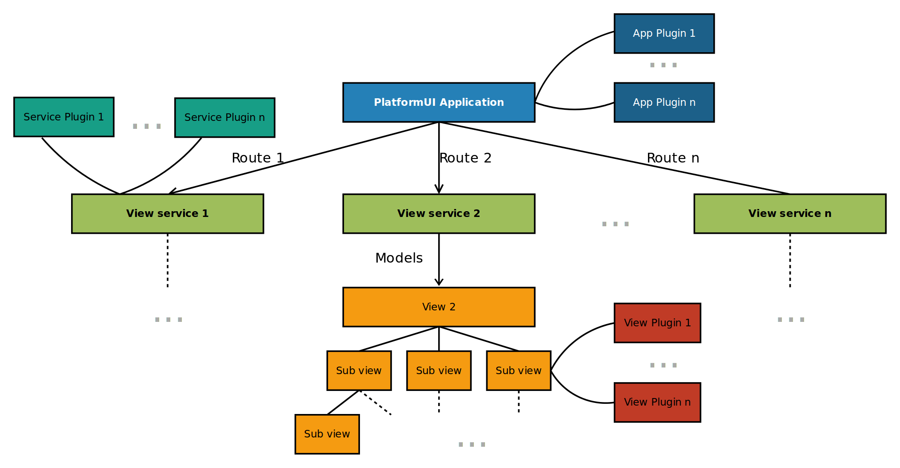
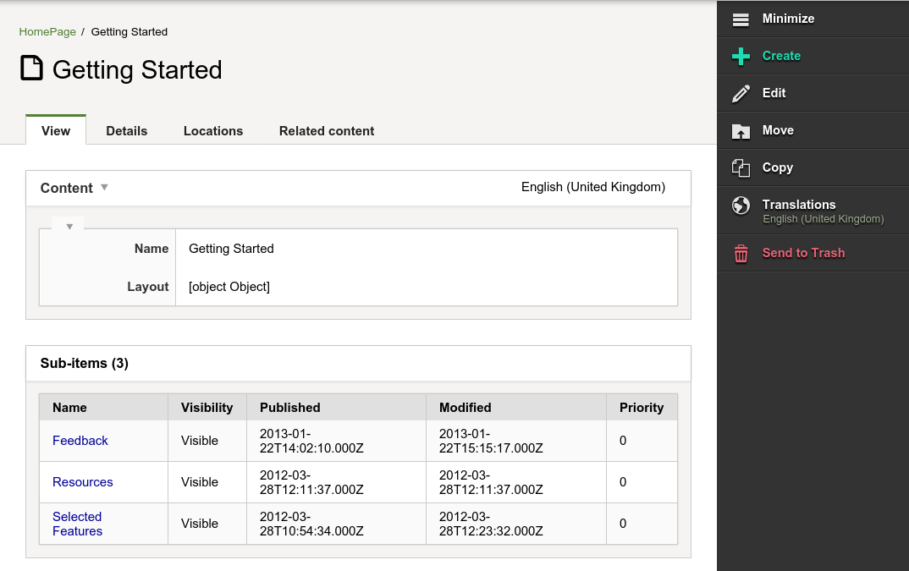
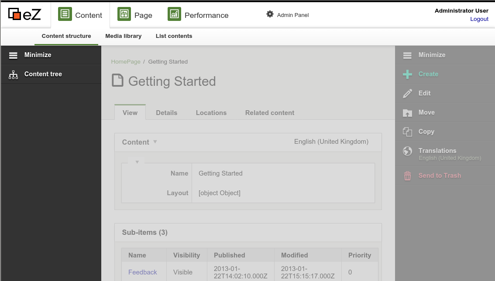
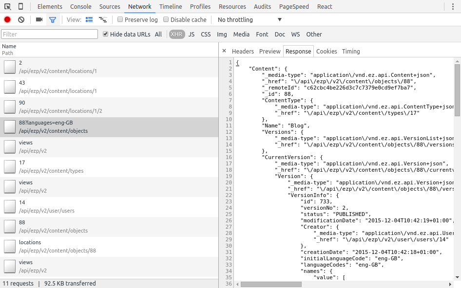
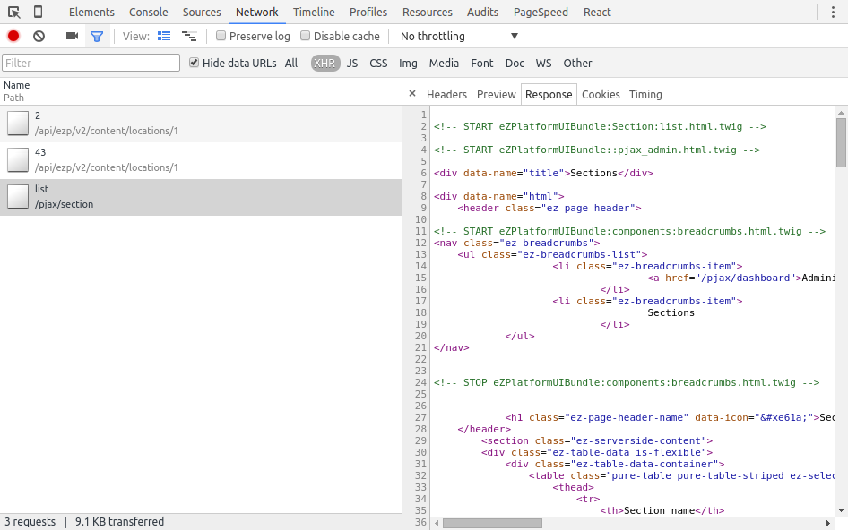
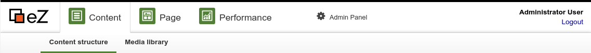
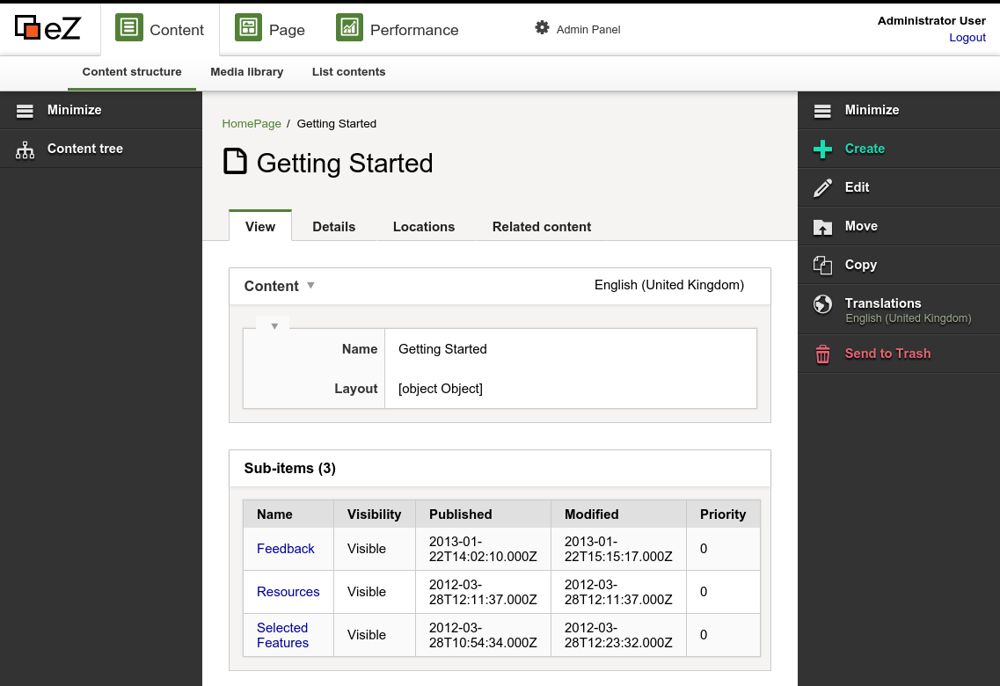
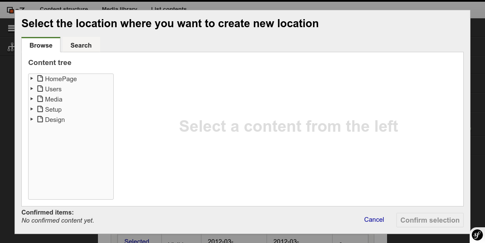

# Extending eZ Platform UI

## Backoffice interface

The backend interface is produced by [the PlatformUI Bundle](https://github.com/ezsystems/PlatformUIBundle) which provides a JavaScript Single Page Application based on [the YUI App Framework](http://yuilibrary.com/yui/docs/app/). This application is accessible in your browser at **http://\[uri\_of\_platform\]/ez**.

### Technical architecture

The PlatformUI application code is divided into different types of components:

- **Application:** this is the top level component, the PlatformUI application is an instance of it. It is responsible for authenticating the user and for handling the routing.
- **Models:** models are the main objects handled by the application, they represent our main domain objects (Content, Location, Content Type, etc.)
- **View services:** view services act between the Application and the Views. They are configured on the routes and the main responsibility of a view service is to provide the model (or other data) to the views and to perform the operations requested by the user (removing a Content item, copying, etc.)
- **Views:** views generate the user interface and handle the user interaction (clicking, form submitting, etc.). A view can have several sub-views which can have further sub-views themselves.
- **Plugins:** plugins can enhance the application, the view services or the views for instance to provide additional features or to tweak the behavior of the plugged component.

The following chart depicts the interaction between those components:



#### Views: main view, sub-view, side view

The views represent a large part of the application and each of them can be used in three different contexts:

1. As the main view
1. As a sub-view of another (sub-)view
1. As a side view

##### Main view

A view used as a main view is configured at the route level to be displayed when the user navigates to that route.

For instance, when reaching `/ez`, the user is redirected to the `loginForm` route (`/ez#/login`) and this route is configured in the following way in the application component:

```
{
     name: "loginForm",
     path: "/login",
     service: Y.eZ.LoginFormViewService,
     sideViews: {'navigationHub': false, 'discoveryBar': false},
     view: 'loginFormView',
     callbacks: ['open', 'handleSideViews', 'handleMainView']
}
```

Among others things, this means the view `loginFormView` will be used as the main view when this route is matched. `loginFormView` is actually [the identifier of the view metadata registered in the `view` property of the Application](http://yuilibrary.com/yui/docs/app/#declaring-views).

##### Sub-view

To avoid having huge main views doing too many things in the application, the views are divided into smaller parts called sub-views.



For instance, the view used to display a Location is divided into several views at several levels, it contains:

- An action bar view for the right toolbar, which contains:
    - a view for the Minimize button
    - a view for the Create button which contains:
        - a view to list and select a Content Type
    - a view for the Edit button
    - ...
- A Location View tab view which contains:
    - the Raw Content View to display the fields which contains:
        - A view for each fields
        - ...
- A Location Details tab view
- ...
- A sub-item list view

##### Side view

A view can also be used as a side view. As its name suggests a side view can represent anything that is not part of the main view.

For instance, when displaying a Location, the top menu (the Navigation hub) or the left toolbar (the Discovery Bar) are side views.



The side views are also used for various widgets providing a service used several times in the application, such as the Universal Discovery Widget.

#### View services

The view services act between the Application and the Views for both the main views and the side views. They are responsible for providing the required data needed by a main view or a side view to be rendered. A view service will also receive the events triggered by the view to react or provide the additional data. For that, the view services receive an instance of the JavaScript REST Client.

### How are pages generated?

Depending on the part of the PlatformUI Application you are using, the page may be generated in two different ways. From an end-user perspective, this is almost transparent but as a developer it is important to understand how the page is generated to be able to extend it.

#### Browser side rendering

The pages in the content part (as opposed to admin related pages) are fully rendered in the browser. For instance, when displaying a Location in PlatformUI, the corresponding view service loads the Location model and the *related* models (Content, Content Type, etc.) with the eZ Platform REST API (through the JavaScript REST Client) and gives them the LocationView to be displayed directly by this view and/or by its sub-views. If you open the browser developer tools in the network panel, you can see the REST requests needed to build the page and they only contain a JSON structure.



#### Server side rendering

The pages in the admin are build in a more traditional way as they are partly rendered server side. For those pages, the view service fetches one (or several) HTML fragment(s) from the server. This HTML fragment follows a very simple structure and can be generated by any means on the server and of course, in PlatformUI this is done in a quite standard Symfony controller. By opening the browser developer tools in the network panel you can see the requests needed to build the section list page.



### UI Components

#### Navigation hub

The Navigation Hub is a side view displaying the top menu.



It displays 3 **Navigation zones**:

- *Content*
- *Page*
- *Admin Panel*

A zone can contain an arbitrary number of **Navigation zone items**. By default, the *Content* zone has 2 navigation items: *Content structure* and *Media library*.

#### Bar views: Discovery Bar View, Action Bar View, Edit Action Bar View

Bar views provide a set of potential actions for the user.



When navigating in the Content zone, the **Discovery Bar View** allows you to discover content while the **Action Bar View** on the right allows you to act on the Content item being viewed (edit, move, copy, etc.).

When editing a Content item, the **Edit Action Bar View** on the right allows you to act on the Content item being edited.

#### Universal Discovery Widget



The Universal Discovery Widget is a side view triggered when the user needs to pick a Content item (or a Location). It can provide several **Discovery Methods**. By default, *Browse* and *Search* are available.

## Extending the Dashboard

eZ Platform contains a Dashboard which shows the user the most relevant Content items divided into blocks for a quick overview.

Aside from the built-in blocks you can extend the Dashboard with new ones and remove existing ones.

It can be done in four steps:

1. Create a block view
1. Create a template
1. Create a plugin for the view
1. Add modules to configuration

#### Create a block view

The first step is creating a view that will be added to the Dashboard. You can do it based on the Dashboard Block Asynchronous View. Thanks to this you only need to provide the data to display in the table.

Using the Dashboard Block Asynchronous View you need to set an `identifier` of the block. The asynchronous view fires the `_fireLoadDataEvent` method to get the data. The data must find itself in an array with the `items` attribute.

If you want to create a completely different view, without a table, you can use the Dashboard Block Base View.

In the example below an `images` block is defined which looks up all content under the `/images/` folder in the tree:

``` php
YUI.add('ezs-dashboardblockimagesview', function (Y) {
    'use strict';
    /**
     * Provides the Dashboard Images Block View class
     *
     * @module ez-dashboardblockimagesview
     */
    Y.namespace('eZS');
    var BLOCK_IDENTIFIER = 'images';
    /**
     * The dashboard images block view
     *
     * @namespace eZS
     * @class DashboardBlockImagesView
     * @constructor
     * @extends eZ.DashboardBlockAsynchronousView
     */
    Y.eZS.DashboardBlockImagesView = Y.Base.create('dashboardBlockImagesView', Y.eZ.DashboardBlockAsynchronousView, [], {
        initializer: function () {
            this._set('identifier', BLOCK_IDENTIFIER);
        },
        _fireLoadDataEvent: function () {
            this.fire('locationSearch', {
                viewName: 'images-dashboard',
                resultAttribute: 'items',
                loadContentType: true,
                loadContent: true,
                search: {
                    criteria: {SubtreeCriterion: '/1/43/51/'},
                    limit: 10
                }
            });
        },
        _getTemplateItem: function (item) {
            return {
                content: item.content.toJSON(),
                contentType: item.contentType.toJSON(),
                location: item.location.toJSON(),
                contentInfo: item.location.get('contentInfo').toJSON(),
            };
        },
    });
});
```

In the `_getTemplateItem` method you can specify the structure of the item which will be provided to the template. In the example above each item will be an object with four properties.

If you don't intend to change the structure of the item, there's no need to override this method.

#### Create a template

Now you have to create a template for the view, for example:

``` html
<h2 class="ez-block-title">Images</h2>
<div class="ez-block-wrapper ez-asynchronousview">
    {{#if loadingError}}
    <p class="ez-asynchronousview-error ez-font-icon">
        An error occurred while loading the images list.
        <button class="ez-asynchronousview-retry ez-button ez-font-icon pure-button">Retry</button>
    </p>
    {{else}}
    <table class="ez-block-items-table">
        <thead class="ez-block-header">
            <tr>
                <th class="ez-block-head-title">Title</th>
                <th class="ez-block-head-content-type">Content Type</th>
                <th class="ez-block-head-version">Version</th>
                <th class="ez-block-head-modified">Last saved</th>
            </tr>
        </thead>
        <tbody class="ez-block-content">
        {{#each items}}
            <tr class="ez-block-row">
                <td class="ez-block-cell">{{ contentInfo.name }}</td>
                <td class="ez-block-cell">{{ lookup contentType.names contentInfo.mainLanguageCode }}</td>
                <td class="ez-block-cell">{{ contentInfo.currentVersionNo }}</td>
                <td class="ez-block-cell ez-block-cell-options">
                    {{ contentInfo.lastModificationDate }}
                    <div class="ez-block-row-options">
                        <a class="ez-block-option-edit ez-font-icon" href="{{ path "editContent" id=contentInfo.id languageCode=contentInfo.mainLanguageCode }}"></a>
                        <a class="ez-block-option-view ez-font-icon" href="{{ path "viewLocation" id=location.id languageCode=contentInfo.mainLanguageCode }}"></a>
                    </div>
                </td>
            </tr>
        {{/each}}
        </tbody>
    </table>
    {{/if}}
</div>
```

You may notice that the template is prepared to handle the `loadingError`, because the asynchronous view provides it if there are problems with loading data. If no error occurs, a table with basic info about your images will be displayed.

#### Create a plugin for the view

The next step is adding the view and the template to the Dashboard. To do this, you need to create a plugin for the Dashboard view.

In the initializer you can use the public `addBlock` method from the Dashboard view. In this method you only have to provide the instance of your view. Here you also set some properties for your new view: `bubbleTargets` to make sure that the events will bubble up to the other views, and `priority` where you can set the order of blocks in the Dashboard (higher number goes first).

``` php
YUI.add('ezs-dashboardblocksplugin', function (Y) {
    'use strict';
    /**
     * The plugin is responsible for adding a new block to the dashboard.
     *
     * @module ezs-dashboardblocksplugin
     */
    Y.namespace('eZS.Plugin');
    Y.eZS.Plugin.DashboardBlocks = Y.Base.create('studioDashboardBlocks', Y.Plugin.Base, [], {
        initializer: function () {
            this.get('host').addBlock(this.get('imagesBlockView'));
        }
    }, {
        NS: 'studioDashboardBlocks',
        ATTRS: {
            imagesBlockView: {
                valueFn : function () {
                    return new Y.eZS.DashboardBlockImagesView({
                        bubbleTargets: this.get('host'),
                        priority: 500
                    });
                }
            }
        }
    });
    Y.eZ.PluginRegistry.registerPlugin(
        Y.eZS.Plugin.DashboardBlocks, ['dashboardBlocksView']
    );
});
```

If for whatever reason you want to remove a block, use another public method, `removeBlock`, and provide it with just the block identifier.

#### Add modules to configuration

The last thing you have to do is add new modules to the yml configuration:

``` yaml
ezs-dashboardblocksplugin:
    requires:
        - 'plugin'
        - 'base'
        - 'ez-pluginregistry'
        - 'ezs-dashboardblockimagesview'
    dependencyOf: ['ez-dashboardblocksview']
    path: %ezstudioui.public_dir%/js/views/services/plugins/ezs-dashboardblocksplugin.js
ezs-dashboardblockimagesview:
    requires:
        - 'ez-dashboardblockasynchronousview'
        - 'dashboardblockimagesview-ez-template'
    path: %ezstudioui.public_dir%/js/views/ezs-dashboardblockimagesview.js
dashboardblockimagesview-ez-template:
    type: 'template'
    path: %ezstudioui.public_dir%/templates/dashboardblock-images.hbt
```

In this example the plugin is added as a dependency of the Dashboard block view, requiring the new images block view. The Dashboard images view in turn requires the asynchronous view.

After this configuration is complete the Dashboard should display the new block.

## Extending the Landing Page (Enterprise)

### Block templates

EZ ENTERPRISE

All Landing Page blocks, both those that come out of the box and [custom ones](../cookbook/creating_landing_page_blocks_(enterprise).md), can have multiple templates. This allows you to create different styles for each block and let the editor choose them when adding the block from the UI. The templates are defined in your configuration files like in the following example, with `simplelist` and `special` being the template names:

``` yaml
# app/config/block_templates.yml
blocks:
    contentlist:
        views:
            simplelist:
                template: blocks/contentlist_simple.html.twig
                name: Simple Content List
            special:
                template: blocks/contentlist_special.html.twig
                name: Special Content List
```

Some blocks can have slightly more complex configuration. An example is the Collection block, which requires an `options` key.
This key defines which Content Types can be added to it.
See [this example from the Studio Demo](https://github.com/ezsystems/ezstudio-demo-bundle/blob/master/Resources/config/default_layouts.yml#L160):

``` yaml
blocks:
    collection:
        views:
            content:
                template: eZStudioDemoBundle:blocks:collection.content.html.twig
                name: Content List View
                options:
                    match: [article, blog_post]
            gallery:
                template: eZStudioDemoBundle:blocks:collection.content.html.twig
                name: Gallery View
                options:
                    match: [image]
```

### Extending the Form Builder

EZ ENTERPRISE

Form Builder Bundle currently comes with three basic types of fields: Single Line Text, Paragraph Text and Email.

It was designed to be easy to extend by adding new types of fields.

#### Field definitions

Default field definitions are available in `Resources\config\default_fields.yml`.

##### Field definition structure

Field definitions are contained under the `fields` key. Each definition has its own key, e.g. `single_line_text`. Each definition must contain two sections:

- `identifier` - name of the definition used on the front end
- `displayName` - name displayed in the Page mode editor in the `fields` tab

The definition can also contain the following optional sections:

- `validators` - defines validators that the field will use. This must contain the validator's identifier and the values that will be checked during validation, for example:

``` yaml
        validators:
            - { identifier: required, value: 1 }
```

- `attributes` - contains the field's attributes. You can place here custom attributes for new fields, like in <https://github.com/ezsystems/ezstudio-form-builder/blob/master/bundle/Resources/config/default_fields.yml#L33>. There are also [four default attributes](https://github.com/ezsystems/ezstudio-form-builder/blob/master/lib/Core/Definition/FieldDefinition.php#L16-L19) that are used for every field: `LABEL_NAME`, `LABEL_HELP_TEXT`, `LABEL_ADMIN_LABEL` and `LABEL_PLACEHOLDER_TEXT`. If you wish, you can override them in your configuration.

- `views` - provides a list of views that will be used to display the field. At least one view must be defined, with the keys `name`, `thumbnail` and `template`, for example:

``` yaml
        views:
            basic:
                name: Form Test Line Text Basic
                thumbnail: /bundles/ezsystemsformbuilder/images/thumbnails/single_line_text/basic.svg
                template: EzSystemsFormBuilderBundle:fields:single_line_text/basic.html.twig
```

##### Adding a new field definition

This procedure assumes you are creating a separate Bundle to house your new type of form field.

###### 1. Create a YAML file with field definition

Create a YAML configuration file, e.g. `Resources\config\extended_fields.yml`, with the following code:

``` yaml
fields:
    test_text:
        identifier: testLineText
        displayName: 'Test Line Text'
        validators:
            - { identifier: required, value: 1 }
        attributes:
            name: 'test line attribute'
        views:
            basic:
                name: Form Test Line Text Basic
                thumbnail: /bundles/ezsystemsformbuilder/images/thumbnails/single_line_text/basic.svg
                template: EzSystemsFormBuilderBundle:fields:single_line_text/basic.html.twig
```

You can also provide additional options using the `options:` key. For example, you can make sure that the data entered in a field will not to be stored in the database, like for example in the [built-in Captcha field](https://github.com/ezsystems/ezstudio-form-builder/blob/5fd44dc5419a2e969f2a17acbda794f321e5c946/bundle/Resources/config/default_fields.yml#L134).

When creating a new template for the field definition, remember to add mandatory `ezform-field` class and `field.id` as shown below: 

``` html


    <input type="text" class="ezform-field ..." id="{{ field.id }}" placeholder="{{ field.placeholderText }}">

```

###### 2. Modify the `DependencyInjection\TestExtension.php` class

The class must implement the` PrependExtensionInterface` interface:

``` php
class TestExtension implements PrependExtensionInterface
```

In the `prepend` method in `TestExtension.php` add the following lines at the end:

``` php
public function prepend(ContainerBuilder $container)
    {
    ...
        $configFile = __DIR__ . '/../Resources/config/extended_fields.yml';
        $config = Yaml::parse(file_get_contents($configFile));
        $container->loadFromExtension('ez_systems_form_builder', $config);
        $container->addResource(new FileResource($configFile));    
    }
```

#### Validators

##### Creating your own validators

You can create your own validators by reproducing the following configuration:

###### Validator configuration

A validator implements the `EzSystems\FormBuilder\SPI\ValidatorInterface.php` interface and extends the abstract class `EzSystems\FormBuilder\Core\Validator\Validator.php`.

The interface requires the implementation of the following methods:

- `validate`
- `getLabel`
- `getErrorMessage`
- `setLimitation`
- `getValueType`

The `validate` method is the one that contains the logic for the validation. It returns `true` when validation is successful, or `false` when the data does not validate:

``` php
    /**
     * @return bool
     */
    public function validate($value);
```

The `getLabel` method returns a string with the name of the validator that will be used in the editor:

``` php
    /**
     * @return string
     */
    public function getLabel();
```

The `getErrorMessage` method returns error message(s) to appear when the `validate` method returns `false`:

``` php
    /**
     * @return array
     */
    public function getErrorMessage();
```

The `setLimitation` method allows the configuration of limitations. Its default implementation is contained in the `Validator` abstract class:

``` php
    /**
     * @param mixed $limitation
     */
    public function setLimitation($limitation);
```

The `getValueType` method returns the name of the checked value type:

``` php
    /**
     * @return string
     */
    public function getValueType();
```

Currently the abstract class `Validator` has three value types (defined in `Core\Validator\Validator.php`):

``` php
    const TYPE_INTEGER = 'integer';
    const TYPE_STRING = 'string';
    const TYPE_BOOL = 'bool';
```

The validator must be tagged as `form_builder.field_validator`. Due to this the `Resources\config\validator_services.yml` file contains two entries, one in the `parameters` section:

``` yaml
form_builder.validator.example.class: EzSystems\FormBuilder\Core\Validator\ExampleValidator
```

and one in the `services` section:

``` yaml
form_builder.validator.example:
        class: '%form_builder.validator.example.class%'
        tags:
            - { name: form_builder.field_validator, alias: example }
```

#### Signal slots

Whenever a form is submitted and stored in a database, `lib\Core\SignalSlot\Signal\FormSubmit` emits signal in a `submitForm` service. You can create your own listeners, called Signal slots, to capture the FormSubmit signal.

Below you can find an example of a custom Signal slot. It saves submission to a text file. 

``` php
<?php
namespace AppBundle\SignalSlot;
use Symfony\Component\Filesystem\Filesystem;
use eZ\Publish\Core\SignalSlot\Slot;
use eZ\Publish\Core\SignalSlot\Signal;
class HandleSubmission extends Slot
{
    /**
     * Receive the given $signal and react on it.
     *
     * @param EzSystems\FormBuilder\Core\SignalSlot\Signal\FormSubmit $signal
     */
    public function receive(Signal $signal)
    {
        $fs = new Filesystem();
        $formId = $signal->formId;
        $submission = $signal->submission;
        $created = $submission->created->format("Y-m-d.H:i:s");
        $dataRows = [];
        foreach ($submission->fields as $field) {
            $dataRows[] = "{$field->label}: {$field->value}";
        }
        $fs->mkdir("forms/{$formId}");
        $fs->dumpFile("forms/{$formId}/{$created}.txt", implode("\n", $dataRows));
    }
}
```

It has to be registered as a tagged Symfony service, like this:

``` yaml
    app_bundle.handle_submission:
        class: "AppBundle\SignalSlot\HandleSubmission"
        tags:
            - { name: ezpublish.api.slot, signal: '\EzSystems\FormBuilder\Core\SignalSlot\Signal\FormSubmit' }
 
```

#### Other Form Builder fields

The following form Builder fields require additional configuration.

##### Date field

To make use of the Date field you need to add the necessary assets. The assets should be added in page head with the following code:

``` html

    <script type="text/javascript" src="{{ asset_url }}"></script>

```

``` html

    <link rel="stylesheet" type="text/css" href="{{ asset_url }}">

```

###### Adding new date format

If you wish to add a new date format, the `alias` in the date field config must follow this pattern:

`d` or `D` - day of the month (1-2 digits)
`dd` or `DD` - day of the month (2 digits)
`m` or `M` - month of the year (1-2 digits)
`mm` or `MM` - month (2 digits)
`yy` or `YY` - year (2 digits)
`yyyy` or `YYYY` - year (4 digits)

for example:

`d-m-yyyy` - `16-1-2017`
`mm/dd/yy` - `01/16/17`

## Further extensibility

### Content Type icons

A Content item can be treated as an instance of a Content Type. The type of a Content item is very important information to provide to the user. The Content Type to which a Content item belongs is represented graphically using an icon near the Content item name. Essentially, the Content Types are project-specific so the icons can be easily configured and extended by integrators.

##### Font icons + CSS

Icons in the PlatformUI interface are provided by an icon font. For Content Types, the idea is to expand that concept so that while generating the interface, we end up with a code similar to:

``` html
 <h1 class="ez-contenttype-icon ez-contenttype-icon-folder">Folder Name</h1>
```

With such classes, the `h1` is specified to display a Content Type icon. The class `ez-contenttype-icon` makes sure the element is styled for that and gets the default Content Type icon. The second class is specific to the Content Type based on its identifier and if it's defined in one of the CSS files, the element will get the custom Content Type icon defined there.

#### Adding new Content Type icons

The extensibility of Content Type icons is tackled differently depending on the use case, but it relies on the ability to embed a custom CSS file in PlatformUI with `css.yml`.

To prevent the need to configure/extend the system, we provide several pre-configured icons for very common Content Types such as:

- `product`
- `author`
- `category`
- `gallery` / `portfolio`
- `blog_post` / `blogpost` / `post`
- `blog` / `weblog`
- `news`
- `pdf`
- `document`
- `photo`
- `comment`
- `wiki`
- `wiki_page` / `wikipage`

There are three ways of choosing Content Type icons:

##### Pick an icon for a custom Content Type from existing icons

In such a case you need to pick the icon code. For that, [the icomoon application](https://icomoon.io/app/) can be used until the UI guidelines are up-to-date and reference the available icons. To ease that process and the readability of the code, we'll use ligatures in the font icon so that the CSS code for a custom Content Type could look like:

``` css
 /* in a custom CSS file included with `css.yml` */
.ez-contenttype-icon-mycontenttypeidentifier:before {
    content: "product"; /* because this icon matches the usage of such content
    items */
}
```

##### Add custom icons

If the icons we provide do not fit a custom Content Type, then a new custom icon font has to be added. To generate the icon, the Icomoon App can be used (or any other tool). Then, using a custom CSS stylesheet, this font can be included and the `ez-contenttype-icon-<content type identifier>` can be configured to use that font.

Example:

``` css
/* in a custom CSS file included with `css.yml` */
@font-face {
    font-family: 'my-icon-font';
    src:url('../../fonts/my-icon-font.eot');
    src:url('../../fonts/my-icon-font.eot?#iefix') format('embedded-opentype'),
        url('../../fonts/my-icon-font.woff') format('woff'),
        url('../../fonts/my-icon-font.ttf') format('truetype'),
        url('../../fonts/my-icon-font.svg#my-icon-font') format('svg');
    font-weight: normal;
    font-style: normal;
}
.ez-contenttype-icon-myidentifier:before {
    font-family: 'my-icon-font';
    content: "myiconcode";
}
/* repeated as many times as needed for each custom Content Type */
```

##### Completely override the icon set

The solution for this use case is very close to the previous one. A custom icon font will have to be produced, loaded with a custom CSS file, and then the `ez-contenttype-icon` style has to be changed to use that new font.

Example:

``` css
/* in a custom CSS file included with `css.yml` */
@font-face {
    font-family: 'my-icon-font';
    src:url('../../fonts/my-icon-font.eot');
    src:url('../../fonts/my-icon-font.eot?#iefix') format('embedded-opentype'),
        url('../../fonts/my-icon-font.woff') format('woff'),
        url('../../fonts/my-icon-font.ttf') format('truetype'),
        url('../../fonts/my-icon-font.svg#my-icon-font') format('svg');
    font-weight: normal;
    font-style: normal;
}
.ez-contenttype-icon:before {
    font-family: 'my-icon-font'; /* replaces ez-platformui-icomoon */
    /* no further change needed if the custom icon font uses the same
     * codes/ligatures
     */
}
```

### Custom Javascript

Custom Javascript can be added to PlatformUI using the following configuration block:

``` yaml
ez_platformui:
    system:
        default:
            javascript:
                files:
                   - '<path to js file>'
```
