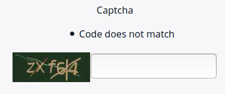
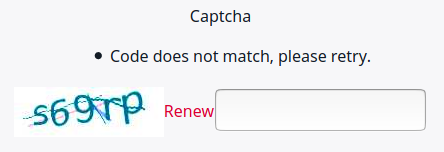

# Forms

You can build forms consisting of different fields in the Form Builder.

!!! tip

    To learn how to get, create, and delete form submissions by using the PHP API,
    see [Managing forms](../../api/public_php_api_managing_forms.md).

[[% include 'snippets/forms_caution.md' %]]

## Existing Form fields

### Captcha field

The Captcha Form field is based on [Gregwar/CaptchaBundle](https://github.com/Gregwar/CaptchaBundle).



You can customize the field by adding configuration to `config/packages/gregwar_captcha.yaml` under `gregwar_captcha`:

``` yaml
gregwar_captcha:
    as_url: true
    width: 150
    invalid_message: Code does not match, please retry.
    reload: true
```

The example configuration above resizes the Captcha image (line 3), changes the error message (line 4),
and enables the user to reload the code (line 5).



For information about available options, see [Gregwar/CaptchaBundle's documentation.](https://github.com/Gregwar/CaptchaBundle#options)

!!! note

    If your installation uses Varnish to manage content cache, you must modify the configuration to avoid issues with the Captcha field. For more information, see [Ensure proper captcha behavior](../cache/symfony_reverse_proxy.md#ensure-proper-captcha-behavior).
