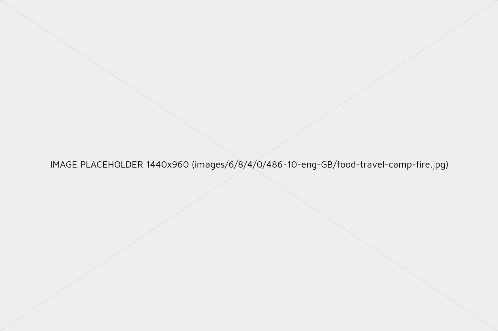
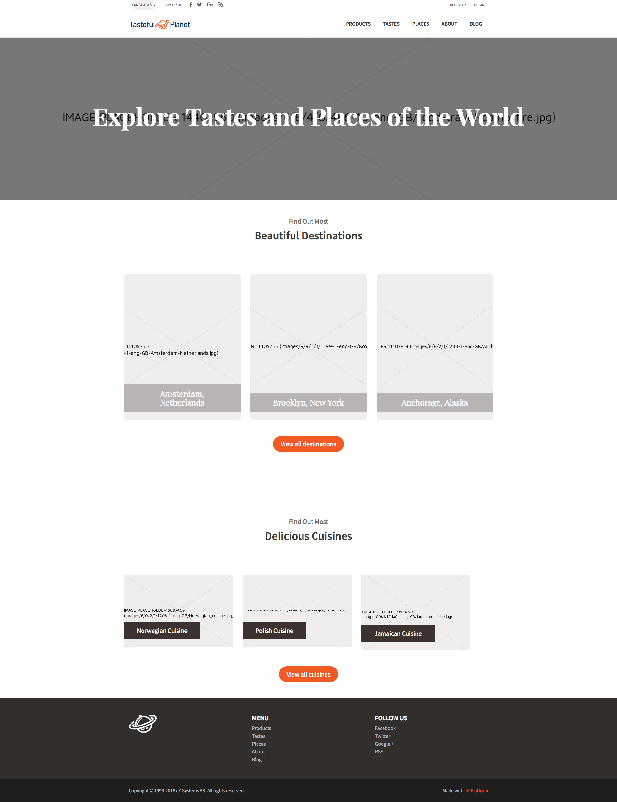
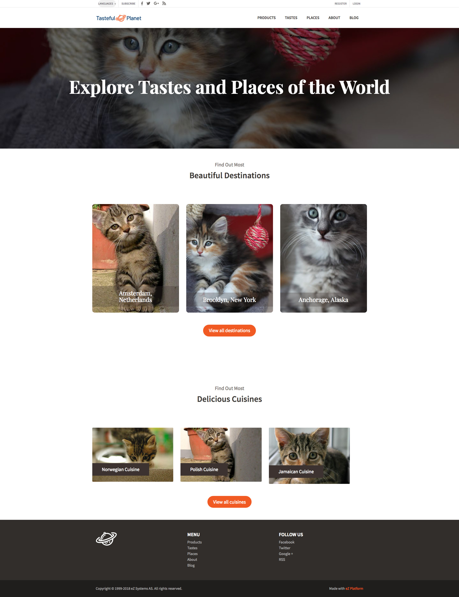

# Images

## Introduction

Image variations (image aliases) enable you to define and use different versions of the same image. You generate variations based on filters which modify aspects such as size and proportions, quality or effects.

Image variations are generated with [LiipImagineBundle](https://github.com/liip/LiipImagineBundle), using the underlying [Imagine library from avalanche123](http://imagine.readthedocs.org/en/latest/). This bundle supports GD (default), Imagick or Gmagick PHP extensions, and enables you to define flexible filters in PHP. Image files are stored using the `IOService,` and are completely independent from the Image Field Type. They are generated only once and cleared on demand (e.g. on content removal).

LiipImagineBundle only works on image blobs (no command line tool is needed). See the [bundle's documentation to learn more on that topic](http://symfony.com/doc/master/bundles/LiipImagineBundle/configuration.html).

## Images from a DAM system

If your installation is connected to a DAM system, you can use images directly from a DAM system in your content.

The [specific configuration](config_connector.md#dam-configuration) will depend on the DAM system in question.

## Configuring image variations

Custom image variations are defined in `ezplatform.yaml` or any imported semantic configuration file. The definition is [dynamic](configuration.md#dynamic-configuration-with-the-configresolver), so it can be configured per SiteAccess and all the other scopes.

``` yaml
# Example image variation definition

ezplatform:
    system:
        my_siteaccess:
            image_variations:
                small:
                    reference: null
                    filters:
                        - { name: geometry/scaledownonly, params: [100, 160] }
                medium:
                    reference: null
                    filters:
                        - { name: geometry/scaledownonly, params: [200, 290] }
                listitem:
                    reference: null
                    filters:
                        - { name: geometry/scaledownonly, params: [130, 190] }
                articleimage:
                    reference: null
                    filters:
                        - { name: geometry/scalewidth, params: [770] }
```

!!! note

    Each variation name **must be unique**. It may contain underscores (`_`), hyphens (`-`) or numbers, but no spaces.

The following parameters are set for each variation:

- `reference`: Name of a reference variation to base the variation on. If set to `null` (or `~`, which means `null` in YAML), the variation will take the original image for reference. It can be any configured variation, or a `filter_set` defined in the `liip_imagine` namespace.
- `filters`: Array of filter definitions (hashes containing `name` and `params` keys). See possible values [below](#available-filters).

!!! caution

    If you change image variation properties manually, you need to clear persistence cache:

    `php bin/console cache:pool:clear <pool_name>`

    where `<pool_name>` is `cache.app` by default, and `cache.redis` when using Redis.

### Built-in image variations

A few basic image variations are included by default in [[= product_name =]] in the `default_settings.yaml` config file:

``` yaml
ezsettings.default.image_variations:
    reference:
        reference: ~
        filters:
            geometry/scaledownonly: [600, 600]
    small:
        reference: reference
        filters:
            geometry/scaledownonly: [100, 100]
    tiny:
        reference: reference
        filters:
            geometry/scaledownonly: [30, 30]
    medium:
        reference: reference
        filters:
            geometry/scaledownonly: [200, 200]
    large:
        reference: reference
        filters:
            geometry/scaledownonly: [300, 300]
```

### Post-Processors

LiipImagineBundle supports [post-processors on image aliases](http://symfony.com/doc/master/bundles/LiipImagineBundle/post-processors.html). You can specify them in image variation configuration:

``` yaml
ezplatform:
    system:
        my_siteaccess:
            image_variations:
                articleimage:
                    reference: null
                    filters:
                        - { name: geometry/scalewidth, params: [770] }
                    post_processors:
                        jpegoptim: {}
```

Please refer to [post-processor documentation in LiipImagineBundle](http://symfony.com/doc/master/bundles/LiipImagineBundle/post-processors.html) for details.

## Configuration examples

### Scaling with an [[= product_name =]] filter

This configuration defines a `medium` image variation that is scaled to a width of 700 px.

``` yaml
ezplatform:
    system:
        my_siteaccess:
            image_variations:
                medium:
                    reference: null
                    filters:
                        - geometry/scalewidth:
                            params: [770]
```

### Image quality with a liip filter

This configuration adds a limit to the image quality using a liip filter.

You can use both an [[= product_name =]] and a liip filter for the same image variation, in this case `medium`.

``` yaml
ezplatform:
    system:
        my_siteaccess:
            image_variations:
                # List of variations

liip_imagine:
    driver: imagick
    filter_sets:
        medium:
            jpeg_quality: 50
```

!!! note

    Notice that the `liip_imagine` key is not placed under `image_variations`, but at the same level as `ezplatform`.

## Rendering image variations

### Render within a Twig template

Image variations can be called within a Twig template by passing `alias` with the parameters:

``` html+twig
ez_render_field( content, 'image', { parameters: { 'alias': 'medium' } } )
```

## Upgrade

### Instantiate `LiipImagineBundle` in your kernel class

If you were using ImageMagick, install [Imagick](http://php.net/imagick) or [Gmagick](http://php.net/gmagick) PHP extensions and activate the driver in `liip_imagine `([see LiipImagineBundle configuration documentation for more information](http://symfony.com/doc/master/bundles/LiipImagineBundle/configuration.html)):

``` yaml
liip_imagine:
    # Driver can be either "imagick", "gmagick" or "gd", depending on the PHP extension you're using.
    driver: imagick
```

GD will be used by default if no driver is specified.

## Managing variations

### Purging

You can use the Liip Imagine console tool to clear generated variations.

``` bash
$ php bin/console liip:imagine:cache:remove --filter=large
$ php bin/console liip:imagine:cache:remove -v
```

The first example will clear the image files for the `large` variation. The second will clear all the generated variations (be careful), and list the removed files (`-v).`

!!! note

    The naming scheme change introduced by this feature wasn't enabled by default on 5.4.x. As part of migration you'll need to adapt to the new schema to get the benefit of this more efficient purge method. More technical information can be found on the [pull request](https://github.com/ezsystems/ezpublish-kernel/pull/1276).

!!! caution "Code injection in image EXIF"

    EXIF metadata of an image may contain e.g. HTML, JavaScript, or PHP code. [[= product_name =]] is itself does not parse EXIF metadata, but third-party bundles need to be secured against this eventuality. Images should be treated like any other user-submitted data - make sure the metadata is properly escaped before use.

### Resolving image URLs

You can use LiipImagine's `liip:image:cache:resolve` script to resolve the path to image variations generated from the original image, with one or more paths as arguments. See [LiipImagineBundle documentation](http://symfony.com/doc/current/bundles/LiipImagineBundle/commands.html#resolve-cache) for more information.

Note that paths to repository images must be relative to the `var/<site>/storage/images` directory, for example: `7/4/2/0/247-1-eng-GB/test.jpg`.

## Filter reference

### Available filters

In addition to [filters exposed by LiipImagineBundle](http://symfony.com/doc/master/bundles/LiipImagineBundle/filters.html), the following are available:

| Filter name                  | Parameters                                  | Description                                                                                        |
|------------------------------|---------------------------------------------|----------------------------------------------------------------------------------------------------|
| geometry/scaledownonly       | \[width, height\]                           | Generates a thumbnail that will not exceed width/height.                                           |
| geometry/scalewidthdownonly  | \[width\]                                   | Generates a thumbnail that will not exceed width.                                                  |
| geometry/scaleheightdownonly | \[height\]                                  | Generates a thumbnail that will not exceed height.                                                 |
| geometry/scalewidth          | \[width\]                                   | Alters image width. Proportion will be kept.                                                       |
| geometry/scaleheight         | \[height\]                                  | Alters image height. Proportion will be kept.                                                      |
| geometry/scale               | \[width, height\]                           | Alters image size, not exceeding provided width and height. Proportion will be kept.               |
| geometry/scaleexact          | \[width, height\]                           | Alters image size to fit exactly provided width and height. Proportion will not be kept.           |
| geometry/scalepercent        | \[widthPercent, heightPercent\]             | Scales width and height with provided percent values. Proportion will not be kept.                 |
| geometry/crop                | \[width, height, startX, startY\]           | Crops the image. Result will have provided width/height, starting at provided startX/startY        |
| border                       | \[thickBorderX, thickBorderY, color=\#000\] | Adds a border around the image. Thickness is defined in px. Color is "\#000" by default.           |
| filter/noise                 | \[radius=0\]                                | Smooths the contours of an image (`imagick`/`gmagick` only). `radius` is in px.                    |
| filter/swirl                 | \[degrees=60\]                              | Swirls the pixels of the center of the image (`imagick`/`gmagick` only). `degrees` defaults to 60°.|
| resize                       | {size: \[width, height\]}                   | Simple resize filter (provided by LiipImagineBundle).                                              |
| colorspace/gray              | N/A                                         | Converts the image to grayscale.                                                                   |

LiipImagineBundle supports additional settings, it is possible to combine filters from the list above with [the ones provided in LiipImagineBundle](http://symfony.com/doc/master/bundles/LiipImagineBundle/filters.html) or custom ones.

### Discarded filters

The following filters exist in the Imagine library but are not used in [[= product_name =]] due to incompatibility:

- `flatten`. Obsolete, images are automatically flattened.
- `bordercolor`
- `border/width`
- `colorspace/transparent`
- `colorspace`

### Custom filters

Please refer to [LiipImagineBundle documentation on custom filters](http://symfony.com/doc/master/bundles/LiipImagineBundle/filters.html#custom-filters). [Imagine library documentation](http://imagine.readthedocs.org/en/latest/) may also be useful.

## Setting placeholder generator

Placeholder generator enables you to download or use generated image placeholder for any missing image. It might be used when you are working on an existing database and you are not able to download uploaded images to your local development environment because of their large size

`PlaceholderAliasGenerator::getVariation` method generates placeholder (by delegating it to the implementation of `PlaceholderProvider` interface) if original image cannot be resolved and saves it under the original path.

In [[= product_name =]] there are two implementations of `PlaceholderProvider` interface:

- [GenericProvider](#genericprovider)
- [RemoteProvider](#remoteprovider)

```php
<?php

namespace eZ\Bundle\EzPublishCoreBundle\Imagine;

use eZ\Publish\Core\FieldType\Image\Value as ImageValue;

interface PlaceholderProvider
{
    /**
     * Provides a placeholder image path for a given Image FieldType value.
     *
     * @param \eZ\Publish\Core\FieldType\Image\Value $value
     * @param array $options
     * @return string Path to placeholder
     */
    public function getPlaceholder(ImageValue $value, array $options = []): string;
}
```

### GenericProvider

`\eZ\Bundle\EzPublishCoreBundle\Imagine\PlaceholderProvider\GenericProvider` generates placeholder with basic information about original image - [example 1](#configuration-examples).

**Generic image example:**



**Full page example:**



|Option|Default value|Description|
|------|-------------|-----------|
|fontpath|n/a|Path to the font file (*.ttf). **This option is required.**|
|text|"IMAGE PLACEHOLDER %width%x%height%\n(%id%)"|Text which will be displayed in the image placeholder. %width%, %height%, %id% in it will be replaced with width, height and ID of the original image.|
|fontsize|20|Size of the font in the image placeholder.|
|foreground|#000000|Foreground color of the placeholder.|
|secondary|#CCCCCC|Secondary color of the placeholder.|
|background|#EEEEEE|Background color of the placeholder.|

### RemoteProvider

`\eZ\Bundle\EzPublishCoreBundle\Imagine\PlaceholderProvider\RemoteProvider` allows you to download placeholders from:

 - remote source e.g. <http://placekitten.com> - [example 2](#configuration-examples)
 - live version of a site - [example 3](#configuration-examples)

**Full page example:**



|Option|Default value|Description|
|------|-------------|-----------|
|url_pattern|''|URL pattern. %width%, %height%, %id% in it will be replaced with width, height and ID of the original image.|
|timeout|5|Period of time before timeout, measured in seconds.|

### Semantic configuration

Placeholder generation can be configured for each [`binary_handler`](file_management.md#handling-binary-files) under the `ezplatform.image_placeholder` key:

```yaml
ezplatform:
    # ...
    image_placeholder:
        <BINARY_HANDLER_NAME>:
            provider: <PROVIDER TYPE>
            options:  <CONFIGURATION>
```

If there is no configuration assigned to [`binary_handler`](file_management/#handling-binary-files) name, the placeholder generation will be disabled.

##### Configuration examples:

**Example 1 - placeholders with basic information about original image**

```yaml
ezplatform:
    # ...
    image_placeholder:
        default:
            provider: generic
            options:
                fontpath: '%kernel.project_dir%/src/Resources/font/font.ttf'
                background: '#EEEEEE'
                foreground: '#FF0000'
                text: 'MISSING IMAGE %%width%%x%%height%%'
```

**Example 2 - placeholders from remote source**

```yaml
ezplatform:
    # ...
    image_placeholder:
        default:
            provider: remote
            options:
                url_pattern: 'https://placekitten.com/%%width%%/%%height%%'
```

**Example 3 - placeholders from live version of a site**

```yaml
ezplatform:
    # ...
    image_placeholder:
        default:
            provider: remote
            options:
                url_pattern: 'http://example.com/var/site/storage/%%id%%'
```

## Resizing images

You can resize all original images of a chosen Content Type using the `ezplatform:images:resize-original` command.
You need to provide the command with:

- identifier of the image Content Type
- identifier of the Field you want to affect
- name of the image variation to apply to the images

`ezplatform:images:resize-original <Content Type identifier> <Field identifier> -f <variation name>`

For example:

`ezplatform:images:resize-original photo image -f small_image`

Additionally you can provide two parameters:

- `iteration-count` is the number of images to be recreated in a single iteration, to reduce memory use. Default is `25`.
- `user` is the identifier of a User with proper permission who will perform the operation (`read`, `versionread`, `edit` and `publish`). Default is `admin`.

!!! caution

    This command publishes a new version of each Content item it modifies.

## Reusing images

You can store images in the media library as independent Content items of a generic Image Content Type to reuse them across the system.
It is achieved by uploading images to an ImageAsset Field Type.

For an ImageAsset Field to be reused you have to publish it. Only then is notification triggered stating image has been published under the Location and can now be reused.
After establishing media library you can create object Relations between the main Content item and the image Content item being used by it.

To learn more about ImageAsset Field Type and its customization see [Field Type Reference](../api/field_type_reference.md#imageasset-field-type).
