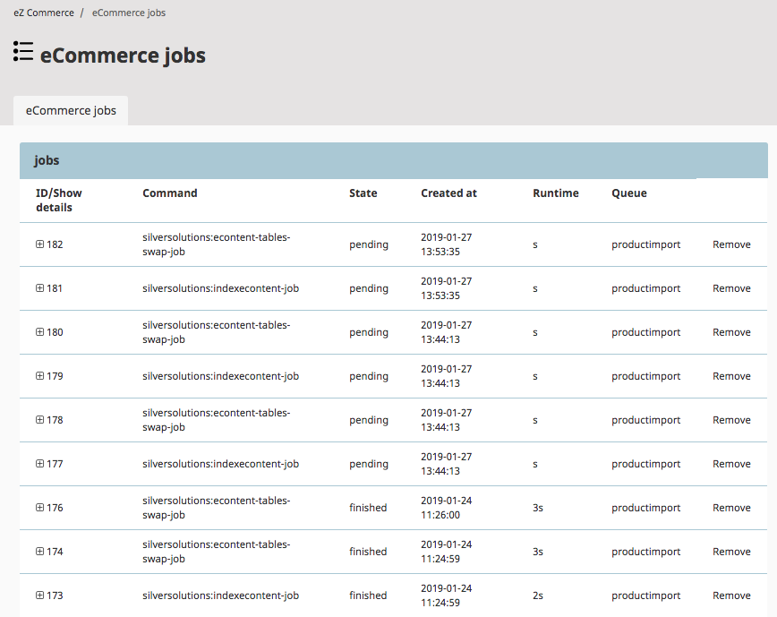

# Job system

The job system enables automating tasks implemented as a command.

It is based on the [JMSJobQueueBundle.](https://github.com/schmittjoh/JMSJobQueueBundle)

You can see an overview of the last jobs in the Back Office by clicking **Control Center** > **e-commerce jobs**.

Expand a running job to see more details of its state.
You can see the output of the command.

The list is automatically updated every 10 seconds.



You can [add your own jobs](#configure-jobs-for-the-backend) to the menu.
The user can then click **Start** and the job is executed. 


## Starting jobs

The job system requires executing the `jms-job-queue:run` command (see [Required crontab tasks](shop_configuration/required_crontab_tasks.md)).

``` bash
php bin/console jms-job-queue:run --env=prod
```

A job can be started using the Back Office (and a configuration of tasks offered) or using the PHP API.

See [bundle documentation](http://jmsyst.com/bundles/JMSJobQueueBundle) for more details about the PHP API.

## Configuring jobs for the Back Office

You can configure project-specific jobs which are displayed in the Back Office.

You can define the Symfony command (parameter `command`) and the parameters.

If your job requires additional tasks, you can add these tasks in the `depending_jobs` parameter.
These jobs are started after the main job has been executed successfully.

``` yaml
parameters:
    siso_control_center.default.add_jobs:
        import_solr:
            label: "Import from eZ"
            desc: "Starts import from a remote system"
            command: "silver:import"
            params:
                - tmp
            depending_jobs:
                index_solr:
                    label: "Index econtent tmp cores"
                    command: "silversolutions:indexecontent-job"
```

## Removing old jobs

To remove old jobs, run the following command:

``` bash
bin/console jms-job-queue:clean-up --env=prod --per-call=10 --max-retention="1 min"
```

## Removing the translation and navigation caches

The shop collects changes regarding translations (text modules) and navigation.
When there are changes (for example, performed in the back end), the cache is refreshed.   

``` 
# Checks for changes and refresh cache
*/5 * * * * cd '/var/www/my_project' && /usr/bin/php bin/console ibexa:commerce:refresh-cache --env=prod
```

## Sending lost orders to the ERP

Lost orders can be re-sent using a command-line tool. 
We recommend that you run this tool regularly, for example, every 5 minutes.

``` 
# resends lost orders every 5 minutes
*/5 * * * * cd '/var/www/my_project' && /usr/bin/php bin/console ibexa:commerce:process-lost-orders --env=prod
```

## Calculating statistical data for active sessions

The dashboard uses statistical data about sessions recorded in a database table.
The following command line refreshes the data every 5 minutes. 

!!! note

    This feature is available only if sessions are handled in the database.

``` 
*/5 * * * * cd /var/www/my_project &&  /usr/bin/php bin/console ibexa:commerce:sessions write_stat --env=prod
```
