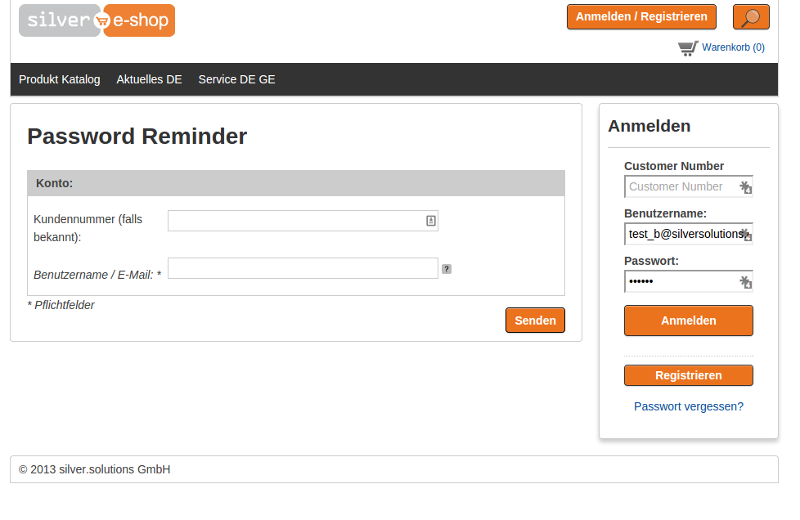
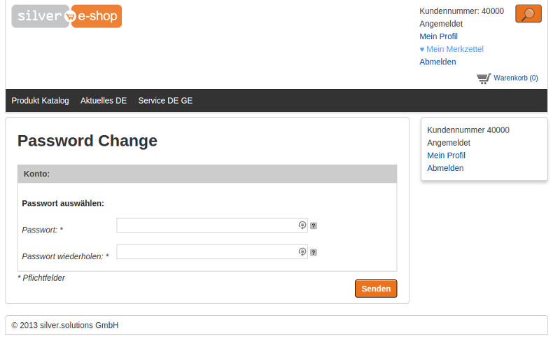

# Forgot / change password

## Forgot password

If the customer does not remember the old password and cannot log in to the shop,
they can use the forgot password page.



### Workflow

1. The customer must provide the login or email address that should receive the link for password resetting.  
Additionally, if the shop expects the customer number as login, the customer can specify the customer number. The shop then searches through the users inside the Customer Center.
2. If the user exists, they receive an email with a unique URL. It includes the correct token.
3. When the user clicks the URL, they are redirected to a page where they can reset the password.

!!! caution

    The user is able to change the password only if the token is provided and the user is anonymous (there is no logged-in session in the browser).

### Implementation

Route:

``` yaml
silversolutions_password_reminder:
    pattern:  /password/{formTypeResolver}
    defaults:
        _controller: SilversolutionsEshopBundle:Forms:forms
        breadcrumb_path: silversolutions_password_reminder
        breadcrumb_names: common.silver_forms.$formTypeResolver$
```

Configuration for password reminder (entity, service, template and data processors)

``` yaml
ses_forms.configs.reminder:
    modelClass: Silversolutions\Bundle\EshopBundle\Form\PasswordReminder
    typeService: silver_forms.password_reminder_type
    template: SilversolutionsEshopBundle:Forms:password_reminder.html.twig
    invalidMessage: error_message_password_reminder
    validMessage: success_message_password_reminder
    dataProcessors:
        - ses_forms.password_reminder_data_processor
        - siso_core.data_processor.send_password_reminder_email
```

#### Service

When building a form, the shop checks if logging in with a customer number is enabled.
If so, the `customerNumber` field is added.

``` php
if($enableCustomerNumber) {
    $builder
        ->add('customerNumber', 'text', array(
            'required' => false,
            'label' => $this->transService->translate('Customer number (if known)') . ': '
        ));
}
```

#### Data Processors

The `ses_forms.password_reminder_data_processor` data processor checks whether the data provided in the form is correct and if the user exists.

If the User exists, the `siso_core.data_processor.send_password_reminder_email` data processor sends an email with a link to change the password.
The link is valid for a time that you can specify in configuration:

``` 
siso_core.default.forget_password_token_valid: 1 hour
```

#### Use in templates

``` html+twig
<a href="{{ path('silversolutions_password_reminder', {'formTypeResolver': 'reminder'}) }}" class="link">{{ 'Forgot your password?'|st_translate }}</a>
```

The shop allows registrations of more than one account with the same email address.
This is useful when eZ Commerce runs a B2B and a B2C shop in one installation.

## Change password

If the customer is logged in but wants to change their password (for security reasons),
they can use the change password form located on the profile page.



#### Workflow

1. The shop checks whether the user is logged in and no token is provided. Otherwise they cannot access the change password page.
1. The user provides a new password and submits the form.
1. The form is validated and the password is updated for the customer.

#### Implementation

``` yaml
silversolutions_password_change:
    pattern:  /change_password/{token}
    defaults:
        _controller: SilversolutionsEshopBundle:CustomerProfileData:changePassword
        token: null
```

Configuration for password change (entity, service, template):

``` yaml
ses_forms.configs.password_change:
    modelClass: Silversolutions\Bundle\EshopBundle\Form\PasswordChange
    typeService: silver_forms.password_change_type
    template: SilversolutionsEshopBundle:Forms:password_change.html.twig
    invalidMessage: error_message_password_change
    validMessage: success_message_password_change
```

#### Action

`CustomerProfileDataController::changePasswordAction()` tries to get the correct user:

``` php
if(!isset($token)) {
    if(!$eZHelperService->isEzUserLoggedIn()) {
        $params = array(
            'errorMsg' => $this->getTrans()->translate(self::ERROR_ACCESS_DENIED)
        );
    } else {
        $user = $eZHelperService->getCurrentUser();
    }
}
```

Then the form data is submitted and the result is displayed.

#### Use in templates

``` html+twig
<a href="{{ path('silversolutions_password_change') }}" class="button float_left">{{ 'Change password'|st_translate() }}</a>         
```
