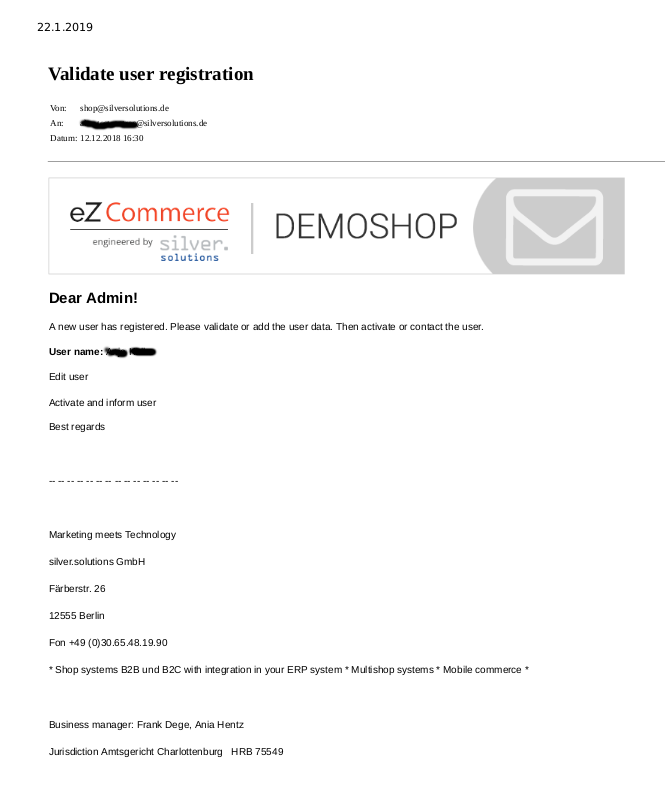
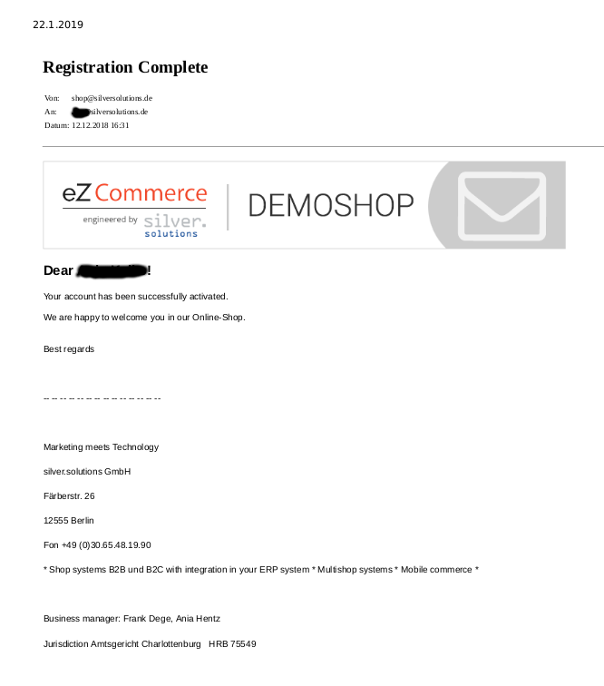

# Login and registration configuration

When the `enable_customer_number_login` parameter is enabled, the shop can log in users with the customer number:

``` yaml
siso_core.default.enable_customer_number_login: true
```

You can specify the default Location ID for users per SiteAccess:

``` yaml
siso_core.default.user_group_location: 106
siso_core.default.user_group_location.business: 106
siso_core.default.user_group_location.private: 106
siso_core.default.user_group_location.editor: 14
```

`redirect_homepage` configures the default list of URLs from which the user is redirected after login.

``` yaml
siso_core.default.redirect_homepage:
    - /login
    - /register
    - /registration
    - /password
    - /token
    - /change_password
```

## Private customer registration

### Activation link recipient

You can decide that emails with the activation link are sent to a different email address rather than the customer.

The email message will contain this additional information:

- name of the user
- link to the user in the Back Office

``` yaml
siso_core.default.user_activation_receiver: <email>
```

To use this feature, you must also configure `related_admin_site_access` correctly:

``` yaml
siso_core.default.related_admin_site_access: 'admin'
```

It is needed to build the link to the Back Office.

You have to adapt the success message of the private registration. The default one uses a text module with the identifier `success_register_private`.



## Account activation email

When the `info_email_after_user_activation` parameter is set to true,
the customer receives an email when the account is enabled using the activation link.

``` yaml
siso_core.default.info_email_after_user_activation: false
```


