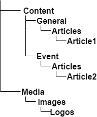
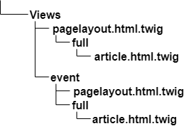

# Multisite

## Introduction

You can serve multiple different sites using one [[= product_name =]] instance and database.

Each site will have its own content root, at a lower level than the default one (Location ID 2).
You can use one global back office for all sites, or a separate back office for each site.

This feature is a reimplementation of the [PathPrefix](http://doc.ez.no/eZ-Publish/Technical-manual/4.x/Reference/Configuration-files/site.ini/SiteAccessSettings/PathPrefix) that existed in eZ Publish Legacy.

## Configuring multisite

Multisite is configured in `ezplatform.yaml`, either at [SiteAccess](siteaccess.md) or SiteAccess group level:

``` yaml
ezplatform:
    system:
        site_group:
            content:
                tree_root:
                    # Root locationId. Default is top locationId
                    location_id: 123
                    # All URL aliases starting with those prefixes will be considered
                    # being outside of the subtree starting at root_location.
                    # Default value is an empty array.
                    # Prefixes are not case sensitive.
                    excluded_uri_prefixes: [ /media, /images ]
```

### Configuration parameters

The two configuration parameters, `location_id` and `excluded_uri_prefixes` are taken into account in several places,
for example in URL alias lookups for incoming web requests, and [URL alias path generation in Twig templates](templates.md#adding-links).
In addition you need to consider them when generating site paths in your layout, or other places rendering site/tree structure.

#### `location_id`

`content.tree_root.location_id` sets the Location ID of the content root of your site
and nothing above this level will be accessible by default.
This parameter can be filtered using the `excluded_uri_prefixes` parameter.

#### `excluded_uri_prefixes`

`content.tree_root.excluded_uri_prefixes` defines which URIs ignore the root limit set using `location_id`.
Add as many Location pathStrings as you like.
In the example above, the Media and Images folders will be accessible using their own URI even though they are not below `content.tree_root.location_id`.

!!! note

    Leading slashes (`/`) are automatically trimmed internally, so they can be ignored.

## Configuration example

To see how multisite can be used, let's look at an example of two sites using the same [[= product_name =]] instance: a general company site and a site for a specific event.
Separate SiteAccesses are set up for the two sites:

``` yaml
ezplatform:
    siteaccess:
        list: [site, event]
        groups:
            site_group: [site, event]
        default_siteaccess: site
        match:
            URIElement: 1
```

This is your content structure:



You can now set the root level for `event` to only access the "Event" Location and its sub-items:

``` yaml
ezplatform:
    system:
        event:
            content:
                tree_root:
                    # LocationId of "Event"
                    location_id: 57
```

Thanks to this config, you can access `<your site>/event/Articles/Article2`, but not `<your site>/General/Articles/Article1`.

In the next step, you need to reuse some content between sites, for example "Logos" from "Media".
You can allow the event site to access them, even though they are in a different part of the tree, via `excluded_uri_prefixes`:

``` yaml
        event:
            content:
                tree_root:
                    location_id: 57
                    excluded_uri_prefixes: [ /media/images/logos ]
```

At this point, using the `event` SiteAccess, you gain access to `<your site>/event/Media/Images/Logos`,
despite the fact that it is not a sub-item of the "Event" Location.

### Setting the Index Page

The Index Page is the page shown when the root index `/` is accessed.
You can configure the Index Page separately for each SiteAccess. Place the parameter `index_page` in your `ezplatform.yaml` file, under the correct SiteAccess:

``` yaml
ezplatform:
    system:
        event:
            # The page to show when accessing IndexPage (/)
            index_page: /EventFrontPage
```

If not specified, the `index_page` is the configured content root.

## Multisite with multiple Repositories

Multisite can be configured to use one or multiple Repositories.
With multiple Repositories, each site can have a separate Repository.
To configure multisite with multiple Repositories, [configure the repositories](config_repository.md) and perform [multi-Repository setup](persistence_cache.md#multi-repository-setup).

### Limitations when using with multisite URI matching with multi-Repository setup

!!! caution

    Only one Repository (database) can be used per domain.
    This does not prohibit using [different Repositories](persistence_cache.md#multi-repository-setup) on different subdomains.
    However, when using URI matching for multisite setup, all SiteAccesses sharing domain also need to share Repository.
    For example:

    - `ibexa.co` domain can use `ibexa_repo`
    - `doc.ibexa.co` domain can use `doc_repo`

    But the following configuration would be invalid:

    - `ibexa.co` domain can use `ibexa_repo`
    - `ibexa.co/doc` **cannot** use `doc_repo`, as it is under the same domain.

    Invalid configuration will cause problems for different parts of the system,
    for example back-end UI, REST interface and other non-SiteAccess-aware Symfony routes
    such as `/_fos_user_context_hash` used by [HTTP cache](http_cache.md).

## Different designs for multiple sites

[[= product_name =]] does not apply a [Legacy template fallback](https://doc.ez.no/display/EZP/Legacy+template+fallback) like eZ Publish did.
You can, however, have different designs in your multisite installation if you organize the view configuration with the use of SiteAccesses.

Looking back at the [previous example](#configuration-example), you can apply different designs to the two sites, but use some common templates.
To do this, organize your templates in the following folder structure:



Now you can use this view configuration (stored e.g. in a `views.yaml` file):

``` yaml
ezplatform:
    system:
        default:
            pagelayout: pagelayout.html.twig
            content_view:
                full:
                    article:
                        template: full/article.html.twig
                        match:
                            Identifier\ContentType: [article]
                    news:
                        template: full/news.html.twig
                        match:
                            Identifier\ContentType: [news]
        event:
            pagelayout: event/pagelayout.html.twig
            content_view:
                full:
                    article:
                        template: event/full/article.html.twig
                        match:
                            Identifier\ContentType: [article]
```

This config defines views that will be used for the `event` SiteAccess:
a separate `event/pagelayout.html.twig` and a template to be used for articles.
When no view is defined under `event`, such as in the case of the `news` Content Type,
the template defined under `default` will apply. `default` will also be used for all SiteAccesses other than `event`.

To load the base (default) layout in templates you now need to use ``.
(See [Template inheritance and sub-requests](content_rendering.md#template-inheritance-and-sub-requests) for more information).
