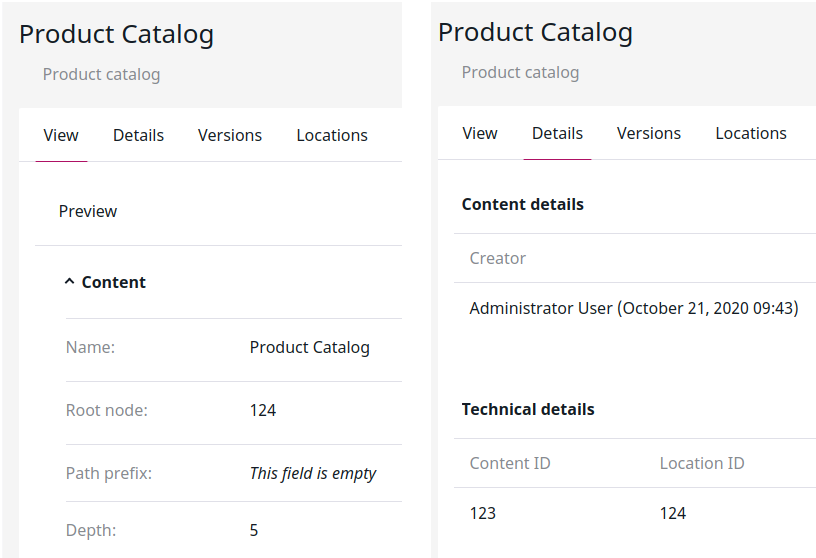

# Navigation [[% include 'snippets/commerce_badge.md' %]]

Navigation is generated automatically and can include one or more product catalogs and other Content items
in the root Location defined in [the configuration](navigation_configuration.md).

You can control which items are included in the navigation by setting the displayed Content Types,
Sections, and by modifying element priority.

The navigation is built using `EshopBundle/Service/NavigationHelper`.

### Using a product catalog

A product catalog has to be set up in the Back Office using a Product Catalog Content item
which adds products to the shop.

The navigation can also store additional data in the navigation node.

You can set up a different Location depth for content from the content model and from catalog.

!!! caution "Catalogs with multiple Locations"

    The navigation does not support product catalogs and categories with multiple Locations.
    If you want to have the same categories in several places, you need to copy the content.
    Products can be assigned to one or more categories.

## Fetching the data

Navigation uses the built-in search to fetch the content, and a custom search service to fetch catalog data directly from Solr.

### Modifying the search query

You can extend the search query before navigation data is fetched.
You do this by using two events that are thrown before the search query is submitted:

- `PostBuildEzContentQueryEven` -  thrown just before content model for the navigation is fetched.
- `PostBuildSolrQueryEvent` - thrown just before catalog content for the navigation is fetched.

### Injecting catalog data

The product catalog is injected into the prepared navigation. 
You can have multiple product catalogs on any level. 

If you are using the content model data provider, place categories and products directly under the product catalog
and then, in the catalog's Root node Field, point to the catalog's Location ID.

If you are using the eContent data provider, in the catalog's Root node Field, point to the installation's root element.
