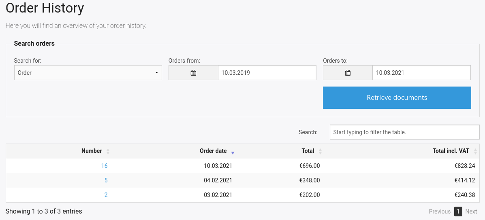
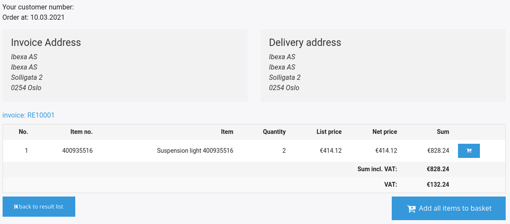

# Order history

The **Order History** screen enables you to see an overview and details of your orders or other documents.
You can see documents related to online purchases as well as orders placed, for example, by phone.

Order history supports different document types:

- order
- invoice
- delivery note
- credit memo

Order history is available in the user menu under **Your documents**,
and through the `/orderhistory` route.

To access order history, the User must have the `siso_policy/orderhistory_view` Policy.

Depending on whether your system is connected to ERP, order history displays documents from ERP,
or [local documents](order_history_local_orders.md).

Each document has a detail page, where you can see the detailed information, such as the buyer, delivery address, ordered items, status, delivery and payment information:

If a product is still available in the shop, you can add it to the basket again. 
