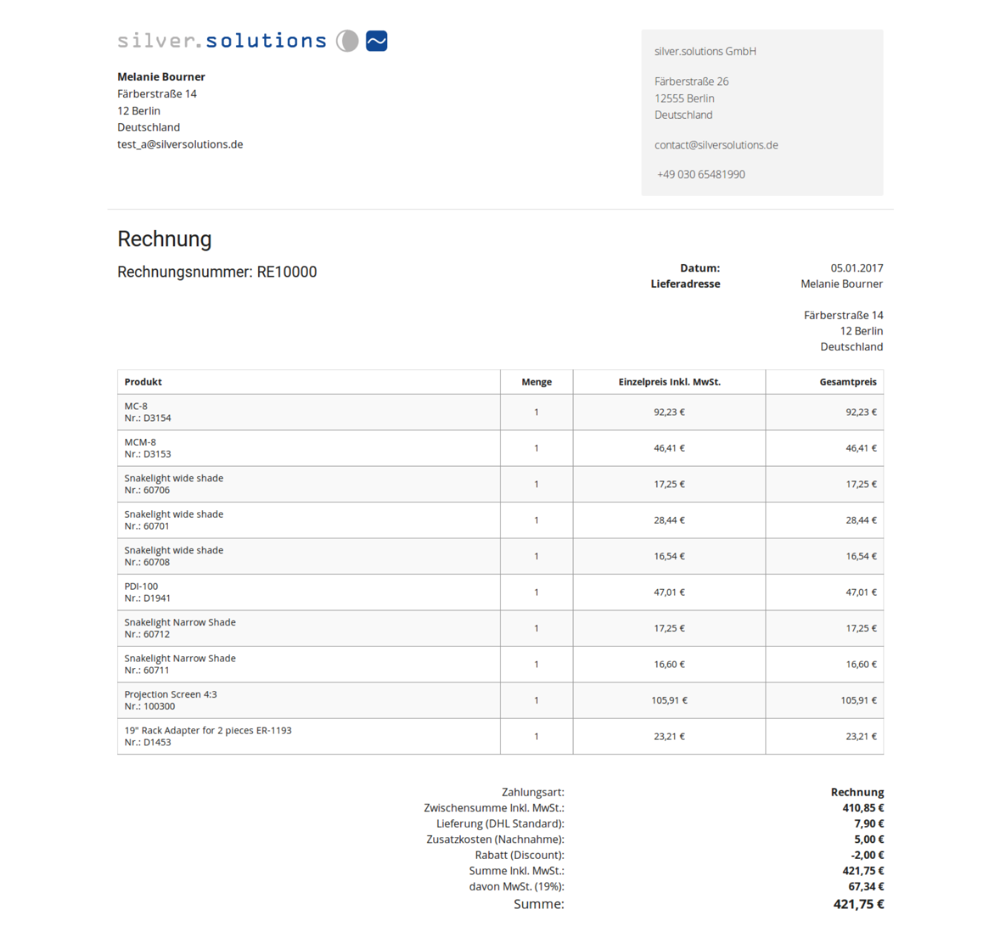

# Local orders [[% include 'snippets/commerce_badge.md' %]]

You can display user orders even if the shop is not connected to an ERP system.

The user sees the orders stored locally in the shop. Order history shows only documents of type `orders`.

Because the shop only has local data for orders, the available document types are different.

The use of the local documents is enabled with the `use_local_documents` configuration parameter:

``` yaml
siso_order_history.default.use_local_documents: false
```

The feature uses event listeners, so the standard logic does not change if this value is set to false.

[[= product_name_com =]] offers an event listener which uses the `ConfigurationEvents::READ_CONFIGURATION` event.
This listener is disabled by default, so you need to activate it in your project:

``` yaml
siso_order_history.default.read_configuration_listener_active: true
```

If local documents are used (parameter `use_local_documents == true`), the logic checks if the requested message is `OrderListMessage` or `OrderListMessage`.
If so, it throws an exception `UseLocalDocumentsException` that is caught by the exception event.
The system then creates the same response as is sent by ERP (the response contains the same information as if it were using ERP.)

## UseLocalDocumentsListener

### Listener `onRequestEvent`

If there is no connection with ERP and local documents are used,
the listener throws an exception that stops sending the message to ERP.
When the exception is caught, another event (`MessageExceptionEvent`) is dispatched and the `onExceptionMessage` listener is executed.

``` xml
<service id="siso_order_history.use_local_documents_listener" class="%siso_order_history.use_local_documents_listener.class%">
   ...
    <tag name="kernel.event_listener"  event="silver_eshop.request_message" method="onRequestEvent" />
   ...
</service>
```

### Listener `onExceptionMessage`

Checks the exception that is thrown by the previous listener and creates a [`ResponseDocument`](../../erp_integration/erp_communication/erp_components/erp_component_messages/erp_component_messages.md) filled with local data (orders).
The response has the same structure as if it was returned from ERP, so no additional changes in the template are required.

``` xml
<service id="siso_order_history.use_local_documents_listener" class="%siso_order_history.use_local_documents_listener.class%">
   ...
    <tag name="kernel.event_listener"  event="silver_eshop.exception_message" method="onExceptionMessage" />
   ...
</service>
```

`silver.orderhistory/src/Siso/Bundle/OrderHistoryBundle/EventListener/UseLocalDocumentsListener.php`

``` php
protected function createOrderListResponseDocument(OrderListRequest $requestDocument)
{
    .... 
    /** @var OrderListResponse $orderListResponse */
    $orderListResponse = new OrderListResponse();
    //These values are same as in the ERP order
    $orderListResponse->OrderTypeCode->value = 'SalesOrderList';
    $orderListResponse->SesExtension->Status->value = 0;
    .....
}
protected function createOrderDetailResponseDocument(OrderDetailRequest $requestDocument)
{
    ....
    $responseDocument = new OrderDetailResponse();
    $responseDocument->ID->value = $basket->getBasketId();
    $issueDate = $this->dateTimeService->defaultToErpDate(
        $basket->getDateLastModified()->format(\DateTime::ISO8601),
        \DateTime::ISO8601
    );
    ...
}
```

## Generating an invoice

For information about generating a PDF invoice from a local order, see [Local order process](../../../guide/checkout/local_orders.md).

`SisoLocalOrderManagementBundle` handles orders without an ERP connection.

The bundle generates:

- local orders with an invoice
- invoice entity (special implementation to generate the invoice number)
- invoice view
- invoice PDF and attaches it to an email

### Show invoice in order history

Once the local order with the invoice is generated you can show it in order history:


Local invoices are available only for the current user (nobody else has access to the invoice page).

Order history details contain a link in the header to the invoice page:


#### Order history list

To show the invoice link in a new column of the table, override the configuration.

``` yaml
siso_order_history.default.default_list_fields:
    order:  
        # ...
        - SesExtension_Invoice  
```

A new Twig block shows the new link to the invoice if the invoice number is set.

``` html+twig
{# Order history list #}

    
        
            <a target="_blank" href="{{ path( 'siso_local_order_management_show_invoice', { 'invoiceNumber': obj.SesExtension.value.InvoiceNumber }, false) }}">{{ obj.SesExtension.value.InvoicePrefix }}{{ obj.SesExtension.value.InvoiceNumber }}</a>
        
    

```

#### Order history detail

To show the link to the invoice in the detail page modify the Twig template.

#### Order history page

Only the owner of the basket can access the `InvoiceController` controller that displays the invoice. 

``` php
if ($basket instanceof Basket) {
    $userId = $basket->getUserId();
    $customerProfileData = $this->getCustomerProfileDataService()->getCustomerProfileData();
    //only display invoice if the invoice belongs to user
    if ($userId == $customerProfileData->sesUser->sesUserObjectId) {
        $parameters['basket'] = $basket;

        $userInvoiceNumber = $invoiceService->getUserInvoiceNumber($invoice);
        $parameters['user_invoice_number'] = $userInvoiceNumber;

        return $this->render('SilversolutionsEshopBundle:Invoice:show.html.twig', $parameters);
    } else {
        throw new AccessDeniedException();
    }
}
```

### Templates

`EshopBundle/Resources/views/Invoice/show.html.twig` template is used to generated the invoice view and the invoice PDF.

This template does not extend any other template, so it also generates the `<html>` and `<head>` tags.

``` html+twig
<!doctype html>
<html>
<head>
    <meta charset="utf-8">
    
        
            <link rel="stylesheet" href="{{ asset_url }}"/>
        
    
</head>

<body>
    ....
</body>
</html>
```


