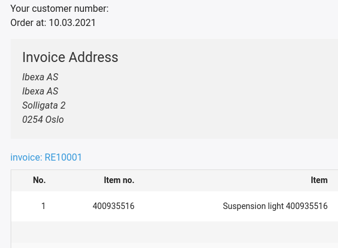

# Local orders

You can display user documents even if the shop is not connected to an ERP system.
In this case, the user sees the documents [stored locally in the shop](../../guide/checkout/local_orders.md).

The shop only stores local data for orders, so only the `order` document type is displayed.

You can enable the use of local documents with the `use_local_documents` configuration parameter:

``` yaml
siso_order_history.default.use_local_documents: false
```

## Invoices for local orders

Invoices for local orders are available only for the current user.

In the header of the order history details page, there is a link to the invoice page:



### Order history list

To show the invoice link in a new column of the table, use the following configuration:

``` yaml
siso_order_history.default.default_list_fields:
    order:  
        # ...
        - SesExtension_Invoice
```

The `EshopBundle/Resources/views/Invoice/show.html.twig` template renders the invoice view and the invoice PDF.
