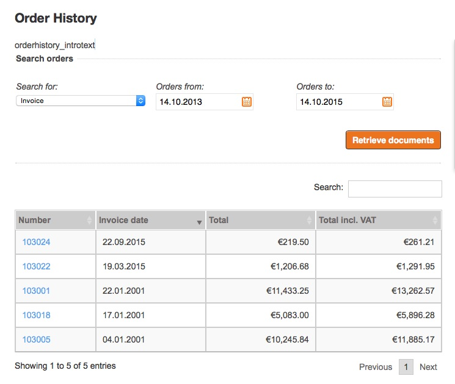
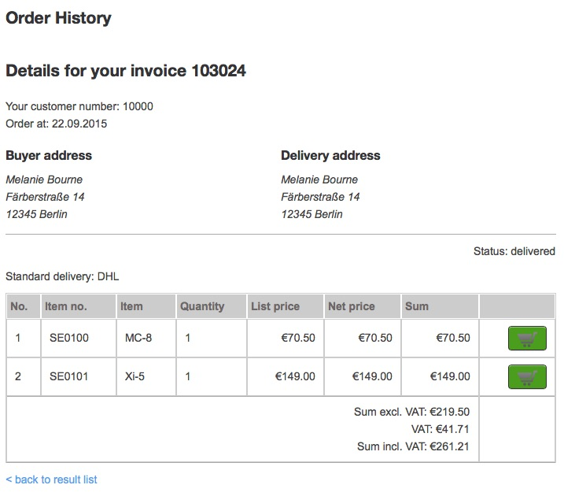

# Order history [[% include 'snippets/commerce_badge.md' %]]

Order history enables you to see an overview and details of your orders or other documents from the ERP system.
You can see documents based on online purchases as well as orders placed e.g. by a telephone call.

On the detail page you can see the buyer, delivery address, ordered items and other details about the order,
such as status, delivery and payment selection.

You can also use the `addToBasket` functionality and speed up the order process, for example if you often order the same items.

Order history is available for customers who have a login and a customer number.
Usually a user gets a customer number right after placing the first order.

The module offers a search functionality which enables searching for invoices, delivery notes, orders or credit memos.
You can configure which documents are shown first. 

The user can search inside the list or sort the list by all columns by clicking the arrow in the table header.

For each document a detail page is offered as well:

If a product is still available in the shop, a basket button is provided. 

Order history supports different document types:

- order
- invoice
- delivery note
- credit memo

## Permissions

To access order history, the user must have the `siso_policy/orderhistory_view` Policy.
