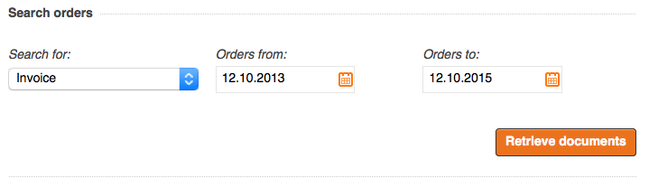

# Order history API [[% include 'snippets/commerce_badge.md' %]]

## Order search form

The order search form uses the `DatePicker` plugin for better user experience.  
If you need to pass additional parameters to this plugin or adapt the form attributes,
override the form type and form validation service.



### Form type

Form type is located in `OrderHistoryBundle/Form/Type/OrderType.php`.

Service definition:

``` xml
<parameter key="siso_order_history.order_type.class">Siso\Bundle\OrderHistoryBundle\Form\Type\OrderType</parameter>

<service id="siso_order_history.order_type" class="%siso_order_history.order_type.class%" scope="prototype">
    <argument type="service" id="ezpublish.config.resolver" />
    <argument>%siso_order_history.date%</argument>
</service> 
```

``` php
//Example: pass some data-attributes for the datepicker plugin

$builder->add('orders_from', 'text', array(
        'label' => 'Orders from:',
        'required' => true,
        'data' => $options['data']['from_date'],
        'attr' => array(
            'class' => 'datepicker',
            'data-date-direction-start' => $maxDirectionStart,
            'data-date-direction-end' => $maxDirectionEnd,
            'data-date-caption-days' => 'F Y',
            'data-date-format' => $dateFormat
        )
    )
);
```

### Form validation

Form validation is located in `OrderHistoryBundle/Services/FormValidationService.php`.

Service definition:

``` xml
<parameter key="siso_order_history.form_validation.class">Siso\Bundle\OrderHistoryBundle\Services\FormValidationService</parameter>

<service id="siso_order_history.form_validation" class="%siso_order_history.form_validation.class%">
    <argument type="service" id="siso_order_history.date_time"/>
    <argument type="service" id="ezpublish.config.resolver"/>
</service>
```

``` php
// adjust validation
public function isValid($params) { }
```
