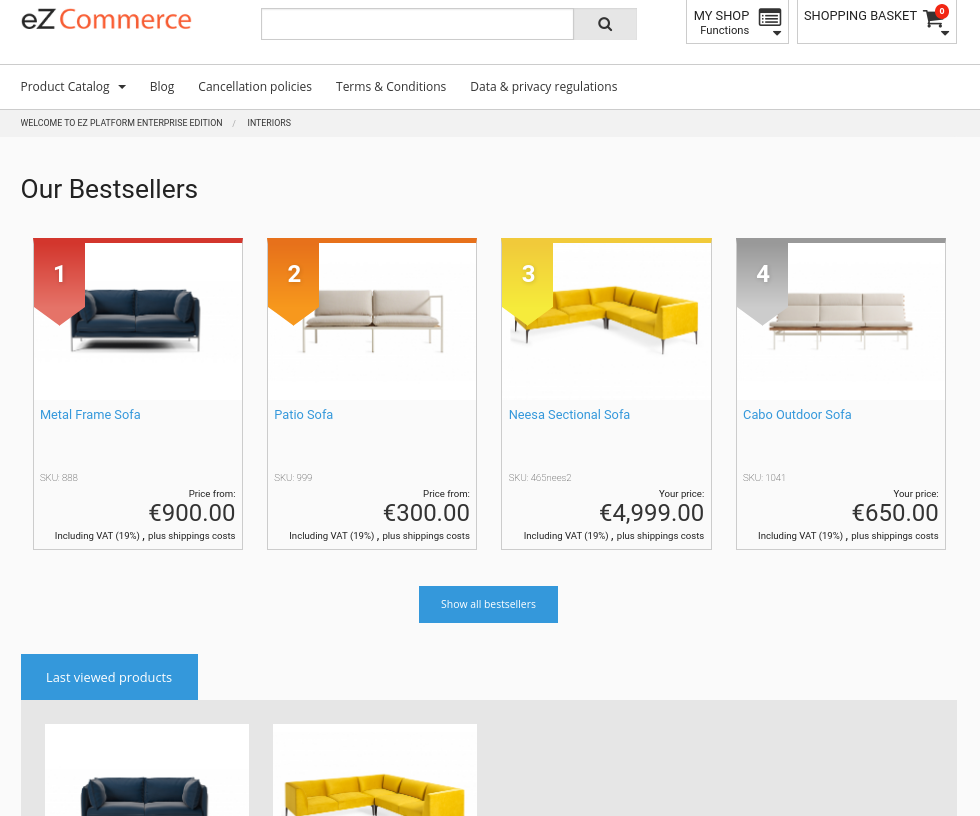

# Pages in the shop [[% include 'snippets/commerce_badge.md' %]]

[[= product_name_com =]] adds the following blocks to the Page Builder:

- Last viewed items - list of products recently viewed by the current user
- Bestsellers - list of bestsellers for a given product category
- Product slider - slider for products grouped with tabs

  

## Template list

|Block|Template|Subtemplates|
|--- |--- |--- |
|Last viewed items|`IbexaPlatformCommercePageBuilderBundle:blocks:product_last_viewed_slider.html.twig`|Uses the `SilversolutionsEshopBundle:EzFlow:showLastViewedProducts` subcontroller and `SilversolutionsEshopBundle:Catalog:last_viewed_slider.html.twig` template|
|Bestsellers|`IbexaPlatformCommercePageBuilderBundle:blocks:bestseller.html.twig`|Uses the `SilversolutionsEshopBundle:Bestsellers:getBestsellers` subcontroller and the `SilversolutionsEshopBundle:Bestsellers:bestsellers_box.html.twig` template|
|Product slider|`IbexaPlatformCommercePageBuilderBundle:blocks:product_slider.html.twig`|Uses the `SilversolutionsEshopBundle:EzFlow:getSkuListByString` subcontroller and the `SisoEzStudioBundle:blocks:product_slider_tabs.html.twig` template|

## Page API

### Last viewed products

The products are recorded by means of a JavaScript call. To use it on other pages as well, place the following code in a template:

``` html+twig
{{ render_esi(
    controller(
        'silver_eshop.catalog_controller:storeProductAsLastViewedAction',
        {"sku": catalogElement.sku}
    )) }}
```

After each call, the cache for the last viewed product slider is purged.
By default, the view is rendered by an ESI block and cached per user.
When the customer visits a new product, the list is purged and regenerated the next time it is displayed. 

Products are stored in the session.

#### Displaying products

To display a list of recently viewed products, place the following code in a template:

``` html+twig
{{ render_esi(
    controller(
        'Silversolutions\\Bundle\\EshopBundle\\Controller\\EzFlowController::showLastViewedProductsAction',
        { }
    )) }}
```

The controller is able to render a different template if required (a parameter template).
`SilversolutionsEshopBundle:Catalog:slider.html.twig` is used by default. 

The caching strategy can be defined in the config file. The strategy is dynamic, so use `vary: cookie`.

``` yaml
silver_eshop.default.http_cache:
    last_viewed_products:
        max_age: 36000
        vary: cookie
```

You can configure the maximum number of last viewed products by selecting
**eCommerce** -> **Configuration Settings** -> **Catalog** -> **Last viewed product limit**.

The default value is set in:

``` yaml
silver_eshop.default.last_viewed_products_in_session_limit: 10
```
