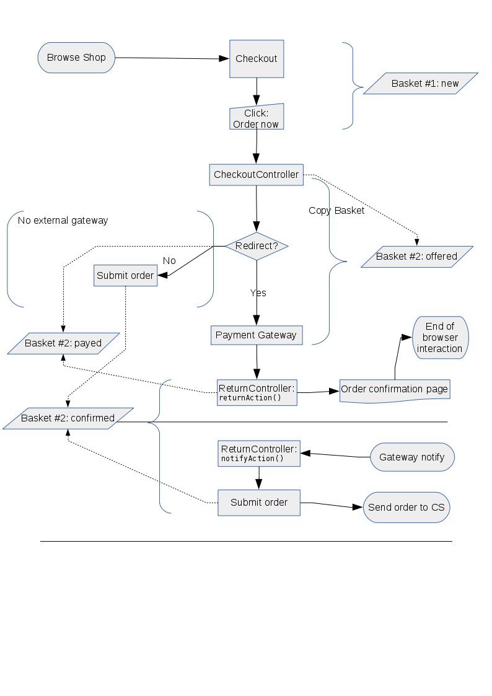

# Payment

Payments in eZ Commerce depends on the [JMSPaymentCoreBundle.](http://jmsyst.com/bundles/JMSPaymentCoreBundle)

!!! note

    If `JMSPaymentCoreBundle` is not installed due to composer dependencies,
    [installed it manually.](http://jmsyst.com/bundles/JMSPaymentCoreBundle/master/installation)
    
The eZ Commerce supports the following payment providers out of the box:

|Payment provider|Code used in Basket|
|--- |--- |
|[PayPal Express](payment_configuration/paypal.md)|`paypal_express_checkout`|
|[TeleCash](payment_configuration/telecash.md)|`telecash_connect`|
|[Ogone](payment_configuration/ogone.md)|`ogone_gateway`|
|[Invoice](payment_configuration/invoice.md), used for non-electronic payments|`invoice`|

## Payment secret

``` yaml
jms_payment_core:
    encryption:
        provider: defuse_php_encryption
        secret: 'def0000033444be8556a1bd7e347a240d19d34a078112f3f18bbb74cb4caeff9f9df7e2f1c86f32826b6b262360791264a0aeb851bdb999f2b882038448966b3b1d40a79'
        enabled: true
```

The secret has to be created by the `generate-defuse-key` command:

`php vendor/defuse/php-encryption/bin/generate-defuse-key`

## Common payment workflow

The following diagram shows the processes involved in a payment process:



When a user accepts the payment and the payment provider acknowledges the data,
the user is redirected to the shop.
The payment provider informs the shop by calling a notify URL of the shop ("Notify Shop").
