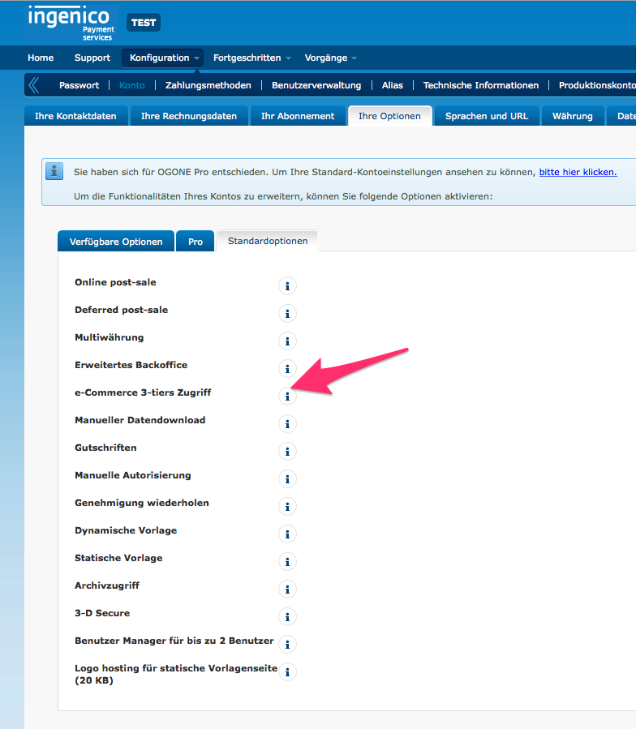
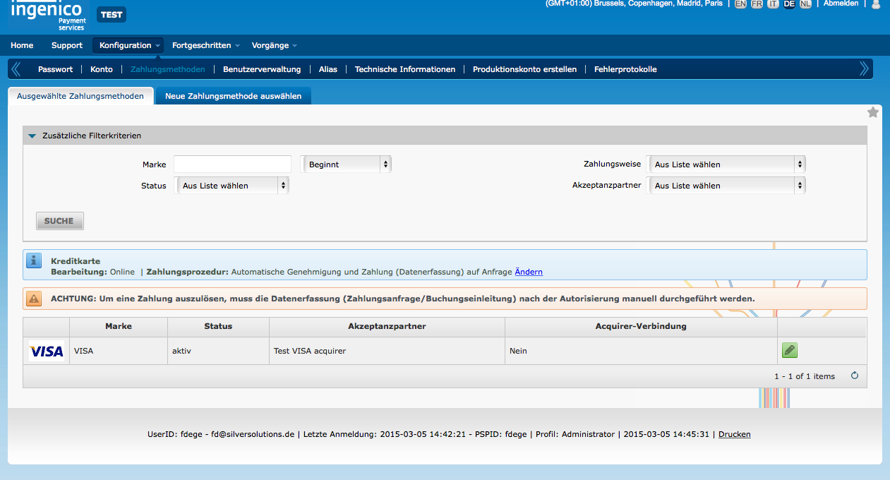
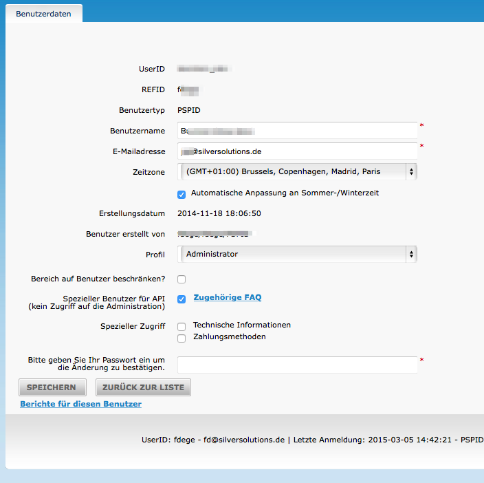
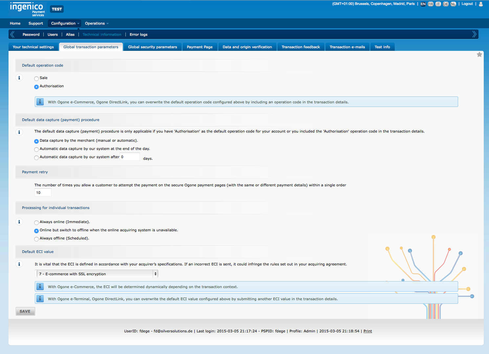
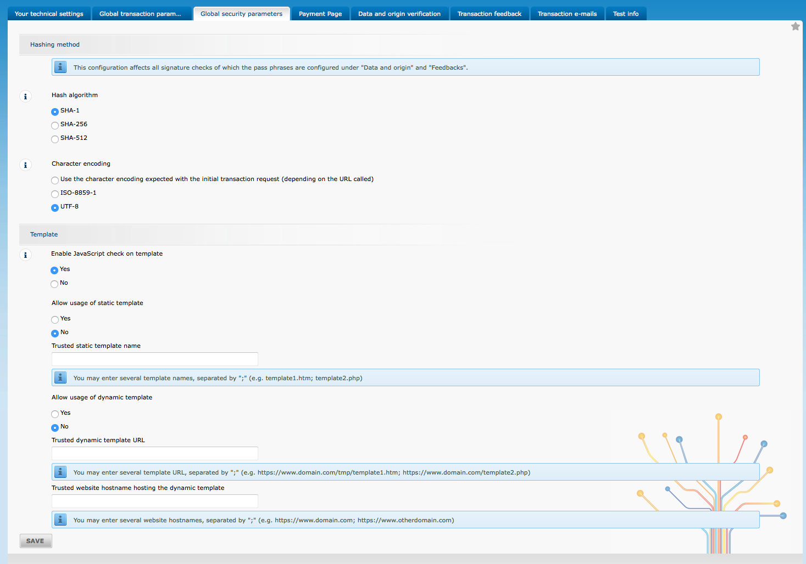
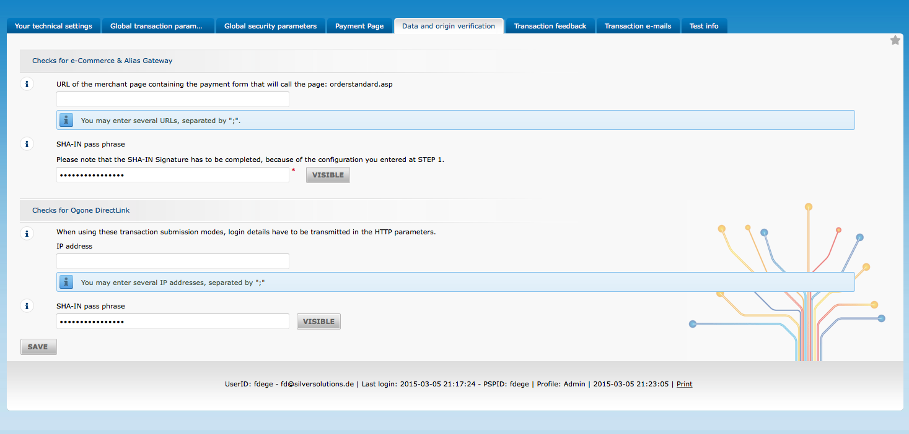
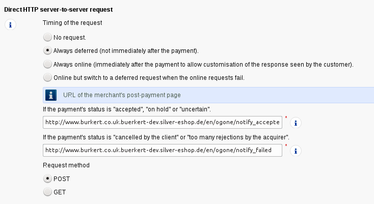
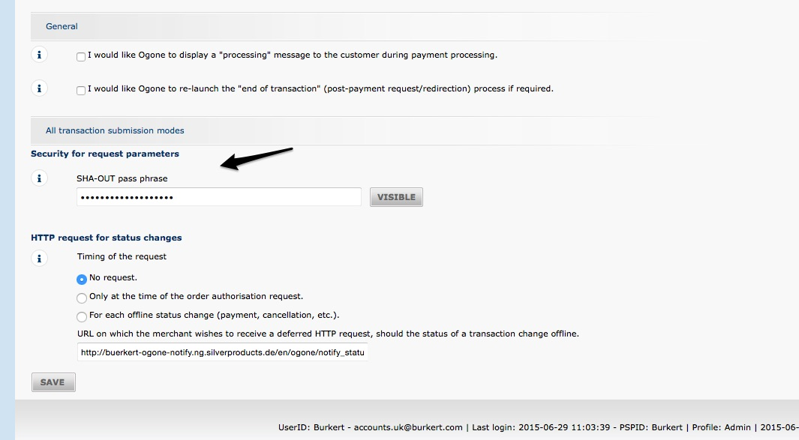

# Ogone

[Ogone](https://www.ingenico.com/login/ogone) is a payment system offered by Ingenico Group.

## Configuration

``` yaml
ets_payment_ogone:
    pspid: my psid
    shain: "<shain defined in ogone backend>"
    shaout: "<shaout defined in ogone backend>"
    debug: true
    utf8: true
    api:
        user: shop_user_id
        password: "<password defined for user in ogone backend>"
```

|Parameter|Details|
|--- |--- |
|`pspid`|The `pspid` used for login in the Ogone backend.|
|`shain`|Has to be defined in the Ogone backend/administration.|
|`shaout`|Has to be defined in the Ogone backend/administration.|
|`api.user`|The user.|
|`api.password`|The password set for this user.|

!!! note

    This configuration is not SiteAccess aware. If you need to configure multiple Ogone accounts, depending on the SiteAccess, you must redefine the token service to get SiteAccess-aware parameters injected, for example:

    ``` xml
    <!-- Overridden token service for Ogone -->
    <service id="payment.ogone.client.token" class="%payment.ogone.client.token.class%">
        <argument>$payment_ogone_pspid;project_domain$</argument>
        <argument>$payment_ogone_api_username;project_domain$</argument>
        <argument>$payment_ogone_api_password;project_domain$</argument>
        <argument>$payment_ogone_shain;project_domain$</argument>
        <argument>$payment_ogone_shaout;project_domain$</argument>
    </service>
    ```

    Only this service relies on the account parameters. In order to configure the values effectively, the `ets_payment_ogone` configuration can't be used any longer.
    The configuration above should look like this:

    ``` 
    project_domain.site_access_name.payment_ogone_pspid: my psid
    project_domain.site_access_name.payment_ogone_shain: "<shain defined in ogone backend>"
    project_domain.site_access_name.payment_ogone_shaout: "<shaout defined in ogone backend>"
    project_domain.site_access_name.payment_ogone_api_username: shop_user_id
    project_domain.site_access_name.payment_ogone_api_password: "<password defined for user in ogone backend>"
    ```

    Debug and utf8 must still be configured for the config namespace `ets_payment_ogone` and are not SiteAccess aware.

## Setting up an Ogone account

### 1. Activate necessary 3-tiers option

In **Configuration**->**Account**->**Your Options** activate the option **e-Commerce 3-tiers access**.



### 2. Activate payment such as VISA

Click **Configuration**->**Payment methods**:



### 3. Create a user for the shop

Click **Configuration**->**Users** and activate the option **API user**.



### 4. Configure Global transaction parameters

If the shop authorizes the transaction and the ERP finalizes it, the option **Authorization** has to be set. 



### 5. Global security parameters

Choose SHA-1 as the hash algorithm and UTF-8 as encoding standard. 



### 6. Data and origin verification

Type in a secure SHA-in pass phrase and add the SHA-in pass phrase in the settings of the shop. 



### 7. Set ShaOut Password and notification URLs

Go to link **Configuration**->**Technical information**->**Transaction Feedback**





