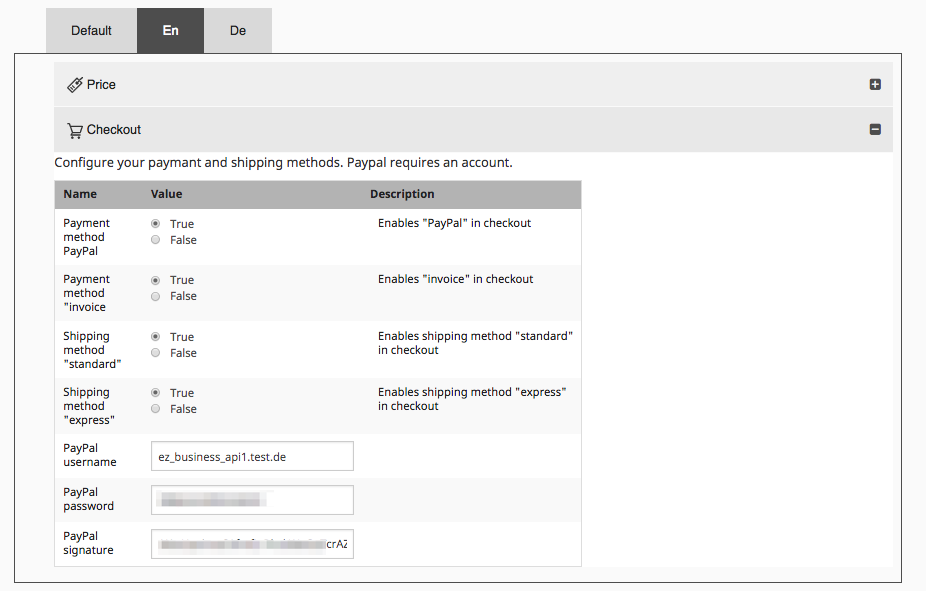
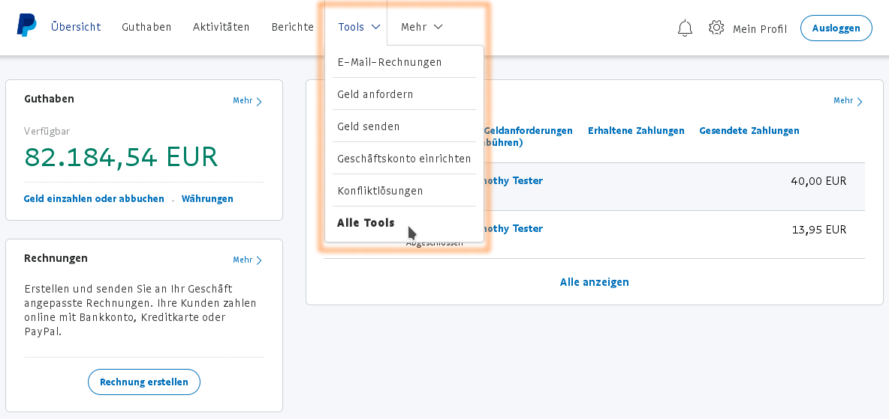
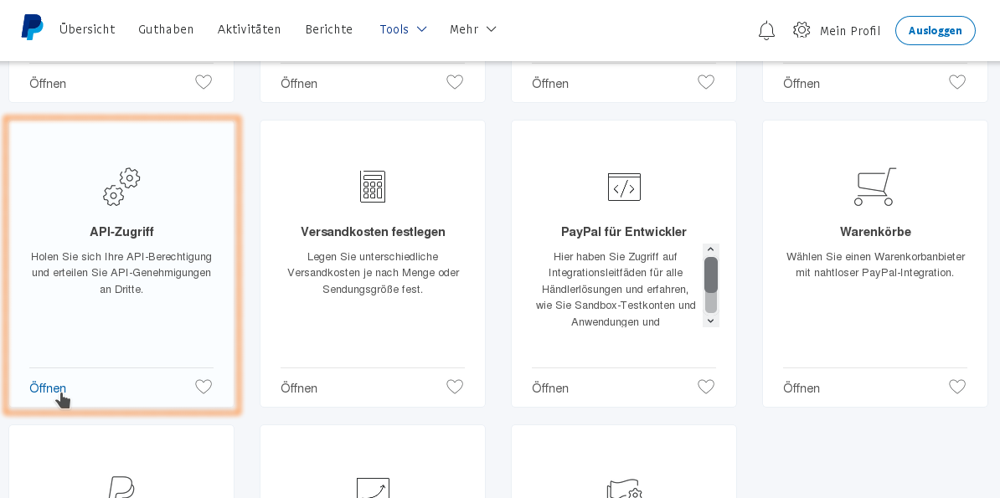
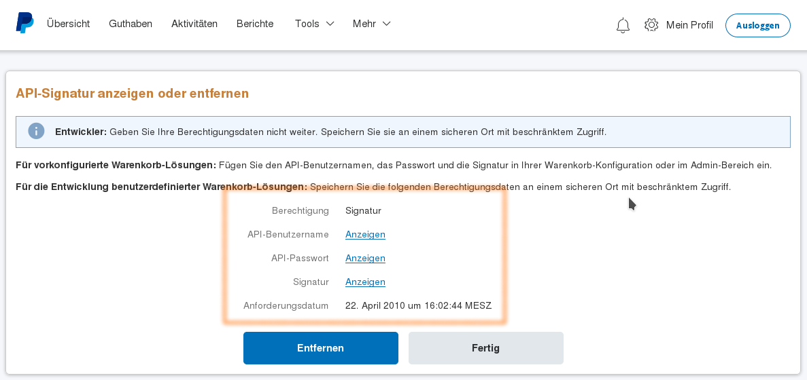

# PayPal Express Checkout

## Installation and configuration

PayPal Express Checkout payments require the third-party library [`JMSPaymentPaypalBundle`.](http://jmspaymentpaypalbundle.readthedocs.io/en/stable/setup.html)

``` bash
php composer.phar require jms/payment-paypal-bundle
php composer.phar update -- jms/payment-paypal-bundle
```

See [How to get the API credentials](#how-to-get-the-api-credentials) to learn where you can find the values for the `JMSPaymentPaypalBundle` configuration in the PayPal merchant's administration.

Additionally, `SisoPaypalPaymentBundle` must be activated in the kernel and the routes must be included:

``` php
public function registerBundles()
{
    $bundles = array(
        // ...
        new Siso\Bundle\PaypalPaymentBundle\SisoPaypalPaymentBundle(),
    );
}
```

``` yaml
_siso_paypal_payment:
    resource: '@SisoPaypalPaymentBundle/Resources/config/routing.yml'
```

## Configure the PayPal Express plugin

The configuration for PayPal Express has to be set up for each admin SiteAccess.



## How to get the API credentials

``` yaml
jms_payment_paypal:
    username: myusername
    password: maypassword
    signature: A5Va2XJid60kg21ddddddxKbSykH4i.ddsdsd-332yT0G8z8LrvNPl1
    debug: true
```

In product mode you need set debug to `false`.

Log in to PayPal and navigate to **All Tools**



Select the tool **API Access**



Choose **Classic (NVP-)API integration**


This page lists the necessary values.


