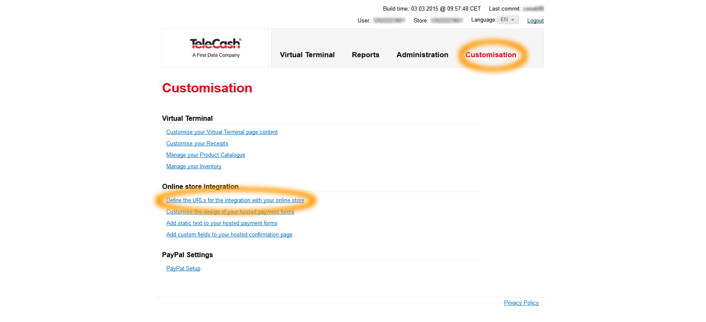
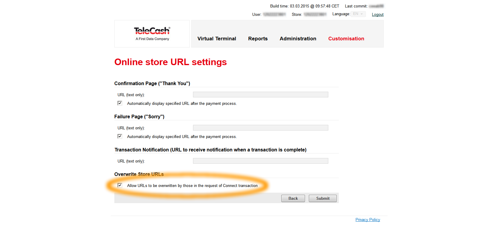
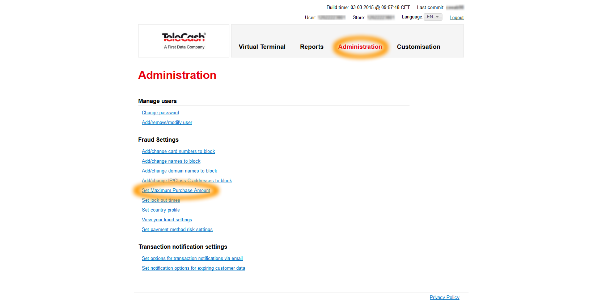
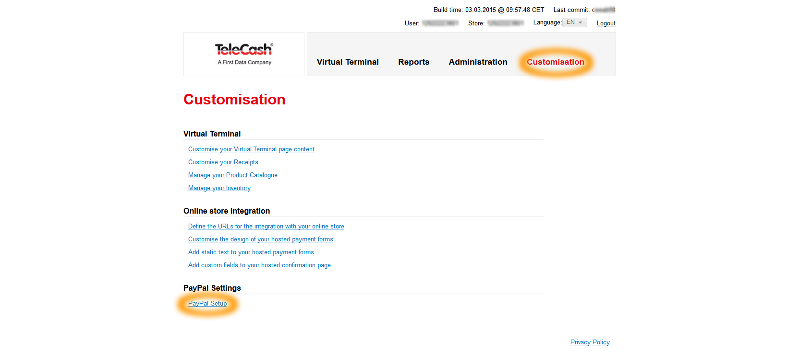
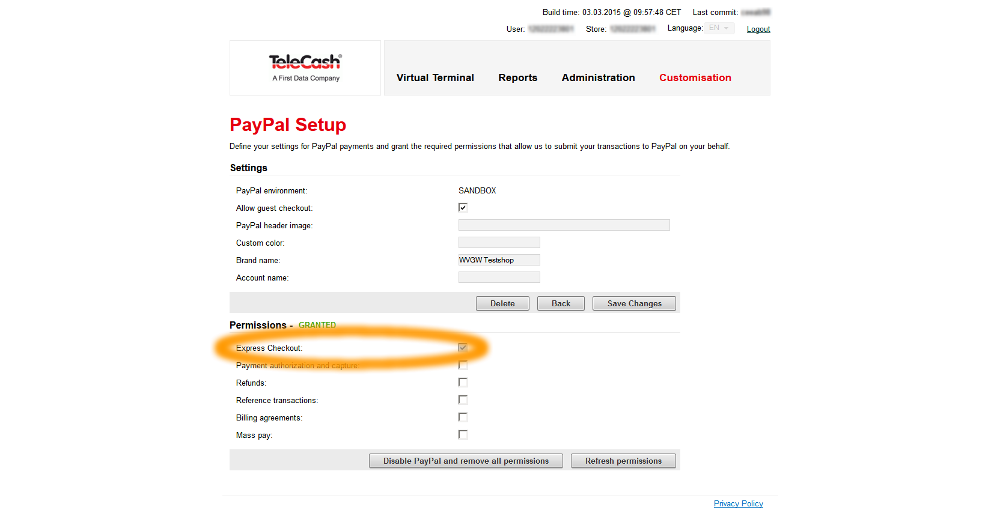

# Telecash

[TeleCash](http://www.telecash.de) is a German payment provider.
It provides electronic payments using different payment options such as:

- credit cards (VISA, American Express, MasterCard, Diners Club International, Discover, JCB, Union Pay including 3D MasterCard Secure Code and Verified by Visa)
- SEPA Direct Debit
- Maestro
- Giropay
- PayPal
- ClickandBuy
- one party transfer and Sofortüberweisung transfer
- iDEAL

The payment options offered in the payment process depend on your contract and configuration.
Some payment options require additional contracts. Contact TeleCash for more information.

## Configuration

`TelecashPaymentBundle` can be configured using Symfony parameters.
The defaults are defined in `TelecashPaymentBundle/Resources/config/parameters.yml`:

|Parameter|Description|Default value|
|--- |--- |--- |
|`siso_telecash_payment.paygate_url.test`|The redirection URL which is used in test mode. This value is not meant to be changed in a project and should rarely change, as it is part of the TeleCash public API.|`https://test.ipg-online.com/connect/gateway/processing`|
|`siso_telecash_payment.paygate_url.prod`|The redirection URL which is used in production mode, according to the test URL above.|`https://www.ipg-online.com/connect/gateway/processing`|
|`siso_telecash_payment.application_mode`|Switch for test and production mode. Possible values are  `test` and `prod`. Depending on this value, either the test URL or the production URL is used during the payment process.|`test`|
|`siso_telecash_payment.parameter.mode`|Defines the mode for the payment data collection at the paygate input page(s). Possible values are `fullpay`, `payplus` and `payonly`. Currently, only `payonly` is tested.|`payonly`|
|`siso_telecash_payment.parameter.storename`|One of the two account authentication credentials parameters that are provided by TeleCash to the customer (shop owner). It has no default value and must be overridden in project settings.||
|`siso_telecash_payment.parameter.secret`|The second account authentication credential parameter. It must be overridden, as well.||
|`siso_telecash_payment.parameter.timezone`|Possible values are `GMT`, `CET` `EET`|`CET`|
|`siso_payment.telecash.test_code.success`|Injected into the plugin implementation and replaces in test mode the decimals digits of the amount to pay with this value. Since TeleCash considers every transaction with a round amount as successful, this value would not cause any failed transactions. Normally this parameter doesn't need to be overridden.|`00`|
|`siso_payment.telecash.test_code.test`|The counterpart to the above setting. If this is injected into the plugin service, all transactions fail with an error code depending on this value. It could be overridden in order to change different error codes.|`01`|
|`siso_payment.currency_mapping`|A collection parameter. It contains a map which translates three letter currency codes into ISO 4217 numerical values. The labels in the mapping are currently not used, but may be used to display readable value later.||

## Account administration

### URL notification

To allow the shop to send the notification URL along with the redirection to the paygate, this option must be activated.
Because the notification URL is generated dynamically and contains the current order ID,
it must be sent instead of being configured statically in the paygate administration.
You can find this option with the following steps:

1\. URL configuration

2\. Checkbox for URL override by request

### Transaction limit

For security reasons, it is possible to limit the number of individual transactions.
If you encounter problems with failed transactions because of the exceeded limit,
you can change it in the following option:

### PayPal integration

In order to processes PayPal payments over TeleCash, you must grant your TeleCash account the respective rights for this in your PayPal account.
You need to register a PayPal account, in advance.
The following steps redirect you to PayPal, ask for login and confirmation of the requested rights.
 Express checkout is at least needed for `silver.payment`.

1\. PayPal

2\. Permissions

# Testing the data

For information about testing the connection and the required credentials, see [TeleCash documentation.](https://www.telecash.de/fileadmin/user_upload/telecash/downloads/e-commerce/Customer_information_testtransactions_within_Internet_Payment_Gateway.pdf)
