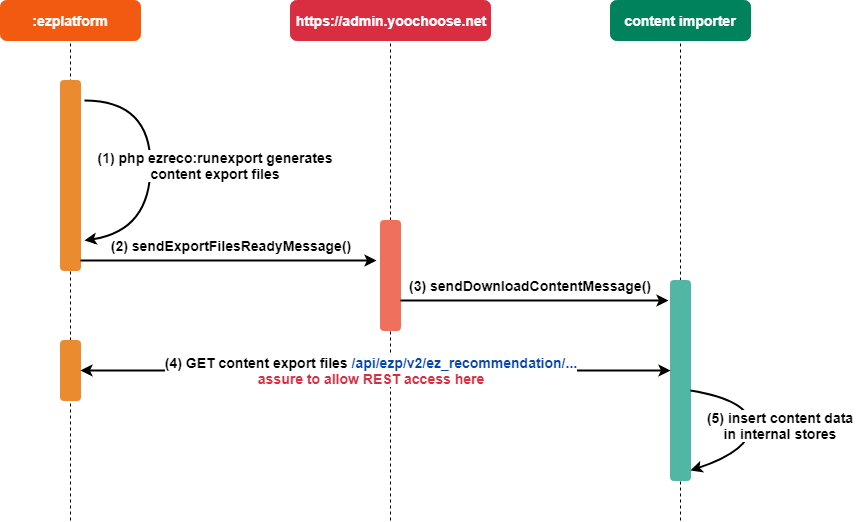
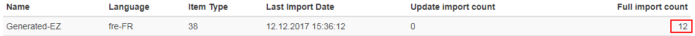
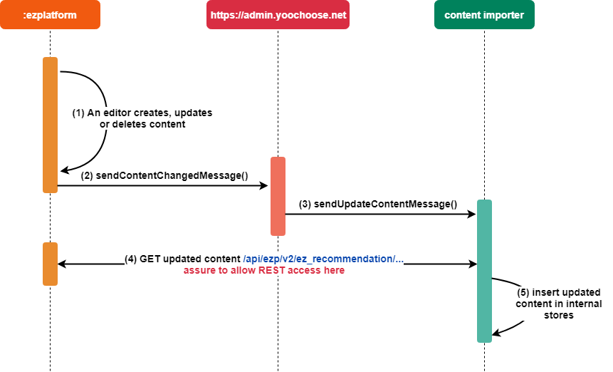

# Personalization

The [eZ Systems Recommendation Bundle](https://github.com/ezsystems/EzSystemsRecommendationBundle) extends the functionality of eZ Platform with a Personalization Solution, powered by [YOOCHOOSE](https://www.yoochoose.com).
It allows you to track the way visitors use your website and recommends content based on their behavior. You can also use the personalized search (content suggestions) and personalized newsletter features (embedding personalized content in your newsletters).

!!! tip "More information"

    - [eZ Services documentation](https://doc.ezplatform.com/projects/ezservices)

!!! note "Personalization Bundle v1"

    This page covers Recommendation Bundle v2, which is the latest version, used with all current releases of eZ Platform.
    If you are still using Recommendation Bundle v1, contact support@yoochoose.com if you need information.

## Installation

### 1. Run composer require

Run the following from your eZ Platform installation root:

``` bash
composer require --no-update ezsystems/recommendation-bundle:^2.0
composer update --prefer-dist
```

### 2. Enable the bundle

Enable the bundle in `app/AppKernel.php`:

``` php
$bundles = [
    // existing bundles
    new EzSystems\RecommendationBundle\EzSystemsRecommendationBundle()
];
```

### 3. Import additional routing

Import additional routing by adding the following lines to your `routing.yml` file:

``` yaml
recommendationBundleRestRoutes:
    resource: '@EzSystemsRecommendationBundle/Resources/config/routing_rest.yml'
    prefix: '%ezpublish_rest.path_prefix%'
```

!!! note "Legacy support"

    Legacy support is disabled by default. To enable the legacy search engine (requires `ezpublish-kernel` bundle) copy these service definitions to your `app/config/services.yml` file and uncomment them:

    ``` yaml
    # ez_recommendation.legacy.search_engine:
    #     class: ezpSearchEngine
    #     factory: [EzSystems\RecommendationBundle\eZ\Publish\LegacySearch\LegacySearchFactory, build]
    #     arguments: ['@ezpublish_legacy.kernel']

    # ez_recommendation.legacy.recommendation_search_engine:
    #     class: EzSystems\RecommendationBundle\eZ\Publish\LegacySearch\RecommendationLegacySearchEngine
    #     arguments:
    #         - '@ez_recommendation.client.yoochoose_notifier'
    #         - '@ez_recommendation.legacy.search_engine'

    # ez_recommendation.legacy.search_configuration_mapper:
    #     class: EzSystems\RecommendationBundle\eZ\Publish\LegacySearch\ConfigurationMapper
    #     lazy: true
    #     arguments:
    #         - '@ez_recommendation.legacy.recommendation_search_engine'
    #         - '@ezpublish.siteaccess'
    #     tags:
    #         - { name: kernel.event_subscriber }
    ```

### 4. Register a Personalization Solution account

Register an account (a so-called customerID) with your eZ Sales manager. If you want to use the open source version of eZ Platform without any subscription please send an email to support@yoochoose.com.

### 5. Allow public HTTP(S) access

Allow public HTTP(S) access to the recommendation bundle API (`<ezplatform-host>/api/ezp/v2/ez_recommendation/**`)

!!! note "IP whitelisting when public access is not possible"

    The Personalization Solution servers need to access the API of an eZ Platform installation in order to continuously sync content.
    If it's not possible to allow public access, the following IP Addresses can be used for whitelisting on (for example), a firewall.

    `54.229.102.177, 54.171.192.161, 54.77.201.13, 52.215.22.234, 52.18.150.96, 52.17.60.35, 52.17.36.104`

!!! note "If BASIC AUTH is required by policy"

    If the company policy is to use BASIC AUTH on the API interfaces, you need to add some specific configuration.

You probably have some access restrictions on your site defined in app/config/security.yml

``` yaml
security:
    providers:
        ezpublish:
            id: ezpublish.security.user_provider
    firewalls:
        ezpublish_rest:
            pattern: ^/api/ezp/v2
            stateless: true
            ezpublish_http_basic:
                realm: eZ Publish REST API
```

Create a user with the name of the CustomerID and a password which is the license key in your local security provider. This user must have access granted on the URLs provided by the bundle API (see above).
In order to tell the recommender to use this user and password to request resources on the eZ Platform instance, you can configure this as follows (an example file is available in the bundle under `Resources/config/default_settings.yml`):

``` yaml
# Export folder authentication method:
# basic - password generated by script
# user - login and passwords set by user
# none - no authentication !Warning - allow users to download content without permission
ez_recommendation.export.users_authentication.method: user
# Credentials for user authentication
# assure to use double quotes, otherwise an int is compared with a string during authentication phase
ez_recommendation.export.users_authentication.login: '<customerID>'
ez_recommendation.export.users_authentication.password: '<licenseKey>'
```

Place this in a settings file which won't be affected by an update to the Recommendation bundle via Composer.

## Configuration

### 1. Define what content should be tracked and exported

Visitor events (clicks, buys, ...) on the site need to be sent to the Personalization Solution for the recommendations to be calculated. The content types that are marked to be tracked are also exported to the Personalization Engine. Please note that you can only recommend what you track!

By defining the Content Types in the local `app/config/config.yml` file, the content will be initially exported by a script. After this, it will be kept in sync with the Personalization Solution everytime a change occurs in the eZ Platform back office.

The bundle's configuration is SiteAccess-aware. This is an example of the settings (in `config.yml`):

``` yaml
ez_recommendation:
    system:
        default:
            yoochoose:
                customer_id: 12345
                license_key: 1234-5678-9012-3456-7890
            server_uri: "http://example.com"
            recommender:
                included_content_types: [blog, article]
```

The following parameters need to be included in the settings file:

| Parameter                            | Description                                               |
|--------------------------------------|-----------------------------------------------------------|
| `yoochoose.customer_id`              | Your YOOCHOOSE customer ID.                               |
| `yoochoose.license_key`              | Your YOOCHOOSE license key.                               |
| `server_uri`                         | The URI your site's REST API can be accessed from.        |
| `recommender.included_content_types` | Content Types on which the tracking script will be shown. |

#### Advanced configuration

If the content's author or image are stored in a different Field, you can specify its name in the `parameters.yml` file:

``` yaml
ez_recommendation.field_identifiers:
    # Field fetched by controller
    author:
        # Content Type: Field with value
        article: authors
    image:
        article: thumbnail
        blog_post: main_image
```

In case a content owner ID is missing, you can set up the default content author in the `default_settings.yml` file:

``` yaml
ez_recommendation.default.author_id: 14   # ID: 14 is default ID of admin user
```

You can edit advanced options for the Personalization Engine using the following settings:

``` yaml
ez_recommendation:
    api_endpoint: https://admin.yoochoose.net
    recommender:
        api_endpoint: '//reco.yoochoose.net'
        consume_timeout: 20
    tracking:
        api_endpoint: http://event.yoochoose.net
        script_url: cdn.yoochoose.net/yct.js
```

Note: changing any of these parameters without a valid reason will break all calls to the Personalization Engine.

#### Enable tracking

The `EzSystemsRecommendationBundle` delivers a Twig extension which helps integrate the tracking functionality into your site. Place the following code snippet in the HEAD section of your header template:

``` html+twig

    {{ yc_track_user(content.id) }}

```

!!! note "How tracking works"

    In the YOOCHOOSE documentation you can find more information about [tracking in general](https://doc.ezplatform.com/projects/ezservices/en/latest/personalization/developer_guide/tracking_api/) and about the [generic asynchronous JavaScript tracker] (https://doc.ezplatform.com/projects/ezservices/en/latest/personalization/developer_guide/tracking_with_yct/).

### 2. Check if the bundle provides REST data

You can verify the import controller of the bundle by calling the local API. You should use the 'Accept' header and may need to add an 'Authorization' header if authentication is required.

To check if the `content` interface is working as expected, try this URI:
```
GET http://{endpoint}/api/ezp/v2/ez_recommendation/v1/content/{contentId}`
Accept application/vnd.ez.api.Content+json`
Authorization Basic xxxxxxxx`
```

Additionally you should check if the `contenttypes` interface is working as well by calling the following URI:
```
GET http://{endpoint}/api/ezp/v2/ez_recommendation/v1/contenttypes/38?page=1&page_size=10`
Accept application/vnd.ez.api.Content+json`
Authorization Basic xxxxxxxx`
```

Both interfaces are supposed to provide content data in JSON format.
The only difference is the size of the content array in the `contentList` object.
For the `content` interface one Content item is returned, for the `contenttypes` interface many are returned.

``` json
{
    "contentList": {
        "_media-type": "application/vnd.ez.api.contentList+json",
        "content": [
            {
                "_media-type": "application/vnd.ez.api.content+json",
                "contentId": 72,
                "contentTypeId": 38,
                "identifier": "place",
                "language": "eng-GB",
                "publishedDate": "2015-09-17T13:23:10+00:00",
                "author": "Sandip Patel",
                "uri": "/Places-Tastes/Places/Kochin-India",
                "categoryPath": "/1/2/95/71/73/",
                "mainLocation": {
                    "_media-type": "application/vnd.ez.api.mainLocation+json",
                    "_href": "/api/ezp/v2/content/locations/1/2/95/71/73/"
                },
                "locations": {
                    "_media-type": "application/vnd.ez.api.locations+json",
                    "_href": "/api/ezp/v2/content/objects/72/locations"
                },
                "name": "Kochin, India",
                "intro": "<![CDATA[<section xmlns=\"http://ez.no/namespaces/ezpublish5/xhtml5\"><p>We got the major port city on the south west coast of India.</p></section>\n]]>",
                "description": "<![CDATA[<section xmlns=\"http://ez.no/namespaces/ezpublish5/xhtml5\"><p><strong>Kochi </strong>(formerly Cochin) ... </p></section>\n]]>",
                "image": "/var/site/storage/images/places-tastes/places/kochin-india/282-5-eng-GB/Kochin-India.jpg",
                "caption": "<![CDATA[<section xmlns=\"http://ez.no/namespaces/ezpublish5/xhtml5\"><p>Chinese fishing nets ... </p></section>\n]]>",
                "location": "kochin, india",
                "authors_position": "Senior Editor",
                "tags": "India, Kochin",
                "rating": "0",
                "publication_date": "1442500260",
                "metas": ""
            }
        ],
        ....
    }
}
```

## Running a full content export

!!! caution "Exporting content is crucial for providing recommendations"

    If the content export does not work, your recommendations will not work as well.
    Required data like URIs, titles etc. will be missing and cannot be delivered in the recommendation response.

After defining which Content Types should be tracked and recommended  you can start the full export by executing the following command:

``` bash
php app/console ezreco:runexport --contentTypeIdList=<contentTypeId>,<contentTypeId> --webHook=https://admin.yoochoose.net/api/<your_customer_id>/items --hidden=1 --mandatorId=<your_customer_id> --host=<your_ezplatform_host_with_scheme>
```

With this command, the bundle exporter will collect all content related to the SiteAccesses of this customerID and store it in files (1).
After finishing, the systems will send a POST request to the `webHook` endpoint and inform the personalization engine to fetch new content (2).
An internal workflow is then triggered (3) so that the generated files are downloaded (4) and imported in the personalization engine's content store (5).

Please be patient, as this can take up to a couple of minutes.



!!! caution "Changing Content Types for recommendations"

    If the Content Types to be recommended are changed, a full export needs to be started again by running the `php app/console ezreco:runexport` command.

### Checking if the full context export was stored in the recommender engine

There are three ways to check if content was transferred and stored successfully in the recommender engine:

#### REST request to the recommender's content store

To get the content of an imported item you can request the following REST resource

`GET https://admin.yoochoose.net/api/<your_customer_id>/item/<your_content_type>/<your_content_id>`

This way requires BASIC Auth. BASIC Auth username is the customerID and the password is the license key.

Example response:

``` xml
<?xml version="1.0" encoding="UTF-8" standalone="yes"?>
<items version="1">
    <item id="73" type="38">
        <imageurls>
            <imageurl type="preview">/var/site/storage/images/places-tastes/places/santo-domingo-dominican-republic/288-4-eng-GB/Santo-Domingo-Dominican-Republic.jpg</imageurl>
        </imageurls>
        <deeplinkurl>/Places-Tastes/Places/Santo-Domingo-Dominican-Republic</deeplinkurl>
        <validfrom>2015-09-17T13:24:25.000</validfrom>
        <categoryids/>
        <categorypaths>
            <categorypath>1/2/95/71/74</categorypath>
        </categorypaths>
        <content/>
        <attributes>
            <attribute value="/var/site/storage/images/places-tastes/places/santo-domingo-dominican-republic/288-4-eng-GB/Santo-Domingo-Dominican-Republic.jpg" key="image" type="TEXT"/>
            <attribute value="place" key="identifier" type="TEXT"/>
            <attribute value="fre-FR" key="language" type="TEXT"/>
            <attribute value="Senior Editor" key="authors_position" type="TEXT"/>
            <attribute value="Michael Wang" key="author" type="TEXT"/>
            <attribute value="/1/2/95/71/74/" key="categoryPath" type="TEXT"/>
            <attribute value="Michael Wang" key="author" type="NOMINAL"/>
            <attribute value="0" key="rating" type="TEXT"/>
            <attribute value="&lt;![CDATA[&lt;section xmlns=&quot;http://ez.no/namespaces/ezpublish5/xhtml5&quot;&gt;&lt;p&gt;Outstanding beaches of Dominican Republic, Samana is one of them.&lt;/p&gt;&lt;p&gt;&lt;em&gt;Photograph by Brian Henry - Anchorage north shore Samana, Dominican Republic&lt;/em&gt;&lt;/p&gt;&lt;/section&gt;&#xA;]]&gt;" key="caption" type="TEXT"/>
            <attribute value="/Places-Tastes/Places/Santo-Domingo-Dominican-Republic" key="uri" type="TEXT"/>
            <attribute value="38" key="contentTypeId" type="TEXT"/>
            <attribute value="Dominican Republic, Santo Domingo" key="tags" type="TEXT"/>
            <attribute value="&lt;![CDATA[&lt;section xmlns=&quot;http://ez.no/namespaces/ezpublish5/xhtml5&quot;&gt;&lt;p&gt;Santo Domingo meaning &quot;Saint Dominic&quot;, officially Santo Domingo de Guzm&amp;aacute;n, is the capital and largest city in the ... &lt;/p&gt;&lt;/section&gt;&#xA;]]&gt;" key="description" type="TEXT"/>
            <attribute value="73" key="contentId" type="TEXT"/>
            <attribute value="&lt;![CDATA[&lt;section xmlns=&quot;http://ez.no/namespaces/ezpublish5/xhtml5&quot;&gt;&lt;p&gt;The oldest European inhabited settlement in the Americas.&lt;/p&gt;&lt;/section&gt;&#xA;]]&gt;" key="intro" type="TEXT"/>
            <attribute value="1442500260" key="publication_date" type="TEXT"/>
            <attribute value="Santo Domingo, Dominican Republic" key="name" type="TEXT"/>
            <attribute value="Santo Domingo, Dominican Republic" key="location" type="TEXT"/>
            <attribute value="2015-09-17T13:24:25+00:00" key="publishedDate" type="TEXT"/>
        </attributes>
    </item>
</items>
```

#### Recommender Backend

You can log in to [admin.yoochoose.net](https://admin.yoochoose.net/), switch to the Item Import tab and check if a FULL import was successful.



#### Personalized Search Requests

Since the search functionality is included by default, you can also create and invoke a search request to look for content that matches certain criteria. The easiest way to do this is to assign the contentID to the request parameter `q`. Make sure that the contentID is at least 2 chars long (for example, `&q=73`).

`GET https://reco.yoochoose.net/api/v4/search/<your_customer_id>/get_suggestions.json?item=5&itemtype=<your_content_type>&q=<your_content_id>&attribute=name&attribute=author&attribute=uri&attribute=<your_custom_attribute>`

Example response:

``` json
{
    "ITEM": [
        {
            "yc_score": 2.209763288497925,
            "yc_id": "72",
            "yc_itemtype": "38",
            "name": "Kochin, India",
            "uri": "/Places-Tastes/Places/Kochin-India",
            "author": "Sandip Patel"
        },
        {
            "yc_score": 1.152622938156128,
            "yc_id": "73",
            "yc_itemtype": "38",
            "name": "Santo Domingo, Dominican Republic",
            "uri": "/Places-Tastes/Places/Santo-Domingo-Dominican-Republic",
            "author": "Michael Wang"
        }
    ],
    "details": [
        {
            "scope": "ITEM",
            "itemType": 38,
            "count": 2
        }
    ]
}
```

## Incremental content export

Every time an editor creates, updates or deletes content in the backoffice (1), a notification is sent to https://admin.yoochoose.net informing that a content change has occured (2). The yoochoose service will also notify other components of the recommendation engine (3) and it will eventually fetch the affected content (4) and update it internally (5).



This mechanism allows the content in the personalization engine to be always in sync with the content on eZ Platform.

## Enabling recommendations

!!! note "Client-based recommendations"

    Recommendations are fetched and rendered asynchronously in the client, so there won't be any additional load on the server.
    Therefore it is crucial to check if the content export has been successful, as e.g. deeplinks and image references are included.
    If the export is NOT successful, the personalization engine will not have the full content information. This will break the recommendations. Even if the recommendations are displayed, there is a big chance they won't have images, titles or deeplinks.

In order to allow displaying recommendations on your site, you must add some code which will integrate the recommender engine (with your site). This can be achieved with a few steps (assuming that `EzSystemsRecommendlationBundle` is properly configured and enabled in `AppKernel.php`):

Add the following JavaScript assets to your header template:

``` html+twig
{% javascripts
    '%kernel.root_dir%/../vendor/components/handlebars.js/handlebars.min.js'
    '@EzSystemsRecommendationBundle/Resources/public/js/recommendationtemplaterenderer.js'
    '@EzSystemsRecommendationBundle/Resources/public/js/recommendationtemplatehelper.js'
    '@EzSystemsRecommendationBundle/Resources/public/js/recommendationrestclient.js'
%}
```

Place a dedicated Twig helper in the place where you want to display recommendations:

``` html+twig
{{ yc_show_recommendations(
    contentId = content.id,
    scenario = '',
    limit = '',
    contentType = '',
    template = '',
    fields = []
) }}
```

### Parameters

| Parameter   | Type   | Description   |
|-------------|--------|---------------|
| `contentId`   | int    | In content-based views the Twig variable holding the content ID (the content you want to get recommendations for). |
| `scenario`    | string | Scenario used to display recommendations. You can create custom scenarios in the [Personalization Engine's  dashboard](https://admin.yoochoose.net). |
| `limit`       | int    | Number of recommendations to fetch. |
| `contentType` | string | Content Type you are expecting in response, e.g. article. |
| `template`    | string | Handlebars template name. Your templates are stored in the `ezsystems/recommendation-bundle/Resources/public/views` directory. Take a look at `default.html.twig` which includes a default template that can be used to prepare customized versions. |
| `fields`      | array  | Fields which are required and will be requested from the recommender engine. These Field names are also used inside Handlebars templates. |

Sample integration can take the following form:

``` html+twig
{{ yc_show_recommendations(
    contentId = content.id,
    scenario = 'popular',
    limit = 5,
    contentType = 'article',
    template = 'default',
    fields = ['uri', 'title', 'image', 'author', 'intro']
) }}
```

You can also bypass named arguments using standard value passing as arguments.

Recommendation responses contain all content data which is requested as attribute in the recommendation call.
These 'attributes' of the response can be used in Handlebars templates to render and style recommendations. For example, the GET request:

`GET https://reco.yoochoose.net/api/v2/<your_customer_id>/someuser/popular.json?contextitems=71&numrecs=5&categorypath=/&outputtypeid=<your_content_type>&attribute=name,author,uri,image`

delivers the following response *if* the content Fields were previously (and successfully) exported by the export script.
``` json
{
    "contextItems": [
        {
            "itemId": 71,
            "itemType": 38,
            "sources": [
                "REQUEST"
            ],
            "viewers": 0
        }
    ],
    "recommendationItems": [
        {
            "itemId": 71,
            "itemType": 38,
            "relevance": 3,
            "links": {
                "clickRecommended": "//event.test.yoochoose.net/api/723/clickrecommended/someuser/38/71?scenario=popular&modelid=4199&categorypath=&requestuuid=d75e7cf0-e4ca-11e7-a94d-0a64dbbea736",
                "rendered": "//event.test.yoochoose.net/api/723/rendered/someuser/38/71?scenario=popular&modelid=4199&categorypath=&requestuuid=d75e7cf0-e4ca-11e7-a94d-0a64dbbea736"
            },
            "attributes": [
                {
                    "key": "image",
                    "values": [
                        "/var/site/storage/images/places-tastes/places/valencia-spain/276-4-eng-GB/Valencia-Spain.jpg"
                    ]
                },
                {
                    "key": "author",
                    "values": [
                        "Tara Fitzgerald"
                    ]
                },
                {
                    "key": "name",
                    "values": [
                        "Valencia, Spain"
                    ]
                },
                {
                    "key": "uri",
                    "values": [
                        "/Places-Tastes/Places/Valencia-Spain"
                    ]
                }
            ]
        },
        {
            "itemId": 75,
            "itemType": 38,
            "relevance": 1,
            "links": {
                "clickRecommended": "//event.test.yoochoose.net/api/723/clickrecommended/someuser/38/75?scenario=popular&modelid=4199&categorypath=&requestuuid=d75e7cf0-e4ca-11e7-a94d-0a64dbbea736",
                "rendered": "//event.test.yoochoose.net/api/723/rendered/someuser/38/75?scenario=popular&modelid=4199&categorypath=&requestuuid=d75e7cf0-e4ca-11e7-a94d-0a64dbbea736"
            },
            "attributes": [
                {
                    "key": "image",
                    "values": [
                        "/var/site/storage/images/places-tastes/places/brooklyn-new-york/300-4-eng-GB/Brooklyn-New-York.jpg"
                    ]
                },
                {
                    "key": "author",
                    "values": [
                        "Elizabeth Liu"
                    ]
                },
                {
                    "key": "name",
                    "values": [
                        "Brooklyn, New York"
                    ]
                },
                {
                    "key": "uri",
                    "values": [
                        "/Places-Tastes/Places/Brooklyn-New-York"
                    ]
                }
            ]
        }
    ]
}
```

### Displaying image variations

Displaying image variations is not currently supported out of the box.

You can work around this limitation by creating your own template (based on [recommendations.html.twig](https://github.com/ezsystems/ezstudio-demo/blob/master/app/Resources/EzSystemsRecommendationBundle/views/recommendations.html.twig))
or your own Twig extension (based on [RecommendationTwigExtension.php](https://github.com/ezsystems/EzSystemsRecommendationBundle/blob/master/Twig/RecommendationTwigExtension.php#L237)).

If you want to access a specific image variation through API, you need to add the `image` parameter to the request URL with the name of the variation as its value.
For example, to retrieve the `rss` variation of the image, use:

`/api/ezp/v2/ez_recommendation/v1/contenttypes/16?lang=eng-GB&fields=title,description,image,intro,name&page=1&page_size=20&image=rss`

## Troubleshooting

### "Console error: eZ is not defined"

If you see this error in the console of your browser's debugger you need to rerun the asset installer:

``` bash
php app/console assets:install --symlink --env=prod
```

### Authentication does not work

If authentication fails although you added a user in your local directory please check if you used double quotes around the username in the export settings.

### Requested content type is not supported (CONFLICT)

When fetching recommendations you get a message that the requested content type is not supported (CONFLICT).
Take a look at the scenario configuration in the [Admin Dashboard](https://admin.yoochoose.net) and check if the input and output types are properly set.

### Logging

Most operations are logged via the `ez_recommendation` [Monolog channel](http://symfony.com/doc/current/cookbook/logging/channels_handlers.html). To log everything about Recommendation to `dev.recommendation.log`, add the following to your `config.yml`:

``` yaml
monolog:
    handlers:
        ez_recommendation:
            type: stream
            path: '%kernel.logs_dir%/%kernel.environment%.recommendation.log'
            channels: [ez_recommendation]
            level: info
```

You can replace `info` with `debug` for more verbosity.
