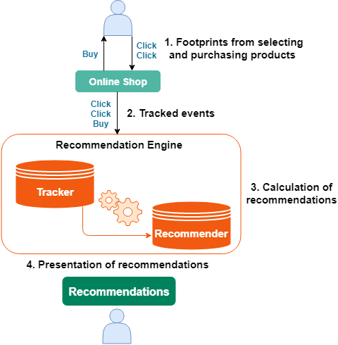

# Personalization

Ibexa Personalization is a service for offering personalized recommendations to visitors to your website.
It can be used to serve targeted content to users based on their preferences and behavior.

Ibexa Personalization can be used both by publishers (to serve personalized content and track its consumption), and in e-commerce (to recommend other products to purchase).

## Benefits

Recommending items helps users navigate and make choices when faced with a mass of content.
Recommendations show relevant information to users who are browsing a website, improve their online experience and increase the chance to keep them on your site.

## Online recommendations

**Online recommendations** are well-known in form of the "What other users bought" and the "Also interesting for you" boxes on e-commerce websites such as Amazon.
These are pure online recommendations that are displayed within a given context.
This could either be a detail page with a product or the personalized landing page, where recommendations are based on a user's personal history.
Online recommendations are used to a similar effect in the publishing sector.
While reading you often find "Related content" boxes on the site which are mostly based on the reading behavior of the visitors or the popularity of current content.

In order to provide online recommendations a recommendation engine must at least:

- track user actions through a web browser or a mobile app
- store the user actions
- use the data to generate recommendations
- provide recommendations on a customer's website

When visiting a website, users usually consume content and - if on an e-commerce site - they may buy products.
Clicking, buying and consuming content are examples of actions that are collected in a recommender engine and later processed to generate recommendations.
After collecting sufficient user activity, the recommender engine can be "asked" for recommendations in the current context.
Usually the context is the current content or product where recommendations should be presented for.
But it could also be the personal history of a user, meaning the content they were reading or the products they have bought.
