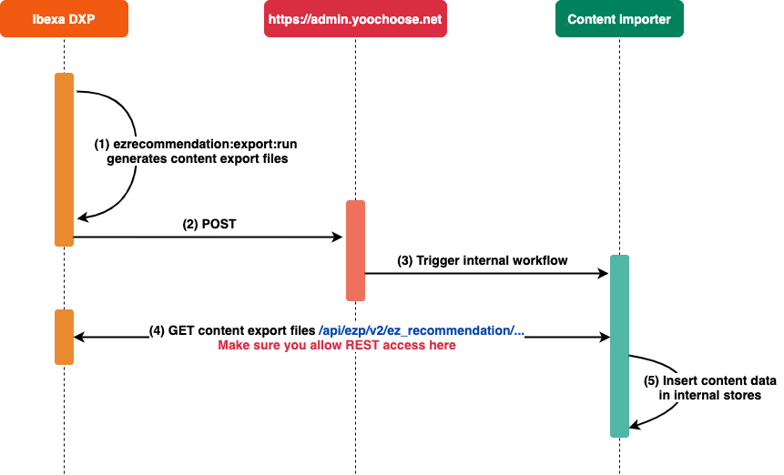

# Recommendation client

The [`ezrecommentation-client`](https://github.com/ezsystems/ezrecommendation-client) package 
adds a personalization solution to [[= product_name =]] and communicates with 
the server that runs the recommendation engine.

Its job is to track the way visitors use your website and recommends content 
based on their behavior.

Once you become familiar with this article, for more information about integrating 
the Personalization service, see [Developer guide](developer_guide/tracking_api.md) and [Best practices](best_practices/tracking_integration.md).

## Configuration

Before you can use the Personalization service, you must configure the client.

### Set up Content Type tracking

For the recommendations to be calculated, apart from visitor events (CLICK, BUY, etc.), 
the Recommendation engine must be fed with the list of Content Types that are tracked.

You define Content Types to be tracked in the `config/packages/ezplatform.yaml` file.
The content is then initially exported by a script.
After this, it is synchronized with the Personalization service every time a change 
occurs in the Back Office.

The client's configuration is SiteAccess-aware, and can resemble the following example:

``` yaml
ezrecommendation:
    system:
        <siteaccess>:
            authentication:
                customer_id: 12345
                license_key: 1234-5678-9012-3456-7890
            included_content_types: [blog, article]
            random_content_types: [blog]
            host_uri: https://server_uri
```

!!! tip

    It is recommended that you provide your `host_uri`, `customer_id` and 
    `license_key` through environment variables: `'%env()%'`.

| Parameter                            | Description                                               |
|--------------------------------------|-----------------------------------------------------------|
| `authentication.customer_id`         | Your customer ID.                                         |
| `authentication.license_key`         | Your license key.                                         |
| `host_uri`                           | The URI your site's REST API can be accessed from.        |
| `included_content_types`             | A list of alphanumerical identifiers of Content Types on which the tracking script is shown. |
| `random_content_types`               | A list of alphanumerical identifiers of Content Types that are returned when the response from the server contains no content. |

#### Advanced configuration

If the Content item's intro, author or image are stored in a different Field,
you can specify its name in the `ezplatform.yaml` file:

``` yaml
ezrecommendation:
    system:
        <siteaccess>
            field:
                identifiers:
                    intro:
                        blog_post: intro
                        article: lead
                    author:
                        blog_post: author
                        article: authors
                    image:
                        <content_type_name>: <field_name>
```

In case a content owner ID is missing, you can set up the default content author in the `default_settings.yaml` file:

``` yaml
ezrecommendation:
    system:
        <siteaccess>:
            author_id: 14   # ID: 14 is default ID of admin user
```

You can edit advanced options for the Recommendation engine using the following settings:

``` yaml
ezrecommendation:
    system:
        <siteaccess>:
            api:
                admin:
                    endpoint: 'https://admin.yoochoose.net'
                recommendation:
                    endpoint: 'https://reco.yoochoose.net'
                    consume_timeout: 20
                event_tracking:
                    endpoint: 'https://event.yoochoose.net'
                    script_url: 'cdn.yoochoose.net/yct.js'
                notifier:
                    endpoint: 'https://admin.yoochoose.net'
```

You can use an alphanumeric content identificator `remoteId` instead of a numeric `id`. To enable it, add the following code to the configuration file:

``` yaml
ezrecommendation:
    system:
        <scope>:
            repository:
                content:
                    use_remote_id: true
```

!!! caution

    Changing any of these parameters without a valid reason breaks all calls to the Recommendation engine.

#### Enable tracking

The `EzRecommendationClientBundle` delivers a Twig extension
which helps integrate the user tracking functionality into your site.
Place the following code snippet in the `<head>` section of your header template:

``` html+twig

    {{ ez_recommendation_track_user(content) }}

```

!!! tip "How tracking works"

    For more information about tracking in general, see [Tracking API](developer_guide/tracking_api.md) and [Tracking with yct.js](developer_guide/tracking_with_yct.md).

### Checking whether the bundle provides REST data

You can verify the import controller of the bundle by calling the local API.
Use the `Accept` header; you may need to add an `Authorization` header if authentication is required.

To check whether the `content` endpoint is working as expected, perform the following request:

```
GET http://<yourdomain>/api/ezp/v2/ez_recommendation/v1/content/{contentId}
Accept application/vnd.ez.api.Content+json
Authorization Basic xxxxxxxx
```

Additionally, check whether the `contenttypes` endpoint is working with the following request:

```
GET http://<yourdomain>/api/ezp/v2/ez_recommendation/v1/contenttypes/38?page=1&page_size=10
Accept application/vnd.ez.api.Content+json
Authorization Basic xxxxxxxx
```

The `content` endpoint returns one Content item and the `contenttypes` endpoint returns many.

``` json
{
    "contentList": {
        "_media-type": "application/vnd.ez.api.contentList+json",
        "content": [
            {
                "_media-type": "application/vnd.ez.api.content+json",
                "contentId": 72,
                "contentTypeId": 38,
                "identifier": "place",
                "language": "eng-GB",
                "publishedDate": "2015-09-17T13:23:10+00:00",
                "author": "Sandip Patel",
                "uri": "/Places-Tastes/Places/Kochin-India",
                "categoryPath": "/1/2/95/71/73/",
                "mainLocation": {
                    "_media-type": "application/vnd.ez.api.mainLocation+json",
                    "_href": "/api/ezp/v2/content/locations/1/2/95/71/73/"
                },
                "locations": {
                    "_media-type": "application/vnd.ez.api.locations+json",
                    "_href": "/api/ezp/v2/content/objects/72/locations"
                },
                "name": "Kochin, India",
                "intro": "<![CDATA[<section xmlns=\"http://ez.no/namespaces/ezpublish5/xhtml5\"><p>We got the major port city on the south west coast of India.</p></section>\n]]>",
                "description": "<![CDATA[<section xmlns=\"http://ez.no/namespaces/ezpublish5/xhtml5\"><p><strong>Kochi </strong>(formerly Cochin) ... </p></section>\n]]>",
                "image": "/var/site/storage/images/places-tastes/places/kochin-india/282-5-eng-GB/Kochin-India.jpg",
                "caption": "<![CDATA[<section xmlns=\"http://ez.no/namespaces/ezpublish5/xhtml5\"><p>Chinese fishing nets ... </p></section>\n]]>",
                "location": "kochin, india",
                "authors_position": "Senior Editor",
                "tags": "India, Kochin",
                "rating": "0",
                "publication_date": "1442500260",
                "metas": ""
            }
        ],
        ....
    }
}
```

## Exporting content information

To get recommendations you must first export the content information to the Recommendation engine.

After you [define Content Types to be tracked and recommended](#set-up-content-type-tracking),
start the full export.
You do it either with the `ibexa:recommendation:run-export` command...

``` bash
php bin/console ibexa:recommendation:run-export
    --contentTypeIdList=<contentTypeId>,<contentTypeId>
    --webHook=https://admin.yoochoose.net/api/<your_customer_id>/items
    --host=<your_ezplatform_host_with_scheme>
```

... or by accessing the `http://<yourdomain>/api/ezp/v2/ez_recommendation/` endpoint:

```
http://<yourdomain>/api/ezp/v2/ez_recommendation/v1/runExport/<contentTypeIdList>?webHook=<webhook>&customerId=<customerId>&licenseKey=<licenseKey>&host=<host>
```

The bundle exporter collects all content related to the SiteAccesses of this `customerID` and stores it in files (1).
After finishing, the systems sends a POST request to the `webHook` endpoint and informs the Recommendation engine to fetch new content (2).
An internal workflow is then triggered (3) so that the generated files are downloaded (4) and imported in the Recommendation engine's content store (5).

The export process can take several minutes.



!!! caution "Re-exporting modified Content Types"

    If the Content Types to be recommended change, you must perform a new full export
    by running the `php bin/console ibexa:recommendation:run-export` command again.

### Checking export results

There are three ways to check whether content was transferred and stored successfully in the Recommendation engine:

#### REST request to the client's content store

To get the content of an imported item you can request the following REST resource:

`GET https://admin.yoochoose.net/api/<your_customer_id>/item/<your_content_type_id>/<your_content_id>`

This way requires BASIC Auth. BASIC Auth username is the `customerID` and the password is the license key.

??? note "Example response"

    ``` xml
    <?xml version="1.0" encoding="UTF-8" standalone="yes"?>
    <items version="1">
        <item id="73" type="38">
            <imageurls>
                <imageurl type="preview">/var/site/storage/images/places-tastes/places/santo-domingo-dominican-republic/288-4-eng-GB/Santo-Domingo-Dominican-Republic.jpg</imageurl>
            </imageurls>
            <deeplinkurl>/Places-Tastes/Places/Santo-Domingo-Dominican-Republic</deeplinkurl>
            <validfrom>2015-09-17T13:24:25.000</validfrom>
            <categoryids/>
            <categorypaths>
                <categorypath>1/2/95/71/74</categorypath>
            </categorypaths>
            <content/>
            <attributes>
                <attribute value="/var/site/storage/images/places-tastes/places/santo-domingo-dominican-republic/288-4-eng-GB/Santo-Domingo-Dominican-Republic.jpg" key="image" type="TEXT"/>
                <attribute value="place" key="identifier" type="TEXT"/>
                <attribute value="fre-FR" key="language" type="TEXT"/>
                <attribute value="Senior Editor" key="authors_position" type="TEXT"/>
                <attribute value="Michael Wang" key="author" type="TEXT"/>
                <attribute value="/1/2/95/71/74/" key="categoryPath" type="TEXT"/>
                <attribute value="Michael Wang" key="author" type="NOMINAL"/>
                <attribute value="0" key="rating" type="TEXT"/>
                <attribute value="&lt;![CDATA[&lt;section xmlns=&quot;http://ez.no/namespaces/ezpublish5/xhtml5&quot;&gt;&lt;p&gt;Outstanding beaches of Dominican Republic, Samana is one of them.&lt;/p&gt;&lt;p&gt;&lt;em&gt;Photograph by Brian Henry - Anchorage north shore Samana, Dominican Republic&lt;/em&gt;&lt;/p&gt;&lt;/section&gt;&#xA;]]&gt;" key="caption" type="TEXT"/>
                <attribute value="/Places-Tastes/Places/Santo-Domingo-Dominican-Republic" key="uri" type="TEXT"/>
                <attribute value="38" key="contentTypeId" type="TEXT"/>
                <attribute value="Dominican Republic, Santo Domingo" key="tags" type="TEXT"/>
                <attribute value="&lt;![CDATA[&lt;section xmlns=&quot;http://ez.no/namespaces/ezpublish5/xhtml5&quot;&gt;&lt;p&gt;Santo Domingo meaning &quot;Saint Dominic&quot;, officially Santo Domingo de Guzm&amp;aacute;n, is the capital and largest city in the ... &lt;/p&gt;&lt;/section&gt;&#xA;]]&gt;" key="description" type="TEXT"/>
                <attribute value="73" key="contentId" type="TEXT"/>
                <attribute value="&lt;![CDATA[&lt;section xmlns=&quot;http://ez.no/namespaces/ezpublish5/xhtml5&quot;&gt;&lt;p&gt;The oldest European inhabited settlement in the Americas.&lt;/p&gt;&lt;/section&gt;&#xA;]]&gt;" key="intro" type="TEXT"/>
                <attribute value="1442500260" key="publication_date" type="TEXT"/>
                <attribute value="Santo Domingo, Dominican Republic" key="name" type="TEXT"/>
                <attribute value="Santo Domingo, Dominican Republic" key="location" type="TEXT"/>
                <attribute value="2015-09-17T13:24:25+00:00" key="publishedDate" type="TEXT"/>
            </attributes>
        </item>
    </items>
    ```

#### Recommendation client backend

In the Back Office, navigate to **Personalization** > **Import** and review a list of historical import operations to see whether a full import was successful.


### Subsequent content exports

The Recommendation engine is automatically kept in sync with the content in [[= product_name =]].

Every time an editor creates, updates or deletes content in the Back Office (1),
a notification is sent to https://admin.yoochoose.net (2).
The personalization service also notifies other components of the Recommendation engine (3)
and it eventually fetches the affected content (4) and updates it internally (5).


## Displaying recommendations

!!! note "Client-based recommendations"

    Recommendations are fetched and rendered asynchronously in the client, so there is no additional load on the server.
    Therefore, it is crucial that you check whether the content export was successful, because certain references, for example, deeplinks and image references, are included.
    If the export fails, the Recommendation engine does not have full content information.
    As a result, even if the recommendations are displayed, they might miss images, titles or deeplinks.

To display recommendations on your site, you must include the asset in the template using the following code:

``` html+twig
{{ encore_entry_script_tags('ezrecommendation-client-js', null, 'ezplatform') }}
```

This file is responsible for sending notifications to the [Recommendation API](developer_guide/recommendation_api.md) after the user clicks on a tracking element.

To render recommended content, use a dedicated `showRecommendationsAction` from the `RecommendationController.php`:

``` html+twig
render(controller('ez_recommendation::showRecommendationsAction', {
        'contextItems': content,
        'scenario': 'front',
        'outputTypeId': 57,
        'limit': 3,
        'template': 'EzRecommendationClientBundle::recommendations.html.twig',
        'attributes': ['title', 'intro', 'image', 'uri']
      }))
```

!!! tip

    To check whether tracking is enabled on the front end, use the `ez_recommendation_enabled()` Twig function.
    You can wrap the call to the `RecommendationController` with:

    ``` html+twig
    
        <div class="container">
            {# ... #}
        </div>
    
    ```

### Parameters

| Parameter        | Type   | Description   |
|------------------|--------|---------------|
| `contextItems`   | int    | instance of eZ\Publish\API\Repository\Values\Content\Content   | Content you want to get recommendations for. |
| `scenario`       | string | Scenario used to display recommendations. You can create custom scenarios in the Back Office. |
| `outputTypeId`   | int | Content Type you are expecting in response, for example, 10. |
| `limit`          | int    | Number of recommendations to fetch. |
| `template`       | string | Template name. |
| `attributes`     | array  | Fields that are required and are requested from the Recommendation engine. These Field names are also used inside Handlebars templates. |

You can also bypass named arguments with standard value passing as arguments.

!!! note "Custom templates"

    To use a custom template for displaying recommendations,
    ensure that it includes `event_tracking.html.twig`:

    ``.

Recommendation responses contain all content data that is requested as attribute in the recommendation call.
This response data can be used in templates to render and style recommendations.

For example, the following GET request should deliver the response below
if the content Fields were previously exported by the export script.

`GET https://reco.yoochoose.net/api/v2/<your_customer_id>/someuser/popular.json?contextitems=71&numrecs=5&categorypath=/&outputtypeid=<your_content_type>&attribute=name,author,uri,image`

??? note "Example response"

    ``` json
    {
        "contextItems": [
            {
                "itemId": 71,
                "itemType": 38,
                "sources": [
                    "REQUEST"
                ],
                "viewers": 0
            }
        ],
        "recommendationItems": [
            {
                "itemId": 71,
                "itemType": 38,
                "relevance": 3,
                "links": {
                    "clickRecommended": "//event.test.yoochoose.net/api/723/clickrecommended/someuser/38/71?scenario=popular&modelid=4199&categorypath=&requestuuid=d75e7cf0-e4ca-11e7-a94d-0a64dbbea736",
                    "rendered": "//event.test.yoochoose.net/api/723/rendered/someuser/38/71?scenario=popular&modelid=4199&categorypath=&requestuuid=d75e7cf0-e4ca-11e7-a94d-0a64dbbea736"
                },
                "attributes": [
                    {
                        "key": "image",
                        "values": [
                            "/var/site/storage/images/places-tastes/places/valencia-spain/276-4-eng-GB/Valencia-Spain.jpg"
                        ]
                    },
                    {
                        "key": "author",
                        "values": [
                            "Tara Fitzgerald"
                        ]
                    },
                    {
                        "key": "name",
                        "values": [
                            "Valencia, Spain"
                        ]
                    },
                    {
                        "key": "uri",
                        "values": [
                            "/Places-Tastes/Places/Valencia-Spain"
                        ]
                    }
                ]
            },
            {
                "itemId": 75,
                "itemType": 38,
                "relevance": 1,
                "links": {
                    "clickRecommended": "//event.test.yoochoose.net/api/723/clickrecommended/someuser/38/75?scenario=popular&modelid=4199&categorypath=&requestuuid=d75e7cf0-e4ca-11e7-a94d-0a64dbbea736",
                    "rendered": "//event.test.yoochoose.net/api/723/rendered/someuser/38/75?scenario=popular&modelid=4199&categorypath=&requestuuid=d75e7cf0-e4ca-11e7-a94d-0a64dbbea736"
                },
                "attributes": [
                    {
                        "key": "image",
                        "values": [
                            "/var/site/storage/images/places-tastes/places/brooklyn-new-york/300-4-eng-GB/Brooklyn-New-York.jpg"
                        ]
                    },
                    {
                        "key": "author",
                        "values": [
                            "Elizabeth Liu"
                        ]
                    },
                    {
                        "key": "name",
                        "values": [
                            "Brooklyn, New York"
                        ]
                    },
                    {
                        "key": "uri",
                        "values": [
                            "/Places-Tastes/Places/Brooklyn-New-York"
                        ]
                    }
                ]
            }
        ]
    }
    ```

### Modifying recommendation data

You can retrieve data returned from the recommendation engine and modify it before it is shown to the user.

To modify recommendation data, subscribe to `RecommendationResponseEvent`.
See [`Event/Subscriber/RecommendationEventSubscriber.php`](https://github.com/ezsystems/ezrecommendation-client/blob/master/src/lib/Event/Subscriber/RecommendationEventSubscriber.php) for example:

``` php
public static function getSubscribedEvents(): array
{
    return [
        RecommendationResponseEvent::class => ['onRecommendationResponse', -10],
    ];
}
```

The `-10` refers to priority, which must be negative so this action is performed before the main subscriber is run.

### Image variations

Displaying image variations is not readily supported yet.

You can work around this limitation by creating a template
(based on [recommendations.html.twig](https://github.com/ezsystems/ezrecommendation-client/blob/master/src/bundle/Resources/views/recommendations.html.twig)).

To access a specific image variation through API, add the `image` parameter to the request URL with the name of the variation as its value.
For example, to retrieve the `rss` variation of the image, use:

`/api/ezp/v2/ez_recommendation/v1/contenttypes/16?lang=eng-GB&fields=title,description,image,intro,name&page=1&page_size=20&image=rss`

## Troubleshooting

### Logging

Most operations are logged via the `ez_recommendation` [Monolog channel]([[= symfony_doc =]]/cookbook/logging/channels_handlers.html).
To log everything about Recommendation to `dev.recommendation.log`, add the following to the `ezplatform.yaml`:

``` yaml
monolog:
    handlers:
        ez_recommendation:
            type: stream
            path: '%kernel.logs_dir%/%kernel.environment%.recommendation.log'
            channels: [ez_recommendation]
            level: info
```

You can replace `info` with `debug` to increase verbosity.
