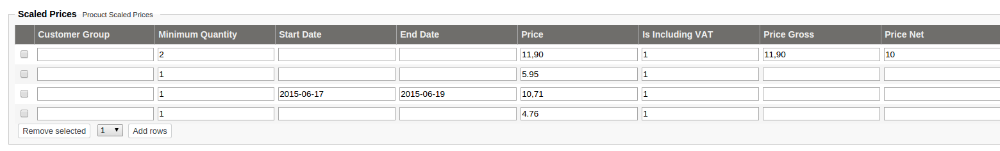

# LocalPriceProvider

The local price provider can calculate prices based on product data imported to eZ Commerce.
It uses the information provided by the catalog element.

The Local price provider supports the following price models:

| Use case                                     | Price from         |
| -------------------------------------------- | ------------------- |
| List price                                   | The price from the catalog element is used.  |
| Customer group based prices                  | The local price provider can use group-based prices. A customer can be part of one or more groups. This rule can be used in combination with scaled prices including date time ranges. |
| Volume discount prices                       | Prices can be defined with a minimum quantity.            |
| Prices defined for given date and time range | Prices can be defined for a given time range. It is possible to add a start or end date including a time.   |

## Price logic

Scaled prices must be stored in the catalog element in a correct format, see [ScaledPriceServiceInterface](../../ez5scaledpriceservice.md#scaledpriceserviceinterface). This is the task of `CatalogFactory`.

You can set up the scaled prices in the Back Office:

!!! note "Rules for finding the matched scaled price"

    Order for checking if a scaled price applies:

    1. Check if the provided quantity matches the scaled price line.
    2. Check if the provided start date matches. For multiple lines the highest date matches. For example, for quantity 1 the start date "2015-06-17" is at the end of the list, before default empty value. 
    3. If the quantity and start date are the same, the lowest price is taken. The price includes VAT (gross price) and may come from Price or Price Gross. If Price is used and does not include VAT, VAT has to be added first for comparison reasons. 

    If no scaled price is found, the standard price from the product is used.

    If several scaled prices match, the best scaled price is used.

## Data considered for price calculation

If [scaled prices](../../ez5scaledpriceservice.md#scaledpriceserviceinterface) are set, they are used to calculate the customer price.

The base price is used to calculate the list price and customer price.

The local price provider performs the best price search. The customer price is always the best price (scaled or base price).

## VAT and currency

`LocalPriceProvider` uses the [VatServiceInterface](../../localvatservice.md#vatserviceinterface) to get the `vatPercent` by the given `vatCode`.
Customer currency is used (set in the price request).

Prices (and currency) are usually set up per country and provided during the import from the ERP or PIM system.
