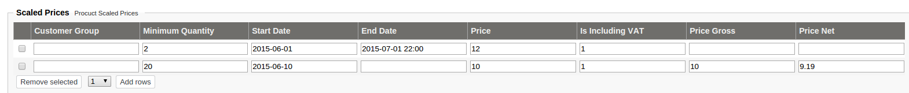

# Ez5ScaledPriceService

`Ez5ScaledPriceService` determines the correct price by comparing base price from the price request to the `scaledPrices` array
stored in extended data (also in `PriceRequest`). The service determines the best price if there are multiple scaled prices that match.

This data may come from the backend. The CatalogFactory stores data in the correct format in the catalog element.

Scaled prices can be set up per product in the Back Office:



|Field|Identifier|Required|Description|Example|
|--- |--- |--- |--- |--- |
|Customer Group|`customerGroup`|no|Code for the customer group|`GROUPA`|
|Minimum Quantity|`minQuantity`|yes|Minimum quantity for the given price. If more than one scaled price entry matches, the latest matching entry is used|`2`|
|Start Date|`startDate`|yes (can be empty)|Start date can be set in two formats (date with and without time). If no time is given, "00:00:00" (hour-minutes-seconds) is used. 2015-06-01 becomes 2015-06-01 00:00:00|`2015-06-01 00:00`|
|End Date|`endDate`|no|End date can be set in two formats (date with and without time). If no time is given, "23:59:59" (hour-minutes-seconds) is used. 2015-06-01 becomes 2015-06-01 23:59:59|`2015-06-01 22:00:00`|
|Price|`price`|yes|Price used to calculate price gross and price net value. Price can be with or without VAT|`12.65`|
|Is Including VAT|`isInclVat`|yes|Determines if the price includes VAT or not.|`0` or `1`|
|Price Gross|`priceGross`|no|If not set, it's calculated based on two previous values: Price and Is Including VAT. If set, gross price value overrides the calculation.||
|Price Net|`priceNet`|no|If not set, it's calculated based on two previous values: Price and Is Including VAT. If set, net price value overrides the calculation.||

`ProductNode` contains additional attribute for scaled prices. `Ez5CatalogFactory` extracts this value and puts it into an ArrayField.

``` php
$scaledPrices = array();
foreach($prices as $price) {
    $scaledPrices[] = array(
        'price' => $price['Price'],
        'isInclVat' => true,
        'minQuantity' => $price['MinQty'],
        'startDate' => '',
        'endDate' => ''
    );
}

return new ArrayField(
    array(
        'array' => $scaledPrices
    )
);
```

#### Scaled price matching

The scaled price matches in the following cases:

- Customer group is not defined or customer group matches the customer group from buyer party
- Price line quantity is greater than the scaled price minimum quantity
- `startDate` is not defined or the current date is more than `startDate` (if defined)
- `endDate` is not defined or the current date is less than `endDate` (if defined)

#### Storing `customerGroups`

`customerGroups` are stored in customer profile data inside Buyer Party:

``` xml
<Party ses_unbounded="PartyIdentification PartyName" ses_type="ses:Contact" ses_tree="SesExtension">
    <SesExtension>
        <CustomerGroups>
            <Code>GROUPA</Code>
            <Code>GROUPB</Code>
        </CustomerGroups>
    </SesExtension>
</Party> 
```

``` php
array( 'CustomerGroups' => array (
    0 => array('Code' => 'GROUPA'),
    1 => array('Code' => 'GROUPB'),
));
```

## ScaledPriceServiceInterface

`ScaledPriceServiceInterface` calculates the correct price if there is a scaled price available.
This is determined by the following attributes:

- `customerGroup` (optional)
- `minQuantity`
- `startDate` (optional)
- `endDate` (optional)
- `price`
- `isInclVat`
- `priceGross` (optional)
- `priceNet` (optional)

|Method|Description|
|--- |--- |
|`public function calculateScaledPrice($lineID, PriceRequest $priceRequest);`|This method always returns matching scaled price `PriceLineAmounts` or default from `priceRequest`|
