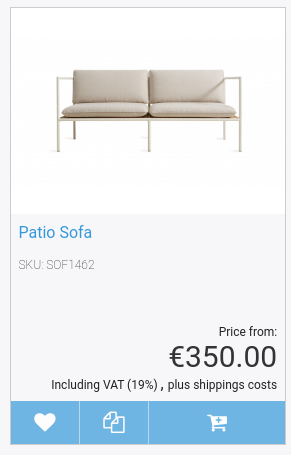

# Price engine templates

## Catalog/Subrequests/product.html.twig

This template is used on product detail page.
It defines the parameters for price rendering and includes the `product_price.html.twig` template.

## Catalog/listProductNode.html.twig

This template is used on product detail page.
It defines the parameters for price rendering and includes the `product_price.html.twig` template.



## Catalog/Subrequests/product_price.html.twig

This is a common template for rendering the price, displaying a label about the price type (e.g. list price) and the price source (e.g. ERP).

It includes `PriceField.html.twig` to render the price.

### Accepted parameters

``` html+twig
{# parameters that are passed to the
PriceField.html.twig  template to render the price #} 

'renderParams': renderParams
{# parameters, that will be used to design the label,
e.g. 'List price', 'Your price' #} 
{# you can decide if you want to display the
label and specify the css class #}
'labelParams': labelParams 

{# if set, the source will be displayed #}
'displaySource' : true
```

### Setting the parameters

``` html+twig

```

## Fieldtypes/PriceField.html.twig

This template renders the given price from catalog element, see [ses_render_price](rendering_for_prices.md).

### Accepted parameters

`'params' : renderParams`

### Setting the parameters

``` html+twig

```

## Related custom Twig functions

|Twig filter|Description|Usage|
|--- |--- |--- |
|`shipping`|Gets the list of shipping costs from the basket|``|
|`basket_discounts`|Gets the list of discounts from the basket|{`% set discounts = basket|basket_discounts %}`|
|`basket_add_costs`|Gets the list of additional costs from the basket|``|
|`basket_add_lines`|Gets the list of additional lines from the basket|``|

|Twig function|Description|Usage|
|--- |--- |--- |
|`price_format`|Formats a price value|`{{ priceValue|price_format(currency, locale) }}`|
|`ses_render_price`|Renders a PriceField from CatalogElement|`{{ ses_render_price(catalogElement, minPrice, { 'outputPrice': {'cssClass': 'price price_med'} }) }}`|
