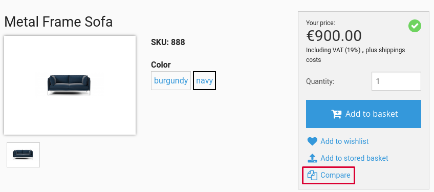
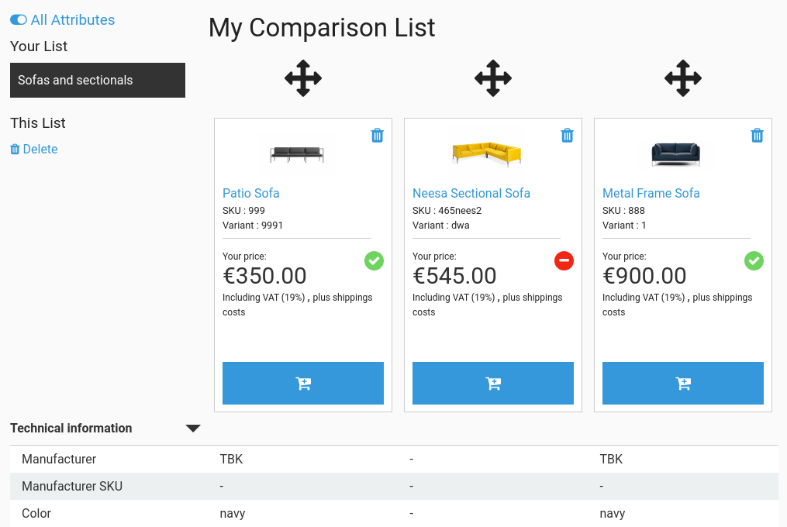
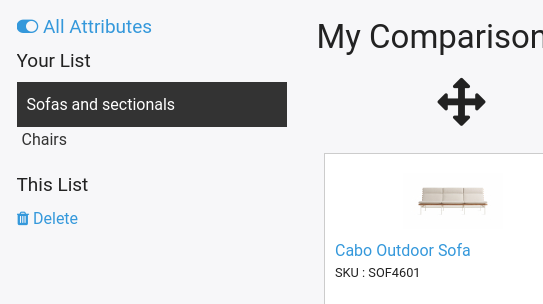

# Product comparison [[% include 'snippets/commerce_badge.md' %]]

[[= product_name_com =]] offers the option to compare products on a single page.
Customers can save products on their own comparison lists.
Comparison lists are divided per kind of product (separately for, e.g. sofas, tables, etc.). 

The comparison function is based on the [basket](../basket/basket.md) system.

!!! note

    There can be many comparison lists for all users including unregistered (anonymous) browser sessions.
    It is recommended that you use a service to frequently clean old anonymous comparison lists for sites with heavy traffic.

### Adding a product to a comparison list

Only orderable products can be added to comparison.
If a product is a variant, the compare button is only shown when all characteristics for this variant are selected.



Neither prices nor product quantity details are stored in the comparison list.

### Comparison list

The comparison list can be found in the header of the website.



The list is divided into categories per kind of product.



#### Displaying attributes

Attributes (or product specifications) are grouped for display and can be opened and closed by clicking the arrows in their header rows (accordion UI).

##### Collapsing groups and attributes

If all products in a comparison list have the same attribute value, you can configure the comparison's behavior.

###### Show/Hide attributes for the same value

There is an icon in the top left corner to show/hide the attributes.
If `collapse_attributes` is set to true, hiding/showing attributes with the same value is enabled.

``` yaml
siso_comparison.default.collapse_attributes: true
```

###### Collapsing all group for product attributes

The `collapse_groups` parameter defines if groups with all identical values should be collapsed or not (by default). 

This applies to a situation where all rows inside a group are identical.

``` yaml
siso_comparison.default.collapse_groups: true
```

### Sorting

Customers can move or rearrange products in the comparison list using drag and drop.

After dragging and dropping, the position in the list is stored in the current [comparison-basket](product_comparison_api.md).
In the next call the customer sees the list sorted by their preference.

When the customer drags and drops products in a comparison, an AJAX call is triggered with new sort order for the list.

Sorting is done by basket line's `groupOrder` attribute. It is a part of the `BasketLine` object.

## Unavailable products

If a product is not available in the shop's catalog any longer, it is removed from the comparison list, and a notification message appears.
The removal only occurs with an HTTP request to the respective comparison list.
There is no background process which removes all non-existent products from all lists.

## Prices and stock information

You can configure which system provides the prices and stock information for comparisons.

By default the ERP is requested. If it is not available, the local price provider responds. 

``` yaml
siso_price.default.price_service_chain.comparison:
    - siso_price.price_provider.remote
    - siso_price.price_provider.local
```
