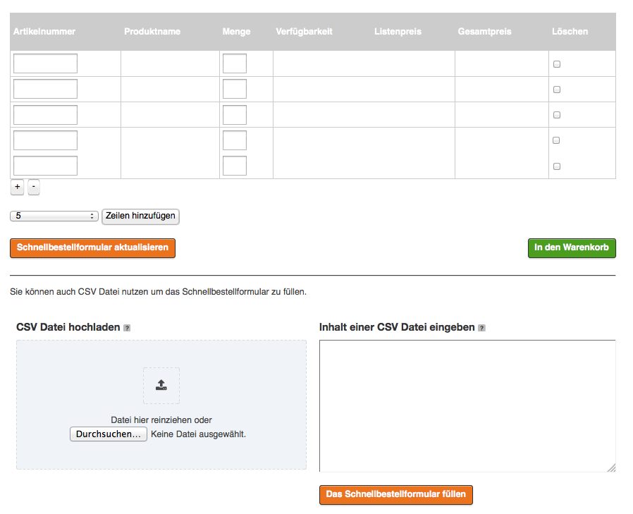
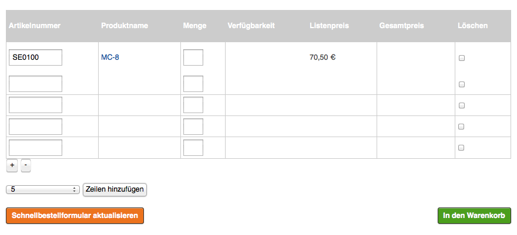
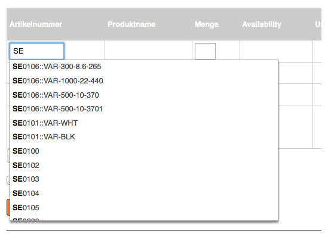

# Quick order [[% include 'snippets/commerce_badge.md' %]]

Quick order is an order form that speeds up the checkout and order process.
The customer can enter a list of SKUs and add them all together to the basket.

Quick order supports autosuggestions and an upload of product data in CSV format.



If a customer stores items in the quick order, they can see the real prices and availability.



If the ERP system is offline, customers see list prices and an error message. There is also no information about product availability.

## Storage time

A quick order is stored for the duration of the session for anonymous users,
and indefinitely for logged-in users.

## Autosuggestions

When entering SKUs, Solr looks up a list of matching results.



Quick order supports variants in autosuggestion.
Customers can type the product name or SKU and/or a variant code (or parts of it) into the SKU field.

## CSV upload

The customer can also add items to the quick order by providing a list of CSV data. 
They can either upload a CSV file, or manually enter CSV data.

By default, the CSV record has 1-3 columns, containing mandatory SKU as well as optional variant code and quantity.

For example, to provide SKU only:

```
SE0100
```

To provide SKU and variant code:

```
SE0101,VAR-BLK,1
```

To provide SKU, variant code and quantity:

```
SE0101,VAR-BLK,3
```

You can set a different order of data and add [additional text](../basket/basket_configuration.md#additional-data-in-the-basket-line)
in [configuration](quick_order_configuration.md#csv-data-order).

The following MIME types are supported:

```
'text/csv',
'text/plain',
'application/csv',
'text/comma-separated-values',
'application/excel',
'application/vnd.ms-excel',
'application/vnd.msexcel',
'text/anytext',
'application/octet-stream',
'application/txt',
```
