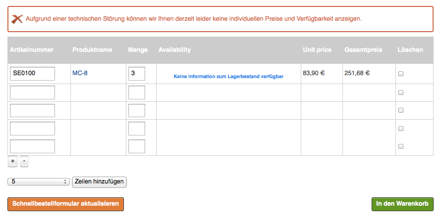
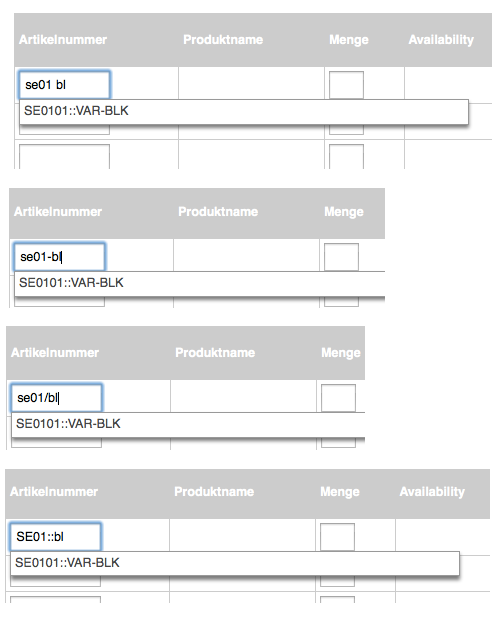
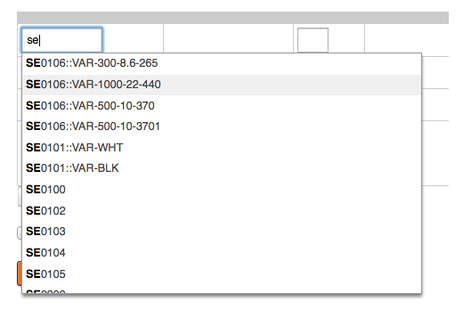
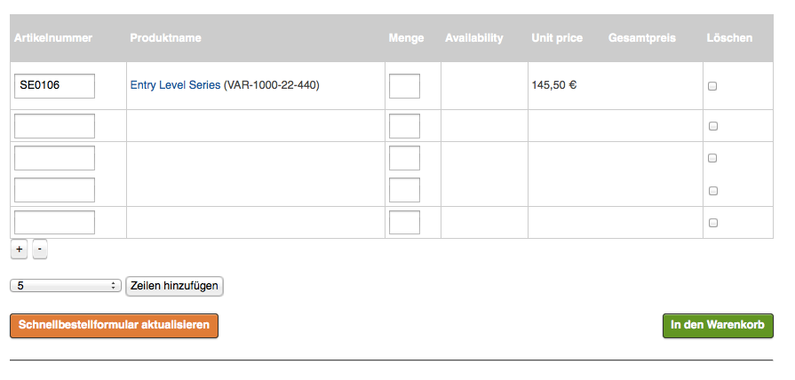
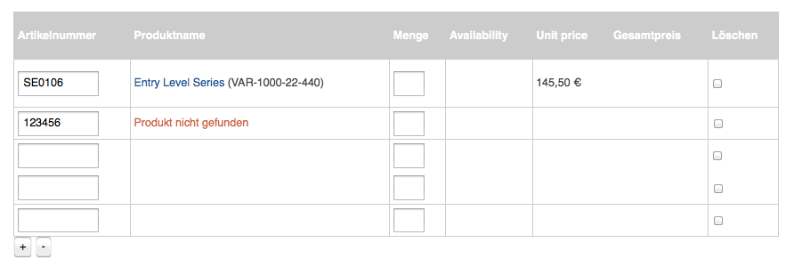
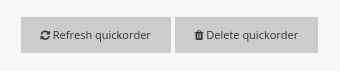
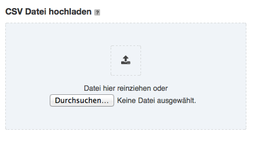
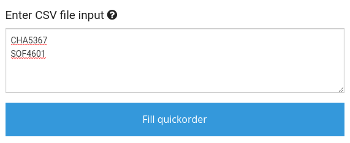
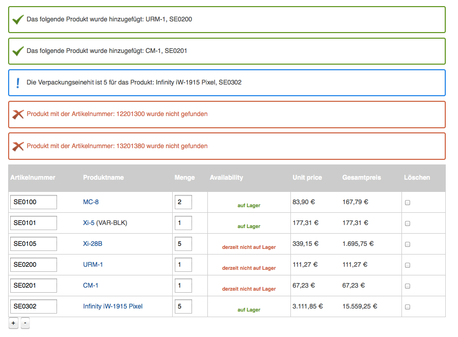

# Quick order

Quick order is an order form that speeds up the checkout and order process.
The customer can enter a list of SKUs and add them all together to the basket.

Quick order supports autosuggestions and an upload of product data in CVS format.


Like in the [basket](../basket/basket.md), you can add additional data to the quick order.

By default you can enable additional text in the quick order:

``` yaml
ses_basket.default.additional_text_for_basket_line: false
```

## Adding to basket

Customers can type SKUs and quantities to either directly add products to the basket by clicking on the **Add to basket** button,
or store items in the quick order by clicking **Refresh quickorder**.

## Updating quick order

If a customer stores items in the quick order, they can see the real prices and availability.


If the ERP system is offline, customers see list prices and an error message. There is also no information about product availability.



Customers can remove the items from the quick order by checking the delete checkbox or entering 0 into the quantity field and then clicking **Refresh quickorder**.

### Storage time

A quick order for an anonymous user is stored for as long as the session exists and the user did not click **Add to basket**, or removed items from quick order.

A quick order for a logged-in customer is stored for as long as the user did not click **Add to basket** button, or remove items from quick order.

## Add more lines

If a customer needs more lines in their quick order, they can add new ones by:

- clicking the plus icon, which adds one line
- choosing a number of lines from the drop down menu and clicking **Add lines**, which adds the selected number of lines.


## Autosuggestions

When entering SKUs, Solr looks up a list of matching results.


If you want to disable autosuggestions in quick order, use the `auto_suggest_limit` setting:

``` yaml
siso_search.default.search.auto_suggest_limit: 0
```

### Variant handling

Quick order supports variants in autosuggestion.
Customers can type the product name or SKU and/or a variant code (or parts of it) into the SKU field.

Solr returns the list of correct SKUs and variant codes.

#### Configuration

Customers can use different delimiters between SKU and the variant code when typing into the SKU field.
The delimiters are configurable:

``` yaml
parameters:
    siso_quickorder.default.autosuggest_delimiters: [' ', '/', '-', '::']
```



Autosuggestion results contain the SKU and the variant code separated by a configurable delimiter.

``` yaml
parameters:
    siso_quickorder.default.sku_variant_code_delimiter: '::'
```



!!! caution

    The configured delimiter cannot be a part of the existing SKUs or variant codes.

    This delimiter is used to separate the variant code from the SKU when adding items into the quick order or to the basket.

## Line preview

If a customer leaves the SKU field (for example by choosing one of the autosuggestion result) and sets the cursor on another field (e.g. quantity field or next line), a background search starts. It displays the product name (and variant code) and the unit price.
This visible feedback is a confirmation for users that the entered SKU is correct.



If the SKU is not correct, the customer sees an error message.



In order to see the real prices and the availability, users must click **Refresh quickorder**.



## CSV upload

The customer can also add items to the quick order with a CSV file. 
They can either:

- upload one CSV file
- enter CSV content into a text area

The CSV format can take 1-3 columns:

- **SKU** - required column that has to be provided first (if only 1 column is provided, there should be no delimiter at the end of the line)
- **variant code** - optional second column. It can be omitted for shops that do not use variants
- **quantity** - optional last column which specifies quantity for the given SKU. It is always the last column (2nd or 3rd)

!!! note

    Optionally, if custom text is enabled, the customer also has the possibility to upload a custom text in CSV upload.
    In this case, the custom text should be the last column (3rd or 4th).

    ``` yaml
    #enable/disable additional text line in basket per basket line
    ses_basket.default.additional_text_for_basket_line: false
    ```

??? note "Example CSV input"

    SKU only:

    ```
    SE0100
    12201300
    SE0101
    SE0105
    SE0302
    13201380
    ```

    SKU and quantity:

    ```	
    SE0100,2
    12201300,3
    SE0101,1
    SE0105,5
    SE0302,1
    13201380,4
    ```

    SKU, variant code and quantity:

    ```
    SE0100,,2
    12201300,,3
    SE0101,VAR-BLK,1
    SE0105,,5
    SE0302,,1
    13201380,,4
    ```

The values in CSV files can by separated by a configurable delimiter:

``` yaml
parameters:
    siso_quickorder.default.csv_delimiters: [';', ',']
```

### Uploading CSV file

Users can upload only one CSV file at once. They can drag and drop the file to the upload area or browse to the file.



### Entering CSV file content into a textarea

The customer can also enter the content of the .csv file directly into a text area and click **Fill quickorder**.



### Result of CSV import

Regardless of the method used, the quick order is filled with the given data:


