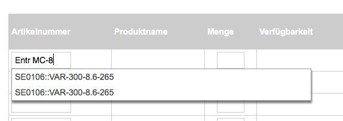

# Quick order FAQ

## Can I search for the name of a product or variant?

Yes, you can. For example, the name of the product is "Entry Level Series" and some variants are named "MC-8":



## Which MIME types are supported for the csv upload?

Following MIME types are supported:

```
'text/csv',
'text/plain',
'application/csv',
'text/comma-separated-values',
'application/excel',
'application/vnd.ms-excel',
'application/vnd.msexcel',
'text/anytext',
'application/octet-stream',
'application/txt',
```
