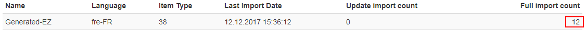

# Recommendation

The Recommendation Bundle extends the functionality of eZ Platform with a recommendation engine, powered by [YOOCHOOSE](https://yoochoose.com/).
It allows you to track the way visitors use your website and suggests recommended content to them based on their behavior.

!!! tip "More information"

    - [eZ Services documentation](https://doc.ezplatform.com/projects/ezservices)

!!! note "Recommendation Bundle v1"

    This page covers Recommendation Bundle v2, which is the latest version, used with all current releases of eZ Platform.
    If you are still using Recommendation Bundle v1, contact support@yoochoose.com if you need information.

## Installation

1. Run composer require
2. Enable the bundle
3. Import additional routing
4. Register a YOOCHOOSE account
5. Allow public HTTP(S) access

### 1. Run composer require

Run the following from your eZ Platform installation root:

``` bash
composer require --no-update ezsystems/recommendation-bundle:^2.0
composer update --prefer-dist
```

### 2. Enable the bundle

Enable the bundle in `app/AppKernel.php`:

``` php
$bundles = array(
    // existing bundles
    new EzSystems\RecommendationBundle\EzSystemsRecommendationBundle()
);
```

### 3. Import additional routing

Import additional routing by adding the following lines to your `routing.yml` file:

``` yaml
recommendationBundleRestRoutes:
    resource: "@EzSystemsRecommendationBundle/Resources/config/routing_rest.yml"
    prefix:   %ezpublish_rest.path_prefix%
```

!!! note "Legacy support"

    Keep in mind that legacy support is disabled by default. To enable legacy search engine (requires `ezpublish-kernel` bundle) uncomment these lines in the bundle's `services.yml`:

    ``` yaml
    # ez_recommendation.legacy.search_engine:
    #     class: ezpSearchEngine
    #     factory_class: EzSystems\RecommendationBundle\eZ\Publish\LegacySearch\LegacySearchFactory
    #     factory_method: build
    #     arguments: [@ezpublish_legacy.kernel]

    # ez_recommendation.legacy.recommendation_search_engine:
    #     class: EzSystems\RecommendationBundle\eZ\Publish\LegacySearch\RecommendationLegacySearchEngine
    #     arguments:
    #         - @ez_recommendation.client.yoochoose_notifier
    #         - @ez_recommendation.legacy.search_engine

    # ez_recommendation.legacy.search_configuration_mapper:
    #     class: EzSystems\RecommendationBundle\eZ\Publish\LegacySearch\ConfigurationMapper
    #     arguments:
    #         - @ez_recommendation.legacy.recommendation_search_engine
    #         - @ezpublish.siteaccess
    #     tags:
    #         - { name: kernel.event_subscriber }
    ```

### 4. Register a YOOCHOOSE account

Register an account (a so-called customer ID) via your eZ Sales manager or by sending an email to support@yoochoose.com.

### 5. Allow public HTTP(S) access

Allow public HTTP(S) access to your eZ Platform installation's API for the recommendation bundle (`/api/ezp/v2/ez_recommendation/**`)

!!! note "IP whitelisting if public access is not possible"

    The recommendation engine servers need to access the API of an eZ Platform installation in order to sync content.
    If it's not possible to allow public access, the following IP Addresses can be used for whitelisting on e.g. a firewall.

    `54.229.102.177, 54.171.192.161, 54.77.201.13, 52.215.22.234, 52.18.150.96, 52.17.60.35, 52.17.36.104`

## Configuration

1. Define what should be tracked
1. Define which content should be imported
1. Style and enable the rendering of recommendations
1. Check if the bundle provides REST data

### 1. Define what should be tracked

Events from the site need to be sent to YOOCHOOSE so that recommendations can be adapted to visitors.
Tracking can be set up in multiple ways, depending on existing constraints.

`EzSystemsRecommendationBundle` delivers a Twig extension which helps integrate the tracking functionality into your site.

#### Enable tracking

Place the following snippet of code in the HEAD section of your header template:

``` html

    {{ yc_track_user(content.id) }}

```

Then configure settings under the `recommender.included_content_types` parameter
(see the `default_settings.yml` file delivered with the bundle).

Here you can define for which Content Types tracking script will be shown.

In the YOOCHOOSE documentation you can find more information about [tracking in general](https://doc.ezplatform.com/projects/ezservices/en/latest/personalization/developer_guide/tracking_api/)
and about the [generic asynchronous JavaScript tracker](https://doc.ezplatform.com/projects/ezservices/en/latest/personalization/developer_guide/tracking_with_yct/).

Additionally, in case of missing content owner ID, there's an option in `default_settings.yml` to set up the default content author:

``` yaml
ez_recommendation.default.author_id: 14   # ID: 14 is default ID of admin user
```

### 2. Define which content should be imported

You also need to define the list of Content Types and their identifiers that should be tracked and recommended.
You can only recommend what you are tracking.

By defining the Content Types in the local `app/config/config.yml` this content will be initially exported by a script
and then kept in sync with the recommendation engine upon every change in the eZ Platform back office.

The bundle's configuration is SiteAccess-aware. This is an example of settings (in `config.yml`):

``` yaml
ez_recommendation:
    system:
        default:
            yoochoose:
                customer_id: "12345"
                license_key: "1234-5678-9012-3456-7890"
            server_uri: "http://example.com"
            recommender:
                included_content_types: ["blog", "article"]
```

The following parameters need to be included in the settings file:

| Parameter                            | Description                                               |
|--------------------------------------|-----------------------------------------------------------|
| `yoochoose.customer_id`              | Your YOOCHOOSE customer ID.                               |
| `yoochoose.license_key`              | Your YOOCHOOSE license key.                               |
| `server_uri`                         | The URI your site's REST API can be accessed from.        |
| `recommender.included_content_types` | Content Types on which the tracking script will be shown. |

If content's author or image are stored in a different Field, you can specify it in `parameters.yml`:

``` yaml
ez_recommendation.field_identifiers:
    # Field fetched by controller
     author:
         # Content Type: Field with value
         article: authors
     image:
         article: thumbnail
         blog_post: main_image
```

#### Advanced configuration

You can select advanced options for YOOCHOOSE back end using the following settings:

``` yaml
ez_recommendation:
    api_endpoint: 'https://admin.yoochoose.net'
    recommender:
        api_endpoint: '//reco.yoochoose.net'
        consume_timeout: 20
    tracking:
        api_endpoint: 'http://event.yoochoose.net'
        script_url: 'cdn.yoochoose.net/yct.js'
```

Changing any of these parameters without a valid reason will break all calls to YOOCHOOSE.
It can be useful to test the API by mocking the service, or if you have a hosted version of YOOCHOOSE Recommendation service.

### 3. Style and enable the rendering of recommendations

In order to allow displaying recommendations on your site you must add portions of scripts which will integrate the recommender engine with your site.

Implementation can be performed in just a few steps (assuming that `EzSystemsRecommendationBundle` is properly configured and enabled in `AppKernel.php`):

#### Enable displaying recommendations

Add the following JavaScript assets to your header template:

``` html
{% javascripts
    '%kernel.root_dir%/../vendor/components/handlebars.js/handlebars.min.js'
    '@EzSystemsRecommendationBundle/Resources/public/js/recommendationtemplaterenderer.js'
    '@EzSystemsRecommendationBundle/Resources/public/js/recommendationtemplatehelper.js'
    '@EzSystemsRecommendationBundle/Resources/public/js/recommendationrestclient.js'
%}
```

Place a dedicated Twig helper in the place where you want to display recommendations:

``` html
{{ yc_show_recommendations(
    contentId = content.id,
    scenario = '',
    limit = '',
    contentType = '',
    template = '',
    fields = []
) }}
```

##### Parameters

| Parameter   | Type   | Description   |
|-------------|--------|---------------|
| `contentId`   | int    | In content-based views the Twig variable holding the content ID (the content you want to get recommendations for). |
| `scenario`    | string | Scenario used to display recommendations. You can create custom scenarios in the YOOCHOOSE dashboard. |
| `limit`       | int    | Number of recommendations to show. |
| `contentType` | string | Content Types you are expecting in response. |
| `template`    | string | Handlebars template name (your templates are stored in the `ezsystems/recommendation-bundle/Resources/public/views` directory. Take a look at `default.html.twig` which includes a default template that can be used to prepare customized versions). |
| `fields`      | array  | Fields which are required and will be requested from the recommender engine. These Field names are also used inside Handlebars templates. |

Sample integration can take the following form:

``` html
{{ yc_show_recommendations(
    contentId = content.id,
    scenario = 'popular',
    limit = 5,
    contentType = 'article',
    template = 'default',
    fields = ['ez_publishedDate', 'ez_url', 'title', 'image', 'author', 'intro']
) }}
```

You can also bypass named arguments using standard value passing as arguments.

#### Item ID

The item ID is usually set to the viewed ContentID. Depending on requirements, it can be set to a different value, in collaboration with YOOCHOOSE.

#### Displaying image variations

Displaying image variations is not currently supported out of the box.

You can work around this limitation by creating your own template (based on [recommendations.html.twig](https://github.com/ezsystems/ezstudio-demo/blob/master/app/Resources/EzSystemsRecommendationBundle/views/recommendations.html.twig))
or your own Twig extension (based on [RecommendationTwigExtension.php](https://github.com/ezsystems/EzSystemsRecommendationBundle/blob/master/Twig/RecommendationTwigExtension.php#L237)).

If you want to access a specific image variation through API, you need to add the `image` parameter to the request URL with the name of the variation as its value.
For example, to retrieve the `rss` variation of the image, use:

`/api/ezp/v2/ez_recommendation/v1/contenttypes/16?lang=eng-GB&fields=title,description,image,intro,name&page=1&page_size=20&image=rss`

The additional `sa` parameter takes the SiteAccess name and defines the SiteAccess whose content will be displayed.

### 4. Check if the bundle provides REST data

You can verify the import controller of the bundle by calling the local API. You should use the 'Accept' header and may need to add an 'Authorization' header if some authentication is required.

To check if the `content` interface is working as expected, try this URI:

`GET http://{endpoint}/api/ezp/v2/ez_recommendation/v1/content/{contentId}`

`Accept    application/vnd.ez.api.Content+json`

`Authorization    Basic xxxxxxxx`

Additionally you should check if the `contenttypes` interface is working as well by calling the following URI:

`GET http://{endpoint}/api/ezp/v2/ez_recommendation/v1/contenttypes/38?page=1&page_size=10`

`Accept    application/vnd.ez.api.Content+json`

`Authorization    Basic xxxxxxxx`

Both interfaces are supposed to provide content data in .json format.
The difference is only the size of the content array in the `contentList` object.
For the `content` interface one Content item is returned, for the `contenttypes` interface many are returned.

``` json
{
    "contentList": {
        "_media-type": "application/vnd.ez.api.contentList+json",
        "content": [
            {
                "_media-type": "application/vnd.ez.api.content+json",
                "contentId": 72,
                "contentTypeId": 38,
                "identifier": "place",
                "language": "eng-GB",
                "publishedDate": "2015-09-17T13:23:10+00:00",
                "author": "Sandip Patel",
                "uri": "/Places-Tastes/Places/Kochin-India",
                "categoryPath": "/1/2/95/71/73/",
                "mainLocation": {
                    "_media-type": "application/vnd.ez.api.mainLocation+json",
                    "_href": "/api/ezp/v2/content/locations/1/2/95/71/73/"
                },
                "locations": {
                    "_media-type": "application/vnd.ez.api.locations+json",
                    "_href": "/api/ezp/v2/content/objects/72/locations"
                },
                "name": "Kochin, India",
                "intro": "<![CDATA[<section xmlns=\"http://ez.no/namespaces/ezpublish5/xhtml5\"><p>We got the major port city on the south west coast of India.</p></section>\n]]>",
                "description": "<![CDATA[<section xmlns=\"http://ez.no/namespaces/ezpublish5/xhtml5\"><p><strong>Kochi </strong>(formerly Cochin) ... </p></section>\n]]>",
                "image": "/var/site/storage/images/places-tastes/places/kochin-india/282-5-eng-GB/Kochin-India.jpg",
                "caption": "<![CDATA[<section xmlns=\"http://ez.no/namespaces/ezpublish5/xhtml5\"><p>Chinese fishing nets ... </p></section>\n]]>",
                "location": "kochin, india",
                "authors_position": "Senior Editor",
                "tags": "India, Kochin",
                "rating": "0",
                "publication_date": "1442500260",
                "metas": ""
            }
        ],
        ....
    }
}
```

## Running a full content export

After defining what Content Types should be recommended and tracked you can start the full export with the following command:

``` bash
php app/console ezreco:runexport --contentTypeIdList=16 --webHook=https://admin.yoochoose.net/api/<your_customer_id>/items --hidden=1 --mandatorId=<your_customer_id> --host=<your_ezplatform_host_with_scheme>
```

By running this command, the bundle exporter collects all content related to the SiteAccesses of this customer ID and places it in files.
After finishing, the systems sends a POST request to the `webHook` endpoint and informs the recommender how to fetch the data.
The recommender triggers an internal workflow so that the generated files are downloaded and imported in the recommender's content store.
Be patient, as this can take up to five minutes.

!!! caution "Changing Content Types for recommendations"

    If the Content Types to be recommended are changed, a full export needs to be started again by running the `php app/console ezreco:runexport` command.

### Checking if the full context export was stored in the recommender engine

There are three ways to check if content was transferred and stored successfully in the recommender engine.

#### REST request to the recommender's content store

To get the content of an imported item you can request the following REST resource

`GET https://admin.yoochoose.net/api/<your_customer_id>/item/<your_content_type>/<your_content_id>`

Example response:

``` xml
<?xml version="1.0" encoding="UTF-8" standalone="yes"?>
<items version="1">
    <item id="73" type="38">
        <imageurls>
            <imageurl type="preview">/var/site/storage/images/places-tastes/places/santo-domingo-dominican-republic/288-4-eng-GB/Santo-Domingo-Dominican-Republic.jpg</imageurl>
        </imageurls>
        <deeplinkurl>/Places-Tastes/Places/Santo-Domingo-Dominican-Republic</deeplinkurl>
        <validfrom>2015-09-17T13:24:25.000</validfrom>
        <categoryids/>
        <categorypaths>
            <categorypath>1/2/95/71/74</categorypath>
        </categorypaths>
        <content/>
        <attributes>
            <attribute value="/var/site/storage/images/places-tastes/places/santo-domingo-dominican-republic/288-4-eng-GB/Santo-Domingo-Dominican-Republic.jpg" key="image" type="TEXT"/>
            <attribute value="place" key="identifier" type="TEXT"/>
            <attribute value="fre-FR" key="language" type="TEXT"/>
            <attribute value="Senior Editor" key="authors_position" type="TEXT"/>
            <attribute value="Michael Wang" key="author" type="TEXT"/>
            <attribute value="/1/2/95/71/74/" key="categoryPath" type="TEXT"/>
            <attribute value="Michael Wang" key="author" type="NOMINAL"/>
            <attribute value="0" key="rating" type="TEXT"/>
            <attribute value="&lt;![CDATA[&lt;section xmlns=&quot;http://ez.no/namespaces/ezpublish5/xhtml5&quot;&gt;&lt;p&gt;Outstanding beaches of Dominican Republic, Samana is one of them.&lt;/p&gt;&lt;p&gt;&lt;em&gt;Photograph by Brian Henry - Anchorage north shore Samana, Dominican Republic&lt;/em&gt;&lt;/p&gt;&lt;/section&gt;&#xA;]]&gt;" key="caption" type="TEXT"/>
            <attribute value="/Places-Tastes/Places/Santo-Domingo-Dominican-Republic" key="uri" type="TEXT"/>
            <attribute value="38" key="contentTypeId" type="TEXT"/>
            <attribute value="Dominican Republic, Santo Domingo" key="tags" type="TEXT"/>
            <attribute value="&lt;![CDATA[&lt;section xmlns=&quot;http://ez.no/namespaces/ezpublish5/xhtml5&quot;&gt;&lt;p&gt;Santo Domingo meaning &quot;Saint Dominic&quot;, officially Santo Domingo de Guzm&amp;aacute;n, is the capital and largest city in the ... &lt;/p&gt;&lt;/section&gt;&#xA;]]&gt;" key="description" type="TEXT"/>
            <attribute value="73" key="contentId" type="TEXT"/>
            <attribute value="&lt;![CDATA[&lt;section xmlns=&quot;http://ez.no/namespaces/ezpublish5/xhtml5&quot;&gt;&lt;p&gt;The oldest European inhabited settlement in the Americas.&lt;/p&gt;&lt;/section&gt;&#xA;]]&gt;" key="intro" type="TEXT"/>
            <attribute value="1442500260" key="publication_date" type="TEXT"/>
            <attribute value="Santo Domingo, Dominican Republic" key="name" type="TEXT"/>
            <attribute value="Santo Domingo, Dominican Republic" key="location" type="TEXT"/>
            <attribute value="2015-09-17T13:24:25+00:00" key="publishedDate" type="TEXT"/>
        </attributes>
    </item>
</items>
```

#### Recommender Backend

You can log in to [admin.yoochoose.net](https://admin.yoochoose.net/), switch to the Item Import tab and check if a FULL import was successful.



#### Personalized Search Requests

As the Search functionality is included by default you can also make a request to search for content matching certain criteria.
It's easiest to query for the content ID as value in the `q` request parameter (at least two chars, e.g. 73). 

`GET https://reco.yoochoose.net/api/v4/search/<your_customer_id>/get_suggestions.json?item=5&itemtype=<your_content_type>&q=<your_content_id>&attribute=name&attribute=author&attribute=uri&attribute=<your_custom_attribute>`

Example response:

``` json
{
    "ITEM": [
        {
            "yc_score": 2.209763288497925,
            "yc_id": "72",
            "yc_itemtype": "38",
            "name": "Kochin, India",
            "uri": "/Places-Tastes/Places/Kochin-India",
            "author": "Sandip Patel"
        },
        {
            "yc_score": 1.152622938156128,
            "yc_id": "73",
            "yc_itemtype": "38",
            "name": "Santo Domingo, Dominican Republic",
            "uri": "/Places-Tastes/Places/Santo-Domingo-Dominican-Republic",
            "author": "Michael Wang"
        }
    ],
    "details": [
        {
            "scope": "ITEM",
            "itemType": 38,
            "count": 2
        }
    ]
}
```

## Fetching recommendations

Fetching recommendations is implemented in the bundle and can be [enabled in templates](#3-style-and-enable-the-rendering-of-recommendations). 

Recommendation responses contain all content data which is requested as attribute in the recommendation call.
These 'attributes' of the response can be used in Handlebars templates to render and style recommendations.

`GET https://reco.yoochoose.net/api/v2/<your_customer_id>/someuser/popular.json?contextitems=71&numrecs=5&categorypath=/&outputtypeid=<your_content_type>&attribute=name,author,uri,image`

delivers the following response *if* the content Fields are exported successfully by the export script.

``` json
{
    "contextItems": [
        {
            "itemId": 71,
            "itemType": 38,
            "sources": [
                "REQUEST"
            ],
            "viewers": 0
        }
    ],
    "recommendationItems": [
        {
            "itemId": 71,
            "itemType": 38,
            "relevance": 3,
            "links": {
                "clickRecommended": "//event.test.yoochoose.net/api/723/clickrecommended/someuser/38/71?scenario=popular&modelid=4199&categorypath=&requestuuid=d75e7cf0-e4ca-11e7-a94d-0a64dbbea736",
                "rendered": "//event.test.yoochoose.net/api/723/rendered/someuser/38/71?scenario=popular&modelid=4199&categorypath=&requestuuid=d75e7cf0-e4ca-11e7-a94d-0a64dbbea736"
            },
            "attributes": [
                {
                    "key": "image",
                    "values": [
                        "/var/site/storage/images/places-tastes/places/valencia-spain/276-4-eng-GB/Valencia-Spain.jpg"
                    ]
                },
                {
                    "key": "author",
                    "values": [
                        "Tara Fitzgerald"
                    ]
                },
                {
                    "key": "name",
                    "values": [
                        "Valencia, Spain"
                    ]
                },
                {
                    "key": "uri",
                    "values": [
                        "/Places-Tastes/Places/Valencia-Spain"
                    ]
                }
            ]
        },
        {
            "itemId": 75,
            "itemType": 38,
            "relevance": 1,
            "links": {
                "clickRecommended": "//event.test.yoochoose.net/api/723/clickrecommended/someuser/38/75?scenario=popular&modelid=4199&categorypath=&requestuuid=d75e7cf0-e4ca-11e7-a94d-0a64dbbea736",
                "rendered": "//event.test.yoochoose.net/api/723/rendered/someuser/38/75?scenario=popular&modelid=4199&categorypath=&requestuuid=d75e7cf0-e4ca-11e7-a94d-0a64dbbea736"
            },
            "attributes": [
                {
                    "key": "image",
                    "values": [
                        "/var/site/storage/images/places-tastes/places/brooklyn-new-york/300-4-eng-GB/Brooklyn-New-York.jpg"
                    ]
                },
                {
                    "key": "author",
                    "values": [
                        "Elizabeth Liu"
                    ]
                },
                {
                    "key": "name",
                    "values": [
                        "Brooklyn, New York"
                    ]
                },
                {
                    "key": "uri",
                    "values": [
                        "/Places-Tastes/Places/Brooklyn-New-York"
                    ]
                }
            ]
        }
    ]
}
```

## Troubleshooting

### Logging

Most operations are logged via the `ez_recommendation` [Monolog channel](http://symfony.com/doc/current/cookbook/logging/channels_handlers.html). To log everything about Recommendation to `dev.recommendation.log`, add the following to your `config.yml`:

``` yaml
monolog:
    handlers:
        ez_recommendation:
            type:   stream
            path:   "%kernel.logs_dir%/%kernel.environment%.recommendation.log"
            channels: [ez_recommendation]
            level: info
```

You can replace `info` with `debug` for more verbosity.

### "eZ is not defined"

If you see this error in the console of your browser's debugger you need to rerun the asset installer:

``` bash
php app/console assets:install --symlink --env=prod
```
