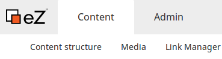
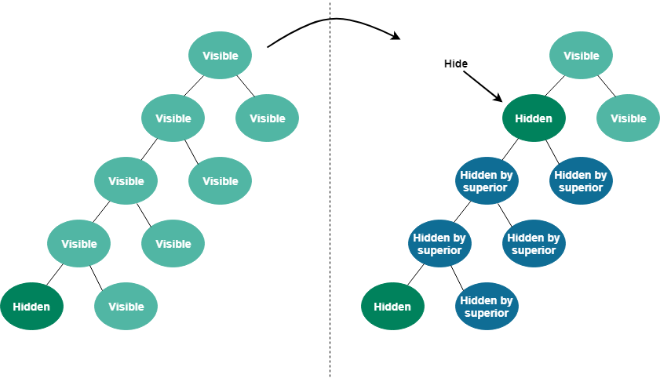
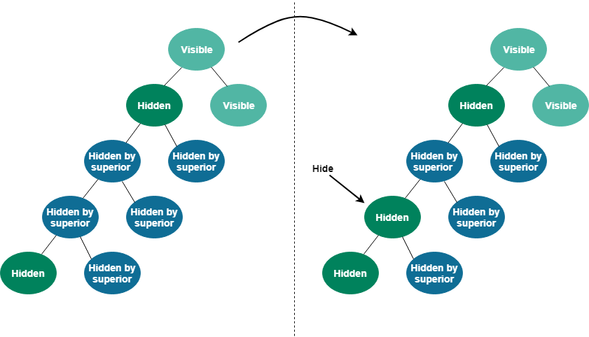
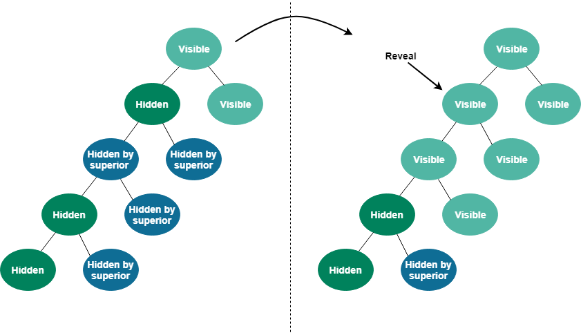
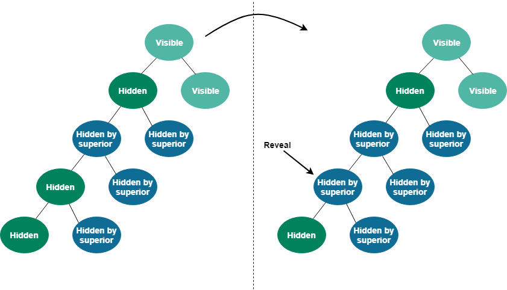
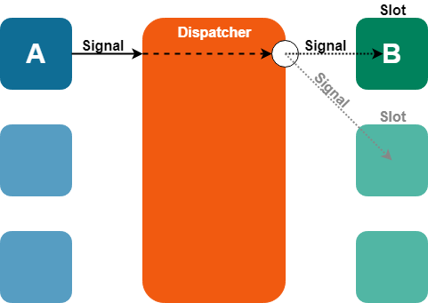

# Repository

## Introduction

### Locations

A Content item could not function in the system without having a place – a Location – assigned to it. When a new Content item is published, a new Location is automatically created and the item is placed in it.

Together, all Locations form a tree which is the basic way of organizing Content in the system and specific to eZ products. Every published Content item has a Location and, as a consequence, also a place in this tree.

A Content item receives a Location only once it has been published. This means that a freshly created draft does not have a Location yet.

A Content item can have more than one Location. This can be used to have the same content in two or more places in the tree, for example an article at the same time on the front page and in the archive. Even in such a case, one of these places is always the Main Location.

The tree is hierarchical, with an empty root Location (which is not assigned any Content item) and a structure of dependent Locations below it. Every Location (aside from the root) has one parent Location and can have any number of children. There are no Locations outside this tree.

#### Top level Locations

Top level Locations are direct children of the root of the tree. The root has ID Location 1, is not related to any Content items and should not be used directly.

Under this root there are preset top level Locations in each installation which cannot be deleted:



##### Content

"Content" is the top level Location for the actual contents of a site. This part of the tree is typically used for organizing folders, articles, information pages, etc. This means that it contains the actual content structure of the site, which can be viewed by selecting the "Content structure" tab in the Content mode interface. The default ID number of the "Content" Location is 2; it references a "Folder" Content item.

##### Media

"Media" is the top level Location which stores and organizes information that is frequently used by Content items located below the "Content" node. It usually contains images, animations, documents and other files. They can be viewed by selecting the "Media library" tab in the Content mode interface. The default ID number of the "Media" Location is 43; it references a "Folder" Content item.

##### Users


"Users" is the top level Location that contains the built-in system for managing user accounts. A user is simply a Content item of the "User account" Content Type. The users are organized within "User group" Content items below this Location. In other words, the "Users" Location contains the actual users and user groups, which can be viewed by selecting the "Users" tab in the Admin Panel. The default identification number of the "Users" Location is 5; it references a "User group" Content item.

##### Other top level Locations

Another top level location, with the ID 48, corresponds to "Setup" and is not regularly used to store content.

You should not add any more content directly below Location 1, but instead store any content under one of those top-level Locations.

#### Location visibility

Location visibility is a mechanism which allows you to control which parts of the content tree are available to the visitor.

Given that once a Content item is published, it cannot be un-published, limiting visibility is the only method used to withdraw content from the website without moving it to Trash. When the Location of a Content item is hidden, any access to it will be denied, preventing the system from displaying it.

Visibility needs not be set individually for every Location. Instead, when a Location is hidden, all of its descendants in the tree will be hidden as well. This means that a Location can have one of three different visibility statuses:

- Visible
- Hidden
- Hidden by superior

By default all Locations are Visible. If a Location is made invisible manually, its status is set to Hidden. At the same time all Locations under it will change status to Hidden by superior.

From the visitor's perspective a Location behaves the same whether its status is Hidden or Hidden by superior – it will be unavailable in the website. The difference is that a Location Hidden by superior cannot be revealed manually. It will only become visible once all of its ancestor Locations are made Visible again.

A Hidden by superior status does not override a Hidden status. This means that if a Location is Hidden manually and later one of its ancestors is Hidden as well, the first Location's status does not change – it remains Hidden (not Hidden by superior). If the ancestor Location is made visible again, the first Location still remains Hidden.

The way visibility works can be illustrated using the following scenarios:

###### Hiding a visible Location



When you hide a Location that was visible before, it will get the status Hidden. Underlying Locations will be marked Hidden by superior. The visibility status of underlying Locations that were already Hidden or Hidden by superior will not be changed.

###### Hiding a Location which is Hidden by superior



When you explicitly hide a Location which was Hidden by superior, it will get the status Hidden. Since the underlying Locations are already either Hidden or Hidden by superior, their visibility status will not be changed.

###### Revealing a Location with a visible ancestor



When you reveal a Location which has a visible ancestor, this Location and its children will become visible. However, underlying Locations that were explicitly hidden by a user will retain the Hidden status (and their children will be remain Hidden by superior).

###### Revealing a Location with a Hidden ancestor



When you reveal a Location that has a Hidden ancestor, it will **not** become Visible itself. Because it still has invisible ancestors, its status will change to Hidden by superior.

!!! tip "In short"

    A Location can only be Visible when all of its ancestors are Visible as well.

##### Visibility mechanics

The visibility mechanics are controlled by two flags: Hidden flag and Invisible flag. The Hidden flag informs whether the node has been hidden by a user or not. A raised Invisible flag means that the node is invisible either because it was hidden by a user or by the system. Together, the flags represent the three visibility statuses:

|Hidden flag|Invisible flag|Status|
|------|------|------|
|-|-|The Location is visible.|
|1|1|The Location is invisible and it was hidden by a user.|
|-|1|The Location is invisible and it was hidden by the system because its ancestor is hidden/invisible.|

!!! caution "Visibility and permissions"

    The Location visibility flag is not permission-based and thus acts as a simple potential filter. **It is not meant to restrict access to content**.

    If you need to restrict access to a given Content item, use **Sections** or **Object states**, which are permission-based.

### Content Relations

Content items are located in a tree structure through the Locations they are placed in. However, Content items themselves can also be related to one another.

A Relation can be created between any two Content items in the repository. This feature is typically used in situations when you need to connect and/or reuse information that is scattered around in the system. For example, it allows you to add images to news articles. Instead of using a fixed set of image attributes, the images are stored as separate Content items outside the article.

There are different types of Relations available in the system. First of all, content can be related on item or on Field level.

Relations at Field level are created using one of two special Field Types: Content relation (single) and Content relations (multiple). As the names suggest, such Fields allow you to select one or more other Content items in the Field value, which will be linked to these Fields. Content relation (single) is an example of a one-to-one relationship, and Content relations (multiple) – a one-to-many relationship.

Relations at item level can be of three different types:

1. Common relations are created between two Content items using the Public API.
1. RichText linked relations are created using a Field of the RichText type. Whenever an internal link (a link to another Location or Content item) is inserted into a Field represented by this Field Type, the system will automatically create a relation of this type. Note that such a relation is automatically removed from the system when the corresponding link is removed from the Content item.
1. RichText embedded relations also use a RichText Field. Whenever an Embed element is inserted into a Field represented by this Field Type, the system will automatically create a relation of this type, that is relate the embedded Content item to the one that is being edited. Note that a relation of this type is automatically removed from the system when the corresponding element is removed.

### Sections

Sections are used to divide Content items in the tree into groups that are more easily manageable by content editors. Division into Sections allows you, among others, to set permissions for only a part of the tree.

Technically, a Section is simply a triplet: a number, a name and an identifier. Content items are placed in Sections by being assigned the Section ID, with one item able to be in only one Section.

When a new Content item is created, its Section ID is set to the default Section (which is usually Standard). When the item is published it is assigned to the same Section as its parent. Because Content must always be in a Section, unassigning happens by choosing a different Section to move it into. If a Content item has multiple Location assignments then it is always the Section ID of the item referenced by the parent of the main Location that will be used. In addition, if the main Location of a Content item with multiple Location assignments is changed then the Section ID of that item will be updated.

When content is moved to a different Location, the item itself and all of its subtree will be assigned to the Section of the new Location. Please note that it works only for copy and move; assigning a new section to a parent's Content does not affect the subtree, meaning that Subtree cannot currently be updated this way.

Sections can only be removed if no Content items are assigned to them. Even then, it should be done carefully. When a Section is deleted, it is only its definition itself that will be removed. Other references to the Section will remain and thus the system will most likely be in an inconsistent state.That is why removing Sections may corrupt permission settings, template output and other things in the system.

Section ID numbers are not recycled. If a Section is removed, its ID number will not be reused when a new Section is created.


### Permissions

#### Overview

A User by default does not have access to anything. To get access they need to inherit Roles, typically assigned to the User Group they belong to.

Each Role can contain one or more **Policies**. A Policy is a rule that gives access to a single **function** in a **module**. For example, a `section/assign` Policy allows the user to assign content to Sections.

When you add a Policy to a Role, you can also restrict it using one or more **Limitations**. A Policy with a Limitation will only apply when the condition in the Limitation is fulfilled. For example, a `content/publish` Policy with a ContentType Limitation on the "Blog Post" Content Type will allow the user to publish only Blog Posts, and not other Content.

Note that Policies on one Role are connected with the *and* relation, not *or*, so when Policy has more than one Limitation, all of them have to apply. See [example below](#restrict-editing-to-part-of-the-tree).

Remember that a Limitation specifies what a user *can* do, not what they *can't do*. A Section Limitation, for example, *gives* the user access to the selected Section, not *prohibits* it.

See [Role Policies Map](#role-policies-map) for further information.

To take effect, a Role must be assigned to a User or User Group. Every User or User Group can have many roles. A User can also belong to many groups, for example, Administrators, Editors, Subscribers.

Best practice is to avoid assigning Roles to Users directly; instead, make sure you model your content (types, structure, sections, etc.) in a way that can be reflected in generic roles. Besides being much easier to manage and keep on top of security-wise, this also makes sure your system performs best. The more Role assignments and complex Policies you add for a given User, the more complex the search/load queries powering the whole CMS will be, as they always take permissions into account.

#### Use Cases

Here are a few examples of sets of Policies you can use to get some common permission configurations.

###### Enter back end interface

To allow the user to enter the back end interface (PlatformUI) and view all Content, you need to set the following Policies:

- `user/login`
- `content/read`

To let the user navigate through StudioUI, you also need to add:

- `content/versionread`

These Policies will be necessary for all other cases below that require access to the PlatformUI.

###### Create and publish content

To create and publish content, the user must have (besides `user/login` and `content/read`) the following Policies:

- `content/create`
- `content/edit`
- `content/publish`
- `content/versionread`

This also lets the user copy and move content, as well as add new Locations to a Content item (but not remove them!).

###### Create content without publishing

This option can be used together with eZ Enterprise's content review options. Using the following Policies, the user is able to create content, but can't publish it; instead, they must send it to review to another user with proper permissions (for example, senior editor, proofreader, etc.).

- `content/create`
- `content/edit`

Note that without eZ Enterprise this setup should not be used, as it will not allow the user to continue working with their content.

###### Restrict editing to part of the tree

If you want to let the user create or edit Content, but only in one part of the content tree, you need to use Limitations. Three Limitations that could be used here are Section Limitation, Node Limitation and Subtree Limitation.

Let's assume you have two Folders under your Home: Blog and Articles. You can let a user create Content for the blogs, but not in Articles by adding a Subtree Limitation on the Blog Content item. This will allow the user to publish content anywhere under this Location in the structure.

A Section Limitation can be used similarly, but a Section does not have to belong to the same subtree in the content structure, any Locations can be assigned to it.

If you add a Node Limitation and point to the same Location, the user will be able to publish content directly under the selected Location, but not anywhere deeper in its subtree.

Note that when a Policy has more than one Limitation, all of them have to apply, or the Policy will not work. For example, a Location Limitation on Location 1/2 and Subtree Limitation on 1/2/55 cannot work together, because no Location can satisfy both those requirements at the same time. If you want to combine more than one Limitation with the *or* relation, not *and*, you can split your Policy in two, each with one of these Limitations.

###### Manage Locations

To add a new Location to a Content item, the Policies required for publishing content are enough. To allow the user to remove a Location, you need to grant them the following Policies:

- `content/remove`
- `content/manage_locations`

Hiding and revealing Location requires one more Policy: `content/hide`.

###### Removing content

To send content to trash, the user needs to have the same two Policies that are required for removing Locations:

- `content/remove`
- `content/manage_locations`

To remove an archived version of content, the user must have the `content/versionremove` Policy.

Further manipulation of trash requires the `content/restore` Policy to restore items from trash, and `content/cleantrash` to completely delete all content from the trash.

###### Registering users

To allow anonymous users to register through the `/register` route, you need to grant the `user/register` Policy to the Anonymous User Group.

#### All available Policies

| Module        | Function             | Effect                                                                                                                                  |
|---------------|----------------------|-----------------------------------------------------------------------------------------------------------------------------------------|
| `all modules` | `all functions`      | grants all available permissions                                                                                                        |
| `content`     | `read`               | view the content both in front and back end                                                                                             |
|               | `diff`               | unused                                                                                                                                  |
|               | `view_embed`         | view content embedded in another Content item (even when not allowed to view it under normal circumstances)                             |
|               | `create`             | create new content. Note: even without this Policy the user is able to enter edit mode, but cannot finalize work with the Content item. |
|               | `edit`               | edit existing content                                                                                                                   |
|               | `publish`            | publish content. Without this Policy, the user can only save drafts or send them for review (in eZ Enterprise)                          |
|               | `manage_locations`   | required to remove Locations and send content to Trash                                                                                  |
|               | `hide`               | hide and reveal content Locations                                                                                                       |
|               | `reverserelatedlist` | see all content that a Content item relates to (even when not allowed to view it under normal circumstances)                            |
|               | `translate`          | unused                                                                                                                                  |
|               | `remove`             | required to remove Locations and send content to Trash                                                                                  |
|               | `versionread`        | required to view content after publishing, and to preview any content in the Page mode                                                  |
|               | `versionremove`      | remove archived content versions                                                                                                        |
|               | `translations`       | required to manage the language list in PlatformUI                                                                                      |
|               | `urltranslator`      | unused                                                                                                                                  |
|               | `pendinglist`        | unused                                                                                                                                  |
|               | `restore`            | restore content from Trash                                                                                                              |
|               | `cleantrash`         | empty the trash                                                                                                                         |
| `class`       | `update`             | modify existing Content Types. Also required to create new Content Types                                                                |
|               | `create`             | create new Content Types. Also required to edit exiting Content Types                                                                   |
|               | `delete`             | delete Content Types                                                                                                                    |
| `state`       | `assign`             | unused                                                                                                                                  |
|               | `administrate`       | unused                                                                                                                                  |
| `role`        | `assign`             | assign roles to Users and User Groups                                                                                                   |
|               | `update`             | modify existing Roles                                                                                                                   |
|               | `create`             | create new Roles                                                                                                                        |
|               | `delete`             | delete Roles                                                                                                                            |
|               | `read`               | view the Roles list in Admin Panel. Required for all other role-related Policies                                                        |
| `section`     | `assign`             | assign Sections to content                                                                                                              |
|               | `edit`               | edit existing Sections and create new ones                                                                                              |
|               | `view`               | view the Sections list in Admin Panel. Required for all other section-related Policies                                                  |
| `setup`       | `administrate`       | unused                                                                                                                                  |
|               | `install`            | unused                                                                                                                                  |
|               | `setup`              | unused                                                                                                                                  |
|               | `system_info`        | view the System information tab in the Admin Panel                                                                                      |
| `user`        | `login`              | log in to the application                                                                                                               |
|               | `password`           | unused                                                                                                                                  |
|               | `preferences`        | unused                                                                                                                                  |
|               | `register`           | register using the `/register` route                                                                                                    |
|               | `selfedit`           | unused                                                                                                                                  |
|               | `activation`         | unused                                                                                                                                  |

### Persistence Cache


##### Layers

Persistence cache can best be described as an implementation of `SPI\Persistence` that decorates the main backend implementation *(currently: "Legacy Storage Engine")*.

As shown in the illustration, this is done in the exact same way as the SignalSlot feature is a custom implementation of API\\Repository decorating the main Repository. In the case of Persistence Cache, instead of sending events on calls passed on to the decorated implementation, most of the load calls are cached, and calls that perform changes purge the affected caches. This is done using a Cache service which is provided by StashBundle; this Service wraps around the Stash library to provide Symfony logging / debugging functionality, and allows cache handlers *(Memcached, Redis, Filesystem, etc.)* to be configured using Symfony configuration. For how to reuse this Cache service in your own custom code, see below.

##### Transparent cache

With the persistence cache, just like with the HTTP cache, eZ Platform tries to follow principles of "Transparent caching", this can shortly be described as a cache which is invisible to the end user and to the admin/editors of eZ Platform where content is always returned "fresh". In other words, there should be no need to manually clear the cache like it was frequently the case with eZ Publish 4.x. This is possible thanks to an interface that follows CRUD *(Create Read Update Delete)* operations per domain, and the fact that the number of other operations capable of affecting a certain domain is kept to a minimum.

###### Entity stored only once

To make the transparent caching principle as effective as possible, entities are, as much as possible, only stored once in cache by their primary id. Lookup by a lternative identifiers (`identifier`, `remoteId`, etc.) is only cached with the identifier as cache key and primary `id` as its cache value, and compositions *(list of objects)* usually keep only the array of primary id's as their cache value.

This means a couple of things:

- Memory consumption is kept low
- Cache purging logic is kept simple (For example: `$sectionService->delete( 3 )` clears "section/3" cache entry)
- Lookup by `identifier` and list of objects needs several cache lookups to be able to assemble the result value
- Cache warmup usually takes several page loads to reach full as identifier is first cached, then the object

##### What is cached?

Persistence cache aims at caching most `SPI\Persistence` calls used in common page loads, including everything needed for permission checking and url alias lookups.

Notes:

- `UrlWildCardHandler` is not currently cached
- Currently in case of transactions this is handled very simply by clearing all cache on rollback, this can be improved in the future if needed.
- Some tree/batch operations will cause clearing all persistence cache, this will be improved in the future when we change to a cache service cable of cache tagging.
- Search is not defined as Persistence and the queries themselves are not planned to be cached. Use [Solr](search.md#solr-bundle) which does this for you to improve scale and offload your database.

*For further details on which calls are cached or not, and where/how to contribute additional caches, check out the [source](https://github.com/ezsystems/ezpublish-kernel/tree/master/eZ/Publish/Core/Persistence/Cache).*

## Configuration

### Content Repository Configuration

The **content repository** is where all your content is been stored. It is the heart of eZ Platform which you interact with using Public API.

To store data, the content repository **uses a storage engine** that can virtually can work with any kind of storage (RDBMS, NoSQL, etc.). eZ Publish 5 came with a relational storage engine, compatible with v4.x: the **Legacy storage engine**, which is the default.

You can define several repositories within a single application. However, you can only use one per site.

#### Configuration examples

##### Using default values

``` yaml
# ezplatform.yml
ezpublish:
    repositories:
        # Defining repository with alias "main"
        # Default storage engine is used, with default connection
        # Equals to:
        # main: { engine: legacy, connection: <defaultConnectionName> }
        main: ~

    system:
        # All members of my_siteaccess_group will use "main" repository
        # No need to set "repository", it will take the first defined repository by default
        my_siteaccess_group:
            # ...
```

If no repository is specified for a siteaccess or siteaccess group, the first defined repository (under `ezpublish.repositories`) will be used.

##### All explicit

``` yaml
# ezplatform.yml
doctrine:
    dbal:
        default_connection: my_connection_name
        connections:
            my_connection_name:
                driver:   pdo_mysql
                host:     localhost
                port:     3306
                dbname:   my_database
                user:     my_user
                password: my_password
                charset:  UTF8

            another_connection_name:
                # ...

ezpublish:
    repositories:
        first_repository: { engine: legacy, connection: my_connection_name, config: {} }
        second_repository: { engine: legacy, connection: another_connection_name, config: {} }

    # ...

    system:
        my_first_siteaccess:
            repository: first_repository

            # ...

        my_second_siteaccess:
            repository: second_repository
```

##### Legacy storage engine

Legacy storage engine uses [Doctrine DBAL](http://docs.doctrine-project.org/projects/doctrine-dbal/en/latest/) (Database Abstraction Layer). Database settings are supplied by [DoctrineBundle](https://github.com/doctrine/DoctrineBundle). As such, you can refer to [DoctrineBundle's documentation](https://github.com/doctrine/DoctrineBundle/blob/master/Resources/doc/configuration.rst#doctrine-dbal-configuration).

!!! note "ORM"

    Doctrine ORM is **not** provided by default. If you want to use it, you will need to add `doctrine/orm` as a dependency in your `composer.json`.

#### Field groups configuration

Field groups, used in content and Content Type editing, can be configured from the repository section. Values entered there are field group *identifiers*:

``` yaml
repositories:
  default:
    fields_groups:
      list: [content, features, metadata]
      default: content
```

These identifiers can be given human-readable values and translated. Those values will at the moment be used when editing Content Types. The translation domain is `ezplatform_fields_groups`.
This file will define English names for field groups:

``` yaml
# app/Resources/translations/ezplatform_fields_groups.en.yml
content: Content
metadata: Metadata
user_data: User data
```

#### Limit of archived Content item versions

`default_version_archive_limit` controls the number of archived versions per Content item that will be stored in the repository, by default set to 5. This setting is configured in the following way (typically in `ezplatform.yml`):

``` yaml
ezpublish:
    repositories:
        default:
            options:
                default_version_archive_limit: 10
```

This limit is enforced on publishing a new version and only covers archived versions, not drafts.

!!! tip

    Don't set this number too high, with LegacyStorageEngine you'll get performance degradation if you store too many versions. Default value of 5 is in general the recommended value, but the less content you have overall, the more you can increase this to, for instance, 25 or even 50.

### Persistence cache configuration

!!! note "Tech Note"

    Current implementation uses a caching library called [Stash](http://stash.tedivm.com/) (via [StashBundle](https://github.com/tedivm/TedivmStashBundle)). Stash supports the following cache backends: FileSystem, Memcache, APC, Sqlite, Redis and BlackHole.

*Use of Memcached or Redis is a requirement for use in Clustering setup. For an overview of this feature, see [Clustering](clustering.md).*

!!! note

    When eZ Platform changes to another PSR-6 based cache system in the future, then configuration documented below will change.

**Cache service**

The cache system is exposed as a "cache" service, and can be reused by any other service as described in the [Using Cache service](repository.md#using-cache-service) section.

#### Configuration

By default, configuration currently uses **FileSystem**, with` %kernel.cache_dir%/stash` to store cache files.

The configuration is placed in `app/config/config.yml` and looks like this:

``` yaml
# Default config.yml
stash:
    caches:
        default:
            drivers:
                - FileSystem
            inMemory: true
            registerDoctrineAdapter: false
```

!!! note "Note for inMemory cache with long running scripts"

    Use `inMemory` with caution, and avoid it completely for long running scripts for the following reasons:

    - It does not have any limits, so can result in the application running out of PHP memory.
    - Its cache pool is by design a PHP variable and is not shared across requests/processes/servers, so data becomes stale if any other concurrent activity happens towards the repository.

##### Multi repository setup

In `ezplatform.yml` you can specify which cache pool you want to use on a siteaccess or sitegroup level. The following example shows use in a sitegroup:

``` yaml
# ezplatform.yml site group setting
ezpublish:
    system:
        # "site_group" refers to the group configured in site access
        site_group:
            # "default" refers to the cache pool, the one configured on stash.caches above
            cache_pool_name: "default"
```

!!! note "One cache pool for each repository"

    If your installation has several repositories *(databases)*, make sure every group of sites using different repositories also uses a different cache pool.

#### Stash cache backend configuration

##### General settings

To check which cache settings are available for your installation, run the following command in your terminal:

``` bash
php app/console config:dump-reference stash
```

##### FileSystem

This cache backend uses the local filesystem, by default the Symfony cache folder. As this is per server, it **does not support** [**multi server (cluster) setups**](clustering.md)!

!!! note

    **We strongly discourage you from storing cache files on NFS**, as it defeats the purpose of the cache: speed.

###### Available settings

|Setting|Description|
|------|------|
|`path`|The path where the cache is placed; default is ``%kernel.cache_dir%/stash`, effectively `app/cache/<env>/stash`|
|`dirSplit`|Number of times the cache key should be split up to avoid having too many files in each folder; default is 2.|
|`filePermissions`|The permissions of the cache file; default is 0660.|
|`dirPermissions`|The permission of the cache file directories (see dirSplit); default is 0770.|
|`memKeyLimit`|Limit on how many key to path entries are kept in memory during execution at a time to avoid having to recalculate the path on key lookups; default is 200.|
|`keyHashFunction`|Algorithm used for creating paths; default is md5. Use crc32 on Windows to avoid path length issues.|

!!! note "Issues with Microsoft Windows"

    If you are using a Windows OS, you may encounter an issue regarding **long paths for cache directory name**. The paths are long because Stash uses md5 to generate unique keys that are sanitized really quickly.

    Solution is to **change the hash algorithm** used by Stash.

    **Specifying key hash function**

    ``` yaml
    stash:
        caches:
            default:
                drivers:
                    - FileSystem
                inMemory: true
                registerDoctrineAdapter: false
                FileSystem:
                    keyHashFunction: 'crc32'
    ```

    **This configuration is only recommended for Windows users**.

    Note: You can also define the **path** where you want the cache files to be generated to be able to get even shorter system path for cache files.

##### FileSystem cache backend troubleshooting

By default, Stash Filesystem cache backend stores cache to a sub-folder named after the environment (`i.e. app/cache/dev`, `app/cache/prod`). This can lead to the following issue: if different environments are used for operations, persistence cache (manipulating content, mostly) will be affected and cache can become inconsistent.

To prevent this, there are 2 solutions:

###### 1. Manual

**Always** use the same environment, for web, command line, cronjobs etc.

###### 2. Share stash cache across Symfony environments (prod / dev / ..)

Either by using another Stash cache backend, or by setting Stash to use a shared cache folder that does not depend on the environment.

``` yaml
# ezplatform.yml
stash:
    caches:
        default:
            FileSystem:
                path: "%kernel.root_dir%/cache/common"
```

This will store stash cache to `app/cache/common.`

##### APC & APCu

This cache backend is using shard memory with APC's user cache feature. As this is per server, it **does not support [multi server (cluster) setups](clustering.md)** .

!!! note "Not supported because of following limitation"

    As APC(u) user cache is not shared between processes, it is not possible to clear the user cache from CLI, even if you set `apc.enable_cli` to On. That is why publishing content from a command line script won't let you properly clear SPI Persistence cache.

Please also note that the default value for `apc.shm_size` is 128MB. However, 256MB is recommended for APC to work properly. For more details please refer to the [APC configuration manual](http://www.php.net/manual/en/apc.configuration.php#ini.apc.shm-size).

**Available settings**

|Setting||
|-----|-----|
| `ttl` | The time to live of the cache in seconds; default is 500 (8.3 minutes)                                                                         |
| `namespace` | A namespace to prefix cache keys with to avoid key conflicts with other eZ Platform sites on same eZ Platform installation; default is `null`. |

#### Redis

This cache backend is using [Redis, a in-memory data structure store](http://redis.io/), via [Redis pecl extension](https://pecl.php.net/package/redis). This is an alternative cache solution for [multi server (cluster) setups](clustering.md), besides using Memcached.

**Available settings**

|||
|------|------|
|`servers`|Array of Redis servers:</br>`server`: Host or IP of your Redis server</br>`port`: Port that Redis is listening to (default: 6379)</br>`ttl`: Optional float value of connection timeout in seconds</br>`socket`: Optional boolean value to specify if server refers to a socket (default: false)|
|`password`|Optional setting if there is a password to connection to a given Redis server in plain text over the network.|
|`database`|Optional setting to specify a given Redis database to use.|

**Example**

``` yaml
# config.yml example
stash:
    caches:
        default:
            drivers: [ Redis ]
            Redis:
                servers:
                    -
                        server: 'redis1.ez.no'
                        port: 6379
                    -
                        server: 'redis2.ez.no'
                        port: 6379
```

##### Memcache(d)

This cache backend is using [Memcached, a distributed caching solution](http://memcached.org/). This is the main supported cache solution for [multi server (cluster) setups](clustering.md), besides using Redis.

!!! note

    Stash supports both the [php-memcache](http://php.net/memcache) and [php-memcached](http://php.net/memcached) extensions. **However** only php-memcached is officially supported as php-memcache is missing many features and is less stable.

**Available settings**

|Setting|Description"
|------|------|
|`servers`|Array of Memcached servers, with host/IP, port and weight</br>`server`: Host or IP of your Memcached server</br>`port`: Port that Memcached is listening to (defaults to 11211)</br>weight: Weight of the server, when using several Memcached servers|
|`prefix_key`|A namespace to prefix cache keys with to avoid key conflicts with other eZ Platform sites on same eZ Platform installation (default is an empty string). Must be the same on all servers with the same installation. See [Memcached prefix_key option](http://www.php.net/manual/en/memcached.constants.php#memcached.constants.opt-prefix-key)|
|`compression`|default true. [See Memcached compression option](http://www.php.net/manual/en/memcached.constants.php#memcached.constants.opt-compression)|
|`libketama_compatible`|default false.  See [Memcached libketama_compatible option](http://www.php.net/manual/en/memcached.constants.php#memcached.constants.opt-libketama-compatible)|
|`buffer_writes`|default false.  See [Memcached buffer_writes option](http://www.php.net/manual/en/memcached.constants.php#memcached.constants.opt-buffer-writes)|
|`binary_protocol`|default false.  See [Memcached binary_protocol option](http://www.php.net/manual/en/memcached.constants.php#memcached.constants.opt-binary-protocol)|
|`no_block`|default false.  See [Memcached no_block option](http://www.php.net/manual/en/memcached.constants.php#memcached.constants.opt-no-block)|
|`tcp_nodelay`|default false.  See [Memcached tcp_nodelay option](http://www.php.net/manual/en/memcached.constants.php#memcached.constants.opt-tcp-nodelay)|
|`connection_timeout`|default 1000.  See [Memcached connection_timeout option](http://www.php.net/manual/en/memcached.constants.php#memcached.constants.opt-connection-timeout)|
|`retry_timeout`|default 0.  See [Memcached retry_timeout option](http://www.php.net/manual/en/memcached.constants.php#memcached.constants.opt-memcached-timeout)|
|`send_timeout`|default 0.  See [Memcached send_timeout option](http://www.php.net/manual/en/memcached.constants.php#memcached.constants.opt-send-timeout)|
|`recv_timeout`|default 0.  See [Memcached recv_timeout option](http://www.php.net/manual/en/memcached.constants.php#memcached.constants.opt-recv-timeout)|
|`poll_timeout`|default 1000.  See [Memcached poll_timeout option](http://www.php.net/manual/en/memcached.constants.php#memcached.constants.opt-poll-timeout)|
|`cache_lookups`|default false.  See [Memcached cache_lookups option](http://www.php.net/manual/en/memcached.constants.php#memcached.constants.opt-cache-lookups)|
|`server_failure_limit`|default 0.  See [PHP Memcached documentation](http://www.php.net/manual/en/memcached.constants.php#memcached.constants.opt-server-failure-limit)|
|`socket_send_size`|See [Memcached socket_send_size option](http://www.php.net/manual/en/memcached.constants.php#memcached.constants.opt-socket-send-size)|
|`socket_recv_size`|See [Memcached socket_recv_size option](http://www.php.net/manual/en/memcached.constants.php#memcached.constants.opt-socket-recv-size)|
|`serializer`|See [Memcached serializer option](http://www.php.net/manual/en/memcached.constants.php#memcached.constants.opt-serializer)|
|`hash`|See [Memcached hash option](http://www.php.net/manual/en/memcached.constants.php#memcached.constants.opt-hash)|
|`distribution`|Specifies the method of distributing item keys to the servers. See [Memcached distribution option](http://www.php.net/manual/en/memcached.constants.php#memcached.constants.opt-distribution) \*|

\* All settings except `servers `are only available with memcached PHP extension. For more information on these settings and which version of php-memcached they are available in, see: <http://php.net/Memcached>

When using Memcache cache backend, you *may* use inMemory to reduce network traffic as long as you are aware of its limitations mentioned above. However you should disable in web servers where there is concurrency on updates, for instance on dedicated editorial server.

##### Example with Memcache(d)

Note that `app/config/config.yml` contains the default stash configuration. To apply the configuration below, make sure you update the existing configuration, or remove it if you want to use another configuration file.

``` yaml
stash:
    caches:
        default:
            drivers: [ Memcache ]
            inMemory: true
            registerDoctrineAdapter: false
            Memcache:
                prefix_key: ezdemo_
                retry_timeout: 1
                servers:
                    -
                        server: 127.0.0.1
                        port: 11211
```

!!! caution "Connection errors issue"

    If memcached does display connection errors when using the default (ascii) protocol, then switching to binary protocol *(in the stash configuration and memcached daemon)* should resolve the issue.

## Usage

### Using Cache Service

Using the internal cache service allows you to use an interface and to not have to care whether the system has been configured to place the cache in Memcached or on File system. And as eZ Platform requires that instances use a cluster-aware cache in Cluster setup, you can safely assume your cache is shared *(and invalidated)* across all web servers.

!!! caution "Interface will change in the future"

    Current implementation uses a caching library called [Stash](http://stash.tedivm.com/), via [StashBundle](https://github.com/tedivm/TedivmStashBundle). We plan to move to a PSR-6 compatible cache service capable of supporting cache Tagging and multi get/set in the future, when that happens the interface of the cache service will change!

!!! note "Use unique vendor prefix for Cache key!"

    When reusing the cache service within your own code, it is very important to not conflict with the cache keys used by others. That is why the example of usage below starts with a unique "myApp" key. For the namespace of your own cache, you must do the same! So never clear cache using the cache service without your key specified, otherwise you'll clear all cache.

##### Get Cache service

##### Via Dependency injection

In your Symfony services configuration you can simply define that you require the "cache" service in your configuration like so:

``` yaml
# yml configuration
    myApp.myService:
        class: %myApp.myService.class%
        arguments:
            - @ezpublish.cache_pool
```

The "cache" service is an instance of the following class: `Tedivm\StashBundle\Service\CacheService`

##### Via Symfony Container

Like any other service, it is also possible to get the "cache" service via container like so:

``` php
// Getting the cache service in PHP

/** @var $cacheService \Tedivm\StashBundle\Service\CacheService */
$cacheService = $container->get('ezpublish.cache_pool');
```

#### Using the cache service

Example usage of the cache service:

``` php
// Example
    $cacheItem = $cacheService->getItem('myApp', 'object', $id);
    $myObject = $cacheItem->get();
    if ($cacheItem->isMiss()) {
        $myObject = $container->get('my_app.backend_service')->loadObject($id)
        $cacheItem->set($myObject);
    }
    return $myObject;
```

For more info on usage, take a look at [Stash's documentation](http://stash.tedivm.com/).

#### Clearing Persistence cache

Persistence cache uses a separate Cache Pool decorator which by design prefixes cache keys with "ez\_spi". Clearing persistence cache can thus be done in the following way:

``` php
// getting the cache service in php

/** @var $cacheService \eZ\Publish\Core\Persistence\Cache\CacheServiceDecorator */
$cacheService = $container->get('ezpublish.cache_pool.spi.cache.decorator');
 
// To clear all cache
$cacheService->clear();
 
// To clear a specific cache item (check source code in eZ\Publish\Core\Persistence\Cache\*Handlers for further info)
$cacheService->clear('content', 'info', $contentId);

// Stash cache is hierarchical, so you can clear all content/info cache like so:
$cacheService->clear('content', 'info');
```

### Regenerating URL Aliases

The command `ezplatform:regenerate:legacy_storage_url_aliases` command regenerates URL aliases for Locations and migrates existing custom Location and global URL aliases to a separate database table. The separate table must be named `__migration_ezurlalias_ml` and should be created manually to be identical (but empty) as the existing table `ezurlalias_ml` before the command is executed.

After the script finishes, to complete migration the table should be renamed to `ezurlalias_ml` manually. Using available options for `action` argument, you can back up custom Location and global URL aliases separately and inspect them before restoring them to the migration table. They will be stored in backup tables named `__migration_backup_custom_alias` and `__migration_backup_global_alias` (created automatically).

It is also possible to skip custom Location and global URL aliases altogether and regenerate only automatically created URL aliases for Locations (use the `autogenerate` action to achieve this). During the script execution the database should not be modified. Since this script can potentially run for a very long time, to avoid memory exhaustion run it in production environment using the `--env=prod` switch.


!!! note "Enabling EzPublishMigrationBundle bundle"

    The URL Alias regeneration command is not available in a default installation, because
    the bundle with the feature is not enabled in the App Kernel. To enable it, add the
    following to your `dev` environment bundles in `app/AppKernel.php`:

    ```
    $bundles[] = new \eZ\Bundle\EzPublishMigrationBundle\EzPublishMigrationBundle();
    ```
    
## Reference

### Services: Public API

The Public API exposes Symfony services for all of its repository services.

| Service id                           | Type                                           |
|--------------------------------------|------------------------------------------------|
| `ezpublish.api.service.content`      | `eZ\Publish\API\Repository\ContentService`     |
| `ezpublish.api.service.content_type` | `eZ\Publish\API\Repository\ContentTypeService` |
| `ezpublish.api.service.location`     | `eZ\Publish\API\Repository\LocationService`    |
| `ezpublish.api.service.url_alias`    | `eZ\Publish\API\Repository\UrlAliasService`    |
| `ezpublish.api.service.field_type`   | `eZ\Publish\API\Repository\FieldTypeService`   |
| `ezpublish.api.service.language`     | `eZ\Publish\API\Repository\Language`           |
| `ezpublish.api.service.object_state` | `eZ\Publish\API\Repository\ObjectState`        |
| `ezpublish.api.service.role`         | `eZ\Publish\API\Repository\Role`               |
| `ezpublish.api.service.search`       | `eZ\Publish\API\Repository\Search`             |
| `ezpublish.api.service.section`      | `eZ\Publish\API\Repository\Section`            |
| `ezpublish.api.service.trash`        | `eZ\Publish\API\Repository\Trash`              |
| `ezpublish.api.service.url_wildcard` | `eZ\Publish\API\Repository\UrlWildcard`        |
| `ezpublish.api.service.user`         | `eZ\Publish\API\Repository\User`               |

### Signals Reference

This section references **all available signals** that you can listen to, triggered by ("Public") Repository API in eZ Platform.

For more information, check the [SignalSlots](#signal-slots) section and the [Listening to Core events](../cookbook/listening_to_core_events.md) recipe.

All signals are relative to `eZ\Publish\Core\SignalSlot\Signal` namespace.

!!! note "Transactions"

    Signals are sent after transactions are executed, making signals transaction safe.

#### ContentService

|Signal type|Properties|Triggered by|
|------|------|------|
|`ContentService\AddRelationSignal`|`srcContentId` (source contentId, aka referrer)</br>`srcVersionNo`</br>`dstContentId` (destination contentId, aka target)|`ContentService::addRelation()`|
|`ContentService\AddTranslationInfoSignal`|N/A|`ContentService::addTranslationInfo()`|
|`ContentService\CopyContentSignal`|`srcContentId` (original content ID)</br>`srcVersionNo`</br>`dstContentId` (contentId of the copy)</br>`dstVersionNo`</br>`dstParentLocationId` (locationId where the content has been copied)|`ContentService::copyContent()`|
|`ContentService\CreateContentDraftSignal`|`contentId`</br>`versionNo`</br>`userId` (Id of user used to create the draft, or null - current user)|`ContentService::createContentDraft()`|
|`ContentService\CreateContentSignal`|`contentId`</br>`versionNo`|`ContentService::createContent()`|
|`ContentService\DeleteContentSignal`|`contentId`|`ContentService::deleteContent()`|
|`ContentService\DeleteRelationSignal`|`srcContentId`</br>`srcVersionNo`</br>`dstContentId`|`ContentService::deleteRelation()`|
|`ContentService\DeleteVersionSignal`|`contentId`</br>`versionNo`|`ContentService::deleteVersion()`|
|`ContentService\PublishVersionSignal`|`contentId`</br>`versionNo`|`ContentService::publishVersion()`|
|`ContentService\TranslateVersionSignal`|`contentId`</br>`versionNo`</br>`userId`|`ContentService::translationVersion()`|
|`ContentService\UpdateContentMetadataSignal`|`contentId`|`ContentService::updateContentMetadata()`|
|`ContentService\UpdateContentSignal`|`contentId`</br>`versionNo`|`ContentService::updateContent()`|

#### ContentTypeService

|Signal type|Properties|Triggered by|
|------|------|------|
|`ContentTypeService\AddFieldDefinitionSignal`|`contentTypeDraftId`|<p>`ContentTypeService::addFieldDefinition()`</p>|
|`ContentTypeService\AssignContentTypeGroupSignal`|`contentTypeId`</br>`contentTypeGroupId`|`ContentTypeService::assignContentTypeGroup()`|
|`ContentTypeService\CopyContentTypeSignal`|`contentTypeId`</br>`userId`|`ContentTypeService::copyContentType()`|
|`ContentTypeService\CreateContentTypeDraftSignal`|`contentTypeId`|`ContentTypeService::createContentTypeDraft()`|
|`ContentTypeService\CreateContentTypeGroupSignal`|`groupId`|`ContentTypeService::createContentTypeGroup()`|
|`ContentTypeService\CreateContentTypeSignal`|`contentTypeId`|`ContentTypeService::createContentType()`|
|`ContentTypeService\DeleteContentTypeGroupSignal`|`contentTypeGroupId`|`ContentTypeService::deleteContentTypeGroup()`|
|`ContentTypeService\DeleteContentTypeSignal`|`contentTypeId`|`ContentTypeService::deleteContentType()`|
|`ContentTypeService\PublishContentTypeDraftSignal`|`contentTypeDraftId`|`ContentTypeService::publishContentTypeDraft()`|
|`ContentTypeService\RemoveFieldDefinitionSignal`|`contentTypeDraftId`</br>`fieldDefinitionId`|`ContentTypeService::removeFieldDefinition()`|
|`ContentTypeService\UnassignContentTypeGroupSignal`|`contentTypeId`</br>`contentTypeGroupId`|`ContentTypeService::unassignContentTypeGroup()`|
|`ContentTypeService\UpdateContentTypeDraftSignal`|`contentTypeDraftId`|`ContentTypeService::updateContentTypeDraft()`|
|`ContentTypeService\UpdateContentTypeGroupSignal`|`contentTypeGroupId`|`ContentTypeService::updateContentTypeGroup()`|
|`ContentTypeService\UpdateFieldDefinitionSignal`|`contentTypeDraftId`</br>`fieldDefinitionId`|`ContentTypeService::updateFieldDefinition()`|

#### LanguageService

|Signal type|Properties|Triggered by|
|------|------|------|
|`LanguageService`|`CreateLanguageSignal`|`languageId`|`LanguageService::createLanguage()`|
|`LanguageService`|`DeleteLanguageSignal`|`languageId`|`LanguageService::deleteLanguage()`|
|`LanguageService`|`DisableLanguageSignal`|`languageId`|`LanguageService::disableLanguage()`|
|`LanguageService`|`EnableLanguageSignal`|`languageId`|`LanguageService::enableLanguage()`|
|`LanguageService`|`UpdateLanguageNameSignal`|`languageId`</br>`newName`|`LanguageService::updateLanguageName()`|

#### LocationService

|Signal type|Properties|Triggered by|
|------|------|------|
|`LocationService\CopySubtreeSignal`|`subtreeId` (top locationId of the subtree to be copied)</br>`targetParentLocationId`|`LocationService::copySubtree()`|
|`LocationService\CreateLocationSignal`|`contentId`</br>`locationId`|`LocationService::createLocation()`|
|`LocationService\DeleteLocationSignal`|`contentId`</br>`locationId`|`LocationService::deleteLocation()`|
|`LocationService\HideLocationSignal`|`contentId`</br>`locationId`|`LocationService::hideLocation()`|
|`LocationService\UnhideLocationSignal`|`contentId`</br>`locationId`|`LocationService::unhideLocation()`|
|`LocationService\MoveSubtreeSignal`|`subtreeId`</br>`newParentLocationId`|`LocationService::moveSubtree()`|
|`LocationService\SwapLocationSignal`|`content1Id`</br>`location1Id`</br>`content2Id`</br>`location2Id`|`LocationService::swapLocation()`|
|`LocationService\UpdateLocationSignal`|`contentId`</br>`locationId`|`LocationService::updateLocation()`|

#### ObjectStateService

|Signal type|Properties|Triggered by|
|------|------|------|
|`ObjectStateService\CreateObjectStateGroupSignal`|`objectStateGroupId`|`ObjectStateService::createObjectStateGroup()`|
|`ObjectStateService\CreateObjectStateSignal`|`objectStateGroupId`</br>`objectStateId`|`ObjectStateService::createObjectState()`|
|`ObjectStateService\DeleteObjectStateGroupSignal`|`objectStateGroupId`|`ObjectStateService::deleteObjectStateGroup()`|
|`ObjectStateService\DeleteObjectStateSignal`|`objectStateId`|`ObjectStateService::deleteObjectState()`|
|`ObjectStateService\SetContentStateSignal`|`contentId`</br>`objectStateGroupId`</br>`objectStateId`|`ObjectStateService::setContentState()`|
|`ObjectStateService\SetPriorityOfObjectStateSignal`|`objectStateId`</br>`priority`|`ObjectStateService::setPriorityOfObjectState()`|
|`ObjectStateService\UpdateObjectStateGroupSignal`|`objectStateGroupId`|`ObjectStateService::updateObjectStateGroup()`|
|`ObjectStateService\UpdateObjectStateSignal`|`objectStateId`|`ObjectStateService::updateObjectState()`|

#### RoleService

|Signal type|Properties|Triggered by|
|------|------|------|
|`RoleService\AddPolicySignal`|`roleId`</br>`policyId`|`RoleService::addPolicy()`|
|`RoleService\AssignRoleToUserGroupSignal`|`roleId`</br>`userGroupId`</br>`roleLimitation`|`RoleService::assignRoleToUserGroup()`|
|`RoleService\AssignRoleToUserSignal`|`roleId`</br>`userId`</br>`roleLimitation`|`RoleService::assignRoleToUser()`|
|`RoleService\CreateRoleSignal`|`roleId`|`RoleService::createRole()`|
|`RoleService\DeleteRoleSignal`|`roleId`|`RoleService::deleteRole()`|
|`RoleService\RemovePolicySignal`|`roleId`</br>`policyId`|`RoleService::removePolicy()`|
|`RoleService\UnassignRoleFromUserGroupSignal`|`roleId`</br>`userGroupId`|`RoleService::unassignRoleFromUserGroup()`|
|`RoleService\UnassignRoleFromUserSignal`|`roleId`</br>`userId`|`RoleService::unassignRoleFromUser()`|
|`RoleService\UpdatePolicySignal`|`policyId`|`RoleService::updatePolicy()`|
|`RoleService\UpdateRoleSignal`|`roleId`|`RoleService::updateRole()`|

#### SectionService

|Signal type|Properties|Triggered by|
|------|------|------|
|`SectionService\AssignSectionSignal`|`contentId`</br>`sectionId`|`SectionService::assignSection()`|
|`SectionService\CreateSectionSignal`|`sectionId`|`SectionService::createSection()`|
|`SectionService\DeleteSectionSignal`|`sectionId`|`SectionService::deleteSection()`|
|`SectionService\UpdateSectionSignal`|`sectionId`|`SectionService::updateSection()`|

#### TrashService

|Signal type|Properties|Triggered by|
|------|------|------|
|`TrashService\DeleteTrashItemSignal`|`trashItemId`|`TrashService::deleteTrashItem()`|
|`TrashService\EmptyTrashSignal`|N/A|`TrashService::emptyTrash()`|
|`TrashService\RecoverSignal`|`trashItemId`</br>`newParentLocationId`</br>`newLocationId`|`TrashService::recover()`|
|`TrashService\TrashSignal`|`locationId`|`TrashService::trash()`|

#### URLAliasService

|Signal type|Properties|Triggered by|
|------|------|------|
|`URLAliasService\CreateGlobalUrlAliasSignal`|`urlAliasId`|`URLAliasService::createGlobalUrlAlias()`|
|`URLAliasService\CreateUrlAliasSignal`|`urlAliasId`|`URLAliasService::createUrlAlias()`|
|`URLAliasService\RemoveAliasesSignal`|`aliasList`|`URLAliasService::removeAliases()`|

#### URLWildcardService

|Signal type|Properties|Triggered by|
|------|------|------|
|`URLWildcardService\CreateSignal`|`urlWildcardId`|`URLWildcardService::create()`|
|`URLWildcardService\RemoveSignal`|`urlWildcardId`|`URLWildcardService::remove()`|
|`URLWildcardService\TranslateSignal`|`url`|`URLWildcardService::translate()`|

#### UserService

|Signal type|Properties|Triggered by|
|------|------|------|
|`UserService\AssignUserToUserGroupSignal`|`userId`</br>`userGroupId`|`UserService::assignUserToUserGroup()`|
|`UserService\CreateUserGroupSignal`|`userGroupId`|`UserService::createUserGroup()`|
|`UserService\CreateUserSignal`|`userId`|`UserService::createUser()`|
|`UserService\DeleteUserGroupSignal`|`userGroupId`|`UserService::deleteUserGroup()`|
|`UserService\DeleteUserSignal`|`userId`|`UserService::deleteUser()`|
|`UserService\MoveUserGroupSignal`|`userGroupId`</br>`newParentId`|`UserService::moveUserGroup()`|
|`UserService\UnAssignUserFromUserGroupSignal`|`userId`</br>`userGroupId`|`UserService::unAssignUserFromUserGroup()`|
|`UserService\UpdateUserGroupSignal`|`userGroupId`|`UserService::updateUserGroup()`|
|`UserService\UpdateUserSignal`|`userId`|`UserService::updateUser()`|

### Limitations Reference

Limitations are crucial building blocks of the [permissions system](#permissions) in eZ Platform. They provide the restrictions you can apply to a given access right to limit the right according to certain conditions.

Limitations consist of two parts:

- `Limitation` (Value)
- `LimitationType`

Certain limitations also serve as RoleLimitations, which means they can be used to limit the rights of a Role assignment. Currently this covers `Subtree` and `Section` limitations.

`Limitation` represents the value, while `LimitationType` deals with the business logic surrounding how it actually works and is enforced.
`LimitationTypes` have two modes of operation in regards to permission logic (see `eZ\Publish\SPI\Limitation\Type` interface for more info):

| Method | Use |
|--------|-----|
| `evaluate` | Evaluating if the user has access to a given object in a certain context (for instance the context can be Locations when the object is `Content`), under the condition of the `Limitation` value(s). |
| `getCriterion` | Generates a `Criterion` using `Limitation` value and current user which `SearchService` by default applies to search criteria for filtering search based on permissions. |

#### BlockingLimitation

A generic Limitation type to use when no other Limitation has been implemented. Without any limitation assigned, a LimitationNotFoundException is thrown.

It is called "blocking" because it will always tell the permissions system that the User does not have access to any Policy it is assigned to, making the permissions system move on to the next Policy.

|                 |                                                                                       |
|-----------------|---------------------------------------------------------------------------------------|
| Identifier      | `n/a` (configured for `ezjscore` limitation `           FunctionList` out of the box) |
| Value Class     | `eZ\Publish\API\Repository\Values\User\Limitation\BlockingLimitation`                 |
| Type Class      | `eZ\Publish\Core\Limitation\BlockingLimitationType`                                   |
| Criterion used  | MatchNone                                                                             |
| Role Limitation | no                                                                                    |

###### Possible values

|Value|UI value|Description|
|------|------|------|
|`<mixed>`|`<mixed>`|This is a generic Limitation which does not validate the values provided to it. Make sure to validate the values passed to this limitation in your own logic.|

###### Configuration

As this is a generic Limitation, you can configure your custom Limitations to use it, out of the box FunctionList uses it in the following way:

``` yaml
    # FunctionList is a ezjscore limitations, it only applies to ezjscore policies not used by
    # API/platform stack so configuring to use "blocking" limitation to avoid LimitationNotFoundException
    ezpublish.api.role.limitation_type.function_list:
        class: %ezpublish.api.role.limitation_type.blocking.class%
        arguments: ['FunctionList']
        tags:
            - {name: ezpublish.limitationType, alias: FunctionList}
```

#### ContentTypeLimitation

A Limitation to specify if the User has access to Content with a specific Content Type.

|                 |                                                                          |
|-----------------|--------------------------------------------------------------------------|
| Identifier      | `Class`                                                                  |
| Value Class     | `eZ\Publish\API\Repository\Values\User\Limitation\ContentTypeLimitation` |
| Type Class      | `eZ\Publish\Core\Limitation\ContentTypeLimitationType`                   |
| Criterion used  | `eZ\Publish\API\Repository\Values\Content\Query\Criterion\ContentTypeId` |
| Role Limitation | no                                                                       |

###### Possible values

|Value|UI value|Description|
|------|------|------|
|`<ContentType_id>`|`<ContentType_name>`|All valid ContentType ids can be set as value(s)|

#### LanguageLimitation

A Limitation to specify if the User has access to Content in a specific language.

|                 |                                                                         |
|-----------------|-------------------------------------------------------------------------|
| Identifier      | `Language`                                                              |
| Value Class     | `eZ\Publish\API\Repository\Values\User\Limitation\LanguageLimitation`   |
| Type Class      | `eZ\Publish\Core\Limitation\LanguageLimitationType`                     |
| Criterion used  | `eZ\Publish\API\Repository\Values\Content\Query\Criterion\LanguageCode` |
| Role Limitation | no                                                                      |

###### Possible values

|Value|UI value|Description|
|------|------|------|
|`<Language_code>`|`<LanguageCode_name>`|All valid language codes can be set as value(s)|

#### LocationLimitation

A Limitation to specify if the User has access to Content with a specific Location, in case of `content/create` the parent Location is evaluated.

|                 |                                                                       |
|-----------------|-----------------------------------------------------------------------|
| Identifier      | `Node`                                                                |
| Value Class     | `eZ\Publish\API\Repository\Values\User\Limitation\LocationLimitation` |
| Type Class      | `eZ\Publish\Core\Limitation\LocationLimitationType`                   |
| Criterion used  | `eZ\Publish\API\Repository\Values\Content\Query\Criterion\LocationId` |
| Role Limitation | no                                                                    |

###### Possible values

|Value|UI value|Description|
|------|------|------|
|`<Location_id>`|`<Location_name>`|All valid Location ids can be set as value(s)|

#### NewObjectStateLimitation

A Limitation to specify if the User has access to (assigning) a given `ObjectState` (to Content).

In the `state/assign` Policy you can combine this with `ObjectStateLimitation` to limit both from and to values.

|                 |                                                                             |
|-----------------|-----------------------------------------------------------------------------|
| Identifier      | `NewState`                                                                  |
| Value Class     | `eZ\Publish\API\Repository\Values\User\Limitation\NewObjectStateLimitation` |
| Type Class      | `eZ\Publish\Core\Limitation\NewObjectStateLimitationType`                   |
| Criterion used  | n/a                                                                         |
| Role Limitation | no                                                                          |

###### Possible values

|Value|UI value|Description|
|------|------|------|
|`<State_id>`|`<State_name>`|All valid state ids can be set as value(s)|

#### NewSectionLimitation

A Limitation to specify if the User has access to (assigning) a given Section (to Content).

In the `section/assign` Policy you can combine this with `SectionLimitation` to limit both from and to values.

|                 |                                                                         |
|-----------------|-------------------------------------------------------------------------|
| Identifier      | `NewSection`                                                            |
| Value Class     | `eZ\Publish\API\Repository\Values\User\Limitation\NewSectionLimitation` |
| Type Class      | `eZ\Publish\Core\Limitation\NewSectionLimitationType`                   |
| Criterion used  | n/a                                                                     |
| Role Limitation | no                                                                      |

###### Possible values

|Value|UI value|Description|
|------|------|------|
|`<Session_id>`|`<Session_name>`|All valid section ids can be set as value(s)|

#### ObjectStateLimitation

A Limitation to specify if the User has access to Content with a specific ObjectState.

|                 |                                                                          |
|-----------------|--------------------------------------------------------------------------|
| Identifier      | `State`                                                                  |
| Value Class     | `eZ\Publish\API\Repository\Values\User\Limitation\ObjectStateLimitation` |
| Type Class      | `eZ\Publish\Core\Limitation\ObjectStateLimitationType`                   |
| Criterion used  | `eZ\Publish\API\Repository\Values\Content\Query\Criterion\ObjectStateId` |
| Role Limitation | no                                                                       |

###### Possible values

|Value|UI value|Description|
|------|------|------|
|`<ObjectState_id>`|`<ObjectState_name>`|All valid ObjectState ids can be set as value(s)|

#### OwnerLimitation

A Limitation to specify that only the owner of the Content item gets a certain access right.

|                 |                                                                                                |
|-----------------|------------------------------------------------------------------------------------------------|
| Identifier      | `Owner`                                                                                        |
| Value Class     | `eZ\Publish\API\Repository\Values\User\Limitation\OwnerLimitation`                             |
| Type Class      | `eZ\Publish\Core\Limitation\OwnerLimitationType`                                               |
| Criterion used  | `eZ\Publish\API\Repository\Values\Content\Query\Criterion\UserMetadata( UserMetadata::OWNER )` |
| Role Limitation | no                                                                                             |

###### Possible values

|Value|UI value|Description|
|------|------|------|
|`1`|"self"|Only the User who is the owner gets access|
|`2`|"session"|Same as "self"|

###### Legacy compatibility notes:

1. "session" is deprecated and works exactly like "self" in Public API since it has no knowledge of user Sessions
1. A User is no longer automatically assumed to be the owner of themselves and gets access to edit themselves when the Owner limitation is used in Public API

!!! note "Workaround for the OwnerLimitation on Users"

    To make sure the User gets access to themselves when using OwnerLimitation across 4.x and 5.x, the solution is to change the User to be the owner of their own Content item.

    This is accomplished using a privileged user to do the following API calls:

    ``` php
    $user = $userService->loadUser( $userId );
    $contentMetadataUpdateStruct = $contentService->newContentMetadataUpdateStruct();
    $contentMetadataUpdateStruct->ownerId = $user->id;
    $contentService->updateContentMetadata( $user->getVersionInfo()->getContentInfo(), $contentMetadataUpdateStruct );
    ```

#### ParentContentTypeLimitation

A Limitation to specify if the User has access to Content whose parent Location contains a specific Content Type, used by `content/create`.

This limitation combined with `ContentTypeLimitation` allows you to define business rules like allowing users to create "Blog Post" within a "Blog." If you also combine it with `ParentOwnerLimitation`, you effectively limit access to create Blog Posts in the users' own Blogs.

|                 |                                                                                |
|-----------------|--------------------------------------------------------------------------------|
| Identifier      | `ParentClass`                                                                  |
| Value Class     | `eZ\Publish\API\Repository\Values\User\Limitation\ParentContentTypeLimitation` |
| Type Class      | `eZ\Publish\Core\Limitation\ParentContentTypeLimitationType`                   |
| Criterion used  | n/a                                                                            |
| Role Limitation | no                                                                             |

###### Possible values

|Value|UI value|Description|
|------|------|------|
|`<ContentType_id>`|`<ContentType_name>`|All valid Content Type ids can be set as value(s)|

#### ParentDepthLimitation

A Limitation to specify if the User has access to creating Content under a parent Location within a specific depth of the tree, used for `content/create` permission.

|                 |                                                                          |
|-----------------|--------------------------------------------------------------------------|
| Identifier      | `ParentDepth`                                                            |
| Value Class     | `eZ\Publish\API\Repository\Values\User\Limitation\ParentDepthLimitation` |
| Type Class      | `eZ\Publish\Core\Limitation\ParentDepthLimitationType`                   |
| Criterion used  | n/a                                                                      |
| Role Limitation | no                                                                       |

###### Possible values

|Value|UI value|Description|
|------|------|------|
|`<int>`|`<int>`|All valid integers can be set as value(s)|

#### ParentOwnerLimitation

A Limitation to specify that only the Users who owns all parent Locations of a Content item gets a certain access right, used for `content/create` permission.

|                 |                                                                          |
|-----------------|--------------------------------------------------------------------------|
| Identifier      | `ParentOwner`                                                            |
| Value Class     | `eZ\Publish\API\Repository\Values\User\Limitation\ParentOwnerLimitation` |
| Type Class      | `eZ\Publish\Core\Limitation\ParentOwnerLimitationType`                   |
| Criterion used  | n/a                                                                      |
| Role Limitation | no                                                                       |

###### Possible values

|Value|UI value|Description|
|------|------|------|
|`1`|"self"|Only the User who is the owner of all parent Locations gets access|
|`2`|"session"|Same as "self"|

###### Legacy compatibility notes

1. "session" is deprecated and works exactly like "self" in Public API since it has no knowledge of user Sessions
1. User is no longer auto assumed to be owner of himself and get access create children of own user content object when `Owner` limitation is used in Public API

!!! note "Workaround for the ParentOwner Limitation on Users (when a User is the parent of the content being created)"

    To make sure the User gets access to themselves when using (Parent)OwnerLimitation across 4.x and 5.x, the solution is to change the User to be the owner of their own Content item.

    This is accomplished using a privileged user to do the following API calls:

    ``` php
    $user = $userService->loadUser( $userId );
    $contentMetadataUpdateStruct = $contentService->newContentMetadataUpdateStruct();
    $contentMetadataUpdateStruct->ownerId = $user->id;
    $contentService->updateContentMetadata( $user->getVersionInfo()->getContentInfo(), $contentMetadataUpdateStruct );
    ```

#### ParentUserGroupLimitation

A Limitation to specify that only Users with at least one common *direct* User group with the owner of the parent Location of a Content item get a certain access right, used by `content/create` permission.

|                 |                                                                              |
|-----------------|------------------------------------------------------------------------------|
| Identifier      | `ParentGroup`                                                                |
| Value Class     | `eZ\Publish\API\Repository\Values\User\Limitation\ParentUserGroupLimitation` |
| Type Class      | `eZ\Publish\Core\Limitation\ParentUserGroupLimitationType`                   |
| Criterion used  | n/a                                                                          |
| Role Limitation | no                                                                           |

###### Possible values

|Value|UI value|Description|
|------|------|------|
|`1`|"self"|Only a User who has at least one common *direct* user group with owner of the parent Location gets access|

#### SectionLimitation

A Limitation to specify if the User has access to Content within a specific Section.

|                 |                                                                      |
|-----------------|----------------------------------------------------------------------|
| Identifier      | `Section`                                                            |
| Value Class     | `eZ\Publish\API\Repository\Values\User\Limitation\SectionLimitation` |
| Type Class      | `eZ\Publish\Core\Limitation\SectionLimitationType`                   |
| Criterion used  | `eZ\Publish\API\Repository\Values\Content\Query\Criterion\SectionId` |
| Role Limitation | yes                                                                  |

###### Possible values

|Value|UI value|Description|
|------|------|------|
|`<Session_id>`|`<Session_name>`|All valid section ids can be set as value(s)|

#### SiteAccessLimitation

A Limitation to specify in which siteaccesses a certain permission applies, used by `user/login`.

|                 |                                                                         |
|-----------------|-------------------------------------------------------------------------|
| Identifier      | `SiteAccess`                                                            |
| Value Class     | `eZ\Publish\API\Repository\Values\User\Limitation\SiteAccessLimitation` |
| Type Class      | `eZ\Publish\Core\Limitation\SiteAccessLimitationType`                   |
| Criterion used  | n/a                                                                     |
| Role Limitation | no                                                                      |

###### Possible values

|Value|UI value|Description|
|------|------|------|
|`<siteaccess_hash>`|`<siteaccess_name>`|Hash is calculated in the following way in legacy in default 64bit mode: `sprintf( '%u', crc32( $siteAccessName ) )`|

###### Legacy compatibility notes

`SiteAccess` Limitation is deprecated and is not used actively in Public API, but is allowed for being able to read / create Limitations for legacy.

#### SubtreeLimitation

A Limitation to specify if the User has access to Content within a specific subtree, in case of `content/create` the parent subtree is evaluated.

|                 |                                                                      |
|-----------------|----------------------------------------------------------------------|
| Identifier      | `Subtree`                                                            |
| Value Class     | `eZ\Publish\API\Repository\Values\User\Limitation\SubtreeLimitation` |
| Type Class      | `eZ\Publish\Core\Limitation\SubtreeLimitationType`                   |
| Criterion used  | `eZ\Publish\API\Repository\Values\Content\Query\Criterion\Subtree`   |
| Role Limitation | yes                                                                  |

###### Possible values

|Value|UI value|Description|
|------|------|------|
|`<Location_pathString>`|`<Location_name>`|All valid location `pathStrings` can be set as value(s)|

#### UserGroupLimitation

A Limitation to specify that only Users with at least one common *direct* User group with the owner of content get a certain access right.

|                 |                                                                                                |
|-----------------|------------------------------------------------------------------------------------------------|
| Identifier      | `Group`                                                                                        |
| Value Class     | `eZ\Publish\API\Repository\Values\User\Limitation\UserGroupLimitation`                         |
| Type Class      | `eZ\Publish\Core\Limitation\UserGroupLimitationType`                                           |
| Criterion used  | `eZ\Publish\API\Repository\Values\Content\Query\Criterion\UserMetadata( UserMetadata::GROUP )` |
| Role Limitation | no                                                                                             |

###### Possible values

|Value|UI value|Description|
|------|------|------|
|`1`|"self"|Only a User who has at least one common *direct* User group with the owner gets access|

### Role Policies Map

#### Retrieving the Role Policies

To retrieve the Roles Policies, on a working eZ Platform instance, in dev environment open the file `app/cache/dev/appDevDebugProjectContainer.xml`

If you can not find the file, please reload the homepage. The cache will be regenerated.

Then open it and look for `ezpublish.api.role.policy_map`, it will look like this:

``` xml
<!--ezpublish.api.role.policy\_map entry in the app/cache/dev/appDevDebugProjectContainer.xml file-->

    <parameter key="ezpublish.api.role.policy_map" type="collection">
        <parameter key="content" type="collection">           
        <parameter key="read" type="collection">
        <parameter key="Class">true</parameter>
```

- The 1st sublevel ("content") is a module.
- The 2nd sublevel ("read") is a function.
- The 3rd sublevel ("Class") is a limitation.

#### Module, function and limitations

Each Module contains functions, and for each function, you have limitations. The default values are shown below.

There are 4 modules:

- content
- section
- state
- user

If a function is absent from the tables below, it means that no Limitations can be assigned to it.

#### Content

|Functions|Class|Section|Owner|Node|Subtree|Group|Language|Other Limitations|
|------|------|------|------|------|------|------|------|------|
|read|true|true|true|true|true|true|-|State|
|diff|true|true|true|true|true|-|-|-|
|view_embed|true|true|true|true|true|-|-|-|
|create|true|true|-|true|true|-|true|ParentOwner</br>ParentGroup</br>ParentClass</br>ParentDepth|
|edit|true|true|true|true|true|true|true|State|
|publish|true|true|true|true|true|true|true|State|
|manage_locations|true|true|true|-|true|-|-|-|
|hide|true|true|true|true|true|true|true|State|
|translate|true|true|true|true|true|true|-|
|remove|true|true|true|true|true|-|-|State|
|versionread|true|true|true|true|true|-|-|Status|
|versionremove|true|true|true|true|true|-|-|Status|

#### Section

|Function|Limitations|
|------|------|
|assign|Class</br>Section</br>Owner</br>NewSection|

#### State

|Function|Limitations|
|------|------|
|assign|Class</br>Section</br>Owner</br>NewSection|

#### User

|Function|Limitations|
|------|------|
|assign|SiteAccess|

## Extensibility

### Permissions

Two parts of the permissions system are extensible from a programmatic perspective: Policies and Limitations

- Policies: [Custom Policies can be added for use in your own code](#custom-policies), custom Policy example: comment/create
- [Limitations](#limitations-reference): You can extend existing Policies, and hence extend the permissions of the CMS, example could be adding a SubscriptionLimitation to content/read Policy

### Custom Policies

#### Description

eZ content repository uses the concept of Roles and Policies in order to authorize a user to do something (e.g. read content).

- A Role is composed of Policies and can be assigned to a User or a User Group.
- A Policy is composed of a combination of **module** and **function** (e.g. `content/read`, `content` being the module and `read` being the function).
- Depending on **module** and **function** combination, a Policy can also be composed of Limitations.

It is possible for any bundle to expose available Policies via a `PolicyProvider` which can be added to EzPublishCoreBundle's DIC extension.

#### PolicyProvider

A `PolicyProvider` is an object providing a hash containing declared modules, functions and limitations.

- Each Policy provider provides a collection of permission *modules*.
- Each module can provide *functions* (e.g. "content/read": "content" is the module, "read" is the function)
- Each function can provide a collection of Limitations.

Policies configuration hash contains declared these modules, functions and Limitations.
First level key is the module name, value is a hash of available functions, with function name as key.
Function value is an array of available Limitations, identified by the alias declared in LimitationType service tag.
If no Limitation is provided, value can be `null` or an empty array.

```
[
    "content" => [
        "read" => ["Class", "ParentClass", "Node", "Language"],
        "edit" => ["Class", "ParentClass", "Language"]
    ],
    "custom_module" => [
        "custom_function_1" => null,
        "custom_function_2" => ["CustomLimitation"]
    ],
]
```

Limitations need to be implemented as *limitation types* and declared as services identified with `ezpublish.limitationType` tag. Name provided in the hash for each Limitation is the same value set in `alias` attribute in the service tag.

#### Example

``` php
namespace Acme\FooBundle\AcmeFooBundle\Security;

use eZ\Bundle\EzPublishCoreBundle\DependencyInjection\Configuration\ConfigBuilderInterface;
use eZ\Bundle\EzPublishCoreBundle\DependencyInjection\Security\PolicyProvider\PolicyProviderInterface;

class MyPolicyProvider implements PolicyProviderInterface
{
    public function addPolicies(ConfigBuilderInterface $configBuilder)
    {
        $configBuilder->addConfig([
             "custom_module" => [
                 "custom_function_1" => null,
                 "custom_function_2" => ["CustomLimitation"],
             ],
         ]);
    }
}
```

#### YamlPolicyProvider

An abstract class based on YAML is provided: `eZ\Bundle\EzPublishCoreBundle\DependencyInjection\Security\PolicyProvider\YamlPolicyProvider`.
It defines an abstract `getFiles()` method.

Extend `YamlPolicyProvider` and implement `getFiles()` to return absolute paths to your YAML files.

``` php
namespace Acme\FooBundle\AcmeFooBundle\Security;

use eZ\Bundle\EzPublishCoreBundle\DependencyInjection\Security\PolicyProvider\YamlPolicyProvider;

class MyPolicyProvider extends YamlPolicyProvider
{
    protected function getFiles()
    {
        return [
             __DIR__ . '/../Resources/config/policies.yml',
         ];
    }
}
```

``` yaml
# AcmeFooBundle/Resources/config/policies.yml
custom_module:
    custom_function_1: ~
    custom_function_2: [CustomLimitation]
```

##### Extending existing policies

A `PolicyProvider` may provide new functions to a module, and additional Limitations to an existing function. 
**It is however strongly encouraged to add functions to your own Policy modules.**

It is not possible to remove an existing module, function or limitation from a Policy.

#### Integrating the PolicyProvider into EzPublishCoreBundle

For a PolicyProvider to be active, it must be properly declared in EzPublishCoreBundle.
A bundle just has to retrieve CoreBundle's DIC extension and call  `addPolicyProvider()` . This must be done in the bundle's  `build()`  method.

``` php
namespace Acme\FooBundle\AcmeFooBundle;

use Symfony\Component\HttpKernel\Bundle\Bundle;

class AcmeFooBundle extends Bundle
{
    public function build(ContainerBuilder $container)
    {
        parent::build($container);

        // ...
 
        // Retrieve "ezpublish" container extension.
        $eZExtension = $container->getExtension('ezpublish');
        // Add the policy provider.
        $eZExtension->addPolicyProvider(new MyPolicyProvider());
    }
}
```

#### Core policies

Policies used internally in repository services are defined in  `EzPublishCoreBundle/Resources/config/policies.yml` .

### SPI and API repositories

Those repositories are read-only split of `ezsystems/ezpublish-kernel`, made available to make dependencies easier and more lightweight.

#### API

This package is a split of the eZ Publish 5 public API. It includes the **services interfaces** and **domain objects** from the `eZ\Publish\API` namespace.
It offers a lightweight way to make your project depend on the eZ API and Domain objects, without depending on the whole ezpublish-kernel.
The repository is read-only, automatically updated from <https://github.com/ezsystems/ezpublish-kernel>.

Requiring ezpublish-api in your project:

```
"require": {
    "ezsystems/ezpublish-api": "~5.0"
}
```

#### SPI

This package is a split of the eZ Publish 5 SPI (persistence interfaces).

It can be used as a dependency, instead of the whole ezpublish-kernel, by packages implementing **custom eZ Publish storage engines**, or by any package that requires **classes from the eZ\\Publish\\SPI namespace**.

The repository is read-only, automatically updated from <https://github.com/ezsystems/ezpublish-kernel>.

Requiring ezpublish-api in your project:

```
"require": {
    "ezsystems/ezpublish-spi": "~5.0"
}
```

### Signal Slots

The Signal-Slot system provides a means for realizing loosely coupled dependencies in the sense that a code entity A can react on an event occurring in code entity B, without A and B knowing each other directly. This works by dispatching event information through a central third instance, the so called dispatcher:



In the shown schematics, object B and one other object are interested in a certain signal. B is a so-called Slot that can be announced to be interested in receiving a Signal (indicated by the circular connector to the dispatcher). Object A now sends the corresponding Signal. The Dispatcher takes care of realizing the dependency and informs the Slot A (and one other Slot) about the occurrence of the Signal.

Signals roughly equal events, while Slots roughly equal event handlers. An arbitrary number (0…n) of Slots can listen for a specific Signal. Every object that receives the Dispatcher as a dependency can send signals. However, the following conditions apply (that typically do not apply to event handling systems):

- A Slot cannot return anything to the object that issued a signal
- It is not possible for a Slot to stop the propagation of a Signal, i.e. all listening Slots will eventually receive the Signal

Those two conditions allow the asynchronous processing of Slots. That means: It is possible to determine, by configuration, that a Slot must not receive a Signal in the very same moment it occurs, but to receive it on a later point in time, maybe after other Signals from a queue have been processed or even on a completely different server.

#### Signal

A Signal represents a specific event, e.g. that a content version has been published. It consists of information that is significant to the event, e.g. the content ID and version number. Therefore, a Signal is represented by an object of a class that is specific to the Signal and that extends from `eZ\Publish\Core\SignalSlot\Signal`. The full qualified name of the Signal class is used to uniquely identify the Signal. For example, the class `eZ\Publish\Core\SignalSlot\Signal\ContentService\PublishVersionSignal` identifies the example Signal.

In order to work properly with asynchronous processing, Signals must not consist of any logic and must not contain complex data structures (such as further objects and resources). Instead, they must be exportable using the `__set_state()` method, so that it is possible to transfer a Signal to a different system.

!!! note

    Signals can theoretically be sent by any object that gets hold of a SignalDispatcher (`eZ\Publish\Core\SignalSlot\SignalDispatcher`). However, at a first stage, **Signals are only sent by special implementations of the Public API to indicate core events**. These services must and will be used by default and will wrap the original service implementations.

#### Slot

A Slot extends the system by realizing functionality that is executed when a certain Signal occurs. To implement a Slot, you must create a class that derives from `eZ\Publish\Core\SignalSlot\Slot`. The full qualified name of the Slot class is also used as the unique identifier of the Slot. The Slot base class requires you to implement the single method `receive()`. When your Slot is configured to listen to a certain Signal and this Signal occurs, the `receive()` method of your Slot is called.

Inside the `receive()` method of your Slot you can basically realize any kind of logic. However, it is recommended that you only dispatch the action to be triggered to a dedicated object. This allows you to trigger the same action from within multiple Slots and to re-use the implementation from a completely different context.

Note that, due to the nature of Signal-Slot, the following requirements must be fulfilled by your Slot implementation:

- A Slot must not return anything to the Signal issuer
- A Slot must be aware that it is potentially executed delayed or even on a different server

**Important**: A single Slot should not take care of processing more than one Signal. Instead, if you need to trigger same or similar actions as different Signals occur. you should encapsulate these actions into a dedicated class, of which your Slots receive an instance to trigger this action.

#### Example: Updating URL aliases

Updating URL aliases is a typical process that can be realized through a Signal-Slot extension for different reasons:

- The action must be triggered on basis of different events (e.g. content update, location move, etc.)
- Direct implementation would involve complex dependencies between otherwise unrelated services
- The action is not critical to be executed immediately, but can be made asynchronous, if necessary

As a first step it needs to be determined for which Signals we need to listen in order to update URL aliases. Some of them are:

- `eZ\Publish\Core\SignalSlot\Signal\ContentService\PublishVersionSignal`
- `eZ\Publish\Core\SignalSlot\Signal\LocationService\CopySubtreeSignal`
- `eZ\Publish\Core\SignalSlot\Signal\LocationService\MoveSubtreeSignal`
- ...

There are of course additional Signals that trigger an update of URL aliases, but these are left out for simplicity here.

Now that we identified some Signals to react upon, we can start implementing Slots for these signals. For the first Signal, which is issued as soon as a new version of Content is published, there exists a method in `eZ\Publish\SPI\Persistence\Content\UrlAlias\Handler` for exactly that purpose: `publishUrlAliasForLocation()`. The Signal contains the ID of the content item and its newly published version number. Using this information, the corresponding Slot can fulfill its purposes with the following steps:

1. Load the corresponding content and its locations
1. Call the URL alias creation method for each location

To achieve this, the Slot has 2 dependencies:

- `eZ\Publish\SPI\Persistence\Content\Handler`
    to load the content itself in order to retrieve the names
- `eZ\Publish\SPI\Persistence\Content\Location\Handler`
    to load the locations
- `eZ\Publish\SPI\Persistence\Content\UrlAlias\Handler`
    to create the aliases for each location

So, a stub for the implementation could look like this:

``` php
namespace Acme\TestBundle\Slot;

use eZ\Publish\Core\SignalSlot\Slot as BaseSlot;
use eZ\Publish\API\Repository\Repository;
use eZ\Publish\SignalSlot\Signal;

class CreateUrlAliasesOnPublishSlot extends BaseSlot
{
    /**
     * @var \eZ\Publish\API\Repository\Repository
     */
    private $repository;
    public function __construct( Repository $repository )
    {
        $this->repository = $repository;
    }

    public function receive( Signal $signal )
    {
        if ( !$signal instanceof Signal\ContentService\PublishVersionSignal )
        {
            return;
        }
        // Load content
        // Load locations
        // Create URL aliases
    }
}
```

!!! note

    In order to make the newly created Slot react on the corresponding Signal, the following steps must be performed:

    1.  Make the Slot available through the Symfony service container as a service
    1.  Register the Slot to react to the Signal of type `eZ\Publish\Core\SignalSlot\Signal\ContentService\PublishVersionSignal`

    See the [Listening to Core events](../cookbook/listening_to_core_events.md) recipe in the developer cookbook for more information.

!!! note "Important note about template matching"

    **Template matching will NOT work if your content contains a Field Type that is not supported by the repository**. It can be the case when you are in the process of a migration from eZ Publish 4.x, where custom datatypes have been developed.

    In this case the repository will throw an exception, which is caught in the `ViewController`, and *if* you are using LegacyBridge it will end up doing a [**fallback to legacy kernel**](https://doc.ez.no/display/EZP/Legacy+template+fallback).

    The list of Field Types supported out of the box [is available here](field_type_reference.md).
