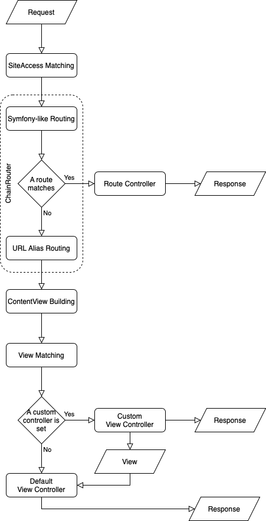

# Request lifecycle: from request to response

## HTTP request entering

When entering the architecture, the HTTP request can be handled by several component like a firewall, a load balancer, a reverse-proxy, etc. before arriving on the web server itself.

For an overview of what happens on reverse proxy like Varnish or Fastly, see [Context-aware HTTP cache / Request lifecycle](cache/context_aware_cache/#request-lifecycle).

When arriving at a Web server, the request is filtered by Apache Virtual Host, Nginx Server Blocks or equivalent. This mainly (and shortly) separates requests of static resources from requests to the application.

As Ibexa DXP is a Symfony application, everything starts like in Symfony, see [Symfony and HTTP Fundamentals](https://symfony.com/doc/current/introduction/http_fundamentals.html).

If the HTTP request is to be treated by Ibexa DXP, it goes to the [Symfony Front Controller](https://symfony.com/doc/current/configuration/front_controllers_and_kernel.html#the-front-controller) public/index.php

The Front Controller transform the HTTP request into a PHP [`Request` object](https://symfony.com/doc/current/introduction/http_fundamentals.html#symfony-request-object) and pass it to Symfony's Kernel to obtain a [`Response` object](https://symfony.com/doc/current/introduction/http_fundamentals.html#symfony-response-object) that will be transform and sent back as an HTTP response.

The schemas start with a `Request` object entering Symfony and Ibexa DXP, only regular request from a browser. No ESI, no REST nor GraphQL request.

## Lifecycle flowcharts

### Concept flowchart

### Kernel events flowchart

The following chart shows events, listeners and data added to the `Request` or the wrapping event object.

This schema is detailed below event by event. 

!!! tip

    - To list all listeners that listen to an event, run `php bin/console debug:event-dispatcher <event.name>`; For example `bin/console debug:event-dispatcher kernel.request`
    - To view details of a service (including class, arguments and tags), run `bin/console debug:container --show-arguments <service.name>`; For example `bin/console debug:container --show-arguments ezpublish.siteaccess_match_listener`
    - To list all services with a specific tag, run `bin/console debug:container --tag=<tag>>`; For example, `bin/console debug:container --tag=router`

## Kernel's request event

When the `Request` enter the Symfony's `Kernel` (and underneath the [`HttpKernel`](https://symfony.com/doc/current/components/http_kernel.html), `http_kernel`), a `kernel.request` event (`KernelEvents::REQUEST`) is dispatched.
Several listeners are called by decreasing priority.

### SiteAccess matching

After the [`FragmentListener`](https://github.com/symfony/http-kernel/blob/5.3/EventListener/FragmentListener.php) (priority 48), this is the turn of the `ezpublish.siteaccess_match_listener` service (priority 45).
This service can be

- purely the `SiteAccessMatchListener` or
- its `UserContextSiteAccessMatchSubscriber` decoration when HTTP Cache is used.

This service will

- find the current siteaccess using the `SiteAccess\Router` (`ezpublish.siteaccess_router`) regarding the [SiteAccess Matching configurations](multisite/siteaccess_matching/),
- add the current siteaccess to the `Request` object's attribute **`siteaccess`**,
- then dispatch the `ezpublish.siteaccess` event (`MVCEvents::SITEACCESS`).

The `SiteAccessListener` (`ezpublish.siteaccess_listener`) subscribes to this `ezpublish.siteaccess` event with top priority (priority 255). The `SiteAccessListener` add the attribute **`semanticPathinfo`**, the path without siteaccess indications ([`URIElement`](multisite/siteaccess_matching/#urielement), [`URIText`](multisite/siteaccess_matching/#uritext) or [`Map\URI`](multisite/siteaccess_matching/#mapuri) implementing the `URILexer` interface), to the Request.

### Routing

Lately, also listening the `kernel.request` event, the `Symfony\Component\HttpKernel\EventListener\RouterListener` (`router_listener`)(priority 32) calls the `eZ\Publish\Core\MVC\Symfony\Routing\ChainRouter::matchRequest` and add its returned parameters to the `Request`.

#### ChainRouter

The [`ChainRouter`](https://symfony.com/doc/current/cmf/components/routing/chain.html) is a Symfony Content Management Framework (CMF) component. Ibexa DXP makes it a service named `ezpublish.chain_router`.
It has a collection of prioritized routers to crawl in until finding one matching the Request to define what to do next.
The `ChainRouter` router collection is build by the ChainRoutingPass collecting the services tagged `router`.
The `DefaultRouter` is always added to the collection with top priority (priority 255).

`DefaultRouter` (`router.default`):
The `DefaultRouter` is trying to match the `semanticPathinfo` against routes, close to [the way pure Symfony does](https://symfony.com/doc/current/routing.html) by extending and using the `Symfony\Component\Routing\Router`.
If a route matches, the controller associated to it will have the responsibility to build a `View` or `Response` object.

`UrlWildcardRouter` (`ezpublish.urlwildcard_router`):
If [URL Wildcards](url_management/#url-wildcards) have been enabled, then the `URLWildcardRouter` is the next tried router.
If a wildcard matches, the `Request`'s `semanticPathinfo` is updated and the router pretend a `ResourceNotFoundException` to continue with the `ChainRouter` collection's next entry.

`UrlAliasRouter` (`ezpublish.urlalias_router`):
This router will use the `UrlAliasService` to associate the `semanticPathinfo` to a location.
If a location is found, the `Request` will receive the attributes **`locationId`** and **`contentId`** as well as that **`viewType`** is `full` and that, for now, the **`_controller`** is `ez_content:viewAction`.

The `locale_listener` (priority 16) will set the **`_locale`** `Request` attribute.

**Notice about Permission Control**: Another `kernel.request` event listener is the `EzSystems\EzPlatformAdminUi\EventListener\RequestListener` (priority 13): When a route got a `siteaccess_group_whitelist` parameter, this listener check that the current siteaccess is in one of the listed groups. For example, the Admin UI set an early protection of its route by passing them a `siteaccess_group_whitelist` containing only the `admin_group`.

Now, the `Request` know its controller, the `HttpKernel` dispatch the `kernel.controller` event.

## Kernel's controller event

### View building and matching

The HttpKernel just dispatched the `kernel.controller` event.

Listening to `kernel.controller`, the `ViewControllerListener` (`ezpublish.view_controller_listener`) (priority 10) checks if the `_controller` Request attribute is associated to a `ViewBuilder` (a service tagged `ibexa.view_builder`) in the `ViewBuilderRegistry` (`ezpublish.view_builder.registry`).
The `ContentViewBuilder` (`ezpublish.view_builder.content`) matches on controller starting with `ez_content:` (see `eZ\Publish\Core\MVC\Symfony\View\Builder\ContentViewBuilder::matches`).
The `ContentViewBuilder` builds a `ContentView`.

First, the `ContentViewBuilder` will load the `Location` and the `Content`, and, add them to the `ContentView` object.

**Notice about Permission Control**: `content/read` and/or `content/view_embed` permissions are controlled during this `ContentView` building.

Then, the `ContentViewBuilder` passes the `ContentView` to its `View\Configurator` (`ezpublish.view.configurator`).
It's implemented by the `View\Configurator\ViewProvider` and its `View\Provider\Registry`, this registry receives the services tagged `ezpublish.view_provider` thanks to the `ViewProviderPass`.
Among the view providers, the services using the `eZ\Bundle\EzPublishCoreBundle\View\Provider\Configured` have an implementation of the `MatcherFactoryInterface` (`ezpublish.content_view.matcher_factory`).
Through service decoration and class inheritance, the `ClassNameMatcherFactory` will be responsible for the [View Matching](content_rendering/templates/template_configuration/#view-rules-and-matching).
The `View\Configurator\ViewProvider` will use the matched view rule to add possible **`templateIdentifier`** and **`controllerReference`** to the `ContentView` object.

The `ViewControllerListener` adds the ContentView to the `Request` as **`view`** attribute.
The `ViewControllerListener` eventually updates the `Request` `_controller` attribute with the `ContentView`'s `controllerReference`.

The `HttpKernel` then dispatches a `kernel.controller_arguments` (a.k.a. `KernelEvents::CONTROLLER_ARGUMENTS`) but nothing from Ibexa DXP is listening to it.

## Controller execution

The `HttpKernel` extracts from the Request the controller and the arguments to pass to the controller. [Argument resolvers](https://symfony.com/doc/current/controller/argument_value_resolver.html) way is similar to autowiring.
The `HttpKernel` executes the controller with those arguments.

As a reminder, the controller and its argument can be:

- A controller set by a route matching and the `Request` as its argument.
- The default `ez_content:viewAction` controller and a `ContentView` as its argument.
- A [custom controller](content_rendering/queries_and_controllers/controllers/) set by the matched view rule and a `View` or the `Request` as its argument (most likely a `ContentView` but there is no restriction). **Notice about Permission Control**: See [Permissions for custom controller](https://doc.ibexa.co/en/latest/guide/permissions/#permissions-for-custom-controllers).

## Kernel's view event and `ContentView` rendering

If the controller returns something else than a `Response`, the `HttpKernel` dispatches a `kernel.view` event (`KernelEvents::VIEW`).
In the case of a URL Alias, the controller most likely returns a ContentView.
The `ViewRendererListener` (`ezpublish.view.renderer_listener`) will use the `ContentView` and the `TemplateRenderer` (`ezpublish.view.template_renderer`) to get the content of the `Response` and attach this new `Response` to the event.
The `HttpKernel` retrieve the Response attached to the event and continue.

## Kernel's response event and `Response` sending

The `HttpKernel` send a `kernel.response` event (`KernelEvents::RESPONSE`). For example, if HTTP Cache is used, `Response`'s headers may be enhanced.

The `HttpKernel` send a `kernel.finish_request` event (`KernelEvents::FINISH_REQUEST`). The `VerifyUserPoliciesRequestListener` (`siso_core.verify_user_policies_request_listener`) (priority 100) is filtering route on its policy configuration. **Notice about Permission Control**: See [Permissions for routes](permissions/#permissions-for-routes).

Finally, the `HttpKernel` send the `Response`.

If an exception occurs during this chain of events, the `HttpKernel` send a `kernel.exception` and try to obtain a `Response` from its listeners.

The `HttpKernel` send a last `kernel.terminate` event (`KernelEvents::TERMINATE`). For example, the `BackgroundIndexingTerminateListener` (`ezpublish.search.background_indexer`) (priority 0) remove from the `SearchService` index possible contents existing in the index but not in the database.

## Summaries
### Summary of events and listeners

* event=`kernel.request`
    - 45:`ezpublish.siteaccess_match_listener`
        - `ezpublish.siteaccess_router`
        - event=`ezpublish.siteaccess`
            - 255:`ezpublish.siteaccess_listener`
    - 32:`router_listener`
        - `ezpublish.chain_router`
            - tag=`router`
                - `router.default`
                - `ezpublish.urlwildcard_router`
                - `ezpublish.urlalias_router`
    - 16:`locale_listener`
    - 13:`EzSystems\EzPlatformAdminUi\EventListener\RequestListener`
* event=`kernel.controller`
    - 10:`ezpublish.view_controller_listener`
        - `ezpublish.view_builder.registry`
            - tag=`ibexa.view_builder`
                - `ezpublish.view_builder.content`
                    - `ezpublish.view.configurator`
* event=`kernel.controller_arguments`
* event=`kernel.view`
    - 0:`ezpublish.view.renderer_listener`
        - `ezpublish.view.template_renderer`
* event=`kernel.response`
* event=`kernel.finish_request`
    - 100:`siso_core.verify_user_policies_request_listener`
* event=`kernel.terminate`
    - 0:`ezpublish.search.background_indexer`

### Examples of info retrieval during request lifecycle

|  Event                  |  Service                              |  Request attribute  |  Example #1   |  Example #2     |
| ----------------------- | ------------------------------------- | ------------------- | ------------- | --------------- |
|                         |  http_kernel                          |  pathInfo           |  /en/about    |  /admin/login   |
|  kernel.request         |  ezpublish.siteaccess_match_listener  |  siteaccess         |  en           |  admin          |
|  ezpublish.siteaccess   |  ezpublish.siteaccess_listener        |  semanticPathinfo   |  /about       |  /login         |
|  kernel.request         |  router.default                       |  _route             |  N/A          |  login          |
|  kernel.request         |  router.default                       |  _controller        |  N/A          |  ezpublish.security.controller:loginAction  |
|  kernel.request         |  ezpublish.urlalias_router            |  _route             |  ez_urlalias  |  login          |
|  kernel.request         |  ezpublish.urlalias_router            |  _controller        |  **ez_content:viewAction**  |  ezpublish.security.controller:loginAction  |
|  kernel.request         |  ezpublish.urlalias_router            |  viewType           |  full         |  N/A            |
|  kernel.request         |  ezpublish.urlalias_router            |  contentId          |  1            |  N/A            |
|  kernel.request         |  ezpublish.urlalias_router            |  locationId         |  42           |  N/A            |
|  kernel.request         |  locale_listener                      |  _locale            |  en_GB        |  fr             |
|  kernel.controller      |  ezpublish.view_builder.content       |  view.content       |  Content      |  N/A            |
|  kernel.controller      |  ezpublish.view_builder.content       |  view.location      |  Location     |  N/A            |
|  kernel.controller      |  ezpublish.view.configurator          |  view.templateIdentifier   |  @EzPublishCore/default/content/full.html.twig  |  @ezdesign/account/login/index.html.twig  |
|  kernel.controller      |  ezpublish.view.configurator          |  view.controllerReference  |  null  |  null           |
|  kernel.controller      |  ezpublish.view_controller_listener   |  view               |  ContentView  |  N/A            |
|  kernel.controller      |  ezpublish.view_controller_listener   |  _controller        |  ez_content:viewAction  |  ezpublish.security.controller:loginAction  |
| (controller execution)  |  http_kernel                          |                     |  ContentView  |  LoginFormView  |
|  kernel.view            |  ezpublish.view.renderer_listener     |  response           |  Response     |  Response       |

## HTTP response leaving

The web server output the HTTP response. Depending on the architecture few things may still occur. For example, Varnish or Fastly will take specific headers into account when setting the cache or serving it.
