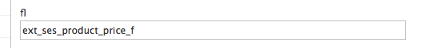

# Implement an indexer plugin for custom Field Types [[% include 'snippets/commerce_badge.md' %]]

The indexer is a class that implements the `DocumentMapperPluginInterface` interface from `ezplatform-solr-search-engine`.

It enables indexing additional data with Solr. For example, it enables searching with additional complex data type like specification matrix, variant matrix, etc., as conditions.

The interface has the following methods that must be implemented:

- `canExtend(Type $type)` - defines which Content Type is handled by the indexer plugin.
- `createExtensionFields(Content $content, Type $type, $languageCode)` - is called for every indexed Content item and language.
The output is an array of SPI Field objects which are used by the main indexer to create Solr fields.

The generated Field instances have the `ext_` prefix in their names to avoid naming conflicts with existing content Fields
and to distinguish them from standard fields.

### Step 1: Create a class

Create a class that extends `DocumentMapperPluginInterface` and define a service for that class:

``` php
class MyCustomMapperPlugin implements DocumentMapperPluginInterface
```

Make sure your plugin uses this files:

``` php
use eZ\Publish\SPI\Persistence\Content;
use eZ\Publish\SPI\Persistence\Content\Type;
use eZ\Publish\SPI\Search\Field;
use eZ\Publish\SPI\Search\FieldType\FloatField;
use EzSystems\EzPlatformSolrSearchEngine\DocumentMapperPluginInterface;
use Siso\Bundle\SearchBundle\Helper\EzSolrSpecificationsIndexHelper;
use Siso\Bundle\SearchBundle\Helper\StaticDocumentMapperPluginHelper as Helper;
```

### Step 2. Create a service for the class

``` xml
<parameter key="siso_search.my_custom_mapper_plugin.class">Siso\Bundle\SearchBundle\Service\MyCustomMapperPlugin</parameter>
  
<!-- Start Indexer Plugins -->
<service id="siso_search.my_custom_mapper_plugin" class="%siso_search.my_custom_mapper_plugin.class%">
    <tag name="ezpublish.search.solr.document_mapper_plugin" />
</service>
```

This allows plugin execution every time the index command is executed.

### Step 3. Define elements to handle

Define which elements will be handled by your plugin using `canExtend()`.

``` php
public function canExtend(Type $type)
{
    return $type->identifier === 'ses_product';
}
```

In this example you want to create additional indexes for `ses_product`.

### Step 4. Create indexer logic

Create the logic you want to extend the indexer with.

The input parameters of the main methods are not regular catalog elements but standard Content items and Content Types.

In the following example you use additional logic to get the Field names you need for custom indexing by implementing:

``` php
public function createExtensionFields(Content $content, Type $type, $languageCode);
```

If you know the Field identifier you can use the static method `getFieldDefinitionId()` from the helper class to get the Field IDs that will be processed.

``` php
$myFieldId = Helper::getFieldDefinitionId($type, $myFieldIdentifier);
```

Then you need to iterate each Field over `$content` and if the Field ID matches the Fields you want to process, add your logic.

``` php
// Iteration over each Field inside the content.
foreach ($content->fields as $field) {
    // If the Field matches the ID, you want to process we can add our logic.
    if ($field->fieldDefinitionId === $myFieldId
        && $field->languageCode === $languageCode
    ) {
        // The index logic indexes price elements as floats:
        $productPrice = Helper::getFieldValue($content, $myFieldId); // This helper function retrieves the field value.
        if ($productPrice !== null) {
            $outputFields[] = new Field( // Returns an array of Fields.
                'ext_ses_product_price', //this is the name of the Solr index.
                Helper::normalizeFloatString((string) $productPrice), // this transforms the field to float.
                new FloatField()    // This specifies element data type.
                                        // Valid types are: IntegerField(), FloatField(),
                                    // StringField(), MultipleIntegerField and MultipleStringField().
            );
        }
    }
}
```

!!! note

    Multiple float Fields for the external Solr field are not supported.

At the end return the array of fields:

``` php
return $outputFields;
```

### Step 5. Names ready in Solr index

The Solr index should have the name you defined + `_` + the datatype.
The datatype is represented by:

- `i` - integer, 
- `s` - string, 
- `f` - float, 
- `mi` - multi integer, 
- `ms` - multi string. 

For example:

``` php
{
    "ext_ses_product_price_f": 12.5
},
```

Multiple string example:

``` php
"language_code_ms": [
    "eng-US",
    "ger-DE"
],
```

### Step 6. Test new fields

If you want to test how your new fields look like in Solr you have to run the reindex command
and perform a Solr query directly in Solr interface.

``` bash
php -d memory_limit=-1 bin/console ezplatform:solr_create_index
```

Make sure you execute this in your project home directory.

To perform a Solr query go to Solr URL, usually: `http://<yourdomain>:8983/solr/`

Then select your collection (usually `collection1`) and select a query.

Additionally you can set Solr to only show the new field by adding the field name to the `fl` field.


