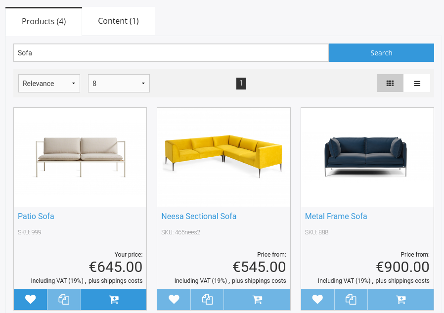
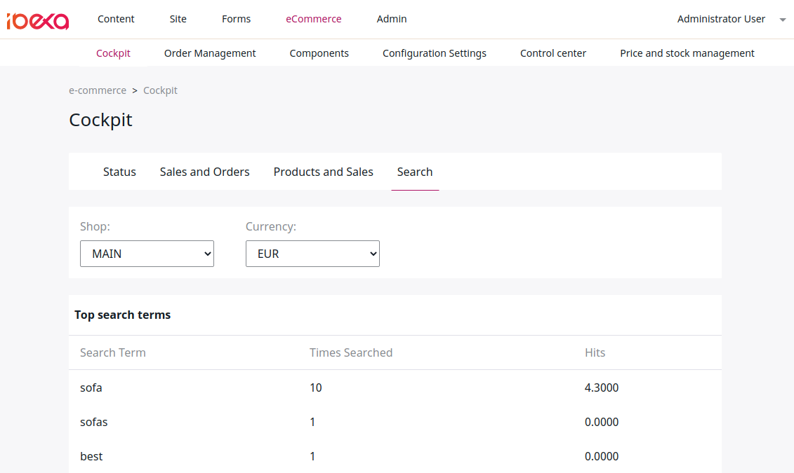

# Shop search [[% include 'snippets/commerce_badge.md' %]]

The built-in search engine based on Solr automatically indexes both content and products.

The search displays the results in different groups. A group can consist of products, videos, downloads, etc.

You can configure groups displayed in tabs such as products and content.
The products can be shown in a list or gallery view.

The user can use the back button to go back without leaving the search.
URLs are unique, so you can share a link to a search result.

The search uses Ajax to refresh the list.

Boosting can be defined in the configuration.

The search comes with an extension plugin system which enables indexing custom fields by Content Type.

## Search statistics

eCommerce cockpit displays the log of searches that are performed by the users.

This includes search queries from the main search box.
It also includes search queries from the secondary search box if no facets are selected
and the search term is different from the previous search term.

The following three tables are displayed:

- **Top search terms** displays the most searched terms sorted by times searched.
- **Last search terms** displays the last searches, ordered by date and time.
- **Most searched terms with less hits** gets the most searched terms with less hits.

Every search query is logged into the `ses_log_search` database table.
This logic is generated in the `QuerySearchLogService` service.
