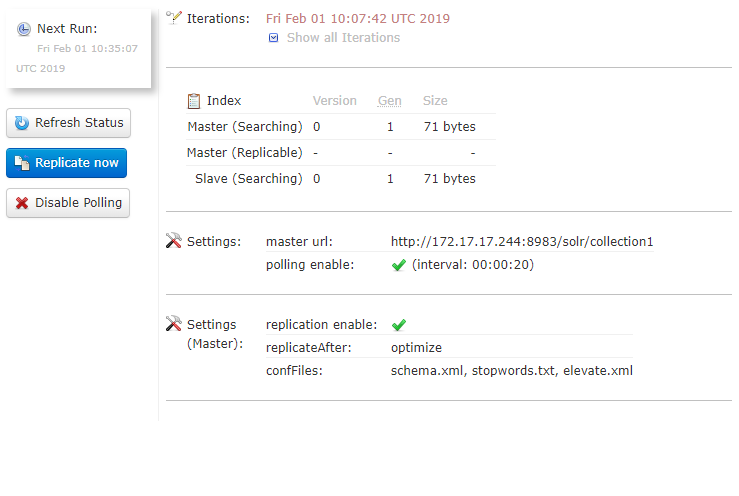

# Solr search engine

[ezplatform-solr-search-engine](https://github.com/ezsystems/ezplatform-solr-search-engine) aims to be a transparent drop-in replacement for the SQL-based Legacy search engine powering [[= product_name =]] Search API by default. When you enable Solr and re-index your content, all your existing Search queries using `SearchService` will be powered by Solr automatically. This allows you to scale up your [[= product_name =]] installation and be able to continue development locally against SQL engine, and have a test infrastructure, Staging and Prod powered by Solr. This removes considerable load from your database. See [further information on the architecture of [[= product_name =]]](../architecture.md).

## How to set up Solr search engine

!!! note "Installing the bundle"

    If you have previously removed the bundle, add/update composer dependencies:
    ``` bash
    composer require --no-update ezsystems/ezplatform-solr-search-engine:~3.0
    composer update
    ```
    
    Symfony Flex will enable the bundle for you when installing the package.

### Step 1: Configuring and starting Solr

The example presents a configuration with a single core. For configuring Solr in other ways, including examples, see [Solr Cores and `solr.xml`](https://cwiki.apache.org/confluence/display/solr/Solr+Cores+and+solr.xml) and [core administration](https://wiki.apache.org/solr/CoreAdmin).

#### Download and configure

!!! note "Solr versions"

    For v3 `ezplatform-solr-search-engine` works with Solr 7 and 8, using most recent version of Solr 7.7 or 8.6 is recommended.

##### Solr 7

Download and extract Solr, for example, in version 7.7.2:

- [solr-7.7.2.tgz](http://archive.apache.org/dist/lucene/solr/7.7.2/solr-7.7.2.tgz) or [solr-7.7.2.zip](http://archive.apache.org/dist/lucene/solr/7.7.2/solr-7.7.2.zip)

Copy the necessary configuration files. In the example below from the root of your project to the place you extracted Solr:

``` bash
# Make sure to replace the /opt/solr/ path with where you have placed Solr
cd /opt/solr
mkdir -p server/ez/template
cp -R <ezplatform-solr-search-engine>/lib/Resources/config/solr/* server/ez/template
cp server/solr/configsets/_default/conf/{solrconfig.xml,stopwords.txt,synonyms.txt} server/ez/template
cp server/solr/solr.xml server/ez

# Modify solrconfig.xml to remove the section that doesn't agree with your schema
sed -i.bak '/<updateRequestProcessorChain name="add-unknown-fields-to-the-schema".*/,/<\/updateRequestProcessorChain>/d' server/ez/template/solrconfig.xml
 
# Start Solr (but apply autocommit settings below first if you need to)
bin/solr -s ez
bin/solr create_core -c collection1 -d server/ez/template
```

##### SolrCloud

SolrCloud is a cluster of Solr servers. It enables you to:

- centralize configuration
- automatically load balance and fail-over for queries
- integrate ZooKeeper for cluster coordination and configuration

To set SolrCloud up follow [SolrCloud reference guide.](https://lucene.apache.org/solr/guide/7_7/solrcloud.html)

#### Further configuration

The bundle does not commit Solr index changes directly on Repository updates, leaving it up to you to tune this using `solrconfig.xml` as best practice suggests.

This setting is **required** if you want to see the changes after publish. It is strongly recommended to set-up `solrconfig.xml` like this:

``` xml
<!--solrconfig.xml-->
<autoCommit>
  <!-- autoCommit is here left as-is like it is out of the box in Solr, this controls hard commits for durability/replication -->
  <maxTime>${solr.autoCommit.maxTime:15000}</maxTime>
  <openSearcher>false</openSearcher>
</autoCommit>

<autoSoftCommit>
  <!-- Soft commits controls mainly when changes becomes visible, by default we change value from -1 (disabled) to 20ms, so Solr gets to bulk update changes a bit, but before a request typically finishes -->
  <maxTime>${solr.autoSoftCommit.maxTime:20}</maxTime>
</autoSoftCommit>
```

#### Generating configuration

The command line tool `bin/generate-solr-config.sh` generates Solr 7 configuration automatically.
It can be used for deploying to Ibexa Cloud (Platform.sh) and on-premise installs.

Execute the script from the [[= product_name =]] root directory for further information:

``` bash
./vendor/ezsystems/ezplatform-solr-search-engine/bin/generate-solr-config.sh --help
```

### Step 2: Configuring the bundle

The Solr Search Engine Bundle can be configured in many ways. The config further below assumes you have parameters set up for Solr DSN and search engine *(however both are optional)*, for example:

``` yaml
    env(SEARCH_ENGINE): solr
    env(SOLR_DSN): 'http://localhost:8983/solr'
    env(SOLR_CORE): collection1
```

#### Single-core example (default)

Out of the box in [[= product_name =]] the following is enabled for a simple setup:

``` yaml
ez_search_engine_solr:
    endpoints:
        endpoint0:
            dsn: '%solr_dsn%'
            core: '%solr_core%'
    connections:
        default:
            entry_endpoints:
                - endpoint0
            mapping:
                default: endpoint0
```

#### Shared-core example

The following example separates one language. The installation contains several similar languages,
and one very different language that should receive proper language analysis for proper stemming and sorting behavior by Solr:

``` yaml
ez_search_engine_solr:
    endpoints:
        endpoint0:
            dsn: '%solr_dsn%'
            core: core0
        endpoint1:
            dsn: '%solr_dsn%'
            core: core1
    connections:
        default:
            entry_endpoints:
                - endpoint0
                - endpoint1
            mapping:
                translations:
                    jpn-JP: endpoint1
                # Other languages, for instance eng-US and other western languages are sharing core
                default: endpoint0
```

#### Multi-core example

If full language analysis features are preferred, then each language can be configured with separate cores.

!!! note

    Make sure to test this setup against a single-core setup, as it might perform worse than single-core if your project uses a lot of language fallbacks per SiteAccess, as queries will then be performed across several cores at once.

``` yaml
ez_search_engine_solr:
    endpoints:
        endpoint0:
            dsn: '%solr_dsn%'
            core: core0
        endpoint1:
            dsn: '%solr_dsn%'
            core: core1
        endpoint2:
            dsn: '%solr_dsn%'
            core: core2
        endpoint3:
            dsn: '%solr_dsn%'
            core: core3
        endpoint4:
            dsn: '%solr_dsn%'
            core: core4
        endpoint5:
            dsn: '%solr_dsn%'
            core: core5
        endpoint6:
            dsn: '%solr_dsn%'
            core: core6
    connections:
        default:
            entry_endpoints:
                - endpoint0
                - endpoint1
                - endpoint2
                - endpoint3
                - endpoint4
                - endpoint5
                - endpoint6
            mapping:
                translations:
                    jpn-JP: endpoint1
                    eng-US: endpoint2
                    fre-FR: endpoint3
                    ger-DE: endpoint4
                    esp-ES: endpoint5
                # Not really used, but specified here for fallback if more languages are suddenly added by content admins
                default: endpoint0
                # Also use separate core for main languages (differs from content object to content object)
                # This is useful to reduce number of cores queried for always available language fallbacks
                main_translations: endpoint6
```

#### SolrCloud example

To use SolrCloud you need to specify data distribution strategy for connection via the `distribution_strategy` option to [`cloud`.](https://lucene.apache.org/solr/guide/7_7/solrcloud.html)

The example is based on multi-core setup so any specific language analysis options could be specified on the collection level.

``` yaml
ez_search_engine_solr:
    endpoints:
        main:
            dsn: '%solr_dsn%'
            core: '%solr_main_core%' 
        en:
            dsn: '%solr_dsn%'
            core: '%solr_en_core%'
        fr:
            dsn: '%solr_dsn%'
            core: '%solr_fr_core%'
        # ...
    connections:
        default:
            distribution_strategy: cloud
            entry_endpoints:
                - main
                - en
                - fr
             # -  ...
            mapping:
                translations:
                    eng-GB: en
                    fre-FR: fr
                    # ...
                main_translations: main
```

This solution uses the default SolrCloud [document routing strategy: `compositeId`.](https://lucene.apache.org/solr/guide/7_7/shards-and-indexing-data-in-solrcloud.html#ShardsandIndexingDatainSolrCloud-DocumentRouting)

#### Solr Basic HTTP Authorization
Solr core can be secured with Basic HTTP Authorization. See more information here: [Solr Basic Authentication Plugin.](https://cwiki.apache.org/confluence/display/solr/Basic+Authentication+Plugin)
In the example below we configured Solr Bundle to work with secured Solr core.

``` yaml
ez_search_engine_solr:
    endpoints:
        endpoint0:
            dsn: '%solr_dsn%'
            core: core0
            user: example
            pass: password
```

Obviously, you should pass credentials for every configured and HTTP Basic secured Solr core. Configuration for multi core setup is exactly the same.

### Step 3: Configuring repository with the specific search engine

The following is an example of configuring Solr search engine, where `connection` name is same as in the example above, and engine is set to `solr`:

``` yaml
ezplatform:
    repositories:
        default:
            storage: ~
            search:
                engine: '%search_engine%'
                connection: default
```

`%search_engine%` is a parameter that is configured in `config/packages/ezplatform.yaml`, and should be changed from its default value `legacy` to `solr` to activate Solr as the search engine.

### Step 4: Clear prod cache

While Symfony `dev` environment keeps track of changes to YAML files, `prod` does not, so clear the cache to make sure Symfony reads the new config:

``` bash
php bin/console --env=prod cache:clear
```

### Step 5: Run CLI indexing command

The last step is to execute the initial indexation of data:

``` bash
php bin/console --env=prod --siteaccess=<name> ezplatform:reindex
```

#### Possible exceptions

If you have not configured your setup correctly, some exceptions might happen on indexing.
Here are the most common issues you may encounter:

- Exception if Binary files in database have an invalid path prefix
    - Make sure `var_dir` is configured properly in `ezplatform.yaml` configuration.
    - If your database is inconsistent in regards to file paths, try to update entries to be correct *(make sure to make a backup first)*.
- Exception on unsupported Field Types
    - Make sure to implement all Field Types in your installation, or to configure missing ones as [NullType](../../api/field_type_reference.md#null-field-type) if implementation is not needed.
- Content is not immediately available 
    - Solr Bundle on purpose does not commit changes directly on Repository updates *(on indexing)*, but lets you control this using Solr configuration. Adjust Solr's `autoSoftCommit` (visibility of changes to search index) and/or `autoCommit` (hard commit, for durability and replication) to balance performance and load on your Solr instance against needs you have for "[NRT](https://cwiki.apache.org/confluence/display/solr/Near+Real+Time+Searching)".
- Running out of memory during indexing
    - In general make sure to run indexing using the prod environment to avoid debuggers and loggers from filling up memory.
    - Flysystem: You can find further info in https://jira.ez.no/browse/EZP-25325.

## Configuring the Solr Search Engine Bundle

### Boost configuration

!!! caution "Index time boosting"

    Index time boosting was deprecated in Solr 6.5 and removed in Solr 7.0.
    Until query time boosting is implemented, there is no way to boost in the bundle out of the box.

!!! tip "How boosting interacts with Search API"

    Boosting of fields or documents will affect the score (relevance) of your search result hits
    when using Search API for any Criteria you specify on `$query->query`, or in REST by using `Query` element.
    When you don't specify anything to sort on, the result will be sorted by this relevance.
    Anything set on `$query->filter`, or in REST using `Filter` element, will *not* affect scoring and only works
    as a pure filter for the result. Thus make sure to place Criteria you want to affect scoring on `query`.

Boosting currently happens when indexing, so if you change your configuration you will need to re-index.

Boosting tells the search engine which parts of the content model have more importance when searching, and is an important part of tuning your search results relevance. Importance is defined using a numeric value, where `1.0` is default, values higher than that are more important, and values lower (down to `0.0`) are less important.

Boosting is configured per connection that you configure to use for a given Repository, like in this `config/packages/ezplatform_solr.yaml` example:

``` yaml
ez_search_engine_solr:
    connections:
        default:
            boost_factors:
                content_type:
                    # Boost a whole Content Type
                    article: 2.0
                meta_field:
                    # Boost a meta Field (name, text) system wide, or for a given Content Type
                    name: 10.0
                    article:
                        # Boost the meta full text Field for article more than 2.0 set above
                        text: 5.0
```

The configuration above will result in the following boosting (Content Type / Field):

- `article/title: 2.0`
- `news/description: 1.0` (default)
- `article/text (meta): 5.0`
- `blog_post/name (meta): 10.0`
- `article/name (meta): 2.0`

!!! tip "How to configure boosting on specific fields"

    Currently, boosting on particular fields is missing.
    However, it could be configured using 3rd party [Novactive/NovaeZSolrSearchExtraBundle](https://github.com/Novactive/NovaeZSolrSearchExtraBundle) in case of custom search implementation, e.g. to handle your front-end search form.
    Unfortunately, this doesn't affect search performed in the administration interface.

    The following example presents boosting configuration for Folder's `name` and `description` fields.
    First, in `ezplatform_solr.yaml` configure [custom fulltext fields.](https://github.com/Novactive/NovaeZSolrSearchExtraBundle/blob/master/doc/custom_fields.md)

    ```yaml
    ez_solr_search_extra:
        system:
            default:
                fulltext_fields:
                    custom_folder_name:
                        - folder/name
                    custom_folder_description:
                        - folder/description
    ```

    The second step requires you to use `\Novactive\EzSolrSearchExtra\Query\Content\Criterion\MultipleFieldsFullText` instead of default `\eZ\Publish\API\Repository\Values\Content\Query\Criterion\FullText`.
    The following example shows custom query which benefits from the custom fields created in the previous example.

    ```php
    <?php

    namespace App\Controller;

    use eZ\Publish\API\Repository\SearchService;
    use eZ\Publish\API\Repository\Values\Content\Query;
    use Symfony\Component\HttpFoundation\Request;
    use Symfony\Component\HttpFoundation\Response;

    class SearchController
    {
        /**
         * @var \eZ\Publish\API\Repository\SearchService
         */
        private $searchService;

        public function __construct(SearchService $searchService)
        {
            $this->searchService = $searchService;
        }

        public function searchAction(Request $request): Response
        {
            $queryString = $request->get('query');

            $query = new Query();
            $query->query = new \Novactive\EzSolrSearchExtra\Query\Content\Criterion\MultipleFieldsFullText(
                $queryString,
                [
                    'metaBoost' => [
                        'custom_folder_name' => 20.0,
                        'custom_folder_description' => 10.0,
                    ]
                ]
            );

            $searchResult = $this->searchService->findContent($query);

            ...
        }
    }
    ```

    Remember to clear the cache and perform search engine reindex afterwords.

    The above configuration will result in the following boosting (Content Type / Field):
    - `folder/name: 20.0`
    - `folder/title: 10.0`

### Indexing related objects

You can use indexation of related objects to search through text of related content.
Indexing is disabled by default.
To set it up you need to define the maximum indexing depth using the following YAML configuration:

```yaml
ez_search_engine_solr:
    # ...
    connections:
        default:
            # ...
            indexing_depth:
                # Default value: 0 - no relation indexing, 1 - direct relations, 2nd level  relations, 3rd level  relations (maximum value).
                default: 1      
                content_type:
                    # Index depth defined for specific content type
                    article: 2
```

## Extending the Solr Search Engine Bundle

### Document field mappers

!!! note

    Document Field Mappers are available since Solr bundle version 1.2.

You can use document field mappers to index additional data in the search engine.

The additional data can come from external sources (e.g. from a recommendation system), or from internal ones.
An example of the latter is indexing data through the Location hierarchy: from the parent Location to the child Location, or indexing child data on the parent Location.
This may be needed when you want to find the content with full-text search, or to simplify search for a complicated data model.

To do this effectively, you first need to understand how the data is indexed with the Solr search engine.
Solr uses [documents](https://lucene.apache.org/solr/guide/7_7/overview-of-documents-fields-and-schema-design.html#how-solr-sees-the-world) as a unit of data that is indexed.
Documents are indexed per translation, as content blocks. A block is a nested document structure.
When used in [[= product_name =]], a parent document represents content, and Locations are indexed as child documents of the Content item.
To avoid duplication, full-text data is indexed on the Content document only. Knowing this, you have the option to index additional data on:

- all block documents (meaning content and its Locations, all translations)
- all block documents per translation
- content documents
- content documents per translation
- Location documents

Indexing additional data is done by implementing a document field mapper and registering it at one of the five extension points described above.
You can create the field mapper class anywhere inside your bundle,
as long as when you register it as a service, the `class` parameter in your `services.yaml` matches the correct path.
There are three different field mappers. Each mapper implements two methods, by the same name, but accepting different arguments:

- `ContentFieldMapper`
    - `::accept(Content $content)`
    - `::mapFields(Content $content)`
- `ContentTranslationFieldMapper`
    - `::accept(Content $content, $languageCode)`
    - `::mapFields(Content $content, $languageCode)`
- `LocationFieldMapper`
    - `::accept(Location $content)`
    - `::mapFields(Location $content)`

These can be used on the extension points by registering them with the container using service tags, as follows:

- all block documents
    - `ContentFieldMapper`
    - `ezpublish.search.solr.field_mapper.block`
- all block documents per translation
    - `ContentTranslationFieldMapper`
    - `ezpublish.search.solr.field_mapper.block_translation`
- Content documents
    - `ContentFieldMapper`
    - `ezpublish.search.solr.field_mapper.content`
- Content documents per translation
    - `ContentTranslationFieldMapper`
    - `ezpublish.search.solr.field_mapper.content_translation`
- Location documents
    - `LocationFieldMapper`
    - `ezpublish.search.solr.field_mapper.location`

The following example shows how to index data from the parent Location content, in order to make it available for full-text search on the children content.
It is based on the use case of indexing webinar data on the webinar events, which are children of the webinar. Field mapper could then look like this:

```php
 <?php

namespace My\WebinarApp;

use EzSystems\EzPlatformSolrSearchEngine\FieldMapper\ContentFieldMapper;
use eZ\Publish\SPI\Persistence\Content\Handler as ContentHandler;
use eZ\Publish\SPI\Persistence\Content\Location\Handler as LocationHandler;
use eZ\Publish\SPI\Persistence\Content;
use eZ\Publish\SPI\Search;

class WebinarEventTitleFulltextFieldMapper extends ContentFieldMapper
{
    /**
     * @var \eZ\Publish\SPI\Persistence\Content\Type\Handler
     */
    protected $contentHandler;

    /**
     * @var \eZ\Publish\SPI\Persistence\Content\Location\Handler
     */
    protected $locationHandler;

    /**
     * @param \eZ\Publish\SPI\Persistence\Content\Handler $contentHandler
     * @param \eZ\Publish\SPI\Persistence\Content\Location\Handler $locationHandler
     */
    public function __construct(
        ContentHandler $contentHandler,
        LocationHandler $locationHandler
    ) {
        $this->contentHandler = $contentHandler;
        $this->locationHandler = $locationHandler;
    }

    public function accept(Content $content)
    {
        // ContentType with ID 42 is webinar event
        return $content->versionInfo->contentInfo->contentTypeId == 42;
    }

    public function mapFields(Content $content)
    {
        $mainLocationId = $content->versionInfo->contentInfo->mainLocationId;
        $location = $this->locationHandler->load($mainLocationId);
        $parentLocation = $this->locationHandler->load($location->parentId);
        $parentContentInfo = $this->contentHandler->loadContentInfo($parentLocation->contentId);

        return [
            new Search\Field(
                'fulltext',
                $parentContentInfo->name,
                new Search\FieldType\FullTextField()
            ),
        ];
    }
}
```

Since you index full text data only on the content document, you would register the service like this:

``` yaml
my_webinar_app.webinar_event_title_fulltext_field_mapper:
    class: My\WebinarApp\WebinarEventTitleFulltextFieldMapper
    arguments:
        - '@ezpublish.spi.persistence.content_handler'
        - '@ezpublish.spi.persistence.location_handler'
    tags:
        - {name: ezpublish.search.solr.field_mapper.content}
```

	
!!! caution "Permission issues when using Repository API in document field mappers"

    Document field mappers are low level. They expect to be able to index all content regardless of current user permissions.
    If you use PHP API in your custom document field mappers, you need to apply [`sudo()`](../../api/public_php_api.md#using-sudo),
    otherwise use the Persistence SPI layer as in the example above.

## Configuring Solr Replication (master/slave)

!!! note

    The configuration below has been tested on Solr 7.7.

### Configuring Master for replication

First you need to change the core configuration in `solrconfig.xml` (for example `*/opt/solr/server/ez/collection1/conf/solrconfig.xml`).
You can copy and paste the code below before any other `requestHandler` section.

```xml
<requestHandler name="/replication" class="solr.ReplicationHandler">
  <lst name="master">
    <str name="replicateAfter">optimize</str>
    <str name="backupAfter">optimize</str>
    <str name="confFiles">schema.xml,stopwords.txt,elevate.xml</str>
    <str name="commitReserveDuration">00:00:10</str>
  </lst>
  <int name="maxNumberOfBackups">2</int>
  <lst name="invariants">
    <str name="maxWriteMBPerSec">16</str>
  </lst>
</requestHandler>
<str name="confFiles">solrconfig_slave.xml:solrconfig.xml,x.xml,y.xml</str>
```

Then restart the master with:

```bash
sudo su - solr -c "/opt/solr/bin/solr restart"
```

### Configuring Slave for replication

You have to edit the same file on the slave server, and use the code below:

```xml
<requestHandler name="/replication" class="solr.ReplicationHandler">
  <lst name="slave">

    <!-- fully qualified url for the replication handler of master. It is
         possible to pass on this as a request param for the fetchindex command -->
    <str name="masterUrl">http://123.456.789.0:8983/solr/collection1/replication</str>

    <!-- Interval in which the slave should poll master.  Format is HH:mm:ss .
         If this is absent slave does not poll automatically.
         But a fetchindex can be triggered from the admin or the http API -->
    <str name="pollInterval">00:00:20</str>

    <!-- THE FOLLOWING PARAMETERS ARE USUALLY NOT REQUIRED-->
    <!-- To use compression while transferring the index files. The possible
         values are internal|external.  If the value is 'external' make sure
         that your master Solr has the settings to honor the accept-encoding header.
         See here for details: http://wiki.apache.org/solr/SolrHttpCompression
         If it is 'internal' everything will be taken care of automatically.
         USE THIS ONLY IF YOUR BANDWIDTH IS LOW.
         THIS CAN ACTUALLY SLOWDOWN REPLICATION IN A LAN -->
    <str name="compression">internal</str>

    <!-- The following values are used when the slave connects to the master to
         download the index files.  Default values implicitly set as 5000ms and
         10000ms respectively. The user DOES NOT need to specify these unless the
         bandwidth is extremely low or if there is an extremely high latency -->
    <str name="httpConnTimeout">5000</str>
    <str name="httpReadTimeout">10000</str>

    <!-- If HTTP Basic authentication is enabled on the master, then the slave
         can be configured with the following -->
    <str name="httpBasicAuthUser">username</str>
    <str name="httpBasicAuthPassword">password</str>
  </lst>
</requestHandler>
```

Next, restart Solr slave.

Connect to the Solr slave interface (http://localhost:8983/solr), go to your core and check the replication status:


