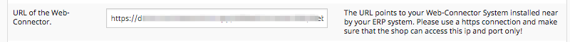

# Configure ERP connection [[% include 'snippets/commerce_badge.md' %]]

By default [[= product_name_com =]] uses the `TsoWebconnectorLayer` which enables the shop to communicate with a Microsoft Dynamics NAV System.

## Requirements

- An ERP System Microsoft Dynamics NAV and the TSO Webconnector product installed.
- The main URL to the webservice

## Configuration

Configure the ERP connection in the backend:



The following configuration enables using the ERP:

``` yaml
siso_local_order_management.default.send_order_to_erp: true
    siso_order_history.default.use_local_documents: false
```
