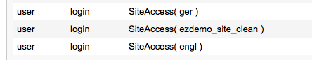

# Set up a new language [[% include 'snippets/commerce_badge.md' %]]

!!! note

    If you introduce a new SiteAccess, it is important that you add a new Policy for the anonymous User Role

    Allow login for the new SiteAccess:

    

## Configuration

- `ezpublish.siteaccess.list` - general configuration for the new SiteAccess
- `ezpublish.siteaccess.groups.ezdemo_site_clean_group` - assign the new SiteAccess to the general group `ezdemo_site_clean_group`
- `ezpublish.siteaccess.match.Compound\LogicalAnd` - define the domain and language for this new SiteAccess, e.g.:

``` yaml
website_be_nl:
    matchers:
        Map\URI:
            nl: true
        Map\Host:
            %domain_website_be%: true
    match: website_be_nl
```

Next, configure a session name and used languages:

``` yaml
website_be_nl:
    session:
        name: eZSESSID
    languages:
        - dut-NL
```

- `ezpublish.siteaccess.ses_admin.languages` - enables the new language for admin SiteAccess.
- `ezsettings.default.languages` - adds the new language.
