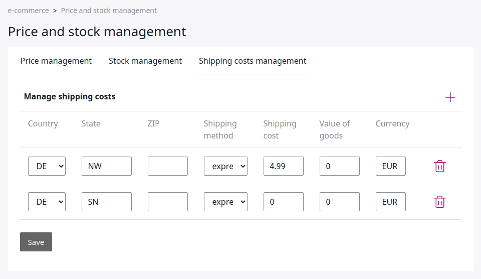

# Configuration [[% include 'snippets/commerce_badge.md' %]]

## HTTP server configuration

For more information about the HTTP server configuration,
see [the installation guide](../../getting_started/install_ez_platform.md#prepare-installation-for-production).

[[= product_name_com =]] requires one more rule in order to display images. The following examples show the settings for Apache:

``` 
RewriteRule ^/var/assets/.* - [L]
```

## PHP settings

### Session settings

Set the `gc_maxlifetime` parameter in `php.ini` (e.g. `/etc/php5/apache2/php.ini`) to reduce the lifetime of the session:

``` 
session.gc_maxlifetime = 86400
```

It can be set in a `.htaccess` as well:

``` 
php_value session.gc_maxlifetime 86400
```

## Bundles

The `registerBundles()` method in Kernel loads different bundles based on the environment.

In addition, you can use this method to load client-specific bundles:

``` php
//custom bundles for clients
switch ($this->getClient()) {
    case "demo":
        $bundles[] = new Silversolutions\Bundle\DemoBundle\SilversolutionsDemoBundle();
    }
```

The value that is considered here is passed from the vhost configuration into the script.

## System-specific settings

The `ezcommerce_parameters.yml` file contains specific settings for your installation. It is generated/updated by the installer. 

### Settings for emails

``` yaml
parameters:
    siso_core.default.ses_swiftmailer:
        mailSender: shop@silversolutions.de
        mailReceiver: shop@silversolutions.de
        lostOrderEmailReceiver: shop@silversolutions.de
        contactMailReceiver: shop@silversolutions.de
        cancellationMailReceiver: shop@silversolutions.de
        shopOwnerMailReceiver: shop@silversolutions.de
    ses_eshop.forms.business.default_contact_recipient: shop@silversolutions.de
    ses_eshop.order.sales_contact: shop@silversolutions.de
    ses_eshop.lostorder_email: shop@silversolutions.de
    siso_paypal_payment.receiver_email: shop@silver.de
    silver_tools.default.translationFolderId: 61 # root (1) / Components (59) / Textmodules (61)
    siso_core.default.user_group_location: 106
    siso_core.default.user_group_location.business: 385
    siso_core.default.user_group_location.private: 388
    siso_core.default.product_catalog_content_type_id: 45

    one_sky_api_key: my-one-sky-key
    one_sky_secret: my-onesky-password
```

## General settings

### General shop settings prices

#### Currencies used per country

``` yaml
siso_core.de.standard_price_factory.fallback_currency: EUR
siso_core.en.standard_price_factory.fallback_currency: GBP
```

#### Shipping costs

You can set up special rules for shipping costs in the Back Office.
Navigate to eCommerce -> Price and stock management and click **Shipping cost management**.



#### Settings for VAT

The settings can be done for each delivery country you want to support in your shop. 

``` yaml
siso_core.default.vat:
    DE:
        VATREDUCED: 7
        VATNORMAL: 19
    US: 
        VATREDUCED: 4
        VATNORMAL: 4   
    default:
        VATREDUCED: 7
        VATNORMAL: 19
        
```

### Payment 

If you want to enable PayPal as a payment provider you need to configure:

``` yaml
jms_payment_core:
    encryption:
        provider: defuse_php_encryption
        secret: 'de---xxxxxxxxxxx'
        enabled: true

siso_paypal_api.user: 'my-api-user'
```

Important: The secret has to be created by a command:

``` 
php vendor/defuse/php-encryption/bin/generate-defuse-key
```

Configure the PayPal parameters in the `parameters.yml` file:

``` yaml
siso_paypal_api.user: 'my-api-use'
siso_paypal_api.password: 'paypal api password'
siso_paypal_api.signature: 'paypal-api-signature'
```

## Changing the logo for [[= product_name_com =]]

If you want to change the logo in the Back Office, provide a link to the assets located in the `web/*` folder:

``` yaml
# Logo for the shop
siso_core.default.logo_image: /bundles/silversolutionseshop/img/logo-advanced.png
# Logo used for invoices
siso_core.default.invoice_logo: /bundles/silversolutionseshop/img/invoice_logo.png
# Logo used for the email header 
siso_core.default.email_header: /bundles/silversolutionseshop/img/email-header.png
```
