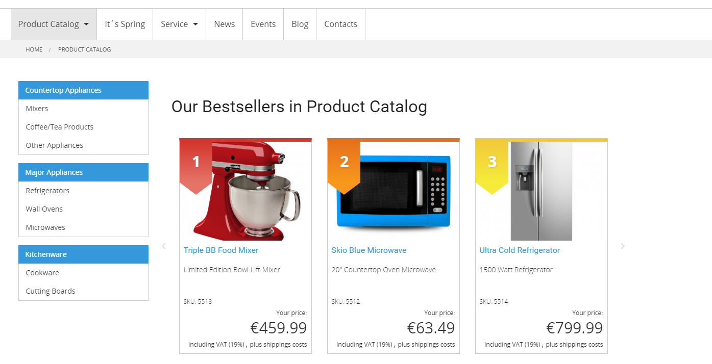
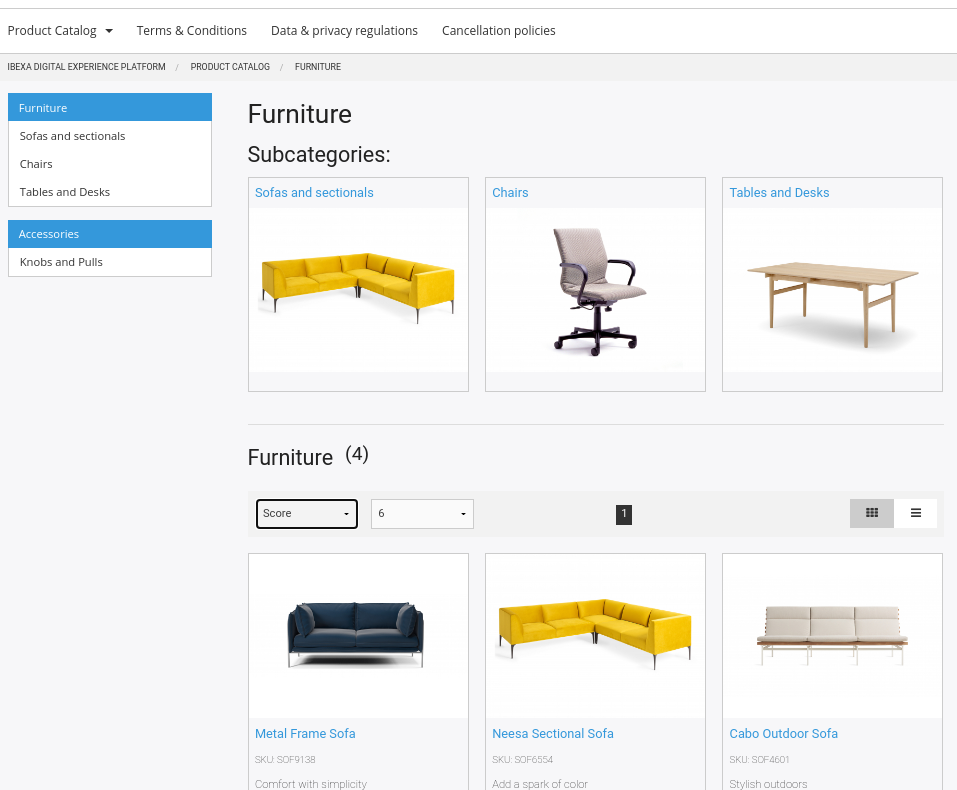

# Catalog [[% include 'snippets/commerce_badge.md' %]]

[[= product_name_com =]] generates the shop catalog automatically from the products and content in the installation or an ERP/PIM system.

The source of products depends on the data provider you have configured.

## Data providers

Data providers define where product information is stored.

You can use one of two data providers: the content model data provider and the eContent data provider.

### Content model data provider

When you use the content model data provider, each product is a Content item, stored in the Repository.

Use this data provider when you have no PIM system and a limited number of products (up to 20.000).

You can create and edit all products directly in the Back Office.

Importing products when using this data provider is time-consuming.

### eContent data provider

Use the eContent data provider when you have a PIM system or an ERP which provides product information.
This information can be imported quickly from the relevant system.

The catalog can contain more than 1 million products.

The products cannot be edited in the Back Office.

eContent offers a staging feature and enhanced catalog segmentation and allows imports during production and switching catalogs.

### Changing data providers

See [Switching the data provider](../data_providers/data_providers#switching-the-data-provider.md)
to learn how to change the data provider.

## Product categories

A category represents a product group. [[= product_name_com =]] enables showing a product category page using different layouts (by default sub-categories only, products only or both on the entry page of a category). In the Back Office you can also configure if bestsellers of the group should be displayed.

