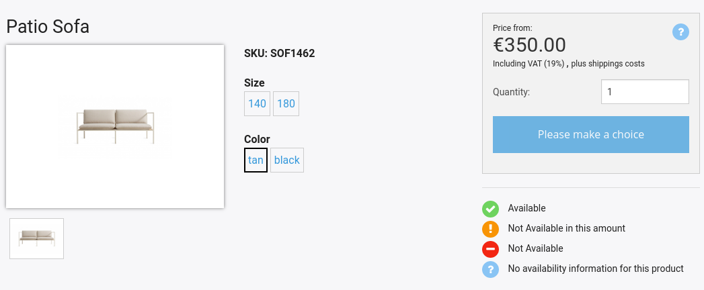

# Content management [[% include 'snippets/commerce_badge.md' %]]

## Product

[[= product_name_com =]] offers a built-in Product Content Type.

Any content of this type can be automatically used for all shop functionalities,
such as adding to basket, price calculation and ordering,
and can be embedded on the front end with quick ordering buttons.

A Product contains the following Fields:

|Name | Identifier | Type | Description |
|---|---|---|---|
|Productname | `ses_name` | `ezstring` | Main name of the product. Used to create the URL |
|Product type | `ses_type` | `ezselection` | |
|SKU | ses_sku | `ezstring` | Unique Stock keeping unit |
|Subtitle | `ses_subtitle` | `ezstring` | Additional product name |
|Short description | `ses_short_description` | `ezrichtext` | Short product description |
|Long description | `ses_long_description` | `ezrichtext` | Long product description  |
|Specifications | `ses_specifications` | `sesspecificationstype` | A set of product specification values. They are indexed in the search engine and can be used for faceted search |
|EAN | `ses_ean` | `ezstring` | European Article Number |
|Variants | `ses_variants` | `uivarvarianttype` | [Product variants](#product-variants) |
|Manufacturer SKU | `ses_manufacturer_sku` | `ezstring` | SKU of the product  as assigned by the manufacturer |
|Unit price | `ses_unit_price` | `ezstring` | Product price |
|Product image | `ses_image_main` | ezimage | Main product image |
|Manufacturer | `ses_manufacturer` | ezstring | Manufacturer name |
|Color | `ses_color` | `ezstring` | Product color |
|Technical specification | `ses_specification` | `eztext` | Technical product description |
|Video | `ses_video` | `ezstring` | Link to a product video |
|Add. Product image 1-4 | `ses_image_1` | `ezimage` | Up to four additional images | 
|Currency | `ses_currency` | `ezstring` | Default product currency |
|VAT Code | `ses_vat_code` | `sesselection` | One of predefined VAT rates |
|Product Type | `ses_product_type` | `ezstring` | Product type used for grouping products in comparison |
|Packaging unit | `ses_packaging_unit` | `ezstring` | Product packaging unit |
|Min order quantity | `ses_min_order_quantity` | `ezstring` | Minimum quantity that can be ordered |
|Max order quantity | `ses_max_order_quantity` | `ezstring` | Maximum quantity that can be ordered |
|Unit | `ses_unit` | `ezstring` | Product unit |
|Stock numeric | `ses_stock_numeric` | `ezstring` | |
|Discontinued | `ses_discontinued` | `ezboolean` | Flag to indicate if the product is discontinued |
|Tags | `tags` | `ezkeyword` | Product keywords |

### Custom product Content Type

`Ez5CatalogDataProvider` defines which Content Type is treated as products and which Field in Product Content items
is treated as SKU:

``` php
const EZ_PRODUCT_CONTENT_TYPE_IDENTIFIER = 'ses_product';
const EZ_PRODUCT_SKU_FIELD_IDENTIFIER = 'ses_sku';
```

If you replace the built-in product with a custom Content Type, you need to replace these constants.

You also need to configure the Content Type to be treated as `createOrderableProductNode`:

``` yaml
parameters.silver_eshop.default.catalog_factory.<content_type_identifier>: createOrderableProductNode
```

## Product variants

A product can have different variants, corresponding for example to different colors or sizes.

You can select and preview variants on the product's page.
Variants can have one or two levels.
When you choose a first attribute, the shop narrows down the options for the second level.



## Product type

A product type represents a collection of very similar products that differ only in some characteristics.
It is used to show a list of products in a tabular way, every product can be added to the basket directly from the overview page. 
