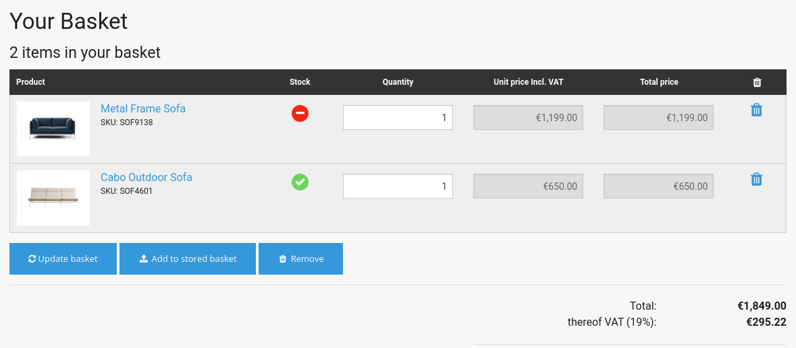
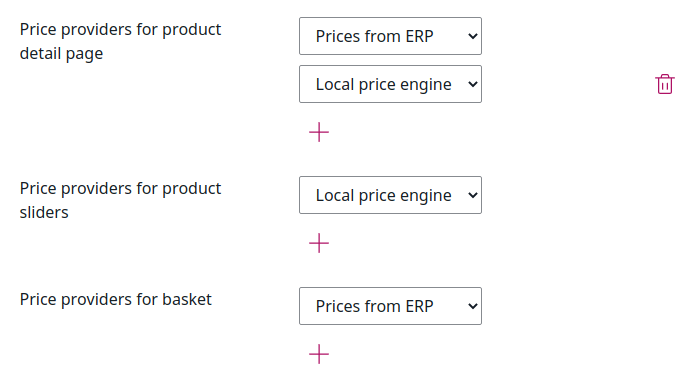

# ERP integration [[% include 'snippets/commerce_badge.md' %]]

[[= product_name_exp =]] can be connected to ERP systems. Out of the box it offers Web.Connectors for SAP, Microsoft Dynamics NAV and AX.
The product provides an open interface which can be adapted to other ERP systems as well.

Existing ERP customers can automatically create an account in the shop without waiting for confirmation from the administrator.
The shop updates customer data from the ERP in real time

The shop can update stock and price information with data from the ERP in real time, including complex price rules.
Orders are directly transferred to the ERP.

The shop requests orders, delivery notes, invoices and credit memos from the ERP.

## Stock information

[[= product_name_exp =]] requests real-time stock information from the ERP
and notifies the customer if the stock is lower than the required quantity.
It is possible to display the real stock as a numeric value as well.

## Configuration of price providers

The shop owner can select systems used for calculating prices. 

A fallback price provider (e.g. using imported prices) can be configured. It is used if the ERP is not available.

## ERP fallback

[[= product_name_exp =]] supports fallback scenarios for the most important processes in case the connection to the ERP is not available:

- Caching latest customer data after login.
- Fallback price engine. The customer is informed if the prices and stock are not up to date.
- Storing an order in the shop. It is transmitted to the ERP when the system is available again.

## Monitoring

You can review all communication (request- and response messages) sent between shop and ERP system.

You can also check the efficiency of the connection between the shop and the ERP system, including the number of the different requests per date and time.
