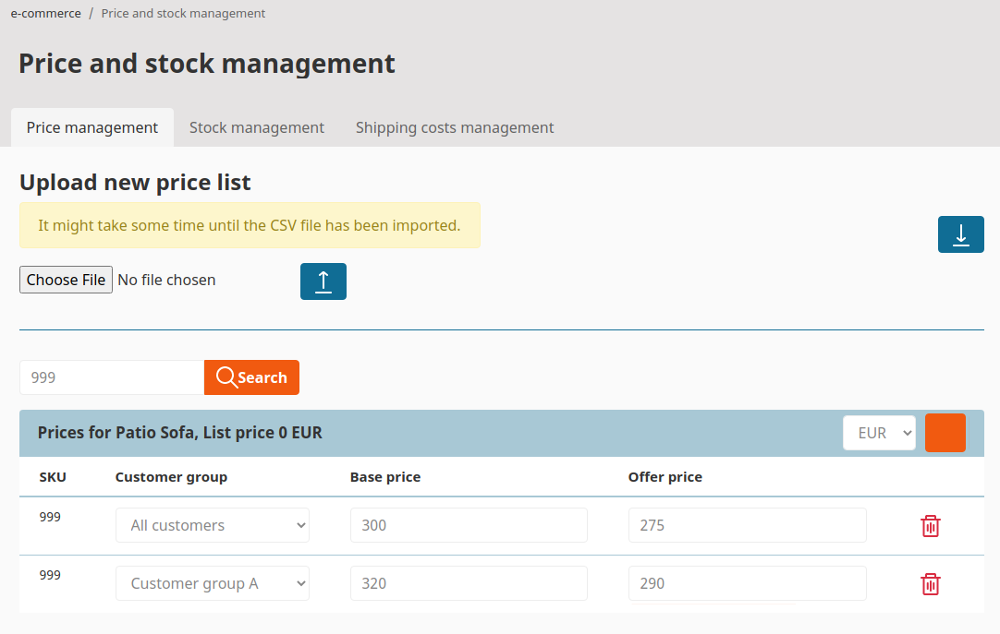
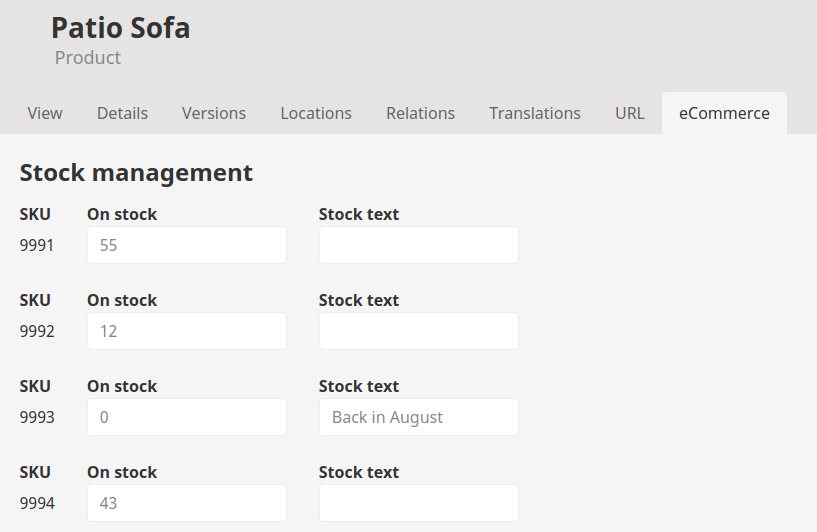

# Pricing [[% include 'snippets/commerce_badge.md' %]]

You can set up prices manually per product or per product variant.
Every price can contain an offer price and a base price. If an offer price is set, both are displayed.

In addition, prices can vary per customer group.

## Currencies

The currency is configured per country in the [configuration settings](../shop_configuration/shop_configuration.md#currencies-used-per-country).

If a product has a price for a currency this price is displayed in the shop.

If there is no price set in a shop for the given currency, [[= product_name_com =]] offers two options that can be set in the shop configuration:

- Calculate the price for the requested currency using the base price defined in the product (using the base currency setup for the installation) and an exchange rate defined in the configuration
- Display an error in the frontend that no price is available

## Import/export stock and price information

You can upload and download stock and price information using a CSV file.

## Vouchers

Using an ERP system you can create vouchers containing discount conditions like minimum basket value or discountable products.
Individual vouchers can be valid for a given number of uses, or for a set time period.
Personalized vouchers are only valid for one-time use.

## Stock

You can manage stock per product and product variant.

In addition you can add a stock text (e.g. indicating when the product will be available).
After an order is placed the stock is reduced by the number of products bought by the customer.
