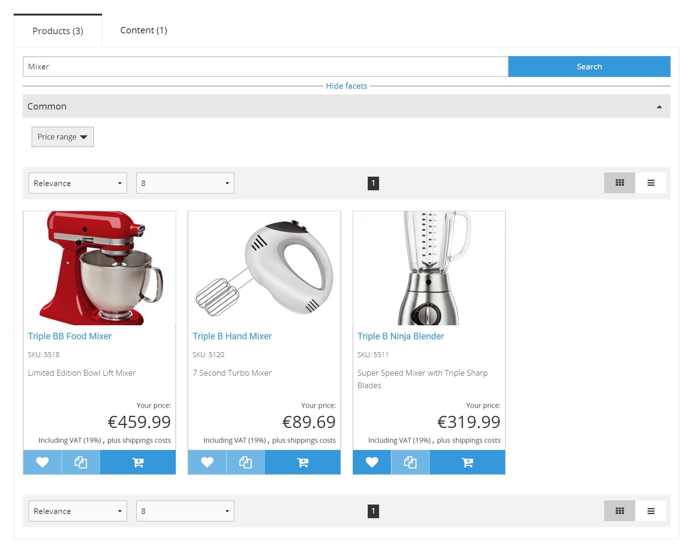
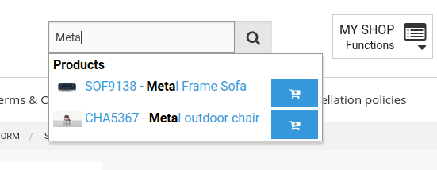

# Search

[[= product_name_com =]] uses Elaticsearch or Solr to index products together with content.

## Autosuggestion

When searching on the front end, autosuggestions are offered for products, categories, downloads and content.

