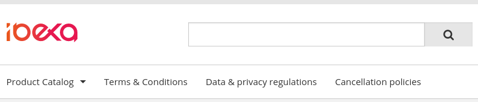
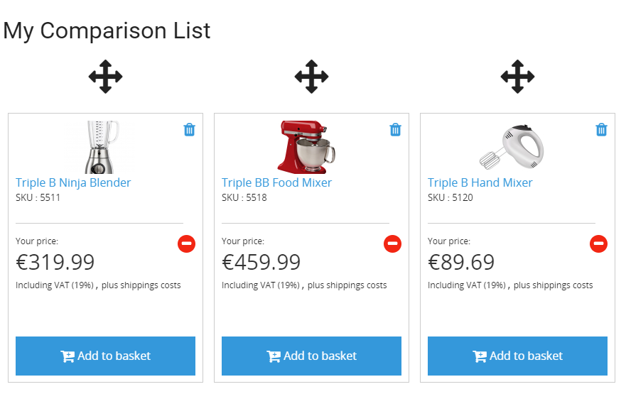
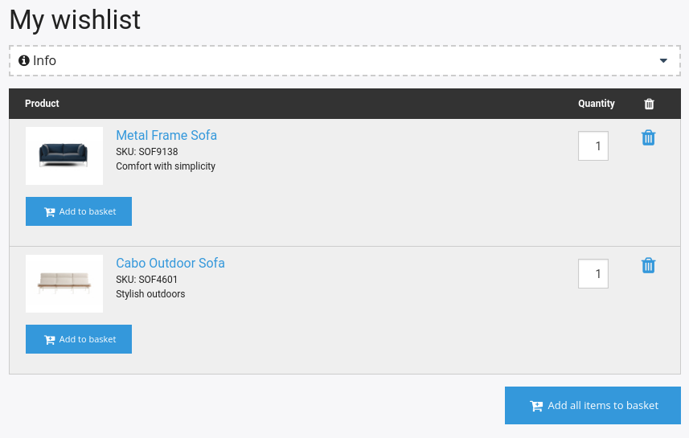
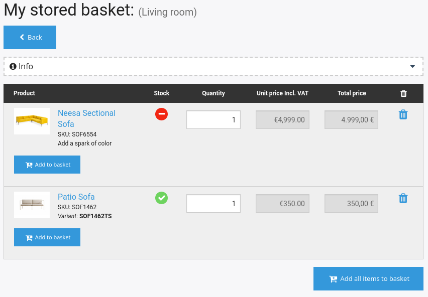
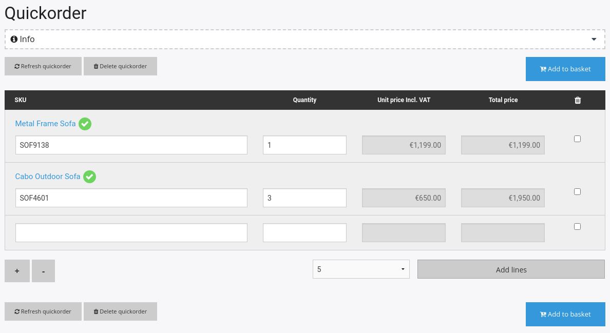
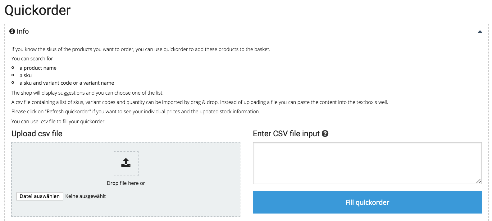

# Shop features [[% include 'snippets/commerce_badge.md' %]]

## Shop navigation

Shop navigation is generated automatically from Content items under the root Location (Location ID 2).
By default these include the product catalog and content relating to legal documents,
but you can add any other content to it.
The order of the navigation items can be defined by the editor in the Back Office using the priority field.

## Product comparison

The customer can add products to a comparison list and access it from the "My shop" menu.
The comparison list automatically groups products per product category and product type (so it is impossible to compare products belonging to different types).
The customer can change the order of the sorting by dragging and can display only differences of the products.

## Wishlist and stored baskets

A logged-in customer can store products for later without adding them to the basket.
The customer can also add products to a personal wishlist or to a named, stored basket.

Products that are not in the catalog are automatically marked as "not available".

## Quickorder

B2B customers can quickly order products by providing their SKU numbers.

They can also upload a CSV file containing a list of SKUs and quantities.

## Order history

When an ERP system is connected, the customer can browse and search past orders, invoices, delivery notes, and credit memos.
This applies to all channels of making an order, including phone, fax, email, or online shop. 
The documents for the chosen dates are fetched in real time.
If the ERP provides a tracking link, this information is displayed as well.
The customer can order the same products again.

## GDPR compliance

[[= product_name_com =]] offers tools to set up a shop that is compliant with GDPR (General Data Protection Regulation):

- Prepared articles with dummy text for T&C, data privacy and cancellation policy
- Important legal documents (e.g. T&C or data privacy) can be linked using permanent URLs
- Checkboxes in checkout and registration to confirm the T&C, cancellation policy and data privacy
- Double opt-in registration process
- Cancellation policy text included in order confirmation emails
- Cookie consent with a link to data privacy to inform the user about used cookies
