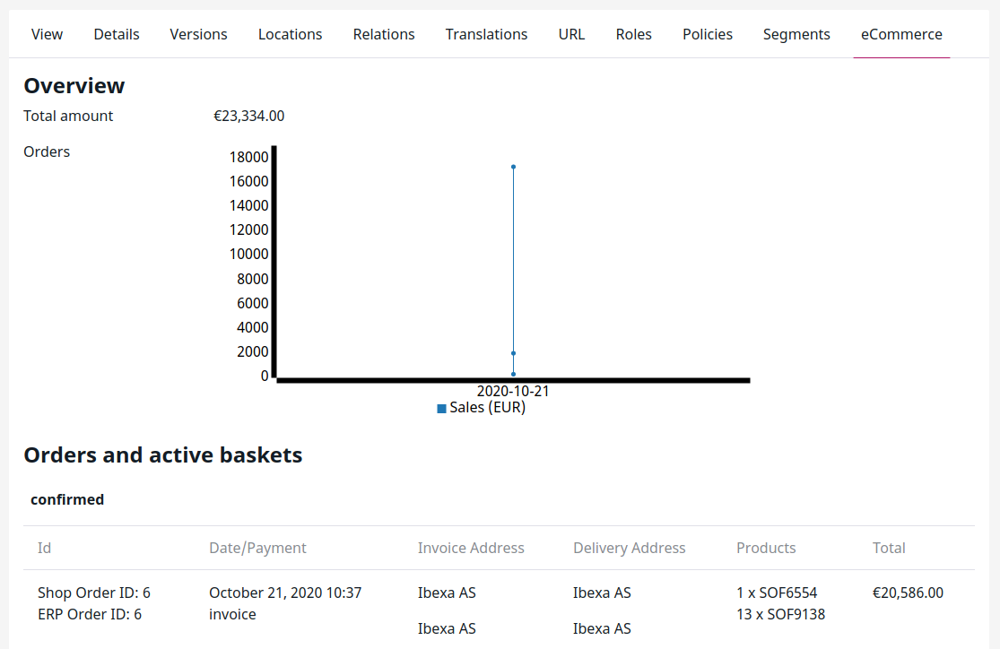
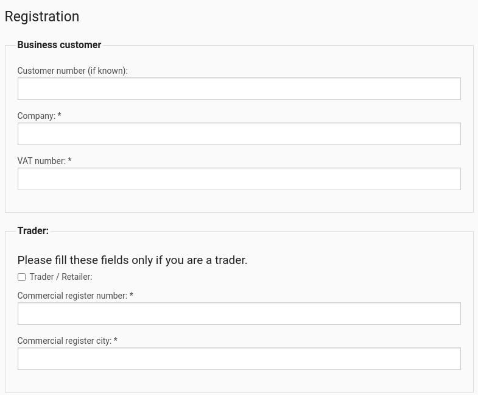
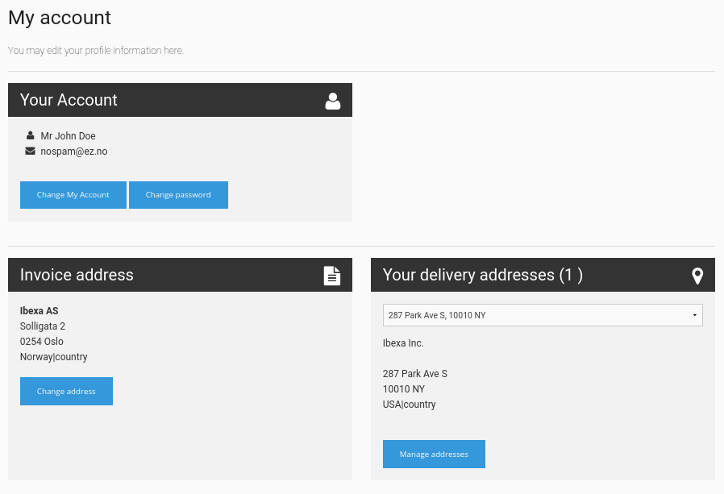
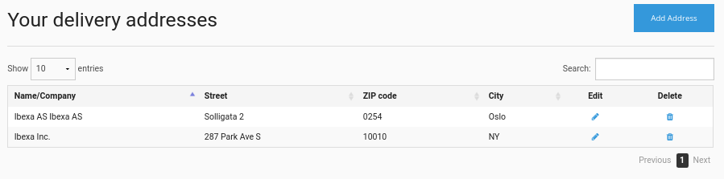

# User management

[[= product_name_com =]] by default adds the Shop users User Group, containing subgroups Business customers and Private customers.

These groups are assigned Roles that allow them to use the shop as customers.

You can get information about a User's last orders and sales statistics. If a user has a current basket it is displayed as well.

## Roles and Policies

The built-in Roles than allow using the shop are:

- Ecommerce anonymous
- Ecommerce checkout
- Ecommerce registered users

[[= product_name_com =]] adds [special shop-related Policies](../user_management/access_control.md#ez-commerce-policies).

## User registration

A user can register as private, business or existing customer.

When registering as a business customer, you need to provide additional information such as the VAT number (checked for EU VAT codes using an online service (VIES)) or a PDF with company registration.

A newly registered account is not active by default. The shop owner or administrator must enable it first.

### Existing customers

Customers who are set up in the connected ERP can activate their [[= product_name_com =]] accounts themselves by entering their customer number and one invoice number.
The data is sent to the ERP. If the data in ERP and the entered data match, the customer gets access to the shop immediately.
A User Content item is created automatically with the customer number from the ERP.

## Account management

The customer can access **My account** on the front page to manage their account, including changing account data, password and addresses.

### Addresses

The customer can manage their delivery addresses in the address book. The addresses are offered for selection during checkout process.

